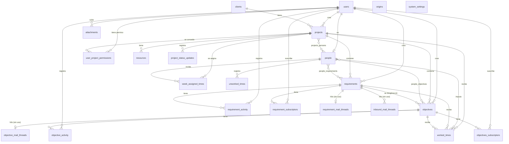

# Base de datos: `jiku`

PostgreSQL. Es la única base del producto y la comparten los dos servicios de backend.

**Extraído de** `packages/models/src/*.model.ts` — los 26 modelos Sequelize del paquete
compartido — y de las 101 migraciones de `api/db-upgrade/migrations/`.

## Quién escribe y quién lee

| Servicio | Acceso | Detalle |
|---|---|---|
| `core` | **lectura y escritura** | El único que escribe. Atiende los comandos del bus |
| `api` | **solo lectura** | Conecta con un rol sin `INSERT`/`UPDATE`/`DELETE` |

Los modelos viven en `@jiku/models` y el paquete **no abre la conexión**: exporta las clases y
cada servicio las registra en su propio Sequelize, porque conectan con credenciales distintas. Es
lo que hace que las definiciones no puedan divergir.

**Tres excepciones donde `api` escribe:**

1. **Las migraciones** — corren al arrancar la api con credenciales propias
   (`POSTGRESQL_MIGRATION_USER`), cayendo a las de la api solo si no están definidas.
2. **`attachments`** — la fila del adjunto se crea con `Attachment.create()`, sin pasar por el bus.
3. **`week_assigned_times`** — `PUT /api/week-assigned-times` hace `destroy` + `bulkCreate` en una
   transacción. Nunca se convirtió en comando.

Las dos últimas son deuda conocida: escriben con las credenciales de solo lectura y funcionan
porque el rol de la instalación se lo permite.

## Convenciones del esquema

| Aspecto | Convención |
|---|---|
| Nombres de tabla | `snake_case`, plural (`projects`, `worked_times`). Las intermedias, `{plural}_{plural}` |
| Nombres de columna | `snake_case` en la base, `camelCase` en el modelo (`underscored: true` lo traduce) |
| Clave primaria | `id` `INTEGER` autoincremental, **salvo `users`**, cuyo `id` es `VARCHAR(100)`: el `sub` de Zitadel |
| Timestamps | `created_at` / `updated_at` en casi todas (`timestamps: true`) |
| Referencias a usuario | `VARCHAR(100)` — nunca un entero, porque son ids de Zitadel |
| Enums | Tipos `ENUM` de PostgreSQL, con **valores en español** (son los que viajan al front) |
| Datos semiestructurados | `JSONB`, salvo `projects.key_value_pairs`, que es `JSON` |

> **`users.id` es el `sub` de Zitadel.** El producto no crea usuarios: los lee del proveedor de
> identidad. `POST /api/auth/present` era la única escritura sobre esta tabla y hoy es un no-op,
> así que **una persona que autentica pero no está en `users` recibe 401 de todas las rutas**.

## Diagrama ER



`attachments` no aparece con relaciones porque **no tiene claves foráneas hacia las entidades**:
se vincula por el par `(entity_type, entity_id)`, que es polimórfico. Solo `uploaded_by` y
`deleted_by` referencian `users`.

## Entidades

### Núcleo del dominio

#### `users`
Espejo del proveedor de identidad. **No la escribe el producto.**

| Columna | Tipo | Restricciones |
|---|---|---|
| `id` | `VARCHAR(100)` | PK. Es el `sub` de Zitadel |
| `name` | `VARCHAR` | NOT NULL |
| `username` | `VARCHAR` | NOT NULL |
| `email` | `VARCHAR` | NOT NULL |
| `roles` | `JSONB` | NOT NULL, default `'[]'::jsonb` — lista de strings, sin CHECK ni validación de contenido |
| `identity_type` | `ENUM` `identity_type` | NOT NULL, default `'person'` — `person`, `service` |
| `created_at`, `updated_at` | `TIMESTAMP` | |

- **`identity_type` es un ENUM nativo en la base pero el modelo lo declara `DataType.STRING`.** Es
  la misma divergencia deliberada de `byte_status` / `retention_status` y por la misma razón:
  declararlo `ENUM` en el modelo haría que `sync()` cree el tipo con la convención de nombre de
  Sequelize (`enum_users_identity_type`), distinto del `identity_type` que crea la migración. El
  argumento completo está en la nota de `byte_status` / `retention_status` de la sección `files`,
  bajo "Migración y backfill (REQ-001, S-001)".
- **Los dos valores están en inglés**, contra la convención *"ENUM con valores en español (son los
  que viajan al front)"*. Dos razones, y la segunda es la que sostiene la excepción por sí sola:
  **no tienen que viajar al front** —el schema `User` de `docs/apis/api.yaml` **no** los declara, y
  la omisión es deliberada: ese schema es alcanzable por `external-user`— y **no los elige el
  producto**: son el `type` de `deploy/nats/auth-callout/rules.yaml`, un contrato con un componente
  externo. Traducirlos obligaría a un mapa `person→persona` en el consumidor del evento, que es un
  lugar más donde divergir sin síntoma. Precedente en este mismo esquema:
  `Enum visibility_level { public internal }`.
- **Que no salgan en ninguna respuesta HTTP no lo garantiza el schema: hay que acotar los
  `include`.** El default de Sequelize es devolver **todas** las columnas, así que estas dos
  aparecen **solas** en cualquier respuesta cuyo `include` de `User` no declare `attributes`. No hay
  cambio de spec que lo delate. Acotar esos `include` es CA-12 de S-015, del lado `api`; **hasta que
  aterrice, la afirmación "no salen en ninguna respuesta HTTP" es falsa por omisión.**
- **`roles` no se valida contra ningún catálogo, a propósito.** Los roles se guardan tal como vienen
  del proveedor de identidad; la autorización no sale de esta lista por sí misma, sale de compararla
  contra un mapa cerrado y deny-by-default. Un rol inventado en Zitadel no autoriza nada, y validar
  acá sería un lugar más donde divergir del proveedor.

#### `clients` — actores
"Actor" en la UI, `clients` en la base.

| Columna | Tipo | Restricciones |
|---|---|---|
| `id` | `INTEGER` | PK, autoincremental |
| `name` | `VARCHAR` | NOT NULL |
| `description` | `TEXT` | NULL. Agregada en `20260626_01` |
| `created_at`, `updated_at` | `TIMESTAMP` | default `NOW` |

#### `people` — personas del equipo
Distinta de `users`: una persona puede no tener usuario, y es **a la persona** a la que se imputan
horas.

| Columna | Tipo | Restricciones |
|---|---|---|
| `id` | `INTEGER` | PK, autoincremental |
| `first_name` | `VARCHAR` | NOT NULL |
| `last_name` | `VARCHAR` | NOT NULL |
| `enabled` | `BOOLEAN` | NOT NULL, default `true` |
| `init_date` | `TIMESTAMP` | NOT NULL |
| `end_date` | `TIMESTAMP` | NULL |
| `must_charge_worked_time` | `BOOLEAN` | NOT NULL, default `true` |
| `user_id` | `VARCHAR(100)` | NULL → `users.id` |

> `must_charge_worked_time` es lo que decide si la persona aparece en la grilla de asignación
> semanal y en los reportes de carga.

#### `projects`

| Columna | Tipo | Restricciones |
|---|---|---|
| `id` | `INTEGER` | PK, autoincremental |
| `code` | `VARCHAR` | |
| `name` | `VARCHAR` | |
| `type` | `ENUM` | NOT NULL — `interno`, `comercial`, `investigacion`, `propuesta` |
| `description` | `TEXT` | |
| `status` | `ENUM` | NOT NULL — `analisis`, `activo`, `inactivo`, `finalizado`, `cancelado` |
| `init_date` | `TIMESTAMP` | NOT NULL |
| `end_date` | `TIMESTAMP` | NULL |
| `priority` | `INTEGER` | NULL, default `0` |
| `origin_id` | `INTEGER` | NULL → `origins.id` (sin FK declarada en el modelo) |
| `key_value_pairs` | `JSON` | NULL. Enlaces del proyecto |
| `ticket_slug` | `VARCHAR(255)` | NULL, **UNIQUE**. Agregada en `20260703_04` |
| `created_by` | `VARCHAR` | NOT NULL → `users.id` |
| `client_id` | `INTEGER` | NULL → `clients.id`. Índice en `20260724_01` |

`key_value_pairs` guarda cuatro claves conocidas: `documentacion`, `diseño`, `board_de_tareas` y
`mattermost_group_name`. Las tres primeras se validan como URI en la api. En el bus este campo se
llama `properties` y viaja como lista de `{code, value}`.

> `type` deriva `week_assigned_times.internal`: una asignación a un proyecto `interno` se marca
> como interna.

#### `requirements`

| Columna | Tipo | Restricciones |
|---|---|---|
| `id` | `INTEGER` | PK, autoincremental |
| `title` | `VARCHAR(255)` | NOT NULL |
| `description` | `TEXT` | NOT NULL |
| `type` | `ENUM` | NULL — `funcionalidad`, `mejora`, `incidencia`, `otro` |
| `priority` | `ENUM` | NOT NULL, default `sin_prioridad` — `sin_prioridad`, `baja`, `media`, `alta`, `urgente` |
| `state` | `ENUM` | NOT NULL, default `analisis` — `analisis`, `planificacion`, `en_cola`, `desarrollo`, `revision`, `resuelto`, `cancelado` |
| `estimated_finish_date` | `DATE` | NULL |
| `tags` | `JSONB` | NULL. Lista de `{key, value}` |
| `project_id` | `INTEGER` | NOT NULL → `projects.id` |
| `created_by` | `VARCHAR(100)` | NOT NULL → `users.id` |
| `scheduled_at` | `TIMESTAMP` | NULL |
| `in_progress_at` | `TIMESTAMP` | NULL |
| `in_review_at` | `TIMESTAMP` | NULL |
| `finished_at` | `TIMESTAMP` | NULL |
| `visibility_level` | `ENUM` | NOT NULL, default `public` — `public`, `internal` |
| `resolution_type` | `ENUM` | NULL — `error_interno`, `fuera_de_alcance`, `error_externo`, `discutible`, `otro` |
| `resolution_conclusion` | `TEXT` | NULL |
| `resolution_comment` | `TEXT` | NULL |
| `scope` | `TEXT` | NULL |
| `technical_solution` | `TEXT` | NULL |
| `acceptance_criteria` | `TEXT` | NULL |

Un hook `@BeforeUpdate` mantiene las cuatro marcas temporales de estado (`scheduled_at`,
`in_progress_at`, `in_review_at`, `finished_at`).

Los tags se consultan con un contains de `jsonb`:
`tags @> '[{"key": "...", "value": "..."}]'::jsonb`.

> Los tres campos de resolución se separaron en `20260721_01`. Una **incidencia** no pasa a
> `resuelto` sin tipo y conclusión — regla que valida la api, no la base.

#### `objectives` — tareas
`objective` en HTTP y en la base, `task` en el bus.

| Columna | Tipo | Restricciones |
|---|---|---|
| `id` | `INTEGER` | PK, autoincremental |
| `title` | `VARCHAR` | NOT NULL |
| `description` | `TEXT` | NULL |
| `estimated_finish_date` | `VARCHAR` | NULL — **es texto, no fecha** |
| `finished_at` | `TIMESTAMP` | NULL. Lo mantiene un hook |
| `state` | `ENUM` | NOT NULL, default `backlog` — `backlog`, `activo`, `finalizado`, `cancelado`, `en_revision` |
| `area` | `ENUM` | NOT NULL — `diseño`, `desarrollo`, `gestion`, `investigacion` |
| `priority` | `INTEGER` | NOT NULL. **Entero 0-5**, no enum |
| `visibility_level` | `ENUM` | NOT NULL, default `public` |
| `project_id` | `INTEGER` | NOT NULL → `projects.id` |
| `created_by` | `VARCHAR` | NOT NULL → `users.id` |
| `requirement_id` | `INTEGER` | NULL → `requirements.id`, **sin constraint** (`constraints: false`) |

Dos particularidades del modelo, ambas relevantes al escribir código:

- **`priority` es un `INTEGER`**, mientras el bus usa un enum de nombres. La api traduce en ambos
  sentidos (`lib/utils/bus/priority.ts`), y core hace la conversión inversa al escribir porque la
  columna no cambió.
- **`estimated_finish_date` es `VARCHAR`**, no `DATE` — a diferencia de
  `requirements.estimated_finish_date`, que sí es `DATE`. Es una inconsistencia del esquema.

El hook `@BeforeUpdate` setea `finished_at` al pasar a `finalizado` y lo limpia al salir de ese
estado.

> **La tabla `stages` ya no existe** (eliminada en `20260808_01`), pero la api sigue aceptando y
> reenviando `stageId` porque la web todavía lo manda.

### Tiempo

#### `worked_times` — horas trabajadas

| Columna | Tipo | Restricciones |
|---|---|---|
| `id` | `INTEGER` | PK, autoincremental |
| `date` | `TIMESTAMP` | |
| `minutes` | `INTEGER` | |
| `project_id` | `INTEGER` | → `projects.id` |
| `person_id` | `INTEGER` | → `people.id` |
| `objective_id` | `INTEGER` | NULL → `objectives.id` |
| `requirement_id` | `INTEGER` | NULL → `requirements.id`. Agregada en `20260626_01` |

`objective_id` y `requirement_id` son **mutuamente excluyentes**: una hora se imputa a una tarea o
a un requisito, no a ambos. La exclusión la valida la api (Joi `.oxor`), no una constraint.

#### `unworked_times` — ausencias

| Columna | Tipo | Restricciones |
|---|---|---|
| `id` | `INTEGER` | PK, autoincremental |
| `date` | `DATE` | NOT NULL |
| `minutes` | `INTEGER` | NOT NULL |
| `reason` | `ENUM` | NOT NULL — `tramite`, `corte_servicios`, `vacaciones`, `dia_no_laborable`, `personal`, `medico`, `estudio`, `enfermedad`, `otro` |
| `person_id` | `INTEGER` | NOT NULL → `people.id` |

#### `week_assigned_times` — asignación semanal

| Columna | Tipo | Restricciones |
|---|---|---|
| `id` | `INTEGER` | PK, autoincremental |
| `date_from` | `TIMESTAMP` | Lunes de la semana |
| `date_to` | `TIMESTAMP` | Lunes + 4 días (viernes) |
| `internal` | `BOOLEAN` | Derivado de `projects.type === 'interno'` |
| `minutes` | `INTEGER` | |
| `project_id` | `INTEGER` | → `projects.id` |
| `person_id` | `INTEGER` | → `people.id` |

> La única tabla que `api` reemplaza por completo: `PUT /api/week-assigned-times` borra la semana
> y la recrea en una transacción. Las asignaciones con `minutes: 0` se descartan.

### Actividad y suscripciones

#### `objective_activity`
Historial de una tarea: cambios de campo y comentarios.

| Columna | Tipo | Restricciones |
|---|---|---|
| `id` | `INTEGER` | PK, autoincremental |
| `type_of_activity` | `ENUM` | NOT NULL — `state`, `area`, `comment`, `title`, `person`, `priority`, `estimatedFinishDate`, `description`, `stageId` |
| `previous_value` | `TEXT` | NOT NULL |
| `new_value` | `TEXT` | NOT NULL |
| `visibility_level` | `ENUM` | NOT NULL, default `internal` — `public`, `internal` |
| `objective_id` | `INTEGER` | NOT NULL → `objectives.id` |
| `changed_by` | `VARCHAR` | NOT NULL → `users.id` |

> Los valores del enum son **camelCase** (`estimatedFinishDate`, `stageId`), a diferencia del
> resto de los enums del esquema. `stageId` quedó del concepto de etapa eliminado.

#### `requirement_activity`

| Columna | Tipo | Restricciones |
|---|---|---|
| `id` | `INTEGER` | PK, autoincremental |
| `type_of_activity` | `ENUM` | NOT NULL — `state`, `comment`, `type`, `priority`, `estimatedFinishDate`, `tag`, `resolution`, `title`, `description` |
| `previous_value` | `TEXT` | NOT NULL |
| `new_value` | `TEXT` | NOT NULL |
| `visibility_level` | `ENUM` | NOT NULL, default `internal` |
| `requirement_id` | `INTEGER` | NOT NULL → `requirements.id` |
| `changed_by` | `VARCHAR(100)` | NOT NULL → `users.id` |

**Regla de visibilidad automática** (`api/lib/utils/visibility-helper.ts`): los cambios de
`state`, `title` y `description` son `public`; el resto `internal`. Solo los comentarios permiten
que el usuario elija.

#### `objectives_subscriptors` y `requirement_subscriptors`
Misma forma: `id`, `objective_id`/`requirement_id` (NOT NULL) y `user_id` `VARCHAR(100)` (NOT
NULL). Sin unique compuesto en el modelo: `already_subscribed` lo valida core.

### Permisos

#### `user_project_permissions`
**La tabla que sostiene todo el aislamiento del portal de clientes.**

| Columna | Tipo | Restricciones |
|---|---|---|
| `id` | `INTEGER` | PK, autoincremental |
| `user_id` | `VARCHAR(100)` | NOT NULL → `users.id` |
| `project_id` | `INTEGER` | → `projects.id` |

Un `external-user` solo ve los proyectos con una fila acá. La verifican
`validateProjectPermissions` y las dos funciones de `attachments-access.ts`, que resuelven el
`project_id` desde cualquiera de los tipos de entidad de adjuntos — **5 desde REQ-001**, que
retiró los cinco draft y legado.

### Archivos y adjuntos

> **Rediseñado por REQ-001 (S-001).** El archivo y el vínculo eran una sola fila y ahora son dos
> tablas: **`files`** es el archivo, que **existe por sí solo**, y **`attachments`** es el vínculo,
> que ahora es **opcional y múltiple** — un `File` tiene **0..N** `attachments`.
>
> Es lo que elimina el patrón *draft*: ya no hace falta declarar a qué entidad se va a colgar un
> archivo para poder subirlo, así que los cinco `entity_type` con sufijo `_draft` desaparecen.

#### `files`

La identidad del archivo, independiente de a qué se vincule.

| Columna | Tipo | Restricciones |
|---|---|---|
| `id` | `INTEGER` | PK, autoincremental |
| `file_name` | `VARCHAR(255)` | NOT NULL. El nombre original — **no** es la clave |
| `file_size` | `INTEGER` | NOT NULL |
| `mime_type` | `VARCHAR(100)` | NOT NULL |
| `storage_key` | `VARCHAR(500)` | NOT NULL, **UNIQUE**. La construye `core`; no depende de la entidad |
| `storage_bucket` | `VARCHAR(100)` | NOT NULL |
| `storage_region` | `VARCHAR(50)` | NOT NULL |
| `checksum` | `VARCHAR(64)` | NULL. sha256 declarado por el cliente — **nadie lo verifica** |
| `byte_status` | `VARCHAR` | NOT NULL, default `pending` — `pending`, `uploaded` |
| `uploaded_by` | `VARCHAR(100)` | NOT NULL → `users.id`. **Contra esto se valida la titularidad** |
| `retention_status` | `VARCHAR` | NOT NULL, default `active` — `active`, `scheduled_for_deletion`, `deleted` |
| `deleted_at` | `TIMESTAMP` | NULL |
| `deleted_by` | `VARCHAR(100)` | NULL → `users.id` |

Índices: `storage_key` UNIQUE, y el compuesto **`(uploaded_by, byte_status)`**.

- **`byte_status` es el estado del byte, no del archivo.** El contenido viaja **directo del cliente
  a S3** con una URL pre-firmada, y **nadie verifica que haya llegado** (D-13): un `headObject`
  dentro de la transacción del despachador arriesgaría el timeout de 5 s de ADR-002. La falla
  aparece al descargar, como `file_not_available`, y no como una fila corrupta.
- **El índice `(uploaded_by, byte_status)` es la mitigación declarada** del riesgo de archivos
  abandonados: con el barrido fuera del alcance de REQ-001, hace que sean **identificables por
  consulta** aunque nada los limpie. `uploaded_by` sin índice propio no serviría: cada vinculación
  lo consulta.
- **`checksum` no lleva `@DefaultScope` de exclusión.** En `attachments` sí lo tenía; acá no hace
  falta replicarlo, porque el scope se aplica al armar la respuesta de `Attachment` en la api, no
  al modelo del archivo.
- **`retention_status` vive acá y no en el vínculo** (D-04): con 0..N vínculos, marcar el archivo
  al desvincular rompería los otros. **Desvincular es borrar la fila de `attachments`.**

**La clave de S3** (`storage_key`) la construye `core` y ya **no depende de la entidad** (D-02):

```
{STORAGE_S3_KEY_PREFIX}/f/{uuid}{ext}
```

El `/f/` separa el namespace nuevo del legado, así el backfill **no toca ninguna clave existente**.
Los archivos migrados conservan la clave vieja
(`{prefix}/{entityType}/{entityId ?? draft}/{uuid}{ext}`) y **ningún objeto se mueve en el bucket**.
**No son dos casos: nadie parsea la clave** — `core` la pasa opaca al firmador de S3 y es el único
que la toca.

> `storage_key` incluye el prefijo de `STORAGE_S3_KEY_PREFIX`. **Cambiar esa variable en una
> instalación con datos deja inaccesibles todos los archivos existentes.** Desde REQ-001 la
> variable la lee **un solo servicio** (`core`), así que deja de estar duplicada entre `api` y
> `core`.

#### `attachments`

El **vínculo** entre una entidad y un archivo. Sigue siendo **polimórfico**: no tiene FK hacia las
entidades, sino el par `(entity_type, entity_id)`.

| Columna | Tipo | Restricciones |
|---|---|---|
| `id` | `INTEGER` | PK, autoincremental. **Preservado a través de la migración** |
| `entity_type` | `VARCHAR` | NOT NULL |
| `entity_id` | `INTEGER` | **NOT NULL** desde REQ-001 (era NULL desde `20260612_03`) |
| `file_id` | `INTEGER` | NOT NULL → `files.id`. **FK real** |
| `deleted_at` | `TIMESTAMP` | NULL |
| `deleted_by` | `VARCHAR(100)` | NULL → `users.id` |

Índices: `(entity_type, entity_id)` y `file_id`.

Valores de `entity_type`, **de 10 a 5**: `project`, `requirement`, `objective`,
`requirement_comment`, `objective_comment`. Los cinco que se van los resuelve el backfill:

- **`comment_draft`, `requirement_draft`, `objective_draft`** — **no hay draft** (D-01). Las filas
  se borran y su `File` queda **sin vínculo**, que es un estado válido y no una anomalía.
- **`comment`** — legado que `20260729_01` dejó a medias. Se migra a `requirement_comment` o
  `objective_comment` según a qué tabla de actividad apunte su `entity_id`; la que no resuelva se
  borra dejando el `File` sin vínculo. **La migración emite un conteo por rama**, que es la
  verificación que S-096 dejó pendiente.
- **`stage`** — la tabla ya no existe y sus adjuntos eran **pérdida de datos silenciosa**
  (`hasProjectPermission` devolvía `false` y nadie podía acceder). El vínculo se borra y el `File`
  se **recupera** como archivo sin vínculo, alcanzable por su `uploaded_by`. No se marcan para
  baja: borrar datos recuperables es irreversible.

Detalles del modelo:

- **La FK polimórfica sigue siendo imposible** (D-05): `(entity_type, entity_id)` apunta a cinco
  tablas. El `NOT NULL` elimina los huérfanos **por draft**, no los huérfanos por entidad borrada.
  **No se promete FK hacia la entidad.**
- **`file_id` sí es FK real**, la primera que esta tabla tiene hacia el contenido.
- **`description` se eliminó**: columna muerta confirmada, vacía en todas las filas por
  construcción.
- Las 9 columnas del archivo (`file_name`, `file_size`, `mime_type`, `storage_key`,
  `storage_bucket`, `storage_region`, `uploaded_by`, `checksum`, `retention_status`) **migraron a
  `files`**. La api las sigue devolviendo **aplanadas** en la respuesta, por un `include`, para no
  romper el contrato con los frontends.
- `paranoid: false` con `deleted_at` propio se conserva. El borrado del **vínculo** es real; el
  ciclo de retención del **archivo** vive en `files.retention_status`.

#### Migración y backfill (REQ-001, S-001)

Cinco migraciones en `api/db-upgrade/migrations/`, en orden. **Las cuatro primeras son aditivas y
reversibles; la quinta es el único punto de no retorno.**

Los cinco archivos viven en `api/db-upgrade/migrations/` (la `api` es la dueña del esquema,
ADR-001) y llevan el prefijo `20260819_01` .. `20260819_05`.

| # | Migración | Qué hace |
|---|---|---|
| 1 | `20260819_01_create_files_table` | Crea `files` vacía y el ENUM nativo `file_byte_status`. Reutiliza el ENUM `retention_status` existente. Sin downtime |
| 2 | `20260819_02_add_attachments_file_id` | Agrega `attachments.file_id` **nullable, sin FK**, más el índice `idx_attachments_file_id` |
| 3 | `20260819_03_backfill_files_from_attachments` | Una fila de `files` por cada `attachments`, **1:1**, con `byte_status = 'uploaded'`. El join es por `storage_key`, que es UNIQUE en origen y destino |
| 4 | `20260819_04_resolve_legacy_and_draft_rows` | Resuelve draft, `stage` y `comment` legado. **Toda rama es contable y logueada** |
| 5 | `20260819_05_harden_attachments_schema` | `NOT NULL` en `entity_id` y `file_id`, FK `fk_attachments_file`, `DROP` de las 10 columnas, y `system_settings.value` a `TEXT` |

- **El backfill es 1:1 deliberado, sin deduplicar por checksum.** Deduplicar cambiaría la
  cardinalidad y está fuera de alcance; 1:1 es idempotente y reversible.
- **`byte_status = 'uploaded'` para todo lo migrado**: son adjuntos que existieron y se sirvieron.
  Marcarlos `pending` los haría parecer abandonados.
- **Los `attachments.id` no se tocan**: el backfill los preservó. La razón original (D-06) era que
  las URLs públicas en circulación los usaban y tenían que seguir resolviendo; **REQ-002 eliminó el
  endpoint público y derogó D-06**, así que los ids dejaron de ser un contrato externo. Siguen sin
  renumerarse —no hay motivo para tocarlos— pero ya no son una restricción que condicione el
  saneamiento del modelo.
- **El paso 5 falla si el 4 quedó incompleto**, y falla **al arrancar la api**. Es el
  comportamiento correcto: la verificación es previa y con evidencia, y los pasos 1-4 se revierten.
- **El paso 5 borra `check_attachments_active_status` antes de dropear `retention_status`.** Esa
  CHECK referencia la columna, y sin borrarla explícitamente el `DROP COLUMN` no es determinista.
- **`byte_status` y `retention_status` son ENUM nativos en la base** (`file_byte_status` y
  `retention_status`) aunque el modelo los declare `DataType.STRING`. La divergencia es deliberada:
  declararlos `ENUM` en el modelo haría que `sync()` cree tipos con la convención de nombre de
  Sequelize (`enum_files_byte_status`), distintos de los que crea la migración.
- **Al terminar, la lectura queda sin ramas**: toda fila de `attachments` tiene `file_id NOT NULL`,
  así que es una sola consulta con `JOIN files` para cualquier archivo, migrado o nuevo.

> **Riesgo declarado: `files` divergente entre `sync()` y la migración.** El producto tiene **dos
> fuentes para el mismo esquema** — `core/src/models/index.ts:56-62` corre `sync()` en
> `testing`/`development` mientras producción usa las migraciones. Una tabla nueva es donde ese
> riesgo se materializa más fácil, y **los tests no lo detectan** (ADR-013 los corre contra el
> esquema de `sync()`). El modelo de `@jiku/models` y la migración se escriben juntos y se revisan
> campo por campo: **la revisión es la única barrera.**

### Tablas intermedias

| Tabla | Une | Columnas extra |
|---|---|---|
| `projects_persons` | `projects` ↔ `people` | — |
| `people_objectives` | `people` ↔ `objectives` | `is_leader`, `active` |
| `people_requirements` | `people` ↔ `requirements` | `is_leader`. Creada en `20260703_01` |

`is_leader` se lee vía `through: { attributes: ['isLeader'] }` y la api lo **aplana** al nivel de
la persona en las respuestas de requisitos.

### Auxiliares

| Tabla | Contenido |
|---|---|
| `system_settings` | `key` (UNIQUE) `VARCHAR(255)` / `value` **`TEXT`** desde REQ-001. De acá salen `hours-per-day` y las 5 claves de archivos |
| `origins` | `reference` `INTEGER` y `name` `VARCHAR`. Referenciada por `projects.origin_id` sin FK declarada |
| `resources` | `key` / `value` por proyecto |
| `project_status_updates` | `status`, `update_date`, `comment` — historial de estado del proyecto |

#### Claves de configuración de archivos (REQ-001, S-001)

Cinco claves nuevas en `system_settings`, **configurables en caliente sin redespliegue** (RF-15):

| `key` | Default | Qué controla |
|---|---|---|
| `upload-url-ttl-seconds` | `300` | Duración de la URL de subida |
| `download-url-ttl-seconds` | `300` | Duración de la URL de descarga y vista previa |
| `file-max-size-bytes` | `10485760` | Peso máximo por archivo — 10 MB, el valor que estaba hardcodeado |
| `file-allowed-extensions` | las 13 vigentes | Primera lista blanca |
| `file-allowed-mime-types` | los 13 vigentes | Segunda lista blanca |

- **`value` pasó de `VARCHAR(255)` a `TEXT`, y era una restricción dura.** Las 13 extensiones
  entran cómodas (~70 caracteres); **los 13 tipos MIME no** —
  `application/vnd.openxmlformats-officedocument.spreadsheetml.sheet` sola son 65. Se descartó
  partir la clave en `-1`/`-2` (frágil por SQL, que es la única vía de escritura) y derivar el MIME
  de una tabla en código (rompe RF-17, que exige agregar un tipo a **las dos** listas).
- **La doble validación se conserva** (RF-17, D-18): un tipo nuevo tiene que agregarse a la lista de
  extensiones **y** a la de MIME para ser aceptado.
- **Los defaults viven en el código de `core`, no solo en el seed.** RF-16 exige que el sistema
  funcione **sin valor cargado**: el seed es conveniencia, el default es la garantía. Y `core` **no
  lee `process.env` para negocio**, así que la tabla es el lugar correcto, no una variable.
- **Se leen por comando, sin caché.** "En caliente" lo exige; cachear con TTL rompería los criterios
  de configurabilidad. Es una lectura por índice `key` UNIQUE dentro de la transacción ya abierta.

### Tablas sin uso

Quedaron de las notificaciones por mail que se eliminaron. **Ninguna migración las borra**, porque
eliminar un modelo no elimina su tabla y una migración destructiva perdería datos.

| Tabla | Forma |
|---|---|
| `objective_mail_threads` | `objective_id` (UNIQUE), `message_id`, `mattermost_post_id` |
| `requirement_mail_threads` | `requirement_id` (UNIQUE), `message_id`, `mattermost_post_id`. Creada en `20260717_02` |
| `inbound_mail_threads` | `requirement_id`, `message_id`. `updatedAt: false`. Creada en `20260703_03` |

`inbound_mail_threads` declara dos índices: único sobre `message_id`
(`uk_inbound_mail_threads_message_id`) e índice sobre `requirement_id`.

## Representación DBML

```dbml
// Generado desde packages/models/src/*.model.ts
// Los ids de usuario son varchar(100): son el `sub` de Zitadel, no enteros.

Table users {
  id varchar(100) [pk, note: 'sub de Zitadel']
  name varchar [not null]
  username varchar [not null]
  email varchar [not null]
  roles jsonb [not null, default: `'[]'::jsonb`, note: 'lista de strings, sin validacion de contenido']
  identity_type identity_type [not null, default: 'person', note: 'el modelo lo declara DataType.STRING a proposito']
  created_at timestamp
  updated_at timestamp
}

Table clients {
  id integer [pk, increment]
  name varchar [not null]
  description text
  created_at timestamp
  updated_at timestamp
}

Table people {
  id integer [pk, increment]
  first_name varchar [not null]
  last_name varchar [not null]
  enabled boolean [not null, default: true]
  init_date timestamp [not null]
  end_date timestamp
  must_charge_worked_time boolean [not null, default: true]
  user_id varchar(100) [ref: > users.id]
  created_at timestamp
  updated_at timestamp
}

Table projects {
  id integer [pk, increment]
  code varchar
  name varchar
  type project_type [not null]
  description text
  status project_status [not null]
  init_date timestamp [not null]
  end_date timestamp
  priority integer [default: 0]
  origin_id integer
  key_value_pairs json
  ticket_slug varchar(255) [unique]
  created_by varchar [not null, ref: > users.id]
  client_id integer [ref: > clients.id]
  created_at timestamp
  updated_at timestamp

  indexes {
    client_id
  }
}

Table requirements {
  id integer [pk, increment]
  title varchar(255) [not null]
  description text [not null]
  type requirement_type
  priority requirement_priority [not null, default: 'sin_prioridad']
  state requirement_state [not null, default: 'analisis']
  estimated_finish_date date
  tags jsonb
  project_id integer [not null, ref: > projects.id]
  created_by varchar(100) [not null, ref: > users.id]
  scheduled_at timestamp
  in_progress_at timestamp
  in_review_at timestamp
  finished_at timestamp
  visibility_level visibility_level [not null, default: 'public']
  resolution_type requirement_resolution
  resolution_conclusion text
  resolution_comment text
  scope text
  technical_solution text
  acceptance_criteria text
  created_at timestamp
  updated_at timestamp
}

Table objectives {
  id integer [pk, increment]
  title varchar [not null]
  description text
  estimated_finish_date varchar [note: 'es texto, no fecha']
  finished_at timestamp
  state objective_state [not null, default: 'backlog']
  area objective_area [not null]
  priority integer [not null, note: '0-5; el bus usa un enum']
  visibility_level visibility_level [not null, default: 'public']
  project_id integer [not null, ref: > projects.id]
  created_by varchar [not null, ref: > users.id]
  requirement_id integer [note: 'sin constraint']
  created_at timestamp
  updated_at timestamp
}

Table worked_times {
  id integer [pk, increment]
  date timestamp
  minutes integer
  project_id integer [ref: > projects.id]
  person_id integer [ref: > people.id]
  objective_id integer [ref: > objectives.id]
  requirement_id integer [ref: > requirements.id]
  created_at timestamp
  updated_at timestamp
  note: 'objective_id y requirement_id son mutuamente excluyentes (lo valida la api)'
}

Table unworked_times {
  id integer [pk, increment]
  date date [not null]
  minutes integer [not null]
  reason unworked_reason [not null]
  person_id integer [not null, ref: > people.id]
  created_at timestamp
  updated_at timestamp
}

Table week_assigned_times {
  id integer [pk, increment]
  date_from timestamp
  date_to timestamp
  internal boolean [note: 'derivado de projects.type === interno']
  minutes integer
  project_id integer [ref: > projects.id]
  person_id integer [ref: > people.id]
  created_at timestamp
  updated_at timestamp
}

Table objective_activity {
  id integer [pk, increment]
  type_of_activity objective_activity_type [not null]
  previous_value text [not null]
  new_value text [not null]
  visibility_level visibility_level [not null, default: 'internal']
  objective_id integer [not null, ref: > objectives.id]
  changed_by varchar [not null, ref: > users.id]
  created_at timestamp
  updated_at timestamp
}

Table requirement_activity {
  id integer [pk, increment]
  type_of_activity requirement_activity_type [not null]
  previous_value text [not null]
  new_value text [not null]
  visibility_level visibility_level [not null, default: 'internal']
  requirement_id integer [not null, ref: > requirements.id]
  changed_by varchar(100) [not null, ref: > users.id]
  created_at timestamp
  updated_at timestamp
}

Table objectives_subscriptors {
  id integer [pk, increment]
  objective_id integer [not null, ref: > objectives.id]
  user_id varchar(100) [not null, ref: > users.id]
  created_at timestamp
  updated_at timestamp
}

Table requirement_subscriptors {
  id integer [pk, increment]
  requirement_id integer [not null, ref: > requirements.id]
  user_id varchar(100) [not null, ref: > users.id]
  created_at timestamp
  updated_at timestamp
}

Table user_project_permissions {
  id integer [pk, increment]
  user_id varchar(100) [not null, ref: > users.id]
  project_id integer [ref: > projects.id]
  created_at timestamp
  updated_at timestamp
  note: 'Sostiene el aislamiento del portal de clientes'
}

Table files {
  id integer [pk, increment]
  file_name varchar(255) [not null, note: 'el nombre original; NO es la clave']
  file_size integer [not null]
  mime_type varchar(100) [not null]
  storage_key varchar(500) [not null, unique, note: 'la construye core; no depende de la entidad']
  storage_bucket varchar(100) [not null]
  storage_region varchar(50) [not null]
  checksum varchar(64) [note: 'sha256 declarado por el cliente, NADIE lo verifica']
  byte_status varchar [not null, default: 'pending', note: 'pending | uploaded']
  uploaded_by varchar(100) [not null, ref: > users.id, note: 'contra esto se valida titularidad']
  retention_status varchar [not null, default: 'active', note: 'el archivo se retiene, el vinculo se borra']
  deleted_at timestamp
  deleted_by varchar(100) [ref: > users.id]
  created_at timestamp
  updated_at timestamp

  indexes {
    storage_key [unique]
    (uploaded_by, byte_status) [note: 'titularidad al vincular + identificar abandonados sin barrido']
  }
}

Table attachments {
  id integer [pk, increment, note: 'PRESERVADO por el backfill. Ya no es contrato externo: REQ-002 derogo D-06']
  entity_type varchar [not null, note: 'polimórfico: sin FK. De 10 valores a 5']
  entity_id integer [not null, note: 'era nullable desde 20260612_03; ya no hay drafts']
  file_id integer [not null, ref: > files.id, note: 'la primera FK real hacia el contenido']
  deleted_at timestamp
  deleted_by varchar(100) [ref: > users.id]
  created_at timestamp
  updated_at timestamp

  indexes {
    (entity_type, entity_id)
    file_id
  }
}

Table projects_persons {
  project_id integer [ref: > projects.id]
  person_id integer [ref: > people.id]
  created_at timestamp
  updated_at timestamp
}

Table people_objectives {
  person_id integer [ref: > people.id]
  objective_id integer [ref: > objectives.id]
  is_leader boolean
  active boolean
  created_at timestamp
  updated_at timestamp
}

Table people_requirements {
  person_id integer [ref: > people.id]
  requirement_id integer [ref: > requirements.id]
  is_leader boolean
  created_at timestamp
  updated_at timestamp
}

Table project_status_updates {
  id integer [pk, increment]
  status varchar [not null]
  update_date timestamp [not null]
  comment varchar [not null]
  project_id integer [ref: > projects.id]
  created_at timestamp
  updated_at timestamp
}

Table resources {
  id integer [pk, increment]
  key varchar
  value varchar
  project_id integer [ref: > projects.id]
  created_at timestamp
  updated_at timestamp
}

Table system_settings {
  id integer [pk, increment]
  key varchar(255) [not null, unique]
  value text [not null, note: 'era varchar(255); ampliado por REQ-001 para las listas de MIME']
  created_at timestamp
  updated_at timestamp
}

Table origins {
  id integer [pk, increment]
  reference integer
  name varchar
  created_at timestamp
  updated_at timestamp
}

// --- Sin uso: quedaron de las notificaciones por mail eliminadas ---

Table objective_mail_threads {
  id integer [pk, increment]
  objective_id integer [not null, unique, ref: > objectives.id]
  message_id varchar(500) [not null]
  mattermost_post_id varchar(100)
  created_at timestamp
  updated_at timestamp
}

Table requirement_mail_threads {
  id integer [pk, increment]
  requirement_id integer [not null, unique, ref: > requirements.id]
  message_id varchar(500) [not null]
  mattermost_post_id varchar(100)
  created_at timestamp
  updated_at timestamp
}

Table inbound_mail_threads {
  id integer [pk, increment]
  requirement_id integer [not null, ref: > requirements.id]
  message_id varchar(500) [not null]
  created_at timestamp

  indexes {
    message_id [unique, name: 'uk_inbound_mail_threads_message_id']
    requirement_id [name: 'idx_inbound_mail_threads_requirement_id']
  }
}

// --- Enums ---

Enum identity_type         { person service }
Enum project_type          { interno comercial investigacion propuesta }
Enum project_status        { analisis activo inactivo finalizado cancelado }
Enum objective_state       { backlog activo finalizado cancelado en_revision }
Enum objective_area        { "diseño" desarrollo gestion investigacion }
Enum requirement_state     { analisis planificacion en_cola desarrollo revision resuelto cancelado }
Enum requirement_type      { funcionalidad mejora incidencia otro }
Enum requirement_priority  { sin_prioridad baja media alta urgente }
Enum requirement_resolution { error_interno fuera_de_alcance error_externo discutible otro }
Enum visibility_level      { public internal }
Enum unworked_reason       { tramite corte_servicios vacaciones dia_no_laborable personal medico estudio enfermedad otro }
Enum objective_activity_type   { state area comment title person priority estimatedFinishDate description stageId }
Enum requirement_activity_type { state comment type priority estimatedFinishDate tag resolution title description }
```

## Estrategia de migraciones

```sh
npm run upgrade-db --workspace @jiku/api      # solas
npm start --workspace @jiku/api               # las corre y después sirve
```

| Aspecto | Detalle |
|---|---|
| Herramienta | `sequelize-cli`, config en `api/db-upgrade/config.js` |
| Ubicación | `api/db-upgrade/migrations/` |
| Formato | **JavaScript** (`.js`), requisito de `sequelize-cli` |
| Nombre | `YYYYMMDD_NN_descripcion.js` |
| Tabla de control | `sequelize_meta` |
| Credenciales | `POSTGRESQL_MIGRATION_USER` / `_PASSWORD`, con fallback a las de la api |
| Cantidad | **101** |
| Naturaleza | Se esperan **aditivas**: el esquema no está versionado aparte del producto |

En `testing` y `development` el arranque hace además `sequelize.sync()`
(`api/lib/models/index.ts:63-70`). En producción, no.

> ### Las migraciones no construyen el esquema desde cero
>
> **Las 101 asumen un esquema existente.** La más antigua modifica `objectives`, y **ninguna la
> crea**. Contra una base vacía la api falla al arrancar:
>
> ```
> ERROR: relation "public.objectives" does not exist
> ```
>
> Una instalación nueva necesita un `.sql` con el esquema, cargado antes del primer arranque
> (`DUMP_FILE` en `deploy/.env`). No hay `db:create` ni migración baseline.
>
> Es consecuencia de cómo se importó el proyecto: el esquema es anterior al historial de
> migraciones. Resolverlo significa escribir una migración baseline que cree el esquema actual y
> marcar las existentes como aplicadas.

### Migraciones recientes que explican el estado actual

| Migración | Efecto |
|---|---|
| `20260820_01_drop_external_integration` | Da de baja la integración con sistemas externos: borra las 3 tablas `external_*`, las 9 columnas de `objectives` y `objective_activity` (incluida `last_synced_at`, la única sin el prefijo) y el índice único parcial `uk_objective_activity_external_comment` |
| `20260808_01_remove_stages` | Elimina la tabla `stages`. La api sigue aceptando `stageId` porque la web lo manda |
| `20260729_01_extend_attachments_entity_type_comment_split` | Separa `comment` en `objective_comment` y `requirement_comment`. Quedan filas legado con `comment` |
| `20260724_01_add_index_projects_client_id` | Índice en `projects.client_id` |
| `20260722_01_requirement_type_remove_sin_tipo_nullable` | `requirements.type` pasa a nullable y se quita `sin_tipo` |
| `20260721_01_requirements_split_resolution_fields` | Separa los tres campos de resolución |
| `20260717_01` / `20260717_02` | Agrega `sin_tipo` (revertido en `20260722_01`) y crea `requirement_mail_threads` |
| `20260707_01` | Agrega `en_cola` al estado y los campos de información base |
| `20260703_01` / `_02` | Crea `people_requirements` y migra el responsable único a la tabla intermedia |
| `20260626_01_worked_times_requirement_id` | Permite imputar horas a un requisito, no solo a una tarea |
| `20260612_03_attachments_entity_id_nullable` | Habilita drafts anclados al usuario |

## Inconsistencias del esquema a tener en cuenta

Ninguna es un bug con síntoma hoy, pero condicionan cualquier cambio en estas tablas:

1. **`objectives.estimated_finish_date` es `VARCHAR`**, mientras
   `requirements.estimated_finish_date` es `DATE`.
2. **`objectives.priority` es `INTEGER` (0-5)**, mientras `requirements.priority` es un `ENUM` de
   nombres. La api traduce entre el entero y el enum del bus.
3. **`projects.key_value_pairs` es `JSON`**, no `JSONB`, a diferencia de todos los demás campos
   semiestructurados del esquema.
4. **`worked_times.date` es `TIMESTAMP`**, mientras `unworked_times.date` es `DATE`.
5. **`projects.origin_id` no declara FK** hacia `origins` en el modelo.
6. **La exclusión entre `objective_id` y `requirement_id`** en `worked_times` no tiene constraint:
   la valida la api.
7. **Los enums de tipo de actividad usan camelCase** (`estimatedFinishDate`, `stageId`), a
   diferencia del snake_case del resto.

## Documentación relacionada

| Documento | Contenido |
|---|---|
| [../apis/api.yaml](../apis/api.yaml) | Contrato HTTP de `api` — cómo se exponen estas entidades |
| [../apis/core.yaml](../apis/core.yaml) | Contrato del bus — los comandos que escriben estas tablas |
| [../architectures/api/conventions/orm.md](../architectures/api/conventions/orm.md) | Cómo se accede a la base desde `api` |
| [../analysis/services/api.md](../analysis/services/api.md) | Análisis de importación de `api` |
