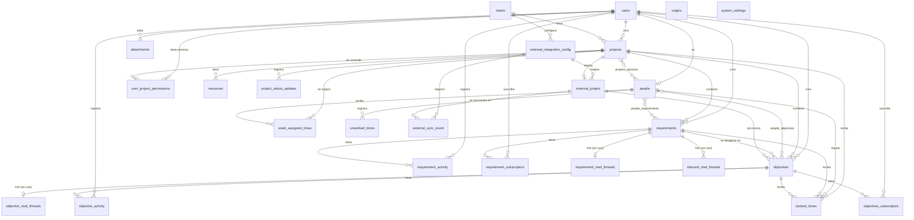

# Base de datos: `jiku`

PostgreSQL. Es la única base del producto y la comparten los dos servicios de backend.

**Extraído de** `packages/models/src/*.model.ts` — los 28 modelos Sequelize del paquete
compartido — y de las 95 migraciones de `api/db-upgrade/migrations/`.

## Quién escribe y quién lee

| Servicio | Acceso | Detalle |
|---|---|---|
| `core` | **lectura y escritura** | El único que escribe. Atiende los comandos del bus |
| `api` | **solo lectura** | Conecta con un rol sin `INSERT`/`UPDATE`/`DELETE` |

Los modelos viven en `@jiku/models` y el paquete **no abre la conexión**: exporta las clases y
cada servicio las registra en su propio Sequelize, porque conectan con credenciales distintas. Es
lo que hace que las definiciones no puedan divergir.

**Tres excepciones donde `api` escribe:**

1. **Las migraciones** — corren al arrancar la api con credenciales propias
   (`POSTGRESQL_MIGRATION_USER`), cayendo a las de la api solo si no están definidas.
2. **`attachments`** — la fila del adjunto se crea con `Attachment.create()`, sin pasar por el bus.
3. **`week_assigned_times`** — `PUT /api/week-assigned-times` hace `destroy` + `bulkCreate` en una
   transacción. Nunca se convirtió en comando.

Las dos últimas son deuda conocida: escriben con las credenciales de solo lectura y funcionan
porque el rol de la instalación se lo permite.

## Convenciones del esquema

| Aspecto | Convención |
|---|---|
| Nombres de tabla | `snake_case`, plural (`projects`, `worked_times`). Las intermedias, `{plural}_{plural}` |
| Nombres de columna | `snake_case` en la base, `camelCase` en el modelo (`underscored: true` lo traduce) |
| Clave primaria | `id` `INTEGER` autoincremental, **salvo `users`**, cuyo `id` es `VARCHAR(100)`: el `sub` de Zitadel |
| Timestamps | `created_at` / `updated_at` en casi todas (`timestamps: true`) |
| Referencias a usuario | `VARCHAR(100)` — nunca un entero, porque son ids de Zitadel |
| Enums | Tipos `ENUM` de PostgreSQL, con **valores en español** (son los que viajan al front) |
| Datos semiestructurados | `JSONB`, salvo `projects.key_value_pairs`, que es `JSON` |

> **`users.id` es el `sub` de Zitadel.** El producto no crea usuarios: los lee del proveedor de
> identidad. `POST /api/auth/present` era la única escritura sobre esta tabla y hoy es un no-op,
> así que **una persona que autentica pero no está en `users` recibe 401 de todas las rutas**.

## Diagrama ER



`attachments` no aparece con relaciones porque **no tiene claves foráneas hacia las entidades**:
se vincula por el par `(entity_type, entity_id)`, que es polimórfico. Solo `uploaded_by` y
`deleted_by` referencian `users`.

## Entidades

### Núcleo del dominio

#### `users`
Espejo del proveedor de identidad. **No la escribe el producto.**

| Columna | Tipo | Restricciones |
|---|---|---|
| `id` | `VARCHAR(100)` | PK. Es el `sub` de Zitadel |
| `name` | `VARCHAR` | NOT NULL |
| `username` | `VARCHAR` | NOT NULL |
| `email` | `VARCHAR` | NOT NULL |
| `created_at`, `updated_at` | `TIMESTAMP` | |

#### `clients` — actores
"Actor" en la UI, `clients` en la base.

| Columna | Tipo | Restricciones |
|---|---|---|
| `id` | `INTEGER` | PK, autoincremental |
| `name` | `VARCHAR` | NOT NULL |
| `description` | `TEXT` | NULL. Agregada en `20260626_01` |
| `created_at`, `updated_at` | `TIMESTAMP` | default `NOW` |

#### `people` — personas del equipo
Distinta de `users`: una persona puede no tener usuario, y es **a la persona** a la que se imputan
horas.

| Columna | Tipo | Restricciones |
|---|---|---|
| `id` | `INTEGER` | PK, autoincremental |
| `first_name` | `VARCHAR` | NOT NULL |
| `last_name` | `VARCHAR` | NOT NULL |
| `enabled` | `BOOLEAN` | NOT NULL, default `true` |
| `init_date` | `TIMESTAMP` | NOT NULL |
| `end_date` | `TIMESTAMP` | NULL |
| `must_charge_worked_time` | `BOOLEAN` | NOT NULL, default `true` |
| `user_id` | `VARCHAR(100)` | NULL → `users.id` |

> `must_charge_worked_time` es lo que decide si la persona aparece en la grilla de asignación
> semanal y en los reportes de carga.

#### `projects`

| Columna | Tipo | Restricciones |
|---|---|---|
| `id` | `INTEGER` | PK, autoincremental |
| `code` | `VARCHAR` | |
| `name` | `VARCHAR` | |
| `type` | `ENUM` | NOT NULL — `interno`, `comercial`, `investigacion`, `propuesta` |
| `description` | `TEXT` | |
| `status` | `ENUM` | NOT NULL — `analisis`, `activo`, `inactivo`, `finalizado`, `cancelado` |
| `init_date` | `TIMESTAMP` | NOT NULL |
| `end_date` | `TIMESTAMP` | NULL |
| `priority` | `INTEGER` | NULL, default `0` |
| `origin_id` | `INTEGER` | NULL → `origins.id` (sin FK declarada en el modelo) |
| `key_value_pairs` | `JSON` | NULL. Enlaces del proyecto |
| `ticket_slug` | `VARCHAR(255)` | NULL, **UNIQUE**. Agregada en `20260703_04` |
| `created_by` | `VARCHAR` | NOT NULL → `users.id` |
| `client_id` | `INTEGER` | NULL → `clients.id`. Índice en `20260724_01` |

`key_value_pairs` guarda cuatro claves conocidas: `documentacion`, `diseño`, `board_de_tareas` y
`mattermost_group_name`. Las tres primeras se validan como URI en la api. En el bus este campo se
llama `properties` y viaja como lista de `{code, value}`.

> `type` deriva `week_assigned_times.internal`: una asignación a un proyecto `interno` se marca
> como interna.

#### `requirements`

| Columna | Tipo | Restricciones |
|---|---|---|
| `id` | `INTEGER` | PK, autoincremental |
| `title` | `VARCHAR(255)` | NOT NULL |
| `description` | `TEXT` | NOT NULL |
| `type` | `ENUM` | NULL — `funcionalidad`, `mejora`, `incidencia`, `otro` |
| `priority` | `ENUM` | NOT NULL, default `sin_prioridad` — `sin_prioridad`, `baja`, `media`, `alta`, `urgente` |
| `state` | `ENUM` | NOT NULL, default `analisis` — `analisis`, `planificacion`, `en_cola`, `desarrollo`, `revision`, `resuelto`, `cancelado` |
| `estimated_finish_date` | `DATE` | NULL |
| `tags` | `JSONB` | NULL. Lista de `{key, value}` |
| `project_id` | `INTEGER` | NOT NULL → `projects.id` |
| `created_by` | `VARCHAR(100)` | NOT NULL → `users.id` |
| `scheduled_at` | `TIMESTAMP` | NULL |
| `in_progress_at` | `TIMESTAMP` | NULL |
| `in_review_at` | `TIMESTAMP` | NULL |
| `finished_at` | `TIMESTAMP` | NULL |
| `visibility_level` | `ENUM` | NOT NULL, default `public` — `public`, `internal` |
| `resolution_type` | `ENUM` | NULL — `error_interno`, `fuera_de_alcance`, `error_externo`, `discutible`, `otro` |
| `resolution_conclusion` | `TEXT` | NULL |
| `resolution_comment` | `TEXT` | NULL |
| `scope` | `TEXT` | NULL |
| `technical_solution` | `TEXT` | NULL |
| `acceptance_criteria` | `TEXT` | NULL |

Un hook `@BeforeUpdate` mantiene las cuatro marcas temporales de estado (`scheduled_at`,
`in_progress_at`, `in_review_at`, `finished_at`).

Los tags se consultan con un contains de `jsonb`:
`tags @> '[{"key": "...", "value": "..."}]'::jsonb`.

> Los tres campos de resolución se separaron en `20260721_01`. Una **incidencia** no pasa a
> `resuelto` sin tipo y conclusión — regla que valida la api, no la base.

#### `objectives` — tareas
`objective` en HTTP y en la base, `task` en el bus.

| Columna | Tipo | Restricciones |
|---|---|---|
| `id` | `INTEGER` | PK, autoincremental |
| `title` | `VARCHAR` | NOT NULL |
| `description` | `TEXT` | NULL |
| `estimated_finish_date` | `VARCHAR` | NULL — **es texto, no fecha** |
| `finished_at` | `TIMESTAMP` | NULL. Lo mantiene un hook |
| `state` | `ENUM` | NOT NULL, default `backlog` — `backlog`, `activo`, `finalizado`, `cancelado`, `en_revision` |
| `area` | `ENUM` | NOT NULL — `diseño`, `desarrollo`, `gestion`, `investigacion` |
| `priority` | `INTEGER` | NOT NULL. **Entero 0-5**, no enum |
| `visibility_level` | `ENUM` | NOT NULL, default `public` |
| `project_id` | `INTEGER` | NOT NULL → `projects.id` |
| `created_by` | `VARCHAR` | NOT NULL → `users.id` |
| `requirement_id` | `INTEGER` | NULL → `requirements.id`, **sin constraint** (`constraints: false`) |
| `external_project_id` | `INTEGER` | NULL → `external_project.id` |
| `external_issue_id` | `VARCHAR(255)` | NULL |
| `external_issue_key` | `VARCHAR(100)` | NULL |
| `external_url` | `TEXT` | NULL |
| `external_raw_data` | `JSONB` | NULL |
| `last_synced_at` | `TIMESTAMP` | NULL |

Dos particularidades del modelo, ambas relevantes al escribir código:

- **`priority` es un `INTEGER`**, mientras el bus usa un enum de nombres. La api traduce en ambos
  sentidos (`lib/utils/bus/priority.ts`), y core hace la conversión inversa al escribir porque la
  columna no cambió.
- **`estimated_finish_date` es `VARCHAR`**, no `DATE` — a diferencia de
  `requirements.estimated_finish_date`, que sí es `DATE`. Es una inconsistencia del esquema.

El hook `@BeforeUpdate` setea `finished_at` al pasar a `finalizado` y lo limpia al salir de ese
estado.

> **La tabla `stages` ya no existe** (eliminada en `20260808_01`), pero la api sigue aceptando y
> reenviando `stageId` porque la web todavía lo manda.

### Tiempo

#### `worked_times` — horas trabajadas

| Columna | Tipo | Restricciones |
|---|---|---|
| `id` | `INTEGER` | PK, autoincremental |
| `date` | `TIMESTAMP` | |
| `minutes` | `INTEGER` | |
| `project_id` | `INTEGER` | → `projects.id` |
| `person_id` | `INTEGER` | → `people.id` |
| `objective_id` | `INTEGER` | NULL → `objectives.id` |
| `requirement_id` | `INTEGER` | NULL → `requirements.id`. Agregada en `20260626_01` |

`objective_id` y `requirement_id` son **mutuamente excluyentes**: una hora se imputa a una tarea o
a un requisito, no a ambos. La exclusión la valida la api (Joi `.oxor`), no una constraint.

#### `unworked_times` — ausencias

| Columna | Tipo | Restricciones |
|---|---|---|
| `id` | `INTEGER` | PK, autoincremental |
| `date` | `DATE` | NOT NULL |
| `minutes` | `INTEGER` | NOT NULL |
| `reason` | `ENUM` | NOT NULL — `tramite`, `corte_servicios`, `vacaciones`, `dia_no_laborable`, `personal`, `medico`, `estudio`, `enfermedad`, `otro` |
| `person_id` | `INTEGER` | NOT NULL → `people.id` |

#### `week_assigned_times` — asignación semanal

| Columna | Tipo | Restricciones |
|---|---|---|
| `id` | `INTEGER` | PK, autoincremental |
| `date_from` | `TIMESTAMP` | Lunes de la semana |
| `date_to` | `TIMESTAMP` | Lunes + 4 días (viernes) |
| `internal` | `BOOLEAN` | Derivado de `projects.type === 'interno'` |
| `minutes` | `INTEGER` | |
| `project_id` | `INTEGER` | → `projects.id` |
| `person_id` | `INTEGER` | → `people.id` |

> La única tabla que `api` reemplaza por completo: `PUT /api/week-assigned-times` borra la semana
> y la recrea en una transacción. Las asignaciones con `minutes: 0` se descartan.

### Actividad y suscripciones

#### `objective_activity`
Historial de una tarea: cambios de campo y comentarios.

| Columna | Tipo | Restricciones |
|---|---|---|
| `id` | `INTEGER` | PK, autoincremental |
| `type_of_activity` | `ENUM` | NOT NULL — `state`, `area`, `comment`, `title`, `person`, `priority`, `estimatedFinishDate`, `description`, `stageId` |
| `previous_value` | `TEXT` | NOT NULL |
| `new_value` | `TEXT` | NOT NULL |
| `visibility_level` | `ENUM` | NOT NULL, default `internal` — `public`, `internal` |
| `objective_id` | `INTEGER` | NOT NULL → `objectives.id` |
| `changed_by` | `VARCHAR` | NOT NULL → `users.id` |
| `external_reference_url` | `TEXT` | NULL |
| `external_user_name` | `VARCHAR(255)` | NULL |
| `external_user_id` | `VARCHAR(128)` | NULL |

**Índice único parcial** `uk_objective_activity_external_comment` sobre `external_reference_url`,
solo donde `type_of_activity = 'comment'` y la URL no es nula: evita importar dos veces el mismo
comentario externo.

> Los valores del enum son **camelCase** (`estimatedFinishDate`, `stageId`), a diferencia del
> resto de los enums del esquema. `stageId` quedó del concepto de etapa eliminado.

#### `requirement_activity`

| Columna | Tipo | Restricciones |
|---|---|---|
| `id` | `INTEGER` | PK, autoincremental |
| `type_of_activity` | `ENUM` | NOT NULL — `state`, `comment`, `type`, `priority`, `estimatedFinishDate`, `tag`, `resolution`, `title`, `description` |
| `previous_value` | `TEXT` | NOT NULL |
| `new_value` | `TEXT` | NOT NULL |
| `visibility_level` | `ENUM` | NOT NULL, default `internal` |
| `requirement_id` | `INTEGER` | NOT NULL → `requirements.id` |
| `changed_by` | `VARCHAR(100)` | NOT NULL → `users.id` |

**Regla de visibilidad automática** (`api/lib/utils/visibility-helper.ts`): los cambios de
`state`, `title` y `description` son `public`; el resto `internal`. Solo los comentarios permiten
que el usuario elija.

#### `objectives_subscriptors` y `requirement_subscriptors`
Misma forma: `id`, `objective_id`/`requirement_id` (NOT NULL) y `user_id` `VARCHAR(100)` (NOT
NULL). Sin unique compuesto en el modelo: `already_subscribed` lo valida core.

### Permisos

#### `user_project_permissions`
**La tabla que sostiene todo el aislamiento del portal de clientes.**

| Columna | Tipo | Restricciones |
|---|---|---|
| `id` | `INTEGER` | PK, autoincremental |
| `user_id` | `VARCHAR(100)` | NOT NULL → `users.id` |
| `project_id` | `INTEGER` | → `projects.id` |

Un `external-user` solo ve los proyectos con una fila acá. La verifican
`validateProjectPermissions` y las dos funciones de `attachments-access.ts`, que resuelven el
`project_id` desde cualquiera de los 9 tipos de entidad de adjuntos.

### Adjuntos

#### `attachments`
Vinculación **polimórfica**: no tiene FK hacia las entidades, sino el par
`(entity_type, entity_id)`.

| Columna | Tipo | Restricciones |
|---|---|---|
| `id` | `INTEGER` | PK, autoincremental |
| `entity_type` | `VARCHAR` | NOT NULL |
| `entity_id` | `INTEGER` | **NULL** desde `20260612_03` |
| `file_name` | `VARCHAR(255)` | NOT NULL. El nombre original |
| `file_size` | `INTEGER` | NOT NULL. Máximo 10 MB |
| `mime_type` | `VARCHAR(100)` | NOT NULL |
| `storage_key` | `VARCHAR(500)` | NOT NULL, **UNIQUE** |
| `storage_bucket` | `VARCHAR(100)` | NOT NULL |
| `storage_region` | `VARCHAR(50)` | NOT NULL |
| `uploaded_by` | `VARCHAR(100)` | NOT NULL → `users.id` |
| `description` | `TEXT` | NULL |
| `checksum` | `VARCHAR(64)` | NULL. sha256 hexadecimal |
| `retention_status` | `VARCHAR` | NOT NULL, default `active` — `active`, `scheduled_for_deletion`, `deleted` |
| `deleted_at` | `TIMESTAMP` | NULL |
| `deleted_by` | `VARCHAR(100)` | NULL → `users.id` |

Valores de `entity_type` (`20260729_01` los separó): `objective`, `project`, `requirement`,
`objective_comment`, `requirement_comment`, `comment_draft`, `objective_draft`,
`requirement_draft`, más dos heredados:

- **`comment`** — filas sin migrar. Pendiente de confirmar que no quedan en producción (S-096).
- **`stage`** — la tabla ya no existe, así que sus adjuntos **nunca se autorizan**:
  `hasProjectPermission` devuelve `false` para este tipo.

Dos detalles del modelo:

- **`@DefaultScope` excluye `checksum`** de las consultas por default: no viaja en las respuestas
  salvo que se pida explícitamente.
- **`entity_id` nullable** habilita el draft anclado al usuario: el requisito todavía no existe, y
  la titularidad se valida por `uploaded_by`.
- `paranoid: false` con `deleted_at` propio: **el borrado lógico lo maneja `retention_status`**, no
  el soft-delete de Sequelize. Hay un hook `@BeforeDestroy`.

> `storage_key` incluye el prefijo de `STORAGE_S3_KEY_PREFIX`. **Cambiar esa variable en una
> instalación con datos deja inaccesibles todos los adjuntos existentes.**

### Integración con sistemas externos (Jira)

Cuatro tablas del módulo de integración. `objectives` lleva las columnas `external_*` que las
enlazan.

#### `external_integration_config`
| Columna | Tipo | Restricciones |
|---|---|---|
| `id` | `INTEGER` | PK, autoincremental |
| `client_id` | `INTEGER` | NOT NULL → `clients.id` |
| `system_type` | `VARCHAR(50)` | NOT NULL |
| `base_url` | `VARCHAR(500)` | NOT NULL |
| `auth_email` | `VARCHAR(255)` | NOT NULL |
| `auth_token_encrypted` | `TEXT` | NOT NULL |
| `enabled` | `BOOLEAN` | NOT NULL, default `true` |
| `config` | `JSONB` | NULL |

#### `external_project`
| Columna | Tipo | Restricciones |
|---|---|---|
| `id` | `INTEGER` | PK, autoincremental |
| `integration_id` | `INTEGER` | NOT NULL → `external_integration_config.id` |
| `external_project_id` | `VARCHAR(255)` | NOT NULL |
| `external_project_key` | `VARCHAR(100)` | NOT NULL |
| `name` | `VARCHAR(500)` | NOT NULL |
| `local_project_id` | `INTEGER` | NULL → `projects.id` |
| `config` | `JSONB` | NULL |
| `prefix` | `VARCHAR(50)` | NULL |

Tres índices declarados en el modelo:
- `idx_external_project_prefix` — parcial, donde `prefix IS NOT NULL`
- `idx_external_project_integration_project` — `(integration_id, external_project_id)`
- `idx_external_project_unique_prefix` — **único** sobre `(integration_id, external_project_id, prefix)`

#### `external_sync_event`
`timestamps: false`; usa `started_at` / `finished_at` propios.

| Columna | Tipo | Restricciones |
|---|---|---|
| `id` | `INTEGER` | PK, autoincremental |
| `integration_id` | `INTEGER` | NOT NULL → `external_integration_config.id` |
| `external_project_id` | `INTEGER` | NULL → `external_project.id` |
| `started_at` | `TIMESTAMP` | NOT NULL, default `NOW` |
| `finished_at` | `TIMESTAMP` | NULL |
| `status` | `VARCHAR(20)` | NOT NULL |
| `issues_created` | `INTEGER` | NOT NULL, default `0` |
| `issues_updated` | `INTEGER` | NOT NULL, default `0` |
| `issues_failed` | `INTEGER` | NOT NULL, default `0` |
| `errors` | `JSONB` | NULL |
| `metadata` | `JSONB` | NULL |

### Tablas intermedias

| Tabla | Une | Columnas extra |
|---|---|---|
| `projects_persons` | `projects` ↔ `people` | — |
| `people_objectives` | `people` ↔ `objectives` | `is_leader`, `active` |
| `people_requirements` | `people` ↔ `requirements` | `is_leader`. Creada en `20260703_01` |

`is_leader` se lee vía `through: { attributes: ['isLeader'] }` y la api lo **aplana** al nivel de
la persona en las respuestas de requisitos.

### Auxiliares

| Tabla | Contenido |
|---|---|
| `system_settings` | `key` (UNIQUE) / `value`, ambos `VARCHAR(255)`. De acá sale `hours-per-day` |
| `origins` | `reference` `INTEGER` y `name` `VARCHAR`. Referenciada por `projects.origin_id` sin FK declarada |
| `resources` | `key` / `value` por proyecto |
| `project_status_updates` | `status`, `update_date`, `comment` — historial de estado del proyecto |

### Tablas sin uso

Quedaron de las notificaciones por mail que se eliminaron. **Ninguna migración las borra**, porque
eliminar un modelo no elimina su tabla y una migración destructiva perdería datos.

| Tabla | Forma |
|---|---|
| `objective_mail_threads` | `objective_id` (UNIQUE), `message_id`, `mattermost_post_id` |
| `requirement_mail_threads` | `requirement_id` (UNIQUE), `message_id`, `mattermost_post_id`. Creada en `20260717_02` |
| `inbound_mail_threads` | `requirement_id`, `message_id`. `updatedAt: false`. Creada en `20260703_03` |

`inbound_mail_threads` declara dos índices: único sobre `message_id`
(`uk_inbound_mail_threads_message_id`) e índice sobre `requirement_id`.

## Representación DBML

```dbml
// Generado desde packages/models/src/*.model.ts
// Los ids de usuario son varchar(100): son el `sub` de Zitadel, no enteros.

Table users {
  id varchar(100) [pk, note: 'sub de Zitadel']
  name varchar [not null]
  username varchar [not null]
  email varchar [not null]
  created_at timestamp
  updated_at timestamp
}

Table clients {
  id integer [pk, increment]
  name varchar [not null]
  description text
  created_at timestamp
  updated_at timestamp
}

Table people {
  id integer [pk, increment]
  first_name varchar [not null]
  last_name varchar [not null]
  enabled boolean [not null, default: true]
  init_date timestamp [not null]
  end_date timestamp
  must_charge_worked_time boolean [not null, default: true]
  user_id varchar(100) [ref: > users.id]
  created_at timestamp
  updated_at timestamp
}

Table projects {
  id integer [pk, increment]
  code varchar
  name varchar
  type project_type [not null]
  description text
  status project_status [not null]
  init_date timestamp [not null]
  end_date timestamp
  priority integer [default: 0]
  origin_id integer
  key_value_pairs json
  ticket_slug varchar(255) [unique]
  created_by varchar [not null, ref: > users.id]
  client_id integer [ref: > clients.id]
  created_at timestamp
  updated_at timestamp

  indexes {
    client_id
  }
}

Table requirements {
  id integer [pk, increment]
  title varchar(255) [not null]
  description text [not null]
  type requirement_type
  priority requirement_priority [not null, default: 'sin_prioridad']
  state requirement_state [not null, default: 'analisis']
  estimated_finish_date date
  tags jsonb
  project_id integer [not null, ref: > projects.id]
  created_by varchar(100) [not null, ref: > users.id]
  scheduled_at timestamp
  in_progress_at timestamp
  in_review_at timestamp
  finished_at timestamp
  visibility_level visibility_level [not null, default: 'public']
  resolution_type requirement_resolution
  resolution_conclusion text
  resolution_comment text
  scope text
  technical_solution text
  acceptance_criteria text
  created_at timestamp
  updated_at timestamp
}

Table objectives {
  id integer [pk, increment]
  title varchar [not null]
  description text
  estimated_finish_date varchar [note: 'es texto, no fecha']
  finished_at timestamp
  state objective_state [not null, default: 'backlog']
  area objective_area [not null]
  priority integer [not null, note: '0-5; el bus usa un enum']
  visibility_level visibility_level [not null, default: 'public']
  project_id integer [not null, ref: > projects.id]
  created_by varchar [not null, ref: > users.id]
  requirement_id integer [note: 'sin constraint']
  external_project_id integer [ref: > external_project.id]
  external_issue_id varchar(255)
  external_issue_key varchar(100)
  external_url text
  external_raw_data jsonb
  last_synced_at timestamp
  created_at timestamp
  updated_at timestamp
}

Table worked_times {
  id integer [pk, increment]
  date timestamp
  minutes integer
  project_id integer [ref: > projects.id]
  person_id integer [ref: > people.id]
  objective_id integer [ref: > objectives.id]
  requirement_id integer [ref: > requirements.id]
  created_at timestamp
  updated_at timestamp
  note: 'objective_id y requirement_id son mutuamente excluyentes (lo valida la api)'
}

Table unworked_times {
  id integer [pk, increment]
  date date [not null]
  minutes integer [not null]
  reason unworked_reason [not null]
  person_id integer [not null, ref: > people.id]
  created_at timestamp
  updated_at timestamp
}

Table week_assigned_times {
  id integer [pk, increment]
  date_from timestamp
  date_to timestamp
  internal boolean [note: 'derivado de projects.type === interno']
  minutes integer
  project_id integer [ref: > projects.id]
  person_id integer [ref: > people.id]
  created_at timestamp
  updated_at timestamp
}

Table objective_activity {
  id integer [pk, increment]
  type_of_activity objective_activity_type [not null]
  previous_value text [not null]
  new_value text [not null]
  visibility_level visibility_level [not null, default: 'internal']
  objective_id integer [not null, ref: > objectives.id]
  changed_by varchar [not null, ref: > users.id]
  external_reference_url text
  external_user_name varchar(255)
  external_user_id varchar(128)
  created_at timestamp
  updated_at timestamp

  indexes {
    external_reference_url [unique, name: 'uk_objective_activity_external_comment', note: 'parcial: type_of_activity = comment']
  }
}

Table requirement_activity {
  id integer [pk, increment]
  type_of_activity requirement_activity_type [not null]
  previous_value text [not null]
  new_value text [not null]
  visibility_level visibility_level [not null, default: 'internal']
  requirement_id integer [not null, ref: > requirements.id]
  changed_by varchar(100) [not null, ref: > users.id]
  created_at timestamp
  updated_at timestamp
}

Table objectives_subscriptors {
  id integer [pk, increment]
  objective_id integer [not null, ref: > objectives.id]
  user_id varchar(100) [not null, ref: > users.id]
  created_at timestamp
  updated_at timestamp
}

Table requirement_subscriptors {
  id integer [pk, increment]
  requirement_id integer [not null, ref: > requirements.id]
  user_id varchar(100) [not null, ref: > users.id]
  created_at timestamp
  updated_at timestamp
}

Table user_project_permissions {
  id integer [pk, increment]
  user_id varchar(100) [not null, ref: > users.id]
  project_id integer [ref: > projects.id]
  created_at timestamp
  updated_at timestamp
  note: 'Sostiene el aislamiento del portal de clientes'
}

Table attachments {
  id integer [pk, increment]
  entity_type varchar [not null, note: 'polimórfico: sin FK']
  entity_id integer [note: 'nullable para drafts anclados al usuario']
  file_name varchar(255) [not null]
  file_size integer [not null]
  mime_type varchar(100) [not null]
  storage_key varchar(500) [not null, unique]
  storage_bucket varchar(100) [not null]
  storage_region varchar(50) [not null]
  uploaded_by varchar(100) [not null, ref: > users.id]
  description text
  checksum varchar(64) [note: 'excluido por DefaultScope']
  retention_status varchar [not null, default: 'active']
  deleted_at timestamp
  deleted_by varchar(100) [ref: > users.id]
  created_at timestamp
  updated_at timestamp
}

Table projects_persons {
  project_id integer [ref: > projects.id]
  person_id integer [ref: > people.id]
  created_at timestamp
  updated_at timestamp
}

Table people_objectives {
  person_id integer [ref: > people.id]
  objective_id integer [ref: > objectives.id]
  is_leader boolean
  active boolean
  created_at timestamp
  updated_at timestamp
}

Table people_requirements {
  person_id integer [ref: > people.id]
  requirement_id integer [ref: > requirements.id]
  is_leader boolean
  created_at timestamp
  updated_at timestamp
}

Table external_integration_config {
  id integer [pk, increment]
  client_id integer [not null, ref: > clients.id]
  system_type varchar(50) [not null]
  base_url varchar(500) [not null]
  auth_email varchar(255) [not null]
  auth_token_encrypted text [not null]
  enabled boolean [not null, default: true]
  config jsonb
  created_at timestamp
  updated_at timestamp
}

Table external_project {
  id integer [pk, increment]
  integration_id integer [not null, ref: > external_integration_config.id]
  external_project_id varchar(255) [not null]
  external_project_key varchar(100) [not null]
  name varchar(500) [not null]
  local_project_id integer [ref: > projects.id]
  config jsonb
  prefix varchar(50)
  created_at timestamp
  updated_at timestamp

  indexes {
    prefix [name: 'idx_external_project_prefix']
    (integration_id, external_project_id) [name: 'idx_external_project_integration_project']
    (integration_id, external_project_id, prefix) [unique, name: 'idx_external_project_unique_prefix']
  }
}

Table external_sync_event {
  id integer [pk, increment]
  integration_id integer [not null, ref: > external_integration_config.id]
  external_project_id integer [ref: > external_project.id]
  started_at timestamp [not null]
  finished_at timestamp
  status varchar(20) [not null]
  issues_created integer [not null, default: 0]
  issues_updated integer [not null, default: 0]
  issues_failed integer [not null, default: 0]
  errors jsonb
  metadata jsonb
}

Table project_status_updates {
  id integer [pk, increment]
  status varchar [not null]
  update_date timestamp [not null]
  comment varchar [not null]
  project_id integer [ref: > projects.id]
  created_at timestamp
  updated_at timestamp
}

Table resources {
  id integer [pk, increment]
  key varchar
  value varchar
  project_id integer [ref: > projects.id]
  created_at timestamp
  updated_at timestamp
}

Table system_settings {
  id integer [pk, increment]
  key varchar(255) [not null, unique]
  value varchar(255) [not null]
  created_at timestamp
  updated_at timestamp
}

Table origins {
  id integer [pk, increment]
  reference integer
  name varchar
  created_at timestamp
  updated_at timestamp
}

// --- Sin uso: quedaron de las notificaciones por mail eliminadas ---

Table objective_mail_threads {
  id integer [pk, increment]
  objective_id integer [not null, unique, ref: > objectives.id]
  message_id varchar(500) [not null]
  mattermost_post_id varchar(100)
  created_at timestamp
  updated_at timestamp
}

Table requirement_mail_threads {
  id integer [pk, increment]
  requirement_id integer [not null, unique, ref: > requirements.id]
  message_id varchar(500) [not null]
  mattermost_post_id varchar(100)
  created_at timestamp
  updated_at timestamp
}

Table inbound_mail_threads {
  id integer [pk, increment]
  requirement_id integer [not null, ref: > requirements.id]
  message_id varchar(500) [not null]
  created_at timestamp

  indexes {
    message_id [unique, name: 'uk_inbound_mail_threads_message_id']
    requirement_id [name: 'idx_inbound_mail_threads_requirement_id']
  }
}

// --- Enums ---

Enum project_type          { interno comercial investigacion propuesta }
Enum project_status        { analisis activo inactivo finalizado cancelado }
Enum objective_state       { backlog activo finalizado cancelado en_revision }
Enum objective_area        { "diseño" desarrollo gestion investigacion }
Enum requirement_state     { analisis planificacion en_cola desarrollo revision resuelto cancelado }
Enum requirement_type      { funcionalidad mejora incidencia otro }
Enum requirement_priority  { sin_prioridad baja media alta urgente }
Enum requirement_resolution { error_interno fuera_de_alcance error_externo discutible otro }
Enum visibility_level      { public internal }
Enum unworked_reason       { tramite corte_servicios vacaciones dia_no_laborable personal medico estudio enfermedad otro }
Enum objective_activity_type   { state area comment title person priority estimatedFinishDate description stageId }
Enum requirement_activity_type { state comment type priority estimatedFinishDate tag resolution title description }
```

## Estrategia de migraciones

```sh
npm run upgrade-db --workspace @jiku/api      # solas
npm start --workspace @jiku/api               # las corre y después sirve
```

| Aspecto | Detalle |
|---|---|
| Herramienta | `sequelize-cli`, config en `api/db-upgrade/config.js` |
| Ubicación | `api/db-upgrade/migrations/` |
| Formato | **JavaScript** (`.js`), requisito de `sequelize-cli` |
| Nombre | `YYYYMMDD_NN_descripcion.js` |
| Tabla de control | `sequelize_meta` |
| Credenciales | `POSTGRESQL_MIGRATION_USER` / `_PASSWORD`, con fallback a las de la api |
| Cantidad | **95** |
| Naturaleza | Se esperan **aditivas**: el esquema no está versionado aparte del producto |

En `testing` y `development` el arranque hace además `sequelize.sync()`
(`api/lib/models/index.ts:63-70`). En producción, no.

> ### Las migraciones no construyen el esquema desde cero
>
> **Las 95 asumen un esquema existente.** La más antigua modifica `objectives`, y **ninguna la
> crea**. Contra una base vacía la api falla al arrancar:
>
> ```
> ERROR: relation "public.objectives" does not exist
> ```
>
> Una instalación nueva necesita un `.sql` con el esquema, cargado antes del primer arranque
> (`DUMP_FILE` en `deploy/.env`). No hay `db:create` ni migración baseline.
>
> Es consecuencia de cómo se importó el proyecto: el esquema es anterior al historial de
> migraciones. Resolverlo significa escribir una migración baseline que cree el esquema actual y
> marcar las existentes como aplicadas.

### Migraciones recientes que explican el estado actual

| Migración | Efecto |
|---|---|
| `20260808_01_remove_stages` | Elimina la tabla `stages`. La api sigue aceptando `stageId` porque la web lo manda |
| `20260729_01_extend_attachments_entity_type_comment_split` | Separa `comment` en `objective_comment` y `requirement_comment`. Quedan filas legado con `comment` |
| `20260724_01_add_index_projects_client_id` | Índice en `projects.client_id` |
| `20260722_01_requirement_type_remove_sin_tipo_nullable` | `requirements.type` pasa a nullable y se quita `sin_tipo` |
| `20260721_01_requirements_split_resolution_fields` | Separa los tres campos de resolución |
| `20260717_01` / `20260717_02` | Agrega `sin_tipo` (revertido en `20260722_01`) y crea `requirement_mail_threads` |
| `20260707_01` | Agrega `en_cola` al estado y los campos de información base |
| `20260703_01` / `_02` | Crea `people_requirements` y migra el responsable único a la tabla intermedia |
| `20260626_01_worked_times_requirement_id` | Permite imputar horas a un requisito, no solo a una tarea |
| `20260612_03_attachments_entity_id_nullable` | Habilita drafts anclados al usuario |

## Inconsistencias del esquema a tener en cuenta

Ninguna es un bug con síntoma hoy, pero condicionan cualquier cambio en estas tablas:

1. **`objectives.estimated_finish_date` es `VARCHAR`**, mientras
   `requirements.estimated_finish_date` es `DATE`.
2. **`objectives.priority` es `INTEGER` (0-5)**, mientras `requirements.priority` es un `ENUM` de
   nombres. La api traduce entre el entero y el enum del bus.
3. **`projects.key_value_pairs` es `JSON`**, no `JSONB`, a diferencia de todos los demás campos
   semiestructurados del esquema.
4. **`worked_times.date` es `TIMESTAMP`**, mientras `unworked_times.date` es `DATE`.
5. **`projects.origin_id` no declara FK** hacia `origins` en el modelo.
6. **La exclusión entre `objective_id` y `requirement_id`** en `worked_times` no tiene constraint:
   la valida la api.
7. **Los enums de tipo de actividad usan camelCase** (`estimatedFinishDate`, `stageId`), a
   diferencia del snake_case del resto.

## Documentación relacionada

| Documento | Contenido |
|---|---|
| [../apis/api.yaml](../apis/api.yaml) | Contrato HTTP de `api` — cómo se exponen estas entidades |
| [../apis/core.yaml](../apis/core.yaml) | Contrato del bus — los comandos que escriben estas tablas |
| [../architectures/api/conventions/orm.md](../architectures/api/conventions/orm.md) | Cómo se accede a la base desde `api` |
| [../analysis/services/api.md](../analysis/services/api.md) | Análisis de importación de `api` |
