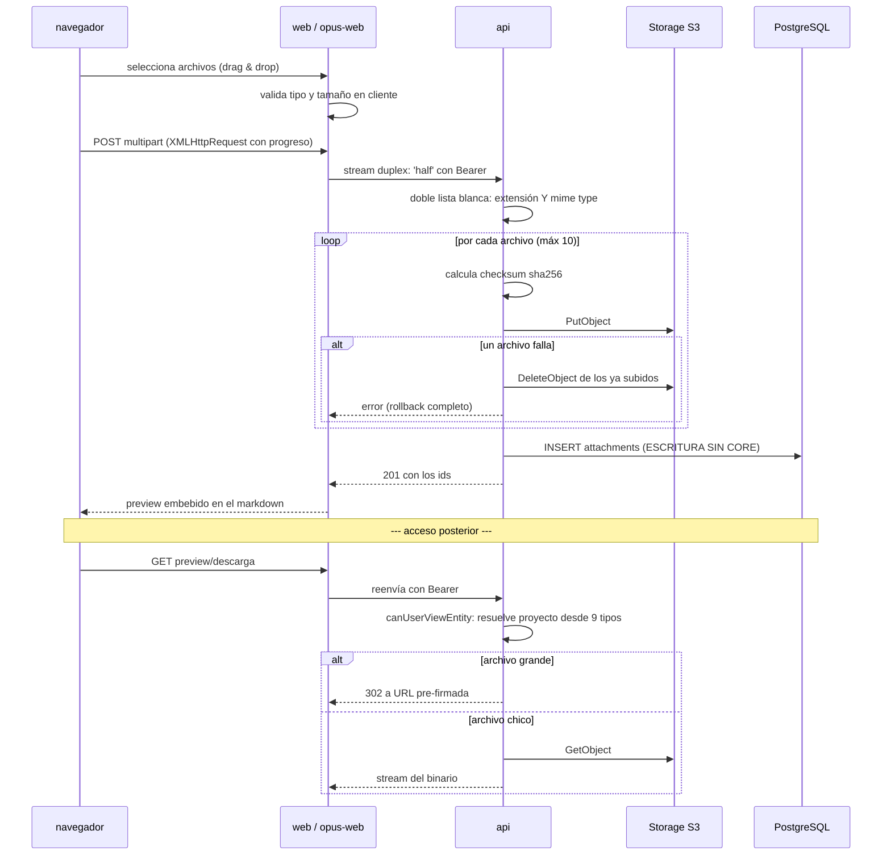

# Subida y Acceso a Adjuntos

**Tipo:** Feature
**Status:** Active (implementado en el código existente)
**Creado:** 2026-08-18
**Última actualización:** 2026-08-18
**Stories:** —

## Descripción

Flujo transversal de adjuntos: subida a storage S3-compatible, y las **tres formas distintas de
acceder** a un archivo — con sesión desde el gestor interno, con sesión desde el portal, y **sin
sesión** por link público.

Es el único flujo que escribe en la base **sin pasar por `core`**, y el único que expone una
superficie no autenticada. Las dos cosas son excepciones deliberadas y conviene entender por qué.

## Servicios Involucrados

| Servicio | Rol | Tipo de Participación |
|---|---|---|
| `web` / `opus-web` | Uploader con progreso; route handlers que hacen streaming | Iniciador |
| `api` | Valida tipo y tamaño, sube a S3, escribe la fila, y autoriza cada acceso | Procesador |
| Storage S3-compatible | Almacena el binario | Almacenamiento externo |
| PostgreSQL `jiku` | Persiste los metadatos en `attachments` | Almacenamiento |
| `core` | **No participa en la subida.** Solo valida adjuntos al vincularlos a una entidad | Procesador (parcial) |

## Pasos del Flujo



### Paso 1: Validación en el cliente

**Origen:** navegador
**Tipo:** Interno

Los dos frontends validan **antes** de subir. En `opus-web` la validación está **duplicada
literalmente** entre `CommentInput` y `CreateRequirementModal` (10 MB, 12 extensiones).

Es validación de conveniencia: **la autoritativa es la de la api**.

---

### Paso 2: Subida con streaming

**Origen:** navegador → frontend → `api`
**Tipo:** REST (multipart)

El navegador sube con `XMLHttpRequest` para tener **barra de progreso** (`fetch` no la da). El
route handler reenvía el cuerpo **como stream** con `duplex: 'half'`, sin bufferizar el archivo
entero en memoria.

```
POST /api/attachments        (o /api/opus/attachments)
Content-Type: multipart/form-data

entityType: requirement_draft | requirement | objective | project | ...
entityId:   {id} | (ausente para borradores)
```

**Ref:** `web/src/app/api/attachments/route.ts` · `docs/db-schemas/jiku.md` — `attachments`

---

### Paso 3: La api valida, sube y hace rollback si algo falla

**Origen:** `api`
**Destino:** Storage S3
**Tipo:** REST (S3 API)

Validaciones:
- **Máximo 10 archivos**, **10 MB cada uno**
- **Doble lista blanca:** extensión **y** MIME type, 13 extensiones. Un `.exe` renombrado a `.pdf`
  se rechaza porque el MIME no coincide
- **Checksum sha256** por archivo

**Rollback explícito:** si un archivo del lote falla a mitad, la api **borra del bucket los ya
subidos** (`attachments-post.ts:124-134`). No hay transacción posible con S3, así que la
compensación es manual.

**Ref:** `api/lib/utils/storage-service.ts`

---

### Paso 4: La fila se escribe SIN pasar por core

**Origen:** `api`
**Destino:** PostgreSQL
**Tipo:** Interno

```sql
INSERT INTO attachments (entity_type, entity_id, file_name, file_size, mime_type,
                         storage_key, storage_bucket, storage_region, uploaded_by,
                         checksum, retention_status)
VALUES (..., 'active')
```

> **Es una de las dos excepciones a [ADR-001](../adrs/ADR-001-separacion-lectura-escritura.md).**
> La api escribe con el ORM usando las credenciales de solo lectura, y funciona porque el rol de
> la instalación se lo permite. Es **deuda reconocida** (NFR-S09, FG-6), no un patrón a seguir.

`storage_key` es **UNIQUE** e incluye el prefijo de `STORAGE_S3_KEY_PREFIX`. **Cambiar esa
variable en una instalación con datos deja inaccesibles todos los adjuntos existentes.**

---

### Paso 5: Vinculación a la entidad (si era borrador)

**Origen:** `core`
**Tipo:** Interno

Si el adjunto se subió como borrador (`entity_id: NULL`), el vínculo lo completa **core**, dentro
de la transacción del comando que crea la entidad.

Core valida que cada adjunto sea **draft propio, del tipo correcto y vivo** (`retentionStatus`
activo). **Si uno falla, se descarta toda la escritura.**

Ver [`alta-requisito-desde-portal.md`](alta-requisito-desde-portal.md) paso 6.

---

### Paso 6: Acceso — tres caminos distintos

**Tipo:** REST

| # | Camino | Sesión | Autorización |
|---|---|---|---|
| A | `web` → `GET /api/attachments/{id}/preview` \| `/download` | **Sí** | `canUserViewEntity` / `canUserAccessEntity` |
| B | `opus-web` → `GET /api/attachments/{id}/preview` | **Sí** | Igual, más permiso de proyecto |
| C | `opus-web` → `GET /attachments/{id}/{fileName}` | **NO** | Solo `visibility` del adjunto |

**Camino C es el único endpoint sin autenticación de todo el producto.** El route handler llama a
`GET /api/opus/attachments/{id}/public`, que:
- sirve **solo** adjuntos marcados públicos
- responde **403 en cualquier otro caso**
- manda `X-Content-Type-Options: nosniff` con **CSP de sandbox**

El `fileName` de la URL **se ignora**: es cosmético, para que la descarga tenga nombre.

**Autorización por entidad (caminos A y B):** `canUserAccessEntity` resuelve el proyecto desde
**9 tipos de entidad distintos** —objetivo, requisito, comentario de cada uno, borradores,
proyecto, y un `comment` legado— y verifica `user_project_permissions`.

**Archivos grandes:** en lugar de hacer streaming, la api **redirige a una URL pre-firmada** de S3.

---

### Paso 7: Renderizado embebido en markdown

**Origen:** frontend
**Tipo:** Interno

Los adjuntos se insertan en el texto como placeholders que el renderer resuelve:

| Frontend | Formato |
|---|---|
| `web` | `placeholder:` y `fileplaceholder:` |
| `opus-web` | `![attach:N]` (imagen) y `[attach:N]` (archivo) |

**`RichContentRenderer` de `opus-web` parsea los dos formatos** — evidencia de que el contenido
creado en un frontend se lee en el otro.

Los metadatos (nombre, tamaño) se resuelven con un `HEAD` al preview, leyendo
`Content-Disposition` y `Content-Length`.

## Manejo de Errores

| Paso | Error | Código | Response | Comportamiento |
|---|---|---|---|---|
| 3 | Más de 10 archivos, o uno > 10 MB | 400 | `{ code: invalid_fields }` | Rechazo, nada subido |
| 3 | Extensión o MIME fuera de la lista blanca | 400 | `{ code: invalid_fields }` | Rechazo. Ambas se verifican |
| 3 | **Falla a mitad de un lote** | 500 | — | **La api borra del bucket los ya subidos.** Compensación manual, no transacción |
| 4 | Falla el INSERT tras subir a S3 | 500 | — | **El binario queda huérfano en el bucket.** No hay compensación en este sentido |
| 5 | Un adjunto no es draft propio o está borrado | 400 | `{ code: invalid_fields }` | Rollback de la entidad completa |
| 6 | Sin permiso sobre el proyecto | 403 | — | La api rechaza |
| 6 | **Adjunto con `entityType: 'stage'`** | 403 | — | **Nunca se autoriza:** la tabla `stages` ya no existe, así que no hay proyecto contra el cual verificar. Son archivos inalcanzables (FG-6) |
| 6 | Adjunto no público por el camino C | 403 | — | El endpoint público solo sirve los marcados como tales |

## Resultado

**Éxito:** El archivo queda en el bucket y visible embebido en el markdown del requisito, tarea o
comentario, con preview para imágenes y PDF, y descarga para el resto.

**Estado final:**
- Storage: el binario bajo `storage_key` (con el prefijo de `STORAGE_S3_KEY_PREFIX`)
- `attachments`: fila con `retention_status: 'active'` y su `checksum` sha256
- Si era borrador: `entity_type` y `entity_id` actualizados por core al guardar la entidad

## Notas

- **Es el único flujo con dos excepciones arquitectónicas a la vez**: escribe sin core y expone
  una superficie no autenticada. Las dos son deliberadas, y la primera está registrada como deuda.
- **No hay transacción entre S3 y PostgreSQL.** El orden es subir primero y escribir después, con
  compensación manual si la subida falla. **En el sentido inverso no hay compensación**: si el
  INSERT falla después de subir, el binario queda huérfano en el bucket y nada lo limpia.
- **El borrado es lógico**, vía `retention_status` (`active` → `scheduled_for_deletion` →
  `deleted`), no el soft-delete de Sequelize. `paranoid: false` con `deleted_at` propio.
- **`checksum` está excluido del scope por default** (`@DefaultScope`): no viaja en las respuestas
  salvo que se pida explícitamente.
- **Los adjuntos históricos con `entityType: 'stage'` son pérdida de datos silenciosa.** Existen
  en el bucket y en la base, y `hasProjectPermission` devuelve `false` para ese tipo, así que
  **nadie puede acceder a ellos**. Están en el alcance de FG-6.
- **El endpoint público es la superficie más sensible del producto**, y es también la mejor
  defendida en proporción: valida visibilidad por su cuenta, responde 403 por default, y manda
  `nosniff` con CSP de sandbox para que un HTML subido no se ejecute como página.
