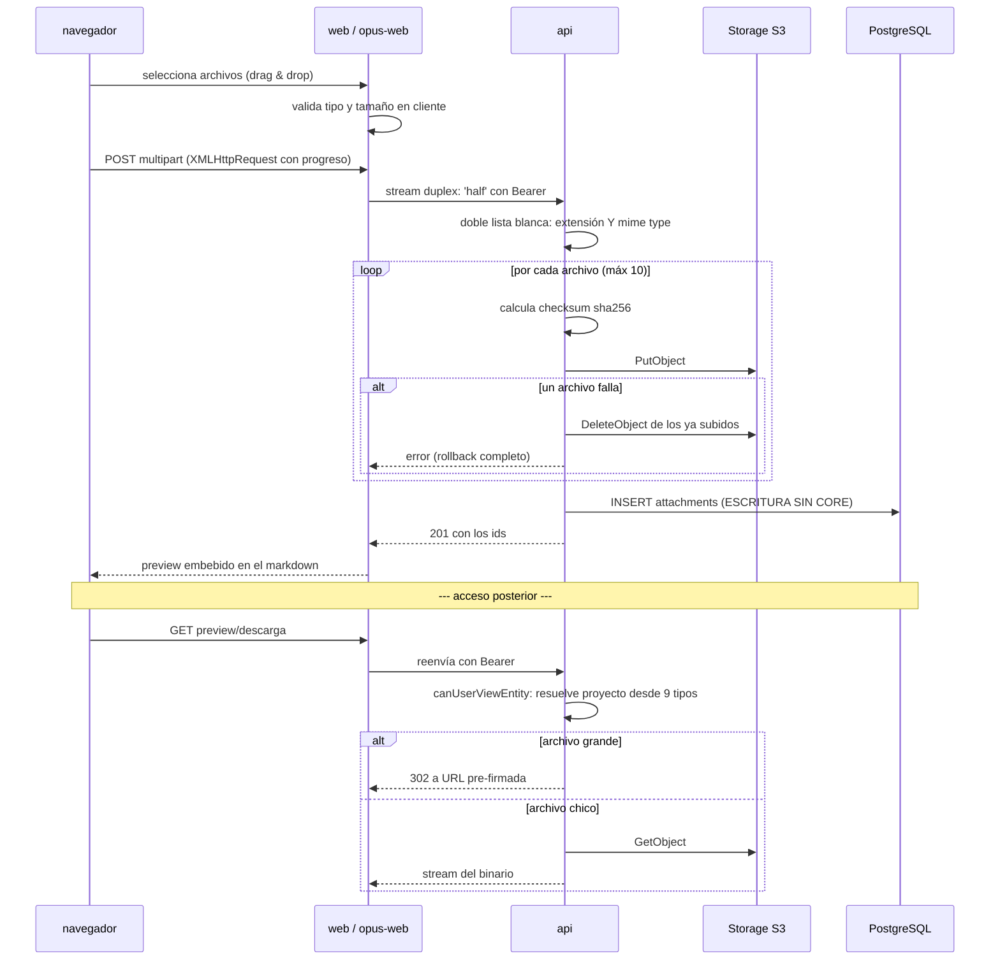

# Subida y Acceso a Adjuntos

**Tipo:** Feature
**Status:** **Deprecated** — reemplazado por completo a partir de REQ-001
**Creado:** 2026-08-18
**Última actualización:** 2026-08-20
**Stories:** S-002, S-003, S-004, S-005, S-006, S-007, S-009

> # ⚠️ FLUJO REEMPLAZADO POR COMPLETO
>
> **Este documento ya no describe el comportamiento del sistema.** El rediseño de
> [`REQ-001`](../requests/REQ-001.rediseno-archivos-y-adjuntos.md) lo **reemplaza por completo** —
> no es una edición de pasos: **seis de sus siete pasos** desaparecen o cambian de servicio, y el
> único que sobrevive (el 7, el renderizado) cambia de mecanismo por debajo.
>
> **Los tres flujos que lo reemplazan:**
>
> | Flujo nuevo | Qué cubre |
> |---|---|
> | [`subida-de-archivos`](subida-de-archivos.md) | El plano del permiso (`files.request-upload`) y el del byte (`PUT` directo del navegador a S3) |
> | [`vinculacion-de-archivos`](vinculacion-de-archivos.md) | El plano del vínculo: `resolveActor`, titularidad, `INSERT INTO attachments` y la desvinculación (`attachments.{id}.delete`) |
> | [`lectura-de-archivos`](lectura-de-archivos.md) | Los cuatro caminos de lectura más el de archivo sin vínculo, y el **302** como único mecanismo |
>
> **Qué le pasó a cada uno de los 7 pasos de este documento:**
>
> | Paso de este flujo | Destino |
> |---|---|
> | **1** — Validación en el cliente | **Se mantiene como conveniencia**, pero la autoritativa **se muda de `api` a `core`** (`system_settings`, en caliente). Ver `subida-de-archivos` paso 1 |
> | **2** — Subida con streaming multipart a la api | **ELIMINADO.** Lo reemplaza el pedido de permiso (`files.request-upload`) + el **`PUT` directo a S3** |
> | **3** — La api valida, sube y hace rollback | **ELIMINADO.** La validación va a `core`; **el rollback de S3 desaparece y no se reemplaza** (quien escribe el objeto es el navegador) |
> | **4** — *"La fila se escribe SIN pasar por core"* | **ELIMINADO.** Es el objetivo declarado del rediseño: cierra la excepción 2 de ADR-001 |
> | **5** — Vinculación del borrador | **ELIMINADO.** **No hay draft.** El vínculo se crea contra la entidad existente. Ver `vinculacion-de-archivos` |
> | **6** — Acceso, tres caminos | **Cambia de mecanismo.** Los tres siguen existiendo y entrando por id de vínculo, pero **ninguno sirve el byte**: autorizan, piden la URL a `core` con `files.{fileId}.request-download` y responden **302**. La rama *"alt archivo grande / 302 a URL pre-firmada"* **deja de ser una rama**. El **camino C quedó deprecado por REQ-001 y ELIMINADO por REQ-002 / S-009**: hoy son **dos** caminos, los dos con sesión |
> | **7** — Renderizado embebido en markdown | **Los placeholders no cambian.** El `HEAD` al preview **sigue funcionando pero por otro mecanismo**: los metadatos vienen del reply del comando en lugar de leerse del stream |
>
> **Actualización (2026-08-20, REQ-002 / S-009): el camino C del paso 6 no solo fue reemplazado — fue
> ELIMINADO.** `GET /attachments/{id}/{fileName}` de `opus-web` y
> `GET /api/opus/attachments/{id}/public` de la `api` **ya no existen**, junto con la excepción
> `attachments` del matcher del middleware y la lista de rutas exentas de `validateToken`. Todo lo que
> este documento dice sobre *"el único endpoint sin autenticación de todo el producto"* describe algo
> que **ya no está**: el acceso a un archivo exige sesión en todos los casos, y
> `visibilityLevel: 'public'` gobierna solo qué ve un usuario **autenticado**. Se anota acá en lugar de
> reescribir los pasos: el documento está `Deprecated` y reescribir un flujo deprecado es trabajo que
> nadie va a leer.
>
> **Pasos nuevos que este documento no tenía:** pedir permiso de subida (`files.request-upload`) y el
> `PUT` directo del navegador a S3.
>
> **El contenido histórico queda debajo sin borrar**, porque documenta lo que había antes del
> rediseño. No lo tomes como referencia de implementación.

---

## Descripción

Flujo transversal de adjuntos: subida a storage S3-compatible, y las **tres formas distintas de
acceder** a un archivo — con sesión desde el gestor interno, con sesión desde el portal, y **sin
sesión** por link público.

Es el único flujo que escribe en la base **sin pasar por `core`**, y el único que expone una
superficie no autenticada. Las dos cosas son excepciones deliberadas y conviene entender por qué.

## Servicios Involucrados

| Servicio | Rol | Tipo de Participación |
|---|---|---|
| `web` / `opus-web` | Uploader con progreso; route handlers que hacen streaming | Iniciador |
| `api` | Valida tipo y tamaño, sube a S3, escribe la fila, y autoriza cada acceso | Procesador |
| Storage S3-compatible | Almacena el binario | Almacenamiento externo |
| PostgreSQL `jiku` | Persiste los metadatos en `attachments` | Almacenamiento |
| `core` | **No participa en la subida.** Solo valida adjuntos al vincularlos a una entidad | Procesador (parcial) |

## Pasos del Flujo



### Paso 1: Validación en el cliente

**Origen:** navegador
**Tipo:** Interno

Los dos frontends validan **antes** de subir. En `opus-web` la validación está **duplicada
literalmente** entre `CommentInput` y `CreateRequirementModal` (10 MB, 12 extensiones).

Es validación de conveniencia: **la autoritativa es la de la api**.

> **Actualizado por S-007 (`opus-web`) y S-006 (`web`).** El paso **se conserva** como conveniencia
> —falla rápido, sin ida y vuelta— pero **dejó de ser autoritativo**: la fuente de verdad es `core`,
> que lee la política de `system_settings` **en caliente**. En el código de `opus-web` la constante
> `ALLOWED_EXTENSIONS` lleva un comentario que lo declara.
>
> **Consecuencia visible:** los mensajes de rechazo **ya no nombran los límites**. `"El archivo
> supera el límite de 10MB"` pasó a `"El archivo supera el tamaño máximo permitido"` y `"Tipo de
> archivo no permitido"` a `"Ese tipo de archivo no está permitido"` — un número escrito en la
> interfaz queda mintiendo cuando la configuración cambia por SQL. Son **los mismos mensajes** que
> devuelve el servidor, así que el usuario no distingue el origen del rechazo.

---

### Paso 2: Subida con streaming

**Origen:** navegador → frontend → `api`
**Tipo:** REST (multipart)

El navegador sube con `XMLHttpRequest` para tener **barra de progreso** (`fetch` no la da). El
route handler reenvía el cuerpo **como stream** con `duplex: 'half'`, sin bufferizar el archivo
entero en memoria.

```
POST /api/attachments        (o /api/opus/attachments)
Content-Type: multipart/form-data

entityType: requirement_draft | requirement | objective | project | ...
entityId:   {id} | (ausente para borradores)
```

**Ref:** `web/src/app/api/attachments/route.ts` · `docs/db-schemas/jiku.md` — `attachments`

---

### Paso 3: La api valida, sube y hace rollback si algo falla

**Origen:** `api`
**Destino:** Storage S3
**Tipo:** REST (S3 API)

Validaciones:
- **Máximo 10 archivos**, **10 MB cada uno**
- **Doble lista blanca:** extensión **y** MIME type, 13 extensiones. Un `.exe` renombrado a `.pdf`
  se rechaza porque el MIME no coincide
- **Checksum sha256** por archivo

**Rollback explícito:** si un archivo del lote falla a mitad, la api **borra del bucket los ya
subidos** (`attachments-post.ts:124-134`). No hay transacción posible con S3, así que la
compensación es manual.

**Ref:** `api/lib/utils/storage-service.ts`

---

### Paso 4: La fila se escribe SIN pasar por core

**Origen:** `api`
**Destino:** PostgreSQL
**Tipo:** Interno

```sql
INSERT INTO attachments (entity_type, entity_id, file_name, file_size, mime_type,
                         storage_key, storage_bucket, storage_region, uploaded_by,
                         checksum, retention_status)
VALUES (..., 'active')
```

> **Es una de las dos excepciones a [ADR-001](../adrs/ADR-001-separacion-lectura-escritura.md).**
> La api escribe con el ORM usando las credenciales de solo lectura, y funciona porque el rol de
> la instalación se lo permite. Es **deuda reconocida** (NFR-S09, FG-6), no un patrón a seguir.

`storage_key` es **UNIQUE** e incluye el prefijo de `STORAGE_S3_KEY_PREFIX`. **Cambiar esa
variable en una instalación con datos deja inaccesibles todos los adjuntos existentes.**

---

### Paso 5: Vinculación a la entidad (si era borrador) — ELIMINADO POR S-003

> ## ⚠️ ESTE PASO YA NO EXISTE
>
> **S-003 lo eliminó.** El patrón de borrador que describía —subir el adjunto con `entity_id: NULL`
> y "confirmarlo" después reanclándolo con un `UPDATE`— **no tiene sustituto porque no hace falta**:
> desde S-001 el archivo existe por su cuenta como fila de `files`, así que no necesita colgar de
> nada para existir mientras el usuario todavía no guardó.
>
> **Lo que hace core ahora:** los seis comandos de dominio reciben `fileIds` (no `attachmentIds`),
> y crean el vínculo con un **`INSERT INTO attachments`** contra una entidad que **ya existe**. No
> hay reanclaje, no hay `entityType` de draft y no hay `attachmentScope`.
>
> **La validación también cambió de premisa:** ya no es "es un draft propio, del tipo correcto y
> vivo", sino "el archivo existe, está vivo, y **lo subió el actor de este comando**"
> (`File.uploaded_by == resolveActor(ctx, payload)`), con `invalid_fields` (400) y
> `file_not_owned` (403) como códigos distinguibles.
>
> Ver [`vinculacion-de-archivos.md`](vinculacion-de-archivos.md), que es el flujo que lo reemplaza,
> y [`alta-requisito-desde-portal.md`](alta-requisito-desde-portal.md) paso 6 para el caso concreto.

**Este documento NO se borra:** las stories S-004 y S-005 todavía lo referencian como descripción
del estado del que parten. Se reemplaza por completo entre las stories 2, 3, 4 y 5.

---

### Paso 6: Acceso — tres caminos distintos

**Tipo:** REST

| # | Camino | Sesión | Autorización |
|---|---|---|---|
| A | `web` → `GET /api/attachments/{id}/preview` \| `/download` | **Sí** | `canUserViewEntity` / `canUserAccessEntity` |
| B | `opus-web` → `GET /api/attachments/{id}/preview` | **Sí** | Igual, más permiso de proyecto |
| C | `opus-web` → `GET /attachments/{id}/{fileName}` | **NO** | Solo `visibility` del adjunto |

**Camino C es el único endpoint sin autenticación de todo el producto.** El route handler llama a
`GET /api/opus/attachments/{id}/public`, que:
- sirve **solo** adjuntos marcados públicos
- responde **403 en cualquier otro caso**
- manda `X-Content-Type-Options: nosniff` con **CSP de sandbox**

El `fileName` de la URL **se ignora**: es cosmético, para que la descarga tenga nombre.

**Autorización por entidad (caminos A y B):** `canUserViewEntity` resuelve el proyecto desde
**9 tipos de entidad distintos** —objetivo, requisito, comentario de cada uno, borradores,
proyecto, y un `comment` legado— y verifica `user_project_permissions`.

> **REEMPLAZADO POR `lectura-de-archivos` EN CUANTO AL MECANISMO (S-005, 2026-08-19).**
>
> Los tres caminos **siguen entrando por el id del vínculo** y su autorización no cambia, pero
> **ninguno sirve el byte**: los tres autorizan, resuelven el `file_id`, publican
> `files.{fileId}.request-download` y responden **302** a la prefirmada que firmó `core`.
>
> **La rama "archivos grandes → 302 a URL pre-firmada" DEJA DE SER UNA RAMA.** El 302 es el único
> mecanismo, para todos los tamaños y todos los caminos. La `api` ya no tiene cliente de S3.
>
> Hay además un **cuarto camino** que este flujo no contempla porque no entra por un vínculo:
> `GET /api/files/{id}/preview`, para el archivo sin vincular. Ver
> [`lectura-de-archivos.md`](lectura-de-archivos.md), que es la fuente de verdad del mecanismo.

---

### Paso 7: Renderizado embebido en markdown

**Origen:** frontend
**Tipo:** Interno

Los adjuntos se insertan en el texto como placeholders que el renderer resuelve:

| Frontend | Formato |
|---|---|
| `web` | `placeholder:` y `fileplaceholder:` |
| `opus-web` | `![attach:N]` (imagen) y `[attach:N]` (archivo) |

**`RichContentRenderer` de `opus-web` parsea los dos formatos** — evidencia de que el contenido
creado en un frontend se lee en el otro.

Los metadatos (nombre, tamaño) se resuelven con un `HEAD` al preview, leyendo
`Content-Disposition` y `Content-Length`.

> **El `HEAD` sigue funcionando, POR OTRO MECANISMO (S-005).** Los placeholders no cambian, pero
> los metadatos ya no salen del stream: vienen en el **reply del comando**
> (`fileName`, `mimeType`, `fileSize`) y la `api` los pone en los headers de su **302**, sin volver
> a consultar la base.
>
> El `Content-Length` con el tamaño del archivo **se manda solo en `HEAD`**: en un `GET` prometería
> bytes que una redirección no tiene y la conexión quedaría colgada. El `HEAD` no lleva body, así
> que ahí el header describe el recurso y es correcto.

## Manejo de Errores

| Paso | Error | Código | Response | Comportamiento |
|---|---|---|---|---|
| 3 | Más de 10 archivos, o uno > 10 MB | 400 | `{ code: invalid_fields }` | Rechazo, nada subido |
| 3 | Extensión o MIME fuera de la lista blanca | 400 | `{ code: invalid_fields }` | Rechazo. Ambas se verifican |
| 3 | **Falla a mitad de un lote** | 500 | — | **La api borra del bucket los ya subidos.** Compensación manual, no transacción |
| 4 | Falla el INSERT tras subir a S3 | 500 | — | **El binario queda huérfano en el bucket.** No hay compensación en este sentido |
| 5 | Un adjunto no es draft propio o está borrado | 400 | `{ code: invalid_fields }` | Rollback de la entidad completa |
| 6 | Sin permiso sobre el proyecto | 403 | — | La api rechaza |
| 6 | **Adjunto con `entityType: 'stage'`** | 403 | — | **Nunca se autoriza:** la tabla `stages` ya no existe, así que no hay proyecto contra el cual verificar. Son archivos inalcanzables (FG-6) |
| 6 | Adjunto no público por el camino C | 403 | — | El endpoint público solo sirve los marcados como tales |

## Resultado

**Éxito:** El archivo queda en el bucket y visible embebido en el markdown del requisito, tarea o
comentario, con preview para imágenes y PDF, y descarga para el resto.

**Estado final:**
- Storage: el binario bajo `storage_key` (con el prefijo de `STORAGE_S3_KEY_PREFIX`)
- `attachments`: fila con `retention_status: 'active'` y su `checksum` sha256
- Si era borrador: `entity_type` y `entity_id` actualizados por core al guardar la entidad

## Notas

- **Es el único flujo con dos excepciones arquitectónicas a la vez**: escribe sin core y expone
  una superficie no autenticada. Las dos son deliberadas, y la primera está registrada como deuda.
- **No hay transacción entre S3 y PostgreSQL.** El orden es subir primero y escribir después, con
  compensación manual si la subida falla. **En el sentido inverso no hay compensación**: si el
  INSERT falla después de subir, el binario queda huérfano en el bucket y nada lo limpia.
- **El borrado es lógico**, vía `retention_status` (`active` → `scheduled_for_deletion` →
  `deleted`), no el soft-delete de Sequelize. `paranoid: false` con `deleted_at` propio.
- **`checksum` está excluido del scope por default** (`@DefaultScope`): no viaja en las respuestas
  salvo que se pida explícitamente.
- **Los adjuntos históricos con `entityType: 'stage'` son pérdida de datos silenciosa.** Existen
  en el bucket y en la base, y `hasProjectPermission` devuelve `false` para ese tipo, así que
  **nadie puede acceder a ellos**. Están en el alcance de FG-6.
- **El endpoint público es la superficie más sensible del producto**, y es también la mejor
  defendida en proporción: valida visibilidad por su cuenta, responde 403 por default, y manda
  `nosniff` con CSP de sandbox para que un HTML subido no se ejecute como página.
