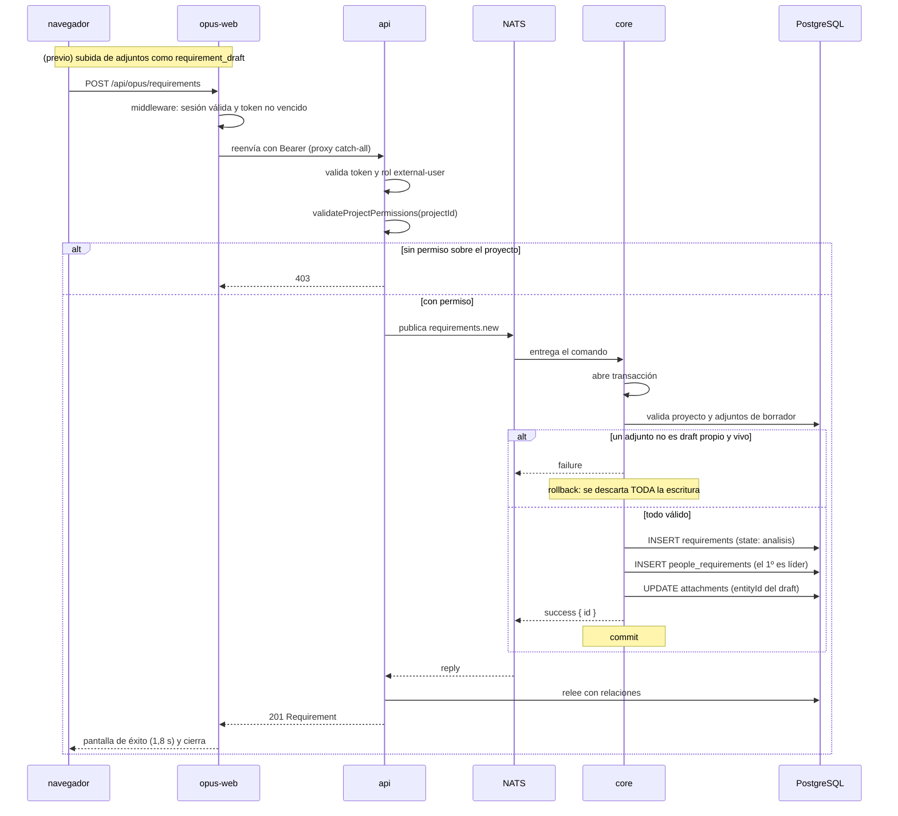

# Alta de Requisito desde el Portal de Clientes

**Tipo:** Feature
**Status:** Active (implementado en el código existente)
**Creado:** 2026-08-18
**Última actualización:** 2026-08-18
**Stories:** —

## Descripción

Flujo por el cual un **cliente externo** crea un requisito desde el portal Opus. Se dispara al
confirmar el modal de creación. Es el flujo que atraviesa **todas las capas de aislamiento** del
producto: proxy del portal, autorización por rol, permiso de proyecto, y adjuntos de borrador que
se vinculan recién al guardar.

Es también el único flujo en el que un actor externo a la organización **escribe** en el sistema.

## Servicios Involucrados

| Servicio | Rol | Tipo de Participación |
|---|---|---|
| `opus-web` | Modal de creación y **proxy catch-all** que agrega el Bearer | Iniciador |
| `api` | Valida rol y permiso de proyecto; publica el comando; relee para la respuesta | Procesador |
| `core` | Valida el proyecto, los adjuntos de borrador y los responsables; escribe | Procesador |
| PostgreSQL `jiku` | Persiste `requirements`, `people_requirements`, `requirement_subscriptors` y actualiza `attachments` | Almacenamiento |

## Pasos del Flujo



### Paso 1: Adjuntos de borrador (previo, opcional)

**Origen:** navegador → `opus-web` → `api`
**Tipo:** REST (multipart)

Antes de que el requisito exista, el usuario puede adjuntar archivos. Se suben con
`entityType: "requirement_draft"` y **`entityId: null`**: la titularidad se resuelve por
`uploadedBy`.

```
POST /api/opus/attachments   (multipart/form-data)
entityType: requirement_draft
entityId:   (ausente)
```

**Validación en la api:** máximo 10 archivos, 10 MB cada uno, doble lista blanca de extensión
**y** MIME type. Si un archivo del lote falla, **se borra del bucket lo ya subido**.

**Ref:** `docs/db-schemas/jiku.md` — `attachments.entity_id` nullable desde `20260612_03`

---

### Paso 2: El cliente confirma la creación

**Origen:** navegador
**Destino:** `opus-web`
**Tipo:** REST

**Request:**
```
POST /api/opus/requirements        ← al propio origen de opus-web

{
  "title": "El reporte de horas no exporta las ausencias",
  "description": "Al exportar el CSV...",
  "projectId": 12,
  "type": "incidencia",
  "priority": "alta",
  "subscriptorIds": ["3233...", "3234..."],
  "attachmentIds": [88, 89]
}
```

**El único campo obligatorio es `title`.** El estado no es editable: se muestra como un chip fijo
"Análisis".

**Ref:** `opus-web/src/features/requirements/components/CreateRequirementModal.tsx:217-221,314-318`

---

### Paso 3: El proxy catch-all reenvía con el token

**Origen:** `opus-web`
**Destino:** `api`
**Tipo:** REST

El route handler `/api/opus/[...path]` reenvía **cualquier método** a
`{API_URL}api/opus/{path}` agregando `Authorization: Bearer {accessToken}` de la sesión.

**El access token nunca llega al navegador**
([ADR-009](../adrs/ADR-009-token-confinado-al-servidor.md)).

> **El proxy no filtra paths ni métodos** (NFR-S08). Toda la superficie de `/api/opus/*` queda
> alcanzable para cualquier usuario logueado; la autorización la decide enteramente la api.

---

### Paso 4: La api autoriza por rol y por entidad

**Origen:** `api`
**Destino:** `api` (interno)
**Tipo:** Interno

Dos capas independientes ([ADR-008](../adrs/ADR-008-autorizacion-deny-by-default.md)):

1. **Rol:** `hasAnyRole(['external-user', 'user', 'admin'])`
2. **Entidad:** `validateProjectPermissions(projectId)` — el usuario tiene que tener fila en
   `user_project_permissions` para ese proyecto

**Es la capa 2 la que sostiene el aislamiento entre clientes**: sin ella, un cliente podría crear
requisitos en el proyecto de otro.

**Ref:** `docs/db-schemas/jiku.md` — `user_project_permissions`

---

### Paso 5: La api publica el comando

**Origen:** `api`
**Destino:** `core`
**Tipo:** Evento (NATS request/reply)

**Subject:** `{instance}.{user-id}.gestion.v1.requirements.new`

**Payload:**
```json
{
  "creator": "323332022539911171",
  "title": "El reporte de horas no exporta las ausencias",
  "description": "Al exportar el CSV...",
  "projectId": 12,
  "type": "incidencia",
  "priority": "alta",
  "state": "analisis",
  "visibilityLevel": "public",
  "responsiblePersonIds": [],
  "attachmentIds": [88, 89]
}
```

`creator` (IdentityUserId, **req**) · `title` (string, req) · `description` (string, req) ·
`projectId` (integer, req) · `type` (enum|null) · `priority` (enum, default `sin_prioridad`) ·
`state` (enum, default `analisis`) · `visibilityLevel` (enum, default `public`) ·
`responsiblePersonIds` (integer[]) · `estimatedFinishDate` (date-time|null) · `tags` (Tag[]) ·
`attachmentIds` (integer[])

> **`creator` viaja en el cuerpo, no en el subject.** El subject identifica al **service user de
> la api**, no a la persona. Core confía en este campo sin verificarlo: la única defensa es la
> política del auth-callout ([ADR-007](../adrs/ADR-007-identidad-zitadel-auth-callout.md)).

**Ref:** `docs/apis/core.yaml` — canal `requirements.new`, `RequirementsNewPayload`

---

### Paso 6: Core valida y escribe, todo en una transacción

**Origen:** `core`
**Destino:** PostgreSQL
**Tipo:** Interno

El despachador abre la transacción. Validaciones:

1. **El proyecto existe** → `project_not_found`
2. **Los adjuntos son drafts propios y vivos:** cada `attachmentId` tiene que ser del propio
   `uploadedBy`, estar anclado al tipo de entidad correcto, y tener `retentionStatus` activo.
   **Si uno solo falla, se descarta toda la escritura.**
3. **Las personas responsables existen** → `person_not_found`

**Operaciones de BD:**
```sql
INSERT INTO requirements (title, description, project_id, type, priority, state,
                          visibility_level, created_by)
VALUES (..., 'analisis', 'public', '323332022539911171');

-- el PRIMERO de responsiblePersonIds queda como líder: el ORDEN es información
INSERT INTO people_requirements (requirement_id, person_id, is_leader) VALUES (...);

-- los adjuntos de borrador se vinculan a la entidad recién creada
UPDATE attachments SET entity_type = 'requirement', entity_id = {nuevoId} WHERE id IN (88, 89);

-- si vinieron suscriptores
INSERT INTO requirement_subscriptors (requirement_id, user_id) VALUES (...);
```

**Response (éxito):** `{ "status": "success", "data": { "id": 412 } }` → **commit**

**Ref:** `core/src/commands/requirements/requirements-new.ts:130` · `docs/db-schemas/jiku.md`

---

### Paso 7: La api relee y el portal confirma

**Origen:** `api` → `opus-web` → navegador
**Tipo:** REST

La api relee la base para armar el recurso completo. El portal muestra una **pantalla de éxito
durante 1,8 segundos** y cierra el modal, invalidando las queries del tablero.

## Manejo de Errores

| Paso | Error | Código | Response | Comportamiento |
|---|---|---|---|---|
| 3 | Sesión ausente o access token vencido | 401 | `{"error":"Unauthorized"}` | El middleware de `opus-web` corta antes de reenviar |
| 4 | Rol no autorizado | 403 | `{ code: access_denied }` | La api rechaza sin publicar |
| 4 | **Sin permiso sobre el proyecto** | 403 | `{ code: access_denied }` | **La capa que aísla un cliente de otro.** Rechaza sin publicar |
| 6 | Proyecto inexistente | 400 | `{ code: project_not_found }` | Rollback |
| 6 | Un adjunto no es draft propio, o está borrado | 400 | `{ code: invalid_fields }` | **Rollback: se descarta el requisito entero**, no solo el adjunto |
| 6 | Persona responsable inexistente | 400 | `{ code: person_not_found }` | Rollback |
| 5 | Timeout del bus | **503** | `{ code: bus_unavailable }` | La operación no ocurrió |
| 2 | **Fallo de creación en el portal** | cualquiera | — | **El modal no muestra el error.** El botón vuelve de "Creando..." a "Crear elemento" sin mensaje (NFR-U06, gap conocido) |

## Resultado

**Éxito:** El cliente ve una pantalla de éxito y el requisito aparece en la columna **Análisis**
del tablero. El equipo interno lo ve en `web` con el mismo estado.

**Estado final:**
- `requirements`: fila nueva con `state: 'analisis'`, `visibility_level: 'public'`,
  `created_by` = el usuario del cliente
- `people_requirements`: filas de responsables, con `is_leader` en la primera
- `attachments`: los drafts pasan de `entity_type: 'requirement_draft'`, `entity_id: NULL` a
  `entity_type: 'requirement'`, `entity_id: {nuevoId}`
- `requirement_subscriptors`: filas de los suscriptores elegidos
- **Ninguna notificación se envía a nadie** (ver Notas)

## Notas

- **Los adjuntos de borrador son el mecanismo más sutil del flujo.** `entity_id` es nullable
  precisamente para que se puedan subir antes de que la entidad exista; la titularidad se valida
  por `uploadedBy`. El vínculo se completa **dentro de la misma transacción** que crea el
  requisito, así que no puede quedar un adjunto huérfano de un requisito que falló.
- **El requisito nace siempre en `analisis`.** El portal lo muestra como chip fijo y core lo
  valida por default, pero **la secuencia posterior del workflow solo se valida en `web`**
  (NFR-S07): por esta misma superficie se puede llevar un requisito a cualquier estado.
- **Los suscriptores no reciben nada.** La suscripción se registra en la base y **no hay canal de
  notificación en el producto**. Es la brecha del feature group FG-2.
- **Un usuario interno puede usar esta misma superficie.** `opus-web` no corta navegación por rol,
  así que un `user` o `admin` que entre al portal puede crear requisitos y cambiar estado y
  prioridad inline (pregunta abierta 4).
- **El comentario que un cliente escriba después se crea siempre como `public`**, y el feed que ve
  filtra por `visibilityLevel: 'public'`: es lo que impide que vea actividad interna.
