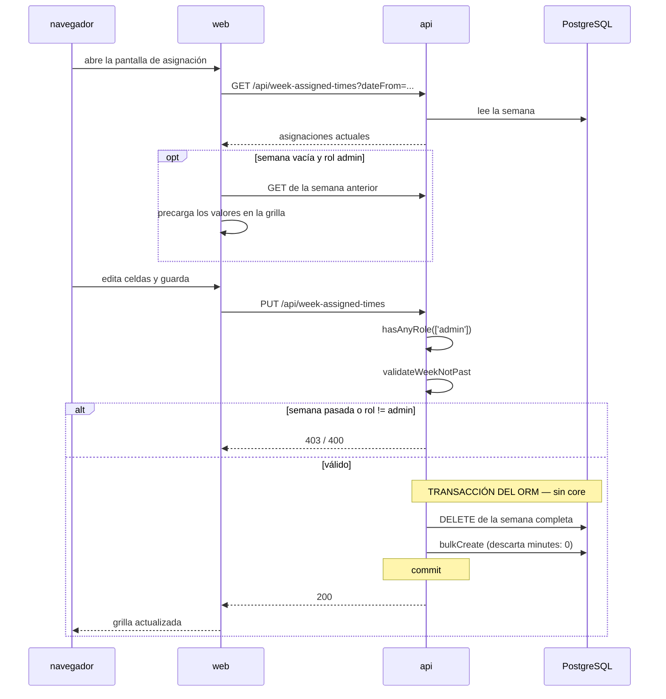

# Asignación Semanal de Capacidad

**Tipo:** Feature
**Status:** Active (implementado en el código existente)
**Creado:** 2026-08-18
**Última actualización:** 2026-08-18
**Stories:** —

## Descripción

Flujo de planificación de capacidad: un administrador reserva cuántas horas de cada persona van a
cada proyecto durante una semana. Se dispara al guardar la grilla proyecto × persona.

**Es el flujo excepcional del producto**, y por eso está documentado aparte: es la **única
escritura de dominio que no pasa por `core`**. La api la ejecuta directamente con el ORM, en una
transacción propia. Documentarlo importa tanto por lo que hace como por lo que revela sobre la
regla que viola.

## Servicios Involucrados

| Servicio | Rol | Tipo de Participación |
|---|---|---|
| `web` | Grilla editable, precarga desde la semana anterior | Iniciador |
| `api` | Valida rol y semana; **borra y recrea la semana con el ORM** | Procesador **y escritor** |
| PostgreSQL `jiku` | Persiste `week_assigned_times` | Almacenamiento |
| `core` | **No participa.** Este flujo no lo involucra | — |

## Pasos del Flujo



### Paso 1: Lectura de la semana

**Origen:** `web`
**Destino:** `api`
**Tipo:** REST

```
GET /api/week-assigned-times?dateFrom=2026-08-17
```

La grilla se arma agrupando en **"Comerciales activos"**, **"Internos activos"** y
**"En análisis"**, y solo incluye personas con `must_charge_worked_time: true`.

**Ref:** `docs/db-schemas/jiku.md` — `people.must_charge_worked_time`

---

### Paso 2: Precarga desde la semana anterior (solo UI)

**Origen:** `web`
**Tipo:** Interno

Si la semana actual está **vacía** y el usuario es **`admin`**, el frontend consulta la semana
anterior y **precarga sus valores** en la grilla, sin guardarlos.

> **Es una regla que vive solo en `web`** (C-37, NFR-U03). No tiene contraparte en el servidor, y
> probablemente esté bien así: es una comodidad de interfaz, no una regla de negocio. Se documenta
> para que quede claro que la ausencia de validación server-side acá es **deliberada**, a
> diferencia del workflow de requisitos.

**Ref:** `web/src/features/time-allocation/components/WeeklyAllocationTable.tsx:203-205`

---

### Paso 3: Guardado de la semana completa

**Origen:** `web`
**Destino:** `api`
**Tipo:** REST

```
PUT /api/week-assigned-times

{
  "dateFrom": "2026-08-17",
  "assignments": [
    { "projectId": 12, "personId": 7, "minutes": 1200 },
    { "projectId": 12, "personId": 9, "minutes": 600 },
    { "projectId": 15, "personId": 7, "minutes": 300 }
  ]
}
```

**Es el único `PUT` de toda la api.** El verbo es correcto: la semántica es de reemplazo total del
recurso "semana", no de edición incremental.

---

### Paso 4: Validaciones en la api

**Origen:** `api`
**Tipo:** Interno

1. **Rol:** `hasAnyRole(['admin'])` — solo un administrador edita la asignación
2. **Semana no pasada:** `validateWeekNotPast` impide modificar semanas ya transcurridas

**Ref:** `api/lib/routes/week-assigned-times-put.ts`

---

### Paso 5: La escritura excepcional

**Origen:** `api`
**Destino:** PostgreSQL
**Tipo:** Interno

**Es la única ruta de la api que escribe con el ORM y usa los middlewares de transacción.**

```sql
BEGIN;
  DELETE FROM week_assigned_times WHERE date_from = '2026-08-17';
  INSERT INTO week_assigned_times (date_from, date_to, internal, minutes, project_id, person_id)
  VALUES (...);   -- bulkCreate
COMMIT;
```

Reglas aplicadas al escribir:
- **Las asignaciones con `minutes: 0` se descartan**: no quedan filas en cero
- **`internal` se deriva** de `projects.type === 'interno'`, no viene del cliente
- `date_to` se calcula como `date_from + 4 días` (lunes a viernes)

> **Esta escritura viola [ADR-001](../adrs/ADR-001-separacion-lectura-escritura.md).** Usa las
> credenciales de solo lectura y funciona porque el rol de la instalación se lo permite. Es una de
> las dos excepciones vivas del producto, junto con la fila de `attachments`, y es deuda
> registrada (NFR-S09, pregunta abierta 15, FG-6).

**Ref:** `api/lib/routes/week-assigned-times-put.ts:39-78` · `docs/db-schemas/jiku.md` —
`week_assigned_times`

## Manejo de Errores

| Paso | Error | Código | Response | Comportamiento |
|---|---|---|---|---|
| 3 | Sin sesión | 401 | `{ code: unauthorized }` | `web` redirige a `/login` |
| 4 | Rol distinto de `admin` | 403 | `{ code: access_denied }` | Rechazo. La grilla ya es de solo lectura para no-admin |
| 4 | Semana pasada | 400 | — | Rechazo: no se modifican semanas transcurridas |
| 5 | Falla el `bulkCreate` a mitad | 500 | — | **Rollback de la transacción del ORM:** la semana queda como estaba. La atomicidad acá la da el ORM, no el despachador de core |
| 5 | Proyecto o persona inexistentes | 500 | — | Falla por foreign key, sin validación previa amigable |

## Resultado

**Éxito:** La grilla muestra la semana guardada. Las horas asignadas quedan disponibles para
comparar contra las horas efectivamente cargadas (ver [`carga-de-horas.md`](carga-de-horas.md)).

**Estado final:**
- `week_assigned_times`: **la semana completa reemplazada** — las filas anteriores de ese
  `date_from` ya no existen
- Las combinaciones proyecto/persona con 0 minutos no tienen fila
- `internal` derivado del tipo de cada proyecto

## Notas

- **Es el contrapunto de la carga de horas.** Este flujo registra **lo planeado** (semanal, solo
  admin, reemplazo total); el de carga de horas registra **lo ocurrido** (diario, cada persona,
  incremental). Compararlos es lo que da G-03.
- **El futuro de este endpoint está sin definir.** Es la única escritura que nunca se convirtió en
  comando, y puede mantenerse, rehacerse como comando de `core`, o eliminarse. Está registrado en
  las limitaciones conocidas del repositorio y en la pregunta abierta 15.
- **Su atomicidad no está en riesgo**, a diferencia de lo que podría sugerir "escritura fuera de
  core": la transacción del ORM garantiza que el borrado y la recreación ocurren juntos. Lo que se
  pierde al no pasar por core es la **uniformidad** —una sola forma de escribir, un solo lugar
  donde auditar reglas— no la integridad de esta operación puntual.
- **El reemplazo total borra el historial.** No queda registro de cuál era la asignación anterior
  ni de quién la cambió: no hay `*_activity` para esta entidad.
- La precarga desde la semana anterior es de las pocas reglas solo-UI del producto que
  **probablemente deban quedarse así**: es una sugerencia de interfaz, no una regla de negocio.
