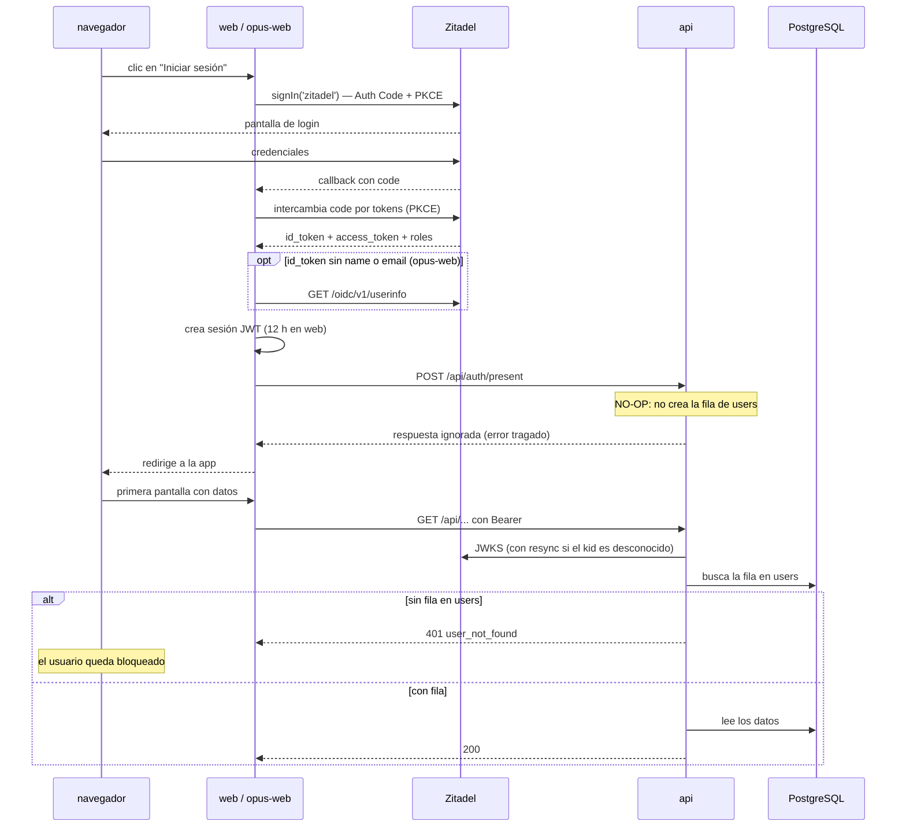

# Autenticación y Entrada al Sistema

**Tipo:** Feature
**Status:** Active (implementado en el código existente)
**Creado:** 2026-08-18
**Última actualización:** 2026-08-18
**Stories:** —

## Descripción

Flujo de login OIDC contra Zitadel, común a los dos frontends. Se dispara al hacer clic en
"Iniciar sesión". Documenta además **el punto donde el producto falla para un usuario nuevo**: el
paso de presentación ante la api es hoy un no-op, así que quien autentica correctamente pero no
tiene fila en `users` queda en un estado inutilizable — autenticado y rechazado por todas las
rutas.

Incluye también la autenticación **de los servicios entre sí**, que usa el mismo proveedor pero un
camino distinto.

## Servicios Involucrados

| Servicio | Rol | Tipo de Participación |
|---|---|---|
| `web` / `opus-web` | Inician el flujo OIDC y guardan la sesión JWT | Iniciador |
| Zitadel | Autentica, emite el token y publica el JWKS | Procesador (externo) |
| `api` | Valida el token contra el JWKS y resuelve la fila de `users` | Procesador |
| `auth-callout` | Mintea los permisos del bus según el rol del token | Autorizador |

## Pasos del Flujo



### Paso 1: El usuario inicia sesión

**Origen:** navegador → frontend
**Destino:** Zitadel
**Tipo:** REST (OIDC)

`signIn('zitadel', { callbackUrl: '/login/enter' })` — **Authorization Code + PKCE**.

El scope incluye la audiencia del proyecto:
`urn:zitadel:iam:org:project:id:{PROJECT_ID}:aud`.

**Los dos frontends comparten la app OIDC** (mismo `ZITADEL_CLIENT_ID`) con secretos de sesión
distintos. `opus-web` es **cliente público**: no usa `ZITADEL_CLIENT_SECRET`, solo PKCE.

**Ref:** `web/src/lib/auth.ts` · `opus-web/src/features/auth/config/nextauth.config.ts`

---

### Paso 2: Zitadel devuelve el token y los roles

**Origen:** Zitadel
**Destino:** frontend
**Tipo:** REST (OIDC)

El `profile()` extrae:
- `id` desde el `sub`
- **los roles** desde el claim `urn:zitadel:iam:org:project:{PROJECT_ID}:roles` —
  `admin`, `user` o `external-user`

**Contrato de sesión** (`shared/types/next-auth.d.ts`):
```ts
session.user = { id, roles[], zitadelId? }
session.accessToken
```

`opus-web` agrega un paso condicional: si el ID token viene **sin `name` o sin `email`**, hace
`GET {ZITADEL_ISSUER}/oidc/v1/userinfo` con el access token para completarlos.

> **Si `ZITADEL_PROJECT_ID` está mal configurado, los roles llegan vacíos y nada falla
> visiblemente.** El usuario entra sin permisos y el síntoma aparece recién al pedir datos.

---

### Paso 3: Presentación ante la api — el paso que no hace nada

**Origen:** frontend (server-side)
**Destino:** `api`
**Tipo:** REST

```
POST /api/auth/present
(cuerpo vacío)
```

Se llama desde `/login/enter`, un server component, después del callback OIDC.

**`POST /api/auth/present` es hoy un no-op.** Era la única escritura que nunca se convirtió en
comando, y cuando la api pasó a solo lectura
([ADR-001](../adrs/ADR-001-separacion-lectura-escritura.md)) dejó de poder crear la fila.

**Los dos frontends se tragan el error a propósito**, y en `opus-web` está documentado en el
código (`authApi.ts:24-31`): `console.warn` y sigue.

**Consecuencia:** el flujo de login **termina con éxito aparente** aunque el usuario no exista en
la base.

**Ref:** `web/src/features/auth/services/authApi.ts:19-21` · `opus-web/.../authApi.ts:24-31`

---

### Paso 4: Primera request de datos — donde el problema aparece

**Origen:** frontend
**Destino:** `api`
**Tipo:** REST

La api valida el token en tres pasos:

1. **Firma:** contra el JWKS de `{IDENTITY_URL}/oauth/v2/keys`. Si el `kid` del token no está
   entre las claves conocidas, **resincroniza y reintenta** `KEY_SYNC_ATTEMPS` veces — así una
   rotación de claves en Zitadel no requiere reiniciar la api.
2. **Rol:** lee el claim de roles.
3. **Usuario:** busca la fila en `users` por el `sub`.

**Si no hay fila en `users`, responde `401 user_not_found` en TODAS las rutas.**

**Ref:** `api/lib/utils/auth-helper.ts:26,99` · `api/lib/utils/middlewares/validate-token.ts`

---

### Paso 5 (paralelo): Autenticación de los servicios en el bus

**Origen:** `api`, `core`
**Destino:** Zitadel → NATS
**Tipo:** Interno

Camino distinto, mismo proveedor:

1. `@jiku/zitadel-auth` pide el access token del **service user** con su JSON key, y lo
   **renueva solo** (caduca en ~1 h)
2. Al conectar a NATS, el **auth-callout** intercepta, valida el token contra Zitadel y mintea:
   - permiso de publicación sobre `{instance}.{user-id}.jiku-commands.v1.>` (comandos)
   - permiso de publicación sobre `{instance}.{user-id}.jiku-queries.v1.>` (consultas)
   - permiso de inbox sobre `_INBOX.<hash(user-id)>.>`
3. El cliente **debe** fijar `inboxPrefix` con el mismo hash, o las respuestas nunca llegan

**El `userId` con el que la api publica sale de la key, no de una variable de entorno**: tiene que
coincidir exactamente con el `sub` que el callout lee del token.

**Ref:** [ADR-007](../adrs/ADR-007-identidad-zitadel-auth-callout.md) · `packages/zitadel-auth/`

## Manejo de Errores

| Paso | Error | Código | Response | Comportamiento |
|---|---|---|---|---|
| 1 | El usuario cancela en Zitadel | — | — | Vuelve a `/login` |
| 2 | `ZITADEL_PROJECT_ID` mal configurado | — | — | **Los roles llegan vacíos y nada falla.** El síntoma aparece en el paso 4 |
| 3 | La api no responde o falla | cualquiera | — | **El error se traga a propósito.** El login continúa |
| 4 | **Usuario sin fila en `users`** | 401 | `{ code: user_not_found }` | **El usuario queda bloqueado.** Autenticado en Zitadel y rechazado por toda la api. Única solución hoy: `INSERT` a mano (FG-1) |
| 4 | Token vencido | 401 | `{ code: unauthorized }` | El interceptor de axios redirige a `/login` |
| 4 | `kid` desconocido | — | — | Resincroniza el JWKS y reintenta antes de fallar |
| 4 | `external-user` entrando a `web` | — | — | El layout de `(loggedin)` lo redirige a `/unauthorized` |
| 5 | Sin `ZITADEL_SERVICE_USER_KEY_B64` en core | — | — | **La conexión al bus se rechaza**: las creds del sentinel no conceden permisos solas |
| 5 | Zitadel caído al renovar el token de bus | — | — | Cuando el token vigente caduca (~1 h), **la escritura del producto se detiene** |

## Resultado

**Éxito:** El usuario entra a la aplicación con su rol resuelto. En `web` la sesión dura 12 h; en
ambos, un access token vencido fuerza re-login.

**Estado final:**
- Sesión JWT en cookie, con `{id, roles[], zitadelId?}` y el `accessToken`
- **El access token nunca llega al navegador**
  ([ADR-009](../adrs/ADR-009-token-confinado-al-servidor.md))
- **Nada se escribió en la base.** El login no crea, actualiza ni registra nada

## Notas

- **Este flujo tiene un final feliz falso para un usuario nuevo.** El login completa sin error
  —Zitadel autentica, la sesión se crea, la presentación se traga su fallo— y recién en la
  primera pantalla con datos aparece un 401 que el usuario no puede resolver. Es el problema que
  abre el feature group **FG-1**.
- **La tabla `users` es un espejo del proveedor que nadie sincroniza.** El producto la lee y no
  la escribe: no hay alta, ni actualización de nombre o email cuando cambian en Zitadel.
- **`GET /api/userinfo` de `web` no tiene consumidores** en el código del frontend. Es un route
  handler que proxea a Zitadel y que nadie llama.
- **Los dos frontends comparten la app OIDC pero usan nombres de variable distintos**: `web` usa
  `AUTH_URL`/`AUTH_SECRET` (NextAuth v5) y `opus-web` `NEXTAUTH_URL`/`NEXTAUTH_SECRET` (v4).
- **El bypass de desarrollo** (`AUTH_BYPASS=true`) es opt-in explícito, **prohibido con
  `NODE_ENV=production`** —el arranque falla— y exige `DEV_USER_ID`. El comentario del código
  registra por qué: la versión anterior se activaba con que faltara `IDENTITY_URL`, así que una
  variable sin completar dejaba la api abierta con rol `admin`, en silencio.
- **Zitadel es un punto único de fallo con dos alcances distintos:** si está caído, nadie entra
  (molesto pero visible) y **los servicios no pueden renovar su token de bus**, así que la
  escritura se detiene cuando el token vigente expira (grave y menos evidente).
