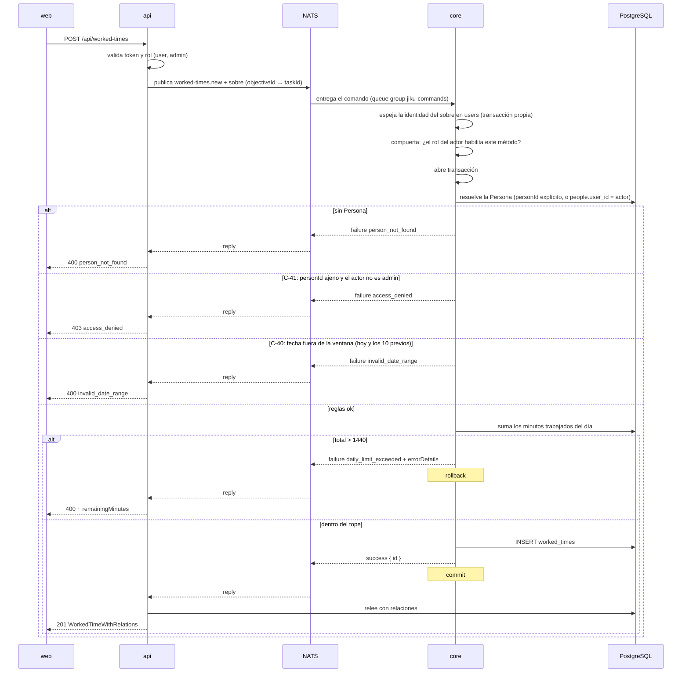

# Carga de Horas Trabajadas

**Tipo:** Feature
**Status:** Active (implementado en el código existente)
**Creado:** 2026-08-18
**Última actualización:** 2026-08-25
**Stories:** S-014, S-029, S-031, S-034, S-035

> ## Registro histórico — REQ-007 ya se aplicó a este documento
>
> Hasta S-031 este flujo era **el ejemplo de reglas de negocio repartidas entre `api` y `core`**, y
> tenía un paso propio —*"la api valida lo que core no puede saber"*— con la ventana de carga, el
> permiso para imputar a terceros y la resolución del default de `personId`. **Ese paso ya no
> existe:** las tres reglas viven en `core`, que es el único servicio que escribe, y por eso valen
> igual por HTTP y por el bus (RF-6).
>
> Lo que lo hizo posible es el **sobre de identidad** de S-029: hasta esa story `core` no conocía al
> usuario final —el `sub` del subject es el service user de la api (ADR-007)— y las reglas que
> dependen de quién actúa **no podían** vivir ahí.
>
> **El contrato HTTP no cambió:** `invalid_date_range` sigue saliendo 400 y `access_denied` sigue
> saliendo 403. Lo que cambió es **quién los emite**.

## Descripción

Flujo de registro diario de horas trabajadas, la operación de mayor frecuencia del producto. Se
dispara cuando un miembro del equipo guarda un registro en la pantalla de carga de horas.

Es el mejor ejemplo del **camino completo de escritura** del sistema y, desde S-031, de la forma
que ese camino tiene ahora: **la api autentica, traduce el contrato y publica; `core` decide y
escribe.** Todas las reglas de negocio —la ventana de carga, quién puede imputar horas a otra
persona, la exclusión tarea/requisito, el tope diario y la pertenencia al proyecto— se aplican en
`core`, en un solo lugar. Lo único que la api conserva de este flujo, además de la autenticación,
es la **traducción de contrato** `objectiveId` → `taskId`, que no es una regla de negocio.

## Servicios Involucrados

| Servicio | Rol | Tipo de Participación |
|---|---|---|
| `web` | Envía el registro desde la pantalla de carga diaria | Iniciador |
| `api` | Autentica, traduce `objectiveId` → `taskId`, publica el comando con el sobre y relee la base para la respuesta | Procesador |
| `core` | Resuelve la Persona del actor y aplica **todas** las reglas: ventana, imputación a terceros, exclusión tarea/requisito, tope diario y pertenencia al proyecto; escribe | Procesador |
| PostgreSQL `jiku` | Persiste `worked_times` | Almacenamiento |

## Pasos del Flujo



### Paso 1: El usuario guarda un registro de horas

**Origen:** `web`
**Destino:** `api`
**Tipo:** REST

**Request:**
```
POST /api/worked-times
Authorization: Bearer {accessToken}   ← inyectado en el servidor (Server Action)

{
  "date": "2026-08-18",
  "minutes": 120,
  "projectId": 12,
  "objectiveId": 45,
  "requirementId": null,
  "personId": 7
}
```

`date` (string, format date, req) · `minutes` (integer, min 1, req) · `projectId` (integer, req) ·
`objectiveId` (integer, nullable) · `requirementId` (integer, nullable) · `personId` (integer, opt)

**Ref:** `docs/apis/api.yaml` — `POST /worked-times`, `x-bus-command: worked-times.new`

---

### Paso 2: La api autentica, traduce y publica

**Origen:** `api`
**Destino:** `core`
**Tipo:** Evento (NATS request/reply)

Lo que la api hace en este flujo, y **nada más**:

1. **Autentica** el token y verifica que el rol sea `user` o `admin`.
2. **Traduce el contrato:** `objectiveId` → `taskId`. Es traducción de nombres entre el contrato
   HTTP y el del bus, **no una regla de negocio**, y por eso **no se mudó** a `core`
   (`docs/architectures/api/conventions/contract-translation.md`).
3. **Publica** el comando con el **sobre de identidad**.

> **El paso que acá había —"la api valida lo que core no puede saber"— desapareció con S-031.** La
> ventana de carga, el permiso para imputar a terceros, la resolución del default de `personId` y
> el `.oxor` de Joi **ya no están en la api**: se aplican en el paso 3.

**Subject:** `{instance}.{user-id}.jiku-commands.v1.worked-times.new`

**Payload** (nótese la traducción `objectiveId` → `taskId`):
```json
{
  "actor": { "id": "323332022539911171", "roles": ["user"] },
  "date": "2026-08-18",
  "minutes": 120,
  "projectId": 12,
  "taskId": 45,
  "requirementId": null,
  "personId": 7
}
```

`actor` (Actor, opcional en el contrato — **siempre presente desde la api**) · `date` (DateOnly,
req) · `minutes` (integer, min 1, req) · `projectId` (integer, req) ·
`personId` (integer, **opcional desde S-031**) · `taskId` (integer|null) ·
`requirementId` (integer|null)

> **El sobre de identidad (S-029, entregado).** Todo comando que publica la api lleva además la
> clave reservada **`actor`** —`{ id, roles, name?, username?, email? }`— armada con el claim que la
> api ya verificó contra Zitadel. La inyecta `sendCommand` una sola vez, así que **ninguna ruta la
> arma a mano**. `core` la extrae **antes** de validar y espeja `users` en su propia transacción
> antes de autorizar. Contrato: `components/schemas/Actor` de `docs/apis/core.yaml`.

> **`personId` es opcional en el bus desde S-031.** Cuando no viaja, `core` lo resuelve **desde el
> actor** (`SELECT id FROM people WHERE user_id = {actor}`). La nota que decía *"core no puede
> resolver la persona del usuario autenticado porque no conoce al usuario final"* **quedó derogada
> por el sobre**: sin este cambio, una persona publicando directo al bus tendría que conocer su
> propio `people.id` —un id que ninguna interfaz muestra— y la paridad de los dos caminos sería
> falsa.

**Timeout:** `NATS_REQUEST_TIMEOUT_MS` (default 5000 ms)

**Ref:** `docs/apis/core.yaml` — canal `worked-times.new`, `WorkedTimesNewPayload`

---

### Paso 3: Core resuelve la identidad, aplica las reglas y escribe

**Origen:** `core`
**Destino:** PostgreSQL
**Tipo:** Interno

El **despachador abre la transacción** antes de ejecutar el comando
([ADR-003](../adrs/ADR-003-transaccion-del-despachador.md)), y antes de eso ya espejó la identidad
del sobre y pasó la compuerta de autorización por rol (S-029, S-030).

El comando decide en este orden, y el orden es parte de la regla:

1. **Identidad del actor:** `resolveActor` — el sobre manda; sin sobre, el `sub` del subject.
2. **La Persona:** si el payload trae `personId`, esa; si no, **la del actor**
   (`people.user_id = {actor}`) → `person_not_found` si no hay ninguna.
3. **C-41 · imputar a terceros:** si la Persona no es la del actor y el actor **no** es `admin` →
   `access_denied`. **Va antes que las referencias a propósito:** un rechazo de permiso no tiene
   por qué confirmar si un proyecto o un requisito existen.
4. **Referencias:** proyecto, tarea y requisito → `*_not_found`; si viene `requirementId`, el
   requisito tiene que ser del `projectId` indicado → `requirement_project_mismatch`.
5. **C-40 · ventana de carga:** `date` entre **hoy y los 10 días previos**, **los dos bordes**
   (una fecha futura también se rechaza) → `invalid_date_range`. Se aplica **a todos los roles**,
   `admin` incluido.
6. **C-42 · exclusión:** `taskId` xor `requirementId` (`.oxor` de Joi, en `validate()`) →
   `invalid_fields`. Desde S-031 ésta es la **única** definición de la exclusión: el `.oxor` de la
   api se eliminó para que las dos no puedan divergir.
7. **Tope diario:** la suma de minutos del día para esa Persona no puede superar **1440**. El
   mensaje informa los minutos disponibles **y desde S-031 también viajan en
   `errorDetails: { remainingMinutes }`** → `daily_limit_exceeded`.

> **El tope de `worked-times.new` cuenta SOLO horas trabajadas.** Es lo que dice el contrato del bus
> (*"counting worked time only"*) y lo que hace el código. **`unworked-times.new` sí suma las dos**
> —trabajadas y ausencias—, y ésa es otra regla, en otro comando. Una versión anterior de este
> documento decía que el alta de horas sumaba las dos: **era falso**, y hacerlo cierto sería un
> endurecimiento visible para el usuario que ninguna story pidió.

**Operación de BD:**
```sql
INSERT INTO worked_times (date, minutes, project_id, person_id, objective_id, requirement_id)
VALUES ('2026-08-18', 120, 12, 7, 45, NULL)
```

**Response (éxito):** `{ "status": "success", "data": { "id": 331 } }` → el despachador hace
**commit**.

**Ref:** `core/src/commands/times/worked-times.ts` · `core/src/commands/times/window.ts` ·
`docs/db-schemas/jiku.md` — `worked_times`

---

### Paso 4: La api relee y responde el recurso completo

**Origen:** `api`
**Destino:** PostgreSQL, luego `web`
**Tipo:** Interno + REST

Core devuelve **solo el `id`**, pero el contrato con los frontends es el recurso completo con sus
relaciones, así que la api **relee la base**
([ADR-001](../adrs/ADR-001-separacion-lectura-escritura.md)).

**Response (éxito):**
```
201 Created
{ ...WorkedTimeWithRelations }   ← con proyecto, persona y tarea/requisito resueltos
```

**Ref:** `docs/apis/api.yaml` — schema `WorkedTimeWithRelations`

---

### Rama alternativa: una persona publica el comando directo al bus

**Origen:** una persona (sin `web`, sin `api`)
**Destino:** `core`
**Tipo:** Evento (NATS request/reply)

Desde que las reglas viven en `core`, **el camino sin api produce exactamente el mismo resultado**:

- No hay sobre. La identidad sale del **subject** —el `sub` de la persona, avalado por el
  auth-callout— y los roles, de `users.roles`.
- `personId` puede omitirse: se resuelve igual, desde el actor.
- La ventana, C-41, la exclusión y el tope se aplican **idénticos**, con **el mismo `errorCode`**.
  Hay una matriz de tests que compara los dos canales regla por regla (S-031, CA-14).

> **La publicación todavía no está habilitada para personas:** falta la plantilla del auth-callout
> que otorga el permiso, y es **S-035**. Ver el flujo `escritura-por-el-bus`. Hasta entonces esta
> rama se ejerce en los tests de `core`, que es donde se prueba el servicio.

## Manejo de Errores

| Paso | Error | Código | Response | Comportamiento |
|---|---|---|---|---|
| 1 | Sin sesión o token vencido | 401 | `{ code: unauthorized }` | `web` redirige el navegador a `/login` |
| 3 | Fecha fuera de la ventana (hoy y los 10 previos, los dos bordes) | 400 | `{ code: invalid_date_range }` | **Rollback.** La regla es de `core` desde S-031; la api solo traduce el código a status |
| 3 | `personId` de otra persona sin ser `admin` | 403 | `{ code: access_denied }` | **Rollback.** El mensaje **no** nombra la Persona, el `sub` ni el subject |
| 3 | El actor no tiene persona vinculada, o el `personId` no existe | 400 | `{ code: person_not_found }` | **Rollback.** Un solo código para las tres causas |
| 3 | `taskId` y `requirementId` juntos | 400 | `{ code: invalid_fields }` | Rechazo de Joi **en core** — la única definición de la exclusión |
| 3 | Superaría los 1440 min del día | 400 | `{ code: daily_limit_exceeded, remainingMinutes: N }` | **Rollback.** Desde S-031 el dato viaja **también** en `errorDetails.remainingMinutes`; la api todavía lo recupera con un regex sobre el mensaje (deuda declarada, NFR-M06) |
| 3 | El requisito no es del proyecto | 400 | `{ code: requirement_project_mismatch }` | Rollback, nada escrito |
| 3 | Proyecto o tarea inexistentes | 400 | `{ code: project_not_found \| objective_not_found }` | Rollback |
| 2 | **Nadie escuchando** el subject (core no desplegado) | **503** | `{ code: service_unavailable }` | **La operación no ocurrió.** El server contesta *no responders* en milisegundos. **Reintentar es seguro** |
| 2 | **La respuesta no llegó a tiempo** (core lento) | **504** | `{ code: gateway_timeout }` | **PUDO haber ocurrido.** Sin reintento ni cola ([ADR-002](../adrs/ADR-002-comandos-nats-sin-jetstream.md)): **reintentar a ciegas puede duplicar** |
| 3 | Error inesperado en core | 500 | `{ code: internal_error }` | El despachador **nunca lanza**: traduce a un `Reply` de falla. Rollback |

## Resultado

**Éxito:** El usuario ve el registro sumado al listado del día, y el semáforo del día actualiza su
estado (completo / parcial / vacío) contra `GET /settings/hours-per-day`.

**Estado final:**
- `worked_times`: una fila nueva con `objective_id` **o** `requirement_id`, nunca ambos
- El total de **horas trabajadas** del día de esa persona ≤ 1440 minutos
- Sin actividad registrada: la carga de horas **no** genera entrada en ningún `*_activity`

## Notas

- **Ya no es el flujo del reparto de reglas: es el de la regla en un solo lugar.** Desde S-031 las
  cinco reglas —ventana, imputación a terceros, exclusión, tope diario y pertenencia al proyecto—
  se aplican en `core`. Cualquier cliente, sea `web`, otro cliente HTTP o una persona publicando
  al bus, queda sujeto a las cinco, y **con el mismo código de error**.
- **Los dos topes de 1440 no son el mismo.** `worked-times.new` cuenta **solo horas trabajadas**;
  `unworked-times.new` suma **trabajadas y ausencias**. La constante `DAILY_LIMIT_MINUTES` está
  **duplicada como literal local** en `worked-times.ts` y `unworked-times.ts`, no compartida
  (pregunta abierta 8).
- **`daily_limit_exceeded` todavía transporta datos por el mensaje.** Desde S-031 el reply **también**
  lleva `errorDetails: { remainingMinutes }`, que es la salida estructurada; la api sigue usando el
  regex sobre `errorMessage` hasta que FG-4 migre el consumo. **Cambiar la redacción del mensaje en
  core rompe la api** mientras ese regex exista.
- **El borrado aplica las mismas dos reglas que el alta, y también en `core`.**
  `worked-times.{id}.delete` verifica **titularidad** (el registro tiene que ser de la Persona del
  actor, salvo `admin` → `access_denied`) y **ventana** (`invalid_date_range`), en ese orden y
  después del `worked_time_not_found`. Hasta S-031 las aplicaba la api y core *"borraba lo que le
  decían"*.
- **Las ausencias ganaron titularidad, no ventana.** `unworked-times.new` y
  `unworked-times.{id}.delete` rechazan con `access_denied` una ausencia que no es de la Persona del
  actor, salvo `admin`. **La ventana de carga no se les aplica**: la regla de la api para borrar una
  ausencia es otra (`deadline_exceeded` sobre `created_at`) y no se mudó.
- Si core escribe y la respuesta se pierde en el bus, el usuario ve un **504** de una operación que
  **sí ocurrió**. No hay forma de distinguirlo desde el frontend. El desdoblamiento 503/504 hace el
  status **más honesto sobre la causa** (tardó, no es que no hubiera nadie) pero **igual de engañoso
  sobre el efecto**: el riesgo asumido de
  [ADR-002](../adrs/ADR-002-comandos-nats-sin-jetstream.md) no se resuelve, solo se vuelve legible.
