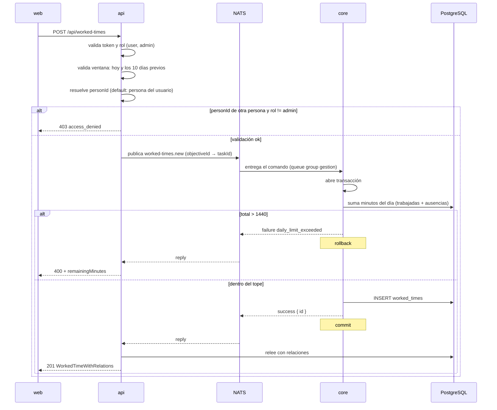

# Carga de Horas Trabajadas

**Tipo:** Feature
**Status:** Active (implementado en el código existente)
**Creado:** 2026-08-18
**Última actualización:** 2026-08-18
**Stories:** — (documentado desde el código, sin story de origen)

## Descripción

Flujo de registro diario de horas trabajadas, la operación de mayor frecuencia del producto. Se
dispara cuando un miembro del equipo guarda un registro en la pantalla de carga de horas. Es el
mejor ejemplo del **camino completo de escritura** del sistema, y el que mejor muestra **por qué
las reglas de negocio están repartidas** entre `api` y `core`: la api valida lo que depende del
rol y del calendario, core lo que depende solo de los datos.

## Servicios Involucrados

| Servicio | Rol | Tipo de Participación |
|---|---|---|
| `web` | Envía el registro desde la pantalla de carga diaria | Iniciador |
| `api` | Valida ventana de fechas, rol y persona; publica el comando; relee la base para la respuesta | Procesador |
| `core` | Valida tope diario, exclusión tarea/requisito y pertenencia al proyecto; escribe | Procesador |
| PostgreSQL `jiku` | Persiste `worked_times` | Almacenamiento |

## Pasos del Flujo



### Paso 1: El usuario guarda un registro de horas

**Origen:** `web`
**Destino:** `api`
**Tipo:** REST

**Request:**
```
POST /api/worked-times
Authorization: Bearer {accessToken}   ← inyectado en el servidor (Server Action)

{
  "date": "2026-08-18",
  "minutes": 120,
  "projectId": 12,
  "objectiveId": 45,
  "requirementId": null,
  "personId": 7
}
```

`date` (string, format date, req) · `minutes` (integer, min 1, req) · `projectId` (integer, req) ·
`objectiveId` (integer, nullable) · `requirementId` (integer, nullable) · `personId` (integer, opt)

**Ref:** `docs/apis/api.yaml` — `POST /worked-times`, `x-bus-command: worked-times.new`

---

### Paso 2: La api valida lo que core no puede saber

**Origen:** `api`
**Destino:** `api` (interno)
**Tipo:** Interno

Tres validaciones que **viven acá porque core no conoce roles, usuarios finales ni calendario**:

1. **Ventana de carga:** `date` tiene que estar entre hoy y los 10 días previos →
   `invalid_date_range`
2. **Rol para imputar a terceros:** solo `admin` puede enviar un `personId` distinto del propio →
   `access_denied`
3. **Resolución del default:** si no viene `personId`, se resuelve desde el usuario autenticado →
   `person_not_found` si el usuario no tiene persona vinculada

Además, Joi valida que `objectiveId` y `requirementId` sean **mutuamente excluyentes** (`.oxor`).

**Ref:** `api/lib/routes/worked-times-post.ts:57-110`

---

### Paso 3: La api publica el comando

**Origen:** `api`
**Destino:** `core`
**Tipo:** Evento (NATS request/reply)

**Subject:** `{instance}.{user-id}.gestion.v1.worked-times.new`

**Payload** (nótese la traducción `objectiveId` → `taskId`):
```json
{
  "date": "2026-08-18",
  "minutes": 120,
  "projectId": 12,
  "taskId": 45,
  "requirementId": null,
  "personId": 7
}
```

`date` (DateOnly, req) · `minutes` (integer, min 1, req) · `projectId` (integer, req) ·
`personId` (integer, **req** — la api ya resolvió el default) · `taskId` (integer|null) ·
`requirementId` (integer|null)

> **`personId` es obligatorio en el bus** aunque sea opcional en HTTP: core no puede resolver "la
> persona del usuario autenticado" porque no conoce al usuario final. La api resuelve el default
> antes de publicar.

**Timeout:** `NATS_REQUEST_TIMEOUT_MS` (default 5000 ms)

**Ref:** `docs/apis/core.yaml` — canal `worked-times.new`, `WorkedTimesNewPayload`

---

### Paso 4: Core valida y escribe

**Origen:** `core`
**Destino:** PostgreSQL
**Tipo:** Interno

El **despachador abre la transacción** antes de ejecutar el comando
([ADR-003](../adrs/ADR-003-transaccion-del-despachador.md)).

Validaciones que dependen solo de los datos:
1. **Tope diario:** la suma de minutos del día para esa persona —**trabajadas Y ausencias**— no
   puede superar **1440**. El mensaje informa los minutos disponibles → `daily_limit_exceeded`
2. **Exclusión:** `taskId` xor `requirementId` (`.oxor`) → `invalid_fields`
3. **Pertenencia:** si viene `requirementId`, el requisito tiene que ser del `projectId` indicado
   → `requirement_project_mismatch`

**Operación de BD:**
```sql
INSERT INTO worked_times (date, minutes, project_id, person_id, objective_id, requirement_id)
VALUES ('2026-08-18', 120, 12, 7, 45, NULL)
```

**Response (éxito):** `{ "status": "success", "data": { "id": 331 } }` → el despachador hace
**commit**.

**Ref:** `core/src/commands/times/worked-times.ts:32,66,80` · `docs/db-schemas/jiku.md` —
`worked_times`

---

### Paso 5: La api relee y responde el recurso completo

**Origen:** `api`
**Destino:** PostgreSQL, luego `web`
**Tipo:** Interno + REST

Core devuelve **solo el `id`**, pero el contrato con los frontends es el recurso completo con sus
relaciones, así que la api **relee la base**
([ADR-001](../adrs/ADR-001-separacion-lectura-escritura.md)).

**Response (éxito):**
```
201 Created
{ ...WorkedTimeWithRelations }   ← con proyecto, persona y tarea/requisito resueltos
```

**Ref:** `docs/apis/api.yaml` — schema `WorkedTimeWithRelations`

## Manejo de Errores

| Paso | Error | Código | Response | Comportamiento |
|---|---|---|---|---|
| 1 | Sin sesión o token vencido | 401 | `{ code: unauthorized }` | `web` redirige el navegador a `/login` |
| 2 | Fecha fuera de la ventana de 11 días | 400 | `{ code: invalid_date_range }` | La api rechaza **sin publicar** el comando |
| 2 | `personId` de otra persona sin ser `admin` | 403 | `{ code: access_denied }` | La api rechaza **sin publicar** |
| 2 | El usuario no tiene persona vinculada | 400 | `{ code: person_not_found }` | La api rechaza **sin publicar** |
| 2 | `objectiveId` y `requirementId` juntos | 400 | `{ code: invalid_fields }` | Rechazo de Joi, sin publicar |
| 4 | Superaría los 1440 min del día | 400 | `{ code: daily_limit_exceeded, remainingMinutes: N }` | **Rollback.** La api agrega `remainingMinutes` **parseando el mensaje con un regex** (deuda declarada, NFR-M06) |
| 4 | El requisito no es del proyecto | 400 | `{ code: requirement_project_mismatch }` | Rollback, nada escrito |
| 4 | Proyecto, persona o tarea inexistentes | 400 | `{ code: project_not_found \| person_not_found \| objective_not_found }` | Rollback |
| 3 | Timeout del bus (core caído o lento) | **503** | `{ code: bus_unavailable }` | **La operación no ocurrió.** Sin reintento ni cola ([ADR-002](../adrs/ADR-002-comandos-nats-sin-jetstream.md)) |
| 4 | Error inesperado en core | 500 | `{ code: internal_error }` | El despachador **nunca lanza**: traduce a un `Reply` de falla. Rollback |

## Resultado

**Éxito:** El usuario ve el registro sumado al listado del día, y el semáforo del día actualiza su
estado (completo / parcial / vacío) contra `GET /settings/hours-per-day`.

**Estado final:**
- `worked_times`: una fila nueva con `objective_id` **o** `requirement_id`, nunca ambos
- El total del día de esa persona ≤ 1440 minutos, contando ausencias
- Sin actividad registrada: la carga de horas **no** genera entrada en ningún `*_activity`

## Notas

- **Es el flujo que mejor muestra el reparto de reglas del producto.** La ventana de 11 días y el
  permiso para imputar a terceros dependen del calendario y del rol, así que están en la api. El
  tope diario y la pertenencia al proyecto dependen solo de los datos, así que están en core. Un
  cliente HTTP que no sea `web` **igual** queda sujeto a las cinco.
- **El tope de 1440 suma trabajadas y ausencias**, así que una ausencia de jornada completa deja
  sin margen para cargar horas ese día. La constante `DAILY_LIMIT_MINUTES` está **duplicada como
  literal local** en `worked-times.ts` y `unworked-times.ts`, no compartida (pregunta abierta 8).
- **`daily_limit_exceeded` transporta datos por el mensaje.** El formato de respuesta del bus no
  tiene dónde poner `remainingMinutes`, así que la api lo recupera con un regex sobre
  `errorMessage`. **Cambiar la redacción del mensaje en core rompe la api.** Es deuda declarada.
- **La ventana de fechas se valida dos veces en el flujo de borrado**, no en el de alta: al borrar,
  la api verifica ventana y titularidad, y core "borra lo que le dicen".
- Si core escribe y la respuesta se pierde en el bus, el usuario ve un 503 de una operación que
  **sí ocurrió**. No hay forma de distinguirlo desde el frontend.
