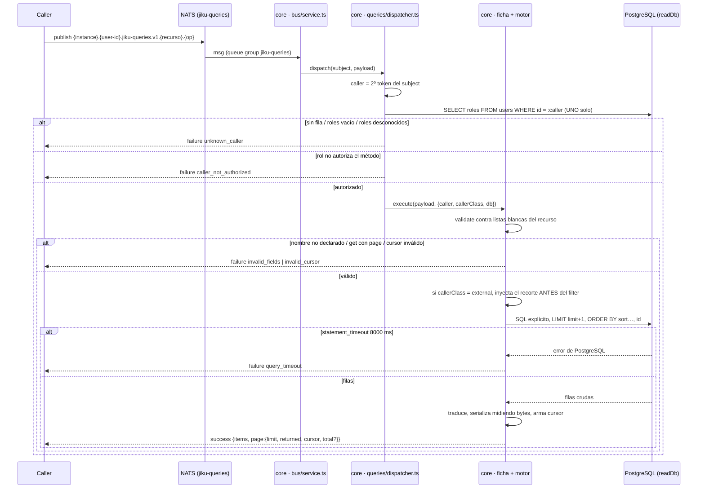

# Consulta por el Bus

**Tipo:** Feature
**Status:** Draft
**Creado:** 2026-08-24
**Última actualización:** 2026-08-25
**Stories:** S-022, S-023, S-024, S-025, S-026, S-027, S-028

## Descripción

Recorrido completo de una **consulta de lectura** por el bus, desde que un caller publica en
`{instance}.{user-id}.jiku-queries.v1.{recurso}.{operación}` hasta que recibe el envelope de
respuesta en su inbox. Cubre la resolución de la identidad desde el subject, la resolución de la
**clase del caller** desde `users.roles`, la validación contra las listas blancas del recurso, el
**recorte del modo externo aplicado antes del filtro**, el armado del SQL sobre la conexión de solo
lectura, y la paginación **keyset con presupuesto de bytes**.

**Es el primer flujo de lectura por el bus del producto.** Hasta REQ-006, todo lo que viajaba por
NATS era escritura (`jiku-commands`) o el evento de autenticación. Merece documento propio por tres
razones que no se reconstruyen leyendo el código:

1. **La identidad y la autorización se resuelven en dos compuertas distintas y consecutivas**, con
   códigos de error distintos y con **una sola** lectura de `users` entre las dos.
2. **El recorte del modo externo se inyecta en el SQL, antes del filtro del caller y sin forma de
   desactivarlo por payload.** Es el segundo punto de aplicación del aislamiento del portal de
   clientes, después de `validateProjectPermissions` en la api.
3. **La paginación se corta midiendo bytes**, no confiando en el `limit`, y **la ausencia de cursor
   es la única señal de fin de colección**.

> **Al cerrar REQ-006 este flujo no tiene ningún caller en producción.** `bus.query()` existe en la
> api desde S-014 y **sigue deliberadamente sin caller**: ninguna de las 28 rutas `GET` migra. Lo
> ejercitan los tests y la verificación manual con `nats req`. Es una decisión de alcance, no un
> descuido.

### Estado de implementación

Este documento describe el recorrido **completo**, que se termina de implementar recién en S-028. El
`status` sigue en **Draft** por eso: pasa a `Active` cuando todos sus pasos existan en el código, no
cuando exista el primero.

| Paso | Estado | Story |
|---|---|---|
| 1 · El caller publica la consulta | Implementado | S-013 (subjects), S-022 (contrato) |
| 2 · `bus/service.ts` decodifica y delega | Implementado | S-013 |
| 3.1-3.3 · Identidad y compuerta de método (`caller_not_authorized`) | Implementado | S-017 |
| 3.4 · Segunda compuerta: la clase del caller (`unknown_caller`) | Implementado | S-023 |
| 4 · Validación contra las listas blancas del recurso | Implementado | S-022 |
| 5 · Recorte del modo externo (proyectos permitidos + `visibilityLevel`) | Implementado para `tasks`, `clients`, `projects`, `requirements`, `comments`, `activity` y `subscriptions` | S-023 (mecanismo), S-024 (las tres primeras formas), S-025 (las dos nuevas) |
| 6 · SQL explícito sobre `readDb`, keyset y `LIMIT + 1` | Implementado | S-022 |
| 7 · Proyección, presupuesto de bytes y emisión del cursor | Implementado | S-022 |
| 8 · El caller recorre la colección | Implementado | S-022 |

**Recursos con contrato:** `tasks` desde S-022; `clients`, `projects` y `requirements` desde S-024
—los cuatro con `list` y `get`—; y `comments` (`list` y `get`), `activity` (`list`) y
`subscriptions` (`list`) desde **S-025**. Son **doce patrones registrados**, y **ninguno responde ya
`unknown_command` por falta de contrato**: `core/src/queries/pending.ts` quedó **sin consumidores**
en S-025 y se **elimina en S-028**, cuando el registro tenga los 18 recursos.

**Los tres recursos de S-025 exigen `entityType` en `filter` —y `comments.get` en el payload—**
porque resuelven contra **dos tablas cuyos ids se pisan**: el `id` 1234 existe en
`objective_activity` y en `requirement_activity` y son filas distintas. No es un filtro con default:
su ausencia es `invalid_fields`.

**Las formas del recorte del Paso 5 son cinco**, y son las que la tabla de recortes de más abajo
necesita para los 18 recursos:

1. la fila **lleva** el proyecto en una columna, con visibilidad (`requirements`, `tasks`) o sin
   ella (`projects`) — S-024;
2. la fila es **alcanzable** desde una tabla que sí lo lleva (`clients`) — S-024;
3. la fila es **alcanzable y las dos puntas llevan visibilidad** (`comments`, `activity`): la
   entidad dueña tiene que estar en un proyecto permitido **y** ser `public`, **y la propia fila**
   tiene que ser `public` — S-025;
4. la fila **es del caller** (`subscriptions`): `user_id = :caller` y **nada más**, sin el predicado
   de proyectos permitidos — S-025;
5. **sin acceso** externo, que resuelve en `items: []` sin ejecutar SQL: la necesitan
   `worked-times`, `unworked-times`, `week-assigned-times` y `settings`, y llega con S-026 y S-028.

> **CONSECUENCIA DE DESPLIEGUE, y es la más seria del requerimiento:** hasta S-023 el Paso 5 estaba
> declarado en la ficha y **no aplicado**, así que `tasks.list` **no recortaba filas** mientras
> `ROLE_METHODS` ya autorizaba `queries: ALL` a `external-user`. **S-022 y S-023 se despliegan
> juntas** a cualquier entorno donde exista un caller externo conectado al bus. La separación entre
> las dos es de desarrollo y verificación, no de despliegue independiente.

> **CONSECUENCIA NUEVA DESDE S-023, aceptada y declarada:** la disponibilidad de la lectura por el
> bus queda **acoplada a la sincronización de `users`**. La compuerta 3.4 **no exime a nadie**, así
> que un evento de autenticación perdido —la entrega no es durable: NATS core, sin JetStream— deja
> al caller sin fila y sus consultas devuelven `unknown_caller` hasta su próxima autenticación.
> **Incluye al service user de la api, sin excepción por configuración.** Su exención sigue intacta
> en la compuerta 3.3, que es otra pregunta: pasa la primera y falla la segunda.

## Servicios Involucrados

| Servicio | Rol | Tipo de Participación |
|---|---|---|
| Caller (`api`, una persona o un conector) | Publica la consulta y espera la respuesta en su inbox | Iniciador |
| NATS | Transporta la request. Servicio micro `jiku-queries`, **queue group propio** | Transporte |
| `core` · `bus/service.ts` | Decodifica el cuerpo y delega en el despachador de consultas | Procesador |
| `core` · `queries/dispatcher.ts` | Resuelve identidad, autoriza el método y **resuelve la clase del caller** | Autorizador |
| `core` · ficha del recurso + motor | Valida contra las listas blancas, arma el SQL, pagina y proyecta | Procesador |
| PostgreSQL (`readDb`) | Ejecuta el SQL con el **rol de solo lectura** y `statement_timeout` de 8000 ms | Almacenamiento |

**Quién NO participa:** `web` y `opus-web` **no hablan con el bus** (ADR-006). `@jiku/models` **no
se usa**: el motor consulta con SQL explícito porque `core/src/models/read.ts` **no registra los
modelos** (ADR-005). Y **ninguna plantilla del auth-callout cambia**: `person.yaml` y `api.yaml` ya
publican sobre `jiku-queries.v1.>`, y el comodín cubre los 23 métodos.

## Pasos del Flujo



### Paso 1: El caller publica la consulta

**Origen:** caller (`api`, persona o conector)
**Destino:** NATS → `core` (servicio micro `jiku-queries`)
**Tipo:** NATS request/reply, sin JetStream (ADR-002)

**Subject:** `{instance}.{user-id}.jiku-queries.v1.{recurso}.{operación}`

- Ejemplo: `dev.323332022539911171.jiku-queries.v1.tasks.list`
- **Sin `*` en el subject** (RF-4 de REQ-006): el id del recurso viaja **en el payload**, para no
  inutilizar el cache de subjects de 1024 entradas del server con el tráfico de mayor volumen del
  sistema.
- El **segundo token es el `sub` de Zitadel de quien publica**, y es **infalsificable**: el
  auth-callout solo autoriza a publicar bajo el id propio (ADR-007).

**Request — forma `list`:**
```jsonc
{
  "filter":  { "projectId": 12, "state": ["backlog", "activo"],
               "createdAt": { "gte": "2026-08-01T00:00:00.000Z" },
               "or": [ { "state": "activo" },
                       { "state": "finalizado", "finishedAt": { "gt": "2026-08-16T00:00:00.000Z" } } ] },
  "sort":    ["-createdAt"],
  "page":    { "limit": 50, "cursor": null },
  "fields":  ["id", "title", "state"],
  "include": ["description", "project"],
  "count":   false
}
```

**Request — forma `get`:**
```jsonc
{ "id": 8140, "fields": [], "include": [] }   // + "entityType" en comments.get
```

- **Todo opcional** salvo `id` en un `get`. En un `get`, `filter`, `sort`, `page` y `count`
  **no aplican**: si vienen, `invalid_fields`.
- **El payload NO lleva identidad.** Un campo de identidad en el cuerpo responde `invalid_fields`.

**Timeout del caller:** `NATS_QUERY_TIMEOUT_MS` = **10000 ms**, propio del cliente de consultas
(`api/lib/utils/bus/index.ts`, S-014), separado del de comandos.

**Ref:** `docs/apis/core-queries.yaml` (creado por S-028), `deploy/.env:59-66,140-144`

---

### Paso 2: `bus/service.ts` decodifica y delega

**Origen:** NATS
**Destino:** `core` · `queries/dispatcher.ts`
**Tipo:** Interno

- Decodifica el cuerpo con `msg.json()`. **Cuerpo vacío = `{}`.**
- Un payload no-JSON se contesta con un `failure` bien formado: **el endpoint nunca deja de
  contestar**.
- → `QueryDispatcher.dispatch(subject, payload)`

**Ref:** `core/src/bus/service.ts`, `core/src/queries/dispatcher.ts`

---

### Paso 3: Identidad, autorización y clase del caller

**Origen:** `core` · `queries/dispatcher.ts`
**Destino:** PostgreSQL (`users`)
**Tipo:** Interno + SELECT

**3.1 — Identidad.** `caller = callerFromSubject(subject)` → el **segundo token**, y de ningún otro
lugar.

**3.2 — Un solo `SELECT`.** El despachador lee **una vez** los `roles` del caller y con ese resultado
alimenta las dos compuertas siguientes.

**Operación de BD:**
- **Tabla:** `users`
- **Operación:** SELECT por PK
- **Campos:** `id`, `roles`
- **Sin transacción** y **sin cache**: cachear reintroduciría roles obsoletos con una ventana
  adicional y no medible, para ahorrar un `SELECT` por PK contra una tabla de decenas de filas.

**3.3 — Primera compuerta: `authorizeCaller(caller, method, 'queries')`** (REQ-005, S-017).
Responde *"¿puede ejecutar este método?"*.

- El `CORE_TRUSTED_PUBLISHER_ID` **pasa sin consultar la base** — exención intacta, y es lo que evita
  una caída total y silenciosa de **escritura** si se pierde el evento de autenticación de la api.
- `ROLE_METHODS` es cerrado y **deny-by-default** (ADR-008): `admin`, `user` y `external-user` tienen
  `queries: ALL`; `internal-app`, `core`, `bus-observer` y `external-publisher`, ninguna.
- Sin autorización → `failure` **`caller_not_authorized`**.

**3.4 — Segunda compuerta: la clase del caller** (REQ-006, S-023). Responde *"¿qué le recorto?"*.

| `roles` contiene | Clase | Qué recorta el servicio |
|---|---|---|
| `internal-app` | **conector** | Nada. El caller autoriza por su cuenta |
| `user` / `admin` | **interno** | **Nada a nivel de fila** (decisión explícita de la v1) |
| `external-user` | **externo** | Lo que declare la ficha del recurso |

- **Con varios roles gana el más restrictivo:** `external-user` → `user` → `internal-app`.
- **Sin fila, con `roles: []` o con roles desconocidos → `unknown_caller`, nunca una lista vacía.**
- **La api no es excepción en esta segunda compuerta.** Un caller exento de 3.3 que no tenga fila
  recibe `unknown_caller`.
- La clase se resuelve **una sola vez** y viaja en `QueryContext.callerClass`.

**Ref:** `core/src/authorize-caller.ts` (`readCallerRoles` / `authorizeWithRoles`),
`core/src/queries/caller-class.ts` (`resolveCallerClass`), `core/src/queries/dispatcher.ts`,
`docs/db-schemas/jiku.md` (tabla `users`)

---

### Paso 4: Validación contra las listas blancas del recurso

**Origen:** `core` · ficha del recurso
**Destino:** (interno)
**Tipo:** Interno

Cada uno de los **18 recursos** declara, **como dato**, cuatro listas blancas más su default de orden
y su recorte externo: `base`, `includable` (con `kind: field|relation` y el tope de las colecciones),
`filterable`, `sortable`.

- **Un nombre no declarado en `filter`, `sort`, `fields` o `include` responde `invalid_fields`**, con
  `errorDetails: { field, value, allowed }`. **Nunca se ignora en silencio**: un filtro ignorado
  devuelve **datos de más**.
- **`filter.or` admite un solo nivel** de anidamiento.
- **`page.limit`:** default **50**, máximo **200** (un valor mayor se **recorta sin avisar**), `0`
  significa "usá el default", negativo o no entero es `invalid_fields`.
- **`sort`:** array aplicado en orden, `-` para descendente. El servicio **agrega `id` como último
  criterio de desempate siempre**, se pida o no.
- **Conjunto devuelto:** `( fields ?? base ) ∪ include ∪ { id }`.
- **Cursor:** si viene, se decodifica (base64url de `{"v":1,"k":[…],"h":<hash(filter+sort)>}`) y se
  verifica `h` contra el `filter`+`sort` **de esta request**. No coincide, malformado o de otra `v` →
  `invalid_cursor`. **Cambiar solo el `limit` sí es válido.**

**La misma estructura que valida es la que `meta.describe` proyecta** (S-028): la descripción del
contrato **no puede desactualizarse** porque no hay una segunda copia.

**Ref:** `docs/apis/core-queries.yaml`, `core/src/queries/<recurso>/`

---

### Paso 5: El recorte del modo externo, ANTES del filtro

**Origen:** `core` · motor
**Destino:** (interno, sobre el SQL)
**Tipo:** Interno

Si `callerClass === 'external'`, el motor **inyecta el recorte que declara la ficha del recurso**
directamente en el SQL, **antes** del filtro del caller y **combinado con AND**:

```sql
-- ejemplo: tasks / requirements
  project_id IN (SELECT project_id FROM user_project_permissions WHERE user_id = :caller)
  AND visibility_level = 'public'
```

- **En el SQL, no en el objeto `filter`**: no hay clave del payload que lo pise.
- **No se puede desactivar por payload.** Un `filter.visibilityLevel = "internal"` se combina con AND
  contra el recorte y da **cero resultados**, no un error.
- **Devuelve `items: []`, nunca un error de autorización.**
- Los recursos que declaran **sin acceso** externo —`worked-times`, `unworked-times`,
  `week-assigned-times` y `settings`— cortan **antes de ejecutar SQL** y devuelven `items: []`.

| Recurso | Recorte del modo externo |
|---|---|
| `clients` | actores con al menos un proyecto permitido |
| `projects` | solo proyectos con fila en `user_project_permissions` |
| `requirements` · `tasks` | proyectos permitidos **y** `visibilityLevel = public` (columna propia) |
| `comments` · `activity` | proyecto permitido **y** `visibilityLevel = public` **de la entidad dueña**, **y** `visibilityLevel = public` **de la propia fila** |
| `people` | personas asignadas a proyectos permitidos |
| `users` | usuarios con permiso sobre algún proyecto que el caller vea, **más él mismo** |
| `attachments` | vínculos de entidades visibles |
| `files` | archivos de entidades visibles; **sin vínculo, solo quien lo subió** |
| `subscriptions` | **solo las propias** (`user_id = :caller`), **sin** el predicado de proyectos permitidos |
| `project-permissions` | solo filas de proyectos permitidos |
| `requirements.tags` | tags de proyectos permitidos |
| `worked-times` · `unworked-times` · `week-assigned-times` · `settings` | **sin acceso** → `items: []` |
| `meta.describe` | igual para todos: describe el **contrato**, no los datos |

**Ref:** `core/src/queries/engine/build-sql.ts` (`externalScopeSql`),
`core/src/queries/types.ts` (`ExternalScopeSpec`), `docs/db-schemas/jiku.md`
(tabla `user_project_permissions`)

---

### Paso 6: El SQL sobre la conexión de solo lectura

**Origen:** `core` · motor
**Destino:** PostgreSQL (`readDb`)
**Tipo:** Interno (SELECT)

**Operación de BD:**
- **Conexión:** `readDb` — `POSTGRESQL_READ_USER`, pool propio (`POSTGRESQL_READ_POOL_MAX` = 10),
  `statement_timeout` = **8000 ms**
- **Operación:** SELECT, **SQL explícito** (`db.query(...)`), **nunca el ORM**
- **Sin transacción:** el despachador de consultas no abre ninguna (ADR-003)

```sql
-- tasks.list, filtro por proyecto, sort default, primera página
SELECT … FROM objectives
 WHERE project_id = $1 AND state = ANY($2)
 ORDER BY created_at DESC, id DESC
 LIMIT 201;                       -- limit + 1, para saber si hay página siguiente SIN un COUNT

-- página siguiente: keyset sobre el índice, no OFFSET
 WHERE project_id = $1 AND state = ANY($2) AND (created_at, id) < ($3, $4)
```

**Dos reglas duras del armado:**

1. **Los nombres** de tabla, columna y dirección de orden salen **exclusivamente de las listas
   blancas** del recurso — **nunca del payload**. Un nombre no declarado **no llega al SQL**:
   responde `invalid_fields` en el Paso 4.
2. **Los valores** van **siempre** como parámetros (`replacements`).

**Traducciones contrato ↔ base, todas en el servicio de consultas** (ADR-004; **ninguna se filtra a
`@jiku/models`**):

| Contrato | Base |
|---|---|
| `tasks` | tabla `objectives` |
| `priority` (enum) + `priorityValue` (entero) | `objectives.priority` `INTEGER` 0-5 |
| `properties` `[{code,value}]` | `projects.key_value_pairs` (`JSON`, **incluible y no filtrable**) |
| `tag` `{key,value}` (contains de `jsonb`, lista con AND) | `requirements.tags` `JSONB` |
| `q` de **solo dígitos** → igualdad por `id` | — (regla del contrato de `requirements`) |
| `totalMinutes` | dos subconsultas sobre `worked_times`: las del requisito **más** las de sus tareas |
| `body` | `objective_activity.new_value` / `requirement_activity.new_value` |
| `authorId` | `changed_by` |
| `taskId` | `worked_times.objective_id` |
| `entityType: "task"` / `"task_comment"` | `objective` / `objective_comment` — **en las dos direcciones** |

**Exclusiones permanentes, no configurables:** `storage_key`, `storage_bucket`, `storage_region` y
`ticket_slug` **nunca se exponen**; los vínculos con `deleted_at` y los archivos con
`retention_status != 'active'` **se excluyen siempre**.

**`include` se resuelve con JOIN o con una consulta por lote de la página, nunca una por item.** Las
relaciones de colección vienen acotadas a los **10 más recientes** y marcan
`"<relación>Truncated": true`.

**Ref:** `core/src/models/read.ts`, `docs/db-schemas/jiku.md` ("Los índices del keyset"), ADR-001,
ADR-004, ADR-005

---

### Paso 7: Proyección, presupuesto de bytes y cursor

**Origen:** `core` · motor
**Destino:** caller (por el inbox)
**Tipo:** NATS reply

- **Traduce por fila** al vocabulario del contrato.
- **Serializa item por item midiendo bytes** hasta `floor(nc.info.max_payload * 0.5)`. Si se pasa,
  **corta ahí** y devuelve cursor **aunque falten items del `limit` pedido**.
- **Un item que solo no entra se devuelve igual**, con el campo de texto truncado y marcado
  (`bodyTruncated: true`). **Nunca una página vacía con cursor**, que para el cliente es un bucle
  infinito.
- **Cursor** = base64url de `{"v":1,"k":[<clave de orden>,<id>],"h":<hash(filter+sort normalizados)>}`.
  **No autoriza nada**: identidad, clase y filtros **se reaplican en cada página**.

**Response (éxito) — `list`:**
```jsonc
{ "status": "success",
  "data": { "items": [ … ],
            "page": { "limit": 200, "returned": 173, "cursor": "eyJ…", "total": 128 } } }
```

**Response (éxito) — `get`:** `data` **es el recurso**, sin envoltorio de colección.
```jsonc
{ "status": "success", "data": { "id": 8140, "title": "…" } }
```

- `items` **siempre presente**; `[]` **no es un error**.
- `page.limit` es el **efectivamente aplicado**, que puede ser menor al pedido.
- `page.returned` es explícito para que el recorte por bytes sea **visible**.
- **La ausencia de `page.cursor` es la ÚNICA señal de fin de colección.** `returned < limit` **no
  significa nada**.
- `page.total` **solo** si se pidió `count`. Es **exacto**, no estimado. `count: "only"` devuelve
  `total` con `items: []` **sin ejecutar la consulta de filas**.

**Ref:** `docs/apis/core.yaml` (schema `Reply`), `docs/apis/core-queries.yaml`

---

### Paso 8: El caller recorre la colección

**Origen:** caller
**Destino:** `core`
**Tipo:** NATS request/reply (repetición del Paso 1)

```ts
let cursor: string | null = null;
do {
  const res = await bus.query('tasks.list', { filter, sort, page: { limit: 200, cursor } });
  procesar(res.data.items);
  cursor = res.data.page.cursor ?? null;
} while (cursor);
```

**Entre página y página, `filter` y `sort` tienen que ir idénticos** o la respuesta es
`invalid_cursor`. **`limit` sí puede cambiar.**

**Ref:** `api/lib/utils/bus/index.ts:20,121` (S-014) — **sin caller al cerrar REQ-006**

## Manejo de Errores

| Paso | Error | Código | Response | Comportamiento |
|---|---|---|---|---|
| 2 | Payload no-JSON o excepción inesperada | `internal_error` | `failure` bien formado, **sin el subject completo** en el mensaje | El endpoint contesta igual: **toda request obtiene respuesta** |
| 3 | Rol que no autoriza el método | `caller_not_authorized` | `failure` | Primera compuerta (REQ-005). El mensaje **no dice si la fila existe** |
| 3 | Sin fila en `users`, `roles: []`, o roles desconocidos | `unknown_caller` | `failure` | Segunda compuerta. **Nunca `items: []`**, que se leería como "no hay datos". **La api no es excepción** |
| 4 | Nombre no declarado en `filter`/`sort`/`fields`/`include` | `invalid_fields` | `errorDetails: { field, value, allowed }` | **Nunca se ignora en silencio**: un filtro ignorado devuelve datos de más |
| 4 | `or` anidado dentro de otro `or` | `invalid_fields` | ídem | Un solo nivel |
| 4 | `limit` negativo o no entero | `invalid_fields` | ídem | `> 200` se recorta **sin avisar**; `0` usa el default |
| 4 | Campo de identidad en el payload | `invalid_fields` | ídem | La identidad sale del subject y solo de ahí |
| 4 | `get` sin `id`, o con `filter`/`sort`/`page`/`count` | `invalid_fields` | ídem | Esas cuatro palancas no aplican en un `get` |
| 4 | `comments`/`activity`/`subscriptions` sin `filter.entityType` | `invalid_fields` | ídem | **Son dos tablas y los ids se pisan** |
| 4 | `requirements.tags` sin `filter.projectId` | `invalid_fields` | ídem | Es obligatorio |
| 4 | Cursor malformado, de otra `v`, o con `h` que no coincide | `invalid_cursor` | `failure` | Cambiar `filter` o `sort` invalida el cursor; cambiar `limit` no |
| 5 | Caller externo sobre un recurso sin acceso | — | `success` con `items: []` | **No es un error**: sin acceso, colección vacía |
| 6 | `statement_timeout` de 8000 ms | `query_timeout` | `failure` | La base corta **antes** que el bus (10000 ms): nunca un timeout mudo |
| 6 | `get` de un id inexistente **o no visible** | `{recurso}_not_found` | `failure` | **No distingue "no existe" de "no lo podés ver"**: distinguirlo confirmaría que el recurso existe |
| 6 | `list` cuyo filtro no matchea nada | — | `success` con `items: []` | **Un `list` nunca devuelve `*_not_found`** |
| 7 | Cualquier otra cosa | `internal_error` | `errorDetails` con el detalle, **sin el subject** | `catch` del despachador |

**La garantía dura: toda request obtiene respuesta.** La sostienen tres redes: el `try/catch` de
`QueryDispatcher.dispatch`, el `try/catch` de `handle()` en `bus/service.ts`, y la invariante
**`POSTGRESQL_STATEMENT_TIMEOUT_MS` (8000) < `NATS_QUERY_TIMEOUT_MS` (10000)**.

## Resultado

**Éxito:** el caller recibe una colección paginada —o el recurso, en un `get`— con exactamente los
campos que el contrato declara, recortada según su clase, y puede recorrer la colección completa
**sin repetir ni saltear filas** aunque haya escrituras concurrentes en curso.

**Estado final:**
- **La base no cambia.** Una consulta es idempotente y sin efectos; el servicio no guarda estado entre
  requests. La conexión de solo lectura **no puede escribir**, y la garantía es de **PostgreSQL**, no
  del código (ADR-001).
- **Esta API no mintea URLs.** `files.get` y `attachments.list` devuelven metadatos; obtener los bytes
  sigue siendo el comando `files.{fileId}.request-download`.
- **Los contadores del servicio micro** (`nats micro stats jiku-queries`) registran la request:
  `num_requests`, `processing_time` y `average_processing_time`, separados de los de
  `jiku-commands`. (`num_errors` **queda en 0 por diseño de la librería**: los `failure` se miden por
  logs y por `errorCode`.)

## Notas

- **La disponibilidad de este flujo queda acoplada a `sincronizacion-de-identidades`.** La fila en
  `users` la crea un evento cuya **entrega no es durable** (NATS sin JetStream): un evento perdido
  deja al caller sin fila y **todas** sus consultas devuelven `unknown_caller` hasta su próxima
  autenticación contra el bus. **Incluye al service user de la api**, sin excepción por configuración.
- **El modo interno no recorta filas, y es una decisión explícita de la v1.** Un caller con rol `user`
  que publique directo al bus ve horas, ausencias, comentarios internos y todos los proyectos. La
  autorización fina por rol (`admin` vs `user`) sigue siendo de la api sobre HTTP.
- **`internal-app` tiene `queries: []` en `ROLE_METHODS`.** Un caller con ese rol que **no** sea el
  publicador confiable es rechazado en el Paso 3.3 y **nunca llega a la clase conector**. Habilitar un
  segundo conector es un cambio deliberado en **dos** archivos —ese mapa y la plantilla del callout—.
- **Ninguna plantilla del auth-callout cambió con REQ-006:** `person.yaml` y `api.yaml` publican sobre
  `jiku-queries.v1.>` desde S-011 y el comodín cubre los 23 métodos.
- **Flujos relacionados:** `autenticacion-y-entrada` (dónde se resuelve la identidad),
  `sincronizacion-de-identidades` (cómo se puebla `users`), `lectura-de-archivos` (la descarga **no**
  es una consulta), `vinculacion-de-archivos` (el modelo que `attachments.list` expone en lectura).
