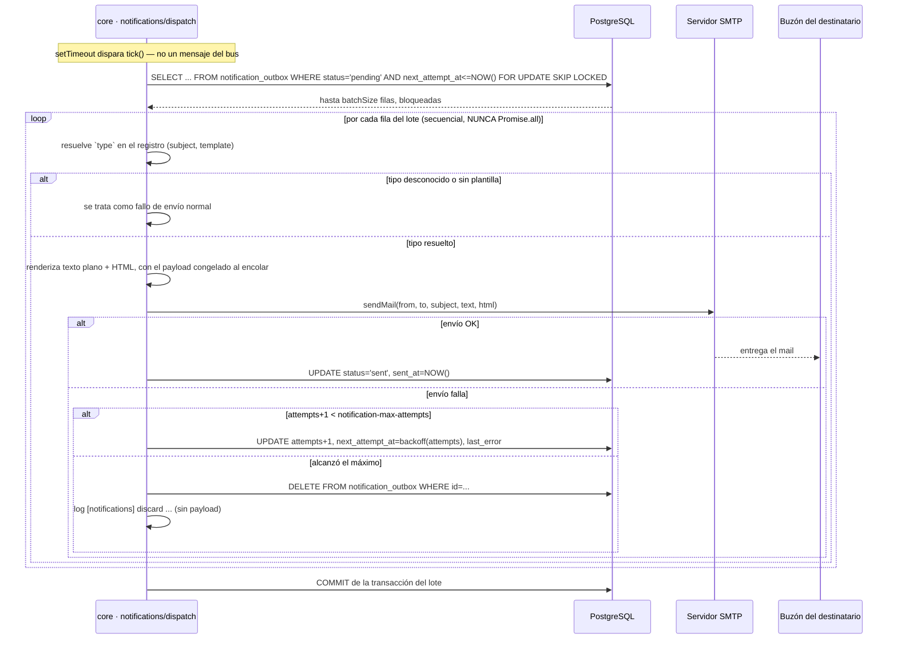

# Envío de Notificaciones — el Vaciado Periódico de la Cola de Salida

**Tipo:** Feature
**Status:** Draft
**Creado:** 2026-09-17
**Última actualización:** 2026-09-17
**Stories:** S-069, S-070, S-071, S-072, S-073, S-074

## Descripción

El vaciado periódico de `notification_outbox`: de la toma del lote al buzón del destinatario. **Es
el primer flujo del producto cuyo trigger no es ni una acción de usuario ni un mensaje del bus**,
sino el **temporizador interno de `core`**. Los doce flujos existentes del producto arrancan en una
de esas dos cosas; este es el primero que no, y por eso conviene decirlo explícitamente en vez de
dejar al lector buscando el actor que lo dispara.

Este flujo arranca con filas **ya en la cola** — el `setTimeout` que dispara el ciclo, no el
comando que encoló la fila. El encolado en sí (el paso 5 de `escritura-por-el-bus.md` y los pasos
del flujo de alta de requisito del portal) es de otro documento; documentarlo acá sería duplicarlo.

El mecanismo completo del scheduler, la relectura de configuración y `FOR UPDATE SKIP LOCKED` está
en la convención [`scheduled-worker`](../architectures/core/conventions/scheduled-worker.md); este
documento es la foto del recorrido de punta a punta, no la implementación.

## Servicios Involucrados

| Servicio | Rol | Tipo de Participación |
|---|---|---|
| `core` (`notifications/dispatch/`) | Dispara el ciclo por tiempo, toma el lote, renderiza, envía y actualiza el estado de cada fila | Iniciador |
| PostgreSQL (`notification_outbox` + `system_settings`) | Persiste la cola de salida y los tres parámetros del ciclo, leídos sin caché | Almacenamiento |
| Servidor SMTP externo | Recibe el `sendMail()` de `nodemailer` | Tercero |
| Buzón del destinatario | Destino final del mail | Consumidor |

**Quién NO participa:** NATS. El proceso no llega por el bus ni responde por el bus — corre dentro
del mismo proceso de `core`, disparado por su propio temporizador. El queue group `gestion` de NATS
**no reparte** este trabajo entre réplicas (ver más abajo, y ver
[`scheduled-worker`](../architectures/core/conventions/scheduled-worker.md)).

## Pasos del Flujo



### Paso 1: Toma del lote

**Componente:** `core` · `notifications/dispatch/claim-batch.ts`

```sql
SELECT id, type, recipient_user_id, recipient_email, payload, attempts
  FROM notification_outbox
 WHERE status = 'pending'
   AND next_attempt_at <= NOW()
 ORDER BY next_attempt_at, id
 LIMIT :batchSize
   FOR UPDATE SKIP LOCKED
```

Abre su **propia transacción** — la única pieza de `core`, fuera del despachador de comandos, que
abre y cierra su propia transacción (ampliación consciente de
[ADR-003](../adrs/ADR-003-transaccion-del-despachador.md)). `readDb` **no sirve para esto**: es
solo lectura (hacen falta `UPDATE`/`DELETE` después) y tiene `statement_timeout: 8000`, que
cortaría la transacción del lote antes de terminar de enviar. El raw query va sobre `sequelize`, la
conexión del usuario dueño.

### Paso 2: Resolución del tipo en el registro

**Componente:** `core` · `notifications/registry.ts` + `templates/index.ts`

`type` llega como string opaco desde la fila (`requirement.created`, `requirement.resolved`,
`requirement.reopened`, `requirement.comment.created`) y se resuelve contra el registro para
obtener su `subject` (plantilla con `{{title}}`) y su `template` (el identificador de render). **Un
`type` que ya no está en el registro, o cuyo `template` no resuelve, se trata como un fallo de
envío normal** — cuenta intento y termina descartándose por el camino del máximo, en vez de
crashear el ciclo completo.

### Paso 3: Renderizado

**Componente:** `core` · `notifications/templates/`

El `subject` se interpola con `{{title}}` y el cuerpo se renderiza en **texto plano y HTML**, a
partir del `payload` **congelado al encolar**: si el requisito cambió de título después de que la
notificación se encoló, el mail dice el título de **cuando ocurrió el hecho**, no el actual.

### Paso 4: Envío SMTP

**Componente:** `core` · `notifications/dispatch/transport.ts` + `run-cycle.ts`

`nodemailer`, con transporte **perezoso** (construido la primera vez que se necesita, nunca al
importar el módulo ni al arrancar el proceso). Los envíos del lote son **secuenciales**
(`for...of` + `await`), **nunca** `Promise.all`: 50 conexiones SMTP en paralelo es la forma más
rápida de que un proveedor aplique rate limit. Un lote de 50 con ~500ms de latencia por envío tarda
~25s en serie, que entra cómodo en el ciclo por defecto de 60s.

### Paso 5: Marcado, backoff o descarte

**Componente:** `core` · `notifications/dispatch/run-cycle.ts` + `backoff.ts`

- **Envío OK:** `UPDATE notification_outbox SET status='sent', sent_at=NOW() WHERE id=:id`.
- **Envío falla, intentos restantes:** `UPDATE ... SET attempts=:attempts, next_attempt_at=:nextAt,
  last_error=:lastError WHERE id=:id`, con `next_attempt_at` calculado por
  `nextAttemptAt(attempts, now)` → `min(60 * 2^attempts, 86400)` segundos desde ahora. `last_error`
  se acota a 500 caracteres, nunca un objeto de error entero.
- **Envío falla, se alcanzó `notification-max-attempts`:** `DELETE FROM notification_outbox WHERE
  id=:id` — la columna `status` solo admite `'pending'`/`'sent'`, no hay `'failed'`, así que el
  descarte **es** un borrado. Se loguea con el formato literal:
  ```
  [notifications] discard id=<id> type=<type> entity=<type>:<id> recipient=<userId> reason=<causa>
  ```
  **El payload NO se loguea.** El log es el **único rastro** que queda del descarte.

## Por qué el queue group `gestion` no reparte este proceso

El plano de comandos y de consultas de `core` corre sobre queue groups de NATS
(`jiku-commands`, `jiku-queries`), que reparten el trabajo entre réplicas por mensaje: cada mensaje
llega a **una sola** réplica del grupo. **Este proceso no llega por ningún mensaje** — corre por
**tiempo**, así que cada réplica dispara **su propio timer**, al mismo tiempo, **sin ninguna
coordinación entre ellas**. El queue group no tiene nada que repartir porque no hay ningún mensaje
que repartir.

**Es exactamente la razón por la que `FOR UPDATE SKIP LOCKED` es requisito y no detalle**: sin él,
dos réplicas ejecutando la misma consulta a la vez leerían y tomarían las **mismas** filas, y cada
mail saldría dos veces. Con él, la segunda transacción **saltea** las filas que la primera ya
bloqueó y toma las siguientes disponibles.

## Garantía at-least-once

La entrega es **at-least-once, declarada, no descubierta**. La ventana de duplicado está entre el
`sendMail()` que salió y el `UPDATE status='sent'` que no llegó a correr — por ejemplo, un
`SIGTERM` a mitad de ciclo. **No hay deduplicación**: la tabla `notification_outbox` no tiene
ningún `UNIQUE` de idempotencia (RF-25), así que un reenvío tras una caída a mitad de lote es un
valor legítimo del protocolo, no una anomalía.

## Destino del descarte

Al alcanzar `notification-max-attempts` (default `5`), la fila se **borra** — nunca queda marcada
como `'failed'`, porque esa columna no admite ese valor. El **único** rastro que sobrevive al
`DELETE` es el log del paso 5, sin el payload. No hay dead-letter queue, ni tabla de reconciliación,
ni métrica de mails perdidos: esa pobreza es un hecho del código, no una omisión de este documento.

## Manejo de Errores

| Situación | Comportamiento | Síntoma observable |
|---|---|---|
| SMTP caído o rechaza la conexión | La fila entra al camino de backoff: `attempts+1`, `next_attempt_at` pospuesto, `last_error` con el mensaje acotado a 500 caracteres | `last_error` de la fila en `notification_outbox` |
| `type` desconocido o sin plantilla | Tratado como fallo de envío normal — cuenta intento y sigue el mismo camino de backoff/descarte | `last_error` con "tipo de notificación desconocido o sin plantilla" |
| `system_settings` ilegible al leer el intervalo (scheduler) | Se loguea y el scheduler reprograma con **5 segundos fijos**, para no dejar de reprogramar | `[notifications] no se pudo leer el intervalo, se reintenta: {msg}` |
| `system_settings` ilegible al leer `batchSize`/`maxAttempts` (ciclo) | El ciclo completo se aborta sin tomar el lote; se reintenta en el próximo tick | `[notifications] no se pudo leer la configuración del ciclo: {msg}` |
| Fallo al tomar el lote (`claimBatch`) | El ciclo completo se aborta; rollback de la transacción (si sigue viva); se reintenta en el próximo tick | `[notifications] no se pudo tomar el lote: {msg}` |
| Fallo inesperado en medio del ciclo (fuera de `processRow`) | La transacción del lote hace rollback; el ciclo entero se da por fallado, sin relanzar | `[notifications] el ciclo falló: {msg}` |
| Se alcanza `notification-max-attempts` | `DELETE` de la fila | `[notifications] discard id=… type=… entity=…:… recipient=… reason=…` |
| `SIGTERM` a mitad de lote | `stopDispatchLoop()` espera la corrida en curso antes de resolver; los envíos en vuelo completan | `[notifications] proceso de envío detenido`, tras el `[notifications] proceso de envío arrancado` de la réplica que lo reemplaza |
| Rechazo no manejado que escapa del ciclo (segunda red del scheduler) | Se atrapa en `tick()`, se loguea, y el scheduler sigue reprogramando | `[notifications] ciclo no manejado: {msg}` |

## Resultado

**Estado final, caso éxito:** la fila pasa a `status='sent'`, `sent_at` queda puesto, y el mail está
en el buzón del destinatario.

**Peor caso:** la fila se agota en reintentos, se borra de `notification_outbox`, y el único rastro
que queda es la línea de log del descarte — sin payload, sin dead-letter queue, sin forma de
reconstruir qué decía el mail que no salió.

## Notas

- **La configuración se relee en cada ciclo, sin caché**, con la latencia que eso implica: un
  cambio de `notification-dispatch-interval-seconds` por SQL tarda **un ciclo** en aplicar —el que
  está en curso ya arrancó con el intervalo viejo—, y un cambio de `notification-batch-size` o
  `notification-max-attempts` aplica desde el ciclo siguiente. Las tres claves y sus defaults:
  `notification-dispatch-interval-seconds` (60), `notification-batch-size` (50),
  `notification-max-attempts` (5).
- **Contraste con `eventos-de-dominio`:** ese plano es **best-effort, sin outbox** — si la
  publicación falla, el evento se pierde y se loguea, sin reintento. Este plano es lo opuesto:
  **outbox persistente en la misma base, at-least-once, con reintentos y backoff**. Son dos
  decisiones distintas para dos efectos que se parecen en la forma (ambos son "algo que pasa
  después de que un comando escribió") pero no en la garantía —ver
  [ADR-014](../adrs/ADR-014-jetstream-para-eventos-de-dominio.md) por el detalle del contraste.
- **Verificación de CA-9 / D-2, registrada acá:** se revisó `eventos-de-dominio.md` y se confirmó
  que **no** pone a las notificaciones como consumidor de `JIKU_EVENTS` — su tabla de Servicios
  Involucrados lista exactamente tres participantes (`core`, NATS/JetStream, el conector externo) y
  ningún `grep -i notif` sobre el archivo devuelve una línea que las agregue como consumidor. El
  archivo **no se modificó** por esta story (CA-9 exige explícitamente que no cambie); esta nota es
  el registro de que la verificación se hizo, no una edición de ese documento.
- **La ampliación de ADR-003, registrada acá también:** la última Implementation Rule de ADR-003
  dice que un efecto externo declarado debe ejecutarse después del `commit()` y no debe propagar su
  error. La escritura de la fila en `notification_outbox` —el otro extremo de este mismo
  flujo, documentado en el paso 5 de
  [`escritura-por-el-bus.md`](escritura-por-el-bus.md)— hace lo contrario a propósito: corre antes
  del commit y sí propaga, porque no es un efecto externo sino una escritura más sobre la misma
  base. Ver el detalle completo en
  [`scheduled-worker`](../architectures/core/conventions/scheduled-worker.md).
- **Este flujo no documenta el encolado.** Las filas que este flujo consume ya existen cuando el
  ciclo arranca; de dónde salen es del flujo que las escribió —
  [`escritura-por-el-bus.md`](escritura-por-el-bus.md) (paso 5, genérico para cualquier comando) y
  el flujo de alta de requisito del portal (paso 6, el caso concreto de `requirements.new`).

**Origen:** REQ-015 · stories S-069 (la tabla `notification_outbox` y `system_settings`), S-070
(`subscriberUserIds` en lote), S-071 (el registro de tipos, las reglas de destinatarios, el
escritor), S-072 (los cuatro comandos declaran), S-073 (el proceso de envío, las plantillas y
SMTP), S-074 (esta documentación).
</content>
