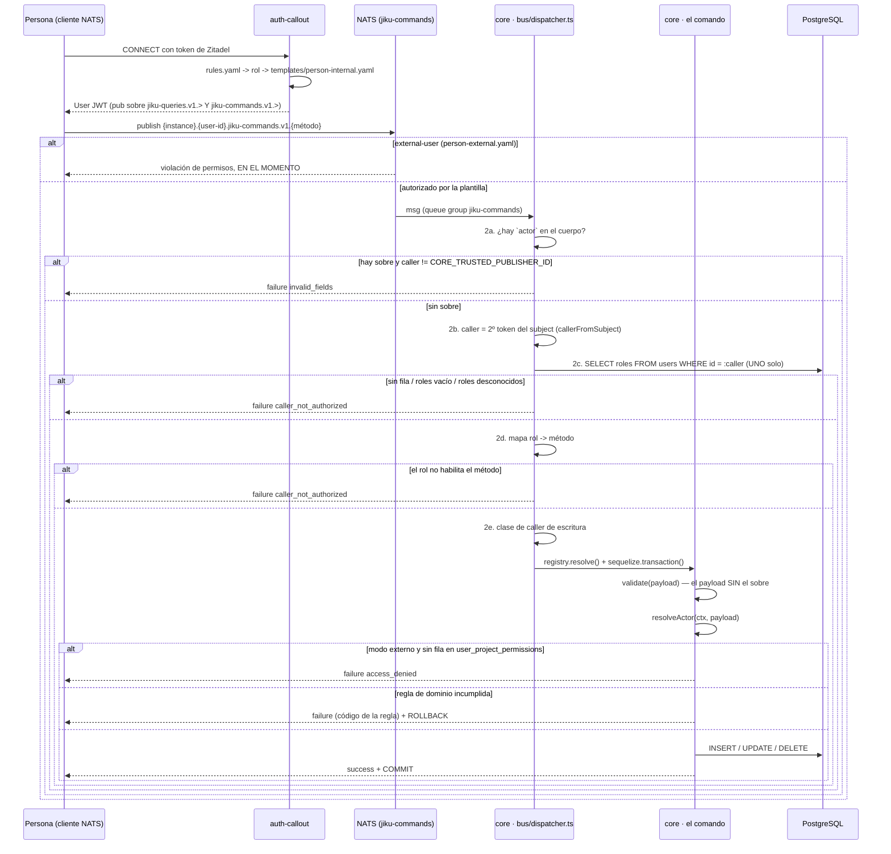

# Escritura por el Bus

**Tipo:** Feature
**Status:** Draft
**Creado:** 2026-08-25
**Última actualización:** 2026-08-25
**Stories:** S-029, S-030, S-031, S-032, S-033, S-035

## Descripción

**El gemelo de `consulta-por-el-bus`, del lado de la escritura.** Documenta el recorrido completo de
un comando publicado por una **persona** —con su propio token de Zitadel y bajo su propio user id—
desde que el auth-callout autoriza el subject hasta que `core` commitea la transacción.

**Qué documenta, y que no está en ningún otro lado:** el recorrido completo de la compuerta —sobre,
espejo, método, clase de caller, entidad—, **el orden entre las cinco**, y **qué código sale de cada
una**. Es el documento que responde *"¿por qué me rechazaron?"* sin leer el código.

**Por qué es un flujo nuevo y no un paso de otro.** Acá **no hay api**. Meterlo dentro de
`carga-de-horas` obligaría a ese flujo a tener dos iniciadores y dos caminos de autorización.

> **Status `Draft`: el flujo describe el estado al cerrar REQ-007.** Hasta que S-035 esté
> desplegada, `templates/person.yaml` **no autoriza la publicación** sobre `jiku-commands` y el
> paso 1 rechaza. El resto del recorrido —del paso 2 en adelante— ya es el vigente para el canal de
> la api desde S-029.

### El canal de la api es el mismo camino con dos diferencias

Los pasos 2 a 6 valen para **los dos** canales. Las diferencias son exactamente dos, y están en el
paso 2:

| | Persona publicando directo | La api publicando por una persona |
|---|---|---|
| **De dónde sale la identidad** | El **segundo token del subject**, y solo de ahí | La clave reservada **`actor`** del cuerpo |
| **De dónde salen los roles** | `users.roles` (persistido, del evento del callout) | `actor.roles` (el claim que la api **ya verificó** contra Zitadel) |
| **¿Se espeja `users`?** | **No** — no hay identidad nueva que espejar | **Sí**, antes de autorizar y en transacción propia |
| **¿Puede mandar `actor`?** | **No** → `invalid_fields` | **Sí**, es el único que puede |

**Que la fuente del rol sea distinta es correcto y deliberado.** Con sobre, el claim es **más
fresco** que la base y ya fue verificado criptográficamente; consultar `users` sería autorizar dos
veces desde dos fuentes, *"con la peor de las dos decidiendo"*. Sin sobre no hay claim que valer: el
subject es infalsificable pero **no transporta roles**. **El espejo es lo que hace que las dos
fuentes converjan**: cada comando de la api refresca `users.roles` con el claim, así que la fila que
autoriza al caller directo **está escrita por el mismo claim** que autoriza al caller de la api.

## Servicios Involucrados

| Servicio | Rol | Tipo de Participación |
|---|---|---|
| Persona (cliente NATS) | Publica el comando con su token de Zitadel y espera la respuesta en su inbox | Iniciador |
| `auth-callout` | Mintea el User JWT desde `templates/person-internal.yaml`: **autoriza el subject de comandos** | Autorizador de transporte |
| NATS | Transporta la request. Servicio micro `jiku-commands`, **queue group propio** | Transporte |
| `core` · `bus/dispatcher.ts` | Extrae el sobre, espeja la identidad, autoriza el método y resuelve la clase del caller | Autorizador |
| `core` · el comando (`registry.resolve()`) | Valida el payload con Joi y ejecuta las reglas de dominio | Procesador |
| PostgreSQL | Ejecuta la escritura con el **usuario dueño**, dentro de la transacción del despachador | Almacenamiento |

**Quién NO participa:** **la `api`.** Es el punto del flujo. Tampoco `web` ni `opus-web`: los
frontends no hablan con el bus (ADR-006).

## Pasos del Flujo



### Paso 1: El auth-callout autoriza el subject de comandos

**Origen:** persona conectada al bus con su token de Zitadel
**Componente:** `auth-callout` · `rules.yaml` + `templates/person-internal.yaml`

`rules.yaml` recorre sus reglas **en orden** y gana la primera cuyo `match` coincida con algún rol
del token. **Las tres reglas de persona van últimas, después de las de servicio**, y no es orden
alfabético: un machine user al que alguien le asignó `admin` por error tiene que caer en la regla
**de servicio**, que es la que tiene el permiso correcto para lo que ese usuario hace.

| Rol | Plantilla | `pub.allow` |
|---|---|---|
| `admin` | `person-internal.yaml` | `jiku-queries.v1.>` **y `jiku-commands.v1.>`** |
| `user` | `person-internal.yaml` | `jiku-queries.v1.>` **y `jiku-commands.v1.>`** |
| `external-user` | `person-external.yaml` | **solo** `jiku-queries.v1.>` |

**Las tres siguen siendo `type: person`**, que es lo que hace que el evento de
`{instance}.events.auth` llegue con `identity_type: "person"`.

**El comodín va al final de cada prefijo de servicio, nunca en `{{instance}}.{{user_id}}.>`.**
Subirlo un segmento daría **todos los servicios presentes y futuros**, no dos.

**Sin catch-all** (ADR-008): un token válido de Zitadel con un rol que no está en las reglas **no
conecta**.

> **El cliente DEBE fijar `inboxPrefix` al conectar.** Si no lo hace, la librería genera un
> `_INBOX.<aleatorio>` que **ningún permiso autoriza** y las respuestas **nunca llegan**. El síntoma
> es un **timeout**, no un error de permisos, y es el error más caro de diagnosticar de la
> plantilla.

### Paso 2: La compuerta del despachador — cinco decisiones en orden

**Componente:** `core` · `bus/dispatcher.ts`

**Todo esto ocurre ANTES de `registry.resolve()` y ANTES de `sequelize.transaction()`.** Es la
propiedad que S-017 CA-6 instaló y que este flujo no toca.

#### 2a. El sobre

```
if hay `actor` y ctx.caller != CORE_TRUSTED_PUBLISHER_ID  ->  failure(invalid_fields)
if hay `actor` y ctx.caller == CORE_TRUSTED_PUBLISHER_ID  ->  se extrae del cuerpo
```

**Solo el publicador de confianza puede transportar identidad.** Para el resto, la identidad **es**
el subject, que el auth-callout hace infalsificable. Se reusa `invalid_fields` **a propósito**:
REQ-006 §19 ya fijó ese código para un campo de identidad en el payload del plano de lectura, y
darle uno propio sugeriría que son cosas distintas.

**El payload que sigue viaje NO lleva el sobre**, así que el esquema Joi de cada comando —que
rechaza claves desconocidas— no cambió, y los 21 `execute()` tampoco.

#### 2b. La identidad

**Sin sobre:** `callerFromSubject` — el **segundo token del subject**, y de ningún otro lugar.
**Con sobre:** `actor.id`.

#### 2c. El espejo — solo en el camino del sobre

```sql
INSERT INTO users (id, name, username, email, roles, identity_type)
VALUES (:id, :name, :username, :email, :roles, 'person')
ON CONFLICT (id) DO UPDATE SET name=…, username=…, email=…, roles=…, identity_type='person'
```

**En su propia transacción, independiente de la del comando, y ANTES de autorizar.** Tres razones:
tiene que **sobrevivir al rollback** (es un hecho sobre la identidad, no sobre la operación); la
compuerta corre antes de `sequelize.transaction()`; y es **idempotente**.

`actor.id` y `actor.roles` son **obligatorios**. `name`, `username` y `email` faltantes **no
rechazan el comando**: se loguea `warn` y, si la fila hay que crearla, `name`/`username` caen a
`email` o al `sub`. Ver `sincronizacion-de-identidades` para la comparación con el otro escritor.

**Sin sobre no hay espejo**, así que **un caller no autorizado nunca escribe en `users`**.

#### 2c'. La lectura de roles — solo en el camino sin sobre

**Un solo `SELECT`**: `User.findByPk(caller)`, con la misma forma que ya usa el plano de consultas
(S-023 CA-5). Su resultado alimenta **la compuerta de método y la clase de caller**.

Sin fila, con `roles: []` o con **solo roles desconocidos** → `caller_not_authorized`. **Nunca se
ejecuta en silencio.**

#### 2d. La compuerta de método — el mapa rol → comando

**Deny-by-default** (ADR-008): el mapa **enumera**, sin coincidencia no se autoriza, y un rol
desconocido no autoriza nada.

| Rol | Comandos |
|---|---|
| `internal-app` | `ALL` — es el publicador |
| `admin` | los enumerados, incluida `week-assigned-times.replace` (C-38) |
| `user` | los enumerados, **sin** `week-assigned-times.replace` |
| `external-user` | **ninguno** |
| rol desconocido | **ninguno** |

**Con sobre, el rol que decide es `actor.roles`, no el del service user de la api**: `internal-app`
sigue exento como **publicador**, pero **ya no como autorizador**.

→ `caller_not_authorized` (**403** cuando la api traduce).

#### 2e. La clase de caller de escritura

Misma precedencia que el plano de lectura — *gana el más restrictivo*: `external-user` → `user` →
`admin` → `internal-app`.

| Clase | Rol | Chequeo de `user_project_permissions` |
|---|---|---|
| **externo** | `external-user` | **Sí**: fila requerida para el proyecto resuelto |
| **interno** | `admin`, `user` | **No** a nivel de fila |
| **conector** | `internal-app` sin sobre | **No**: el caller autoriza por su cuenta |

> **Por qué el chequeo NO se aplica a todos.** `validateProjectPermissions` de la api **solo
> restringe a `external-user`**; el resto pasa de largo. Los usuarios internos **no tienen filas**
> en `user_project_permissions` —la tabla sostiene el aislamiento del portal y no se administra
> desde ninguna interfaz—, así que aplicarles el chequeo rechazaría **a cada `admin` y a cada
> `user` en cada comando** sobre una entidad de proyecto. El síntoma sería *"nadie puede hacer
> nada"*.

### Paso 3: El comando valida y ejecuta

**Componente:** `core` · el comando resuelto por `registry.resolve()`, dentro de
`sequelize.transaction()`

1. **`command.validate(payload)`** — el payload de dominio, **sin el sobre**
2. **`resolveActor(ctx, payload)`**:
   ```
   if hay sobre                                       -> actor.id
   else if ctx.caller == CORE_TRUSTED_PUBLISHER_ID    -> payload.author/creator/editor/uploader
   else                                               -> ctx.caller
   ```
   Sobre **y** campo de dominio presentes **y distintos** → `invalid_fields` con
   `errorDetails: { field, value, expected }`. **No se elige el más probable.**
3. **El chequeo de entidad, solo en modo externo:** resuelve el proyecto **desde el tipo de
   entidad** (los 9 que hoy resuelve `canUserAccessEntity`) y verifica
   `user_project_permissions` por el unique `(user_id, project_id)` → si no hay fila,
   **`access_denied`**
4. **Las reglas de dominio del comando** (ver la tabla del paso 4)

### Paso 4: Las reglas que se decidieron acá y no en la api

| Regla | Capability | Dónde se decide | Código |
|---|---|---|---|
| ¿Tu rol habilita este método? | C-70 | **El mapa**, antes del dominio | `caller_not_authorized` |
| ¿Podés tocar ESTA entidad? | C-71 / C-58 | **El comando**, con la fila delante, **solo en modo externo** | `access_denied` |
| Ventana de carga: hoy y los 10 días previos | C-40 | `worked-times.new` / `.delete` | `invalid_date_range` |
| Solo `admin` imputa horas a otra persona | C-41 | `worked-times.new` | `access_denied` |
| Titularidad del registro al borrar | — | `worked-times.{id}.delete`, `unworked-times.{id}.delete` | `access_denied` |
| Exclusión `taskId` / `requirementId` | C-42 | `worked-times.new` — **una sola definición** | `invalid_fields` |
| Tope diario de 1440, horas **y** ausencias | — | `worked-times` / `unworked-times` | `daily_limit_exceeded` |
| Solo `admin` edita la grilla semanal | C-38 | **El mapa** — no depende del payload | `caller_not_authorized` |
| No se modifican semanas pasadas | C-36 | `week-assigned-times.replace` | `invalid_date_range` |
| Transición de estado del requisito | C-15 | `requirements.{id}.edit` **y** `.resolve`, mismo validador | `invalid_state_transition` |
| Tipo + conclusión al resolver | C-17 | El mismo validador | `resolution_required` |
| `documentacion` / `diseño` / `board_de_tareas` como URI | C-07 | `projects.new` / `.edit` | `invalid_fields` |
| Límites de subida y doble lista blanca | C-50 | `files.request-upload` — **ya estaba en core** | `file_too_large`, `file_type_not_allowed` |
| Titularidad del archivo al vincular | — | Los ocho comandos con `fileIds` — REQ-011 suma los dos de edición de comentario | `file_not_owned` |
| Autoría del comentario, con excepción por rol `admin` | — | `requirements.{id}.comment.{cid}.edit` / `tasks.{id}.comment.{cid}.edit` (REQ-011) — `actor === comment.changedBy \|\| ctx.roles.includes('admin')` | `comment_not_owned` |
| Solo se edita una actividad de tipo `comment` | — | Los mismos dos comandos (REQ-011) | `activity_not_editable` |
| `visibilityLevel` inmutable después de creado | — | Los mismos dos comandos (REQ-011) — el payload no declara la propiedad | `invalid_fields` |

**`access_denied` y `caller_not_authorized` responden preguntas distintas** y no se fusionan:
el primero es *"¿podés tocar ESTA entidad?"* y lo decide el comando con la fila delante; el segundo
es *"¿tu rol habilita este método?"* y lo decide el mapa antes de tocar el dominio. **Es además el
código que los dos frontends ya conocen** para este caso, que es lo que hace que el contrato HTTP no
cambie.

### Paso 5: La transacción cierra

**Commit si el reply es `success`; rollback en cualquier otro caso** (ADR-003). Vale igual para los
comandos de personas: si un comando inserta varias filas y falla en una validación posterior,
**ninguna queda**.

**La única escritura que sobrevive al rollback es el espejo de `users`** del paso 2c, y es
deliberado: es un hecho sobre la identidad y no sobre la operación.

### Paso 6: La persona recibe el reply

**En su inbox `_INBOX.{{user_id_hash}}.>`**, que es la única suscripción que su plantilla autoriza.
Lo que permite que `core` le conteste es el bloque `response:` de `core.yaml`, no uno de la
plantilla de persona — una persona **nunca recibe requests**, así que no tiene ese bloque.

## Manejo de Errores

| Situación | Reply | HTTP equivalente | Dónde se decide |
|---|---|---|---|
| `external-user` publicando un comando | *(violación de permisos del servidor NATS, en el momento)* | — | **Paso 1** — el mensaje no llega a `core` |
| Ídem, si la plantilla se equivocara | `caller_not_authorized` | 403 | **Paso 2d** — la segunda capa |
| Identidad en el payload de un caller no confiable | `invalid_fields` | 400 | Paso 2a |
| Sin fila en `users` / `roles: []` / roles desconocidos | `caller_not_authorized` | 403 | Paso 2c' |
| El rol no habilita el método | `caller_not_authorized` | 403 | Paso 2d |
| Modo externo sin permiso sobre la entidad | `access_denied` | 403 | Paso 3 |
| Regla de dominio incumplida | el código de la regla | 400 / 403 | Paso 4 |
| Sobre y campo de dominio que difieren | `invalid_fields` + `errorDetails` | 400 | Paso 3 |
| El cliente no fijó `inboxPrefix` | *(timeout)* | 504 | **Paso 1** — el error más caro de diagnosticar |
| `core` caído | *(sin suscriptor / timeout)* | 503 / 504 | ADR-002 |

**Siempre hay respuesta.** Ningún caller queda esperando hasta el timeout, **incluido uno rechazado
por autorización**.

**Los datos estructurados van en `errorDetails` y el mensaje NUNCA lleva el subject completo**, que
transporta el user id.

## Resultado

**Una persona escribe en el producto con su propio token, bajo su propio user id, sin api de por
medio** — y la Actividad queda registrada **a su nombre**, no al del service user de la api, con la
visibilidad automática que decide el sistema (C-21).

**Y la misma operación produce el mismo resultado por los dos caminos.** Ese es el punto: las reglas
se mudaron a `core` **antes** de abrir la puerta, así que un comando publicado por una persona y el
mismo comando publicado por la api aplican exactamente las mismas validaciones y devuelven el mismo
reply.

## Notas

**Las dos defensas son independientes y cada una alcanza por sí sola.** El auth-callout no le da
permiso de publicación a `external-user`, **y** el mapa de `core` no autoriza su rol. Verificar las
dos es parte del cierre de S-035 — y es la razón por la que `person.yaml` se partió en dos en vez de
ampliarse: agregar `jiku-commands` a la plantilla compartida se lo habría dado a `external-user`
también, con la segunda capa haciendo de primera.

**`rules.yaml` no tiene suite.** Es configuración de un componente externo, así que la verificación
es **manual y tiene tres pasos**: conectar con un token de `user` y publicar un comando (**acepta**);
conectar con `external-user` y publicar (**violación de permisos en el momento**); y verificar que el
mapa de `core` rechaza a `external-user` **aunque el permiso existiera**.

**Lo que este flujo NO cierra.** Dentro del canal de la api, `core` sigue confiando en lo que la api
declara: quien tenga su service user puede **fabricar un sobre** y escribir como cualquiera. El
sobre **no elimina esa confianza: la hace explícita y la concentra en un solo campo**, en vez de
repartirla entre `creator`/`author`/`editor`/`uploader`. **Para el canal de las personas eso no
aplica**: la identidad **es** el subject. Cerrar la del canal de la api exigiría propagar el JWT del
usuario final hasta `core`, que es otro ADR.

**Riesgo heredado:** una persona a la que se le revoca el rol en Zitadel **conserva su token hasta
que venza**. Es la garantía que REQ-005 ya aceptó; lo que cambia con este flujo es que el conjunto de
identidades a las que aplica ahora incluye **la escritura**.

**`nats micro info jiku-commands` lista 21 endpoints** desde S-032: el registro es automático desde
`commands/index.ts`, así que sumar el comando **es** sumar el endpoint.
