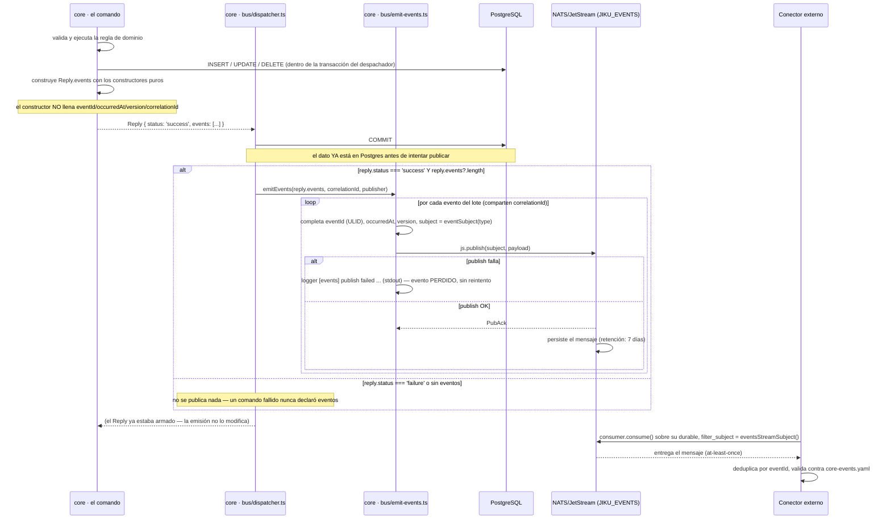

# Eventos de Dominio — el Mecanismo de Emisión Post-Commit de Punta a Punta

**Tipo:** Evento
**Status:** Draft
**Creado:** 2026-09-08
**Última actualización:** 2026-09-08
**Stories:** S-061, S-062, S-063, S-064, S-065, S-066, S-067

## Descripción

El mecanismo por el que `core` publica, al bus, un hecho de dominio ya ocurrido —un requisito
creado, una tarea reasignada, un comentario editado— para que un conector **externo a Jiku** lo
consuma sin tener que preguntar por polling. Es el **segundo** plano de eventos del producto y el
**primero saliente**: `sincronizacion-de-identidades.md` documenta el único evento que existía
antes de REQ-014, y es **entrante** (`core` lo consume, no lo publica).

**Merece documento propio por tres razones que no se pueden reconstruir leyendo el código:**

1. Es el **primer uso de JetStream** del producto. Los planos de comandos y de consultas siguen
   siendo request/reply sin persistencia (ADR-002); este es el único que **queda grabado** en un
   stream, con retención y reproducción — y esa diferencia es la que hace posible que un conector
   se caiga y, dentro de la ventana de retención, se ponga al día.
2. Su publicación es **best-effort y sin outbox**, a propósito: no hay tabla de reconciliación,
   no hay reintento, y el commit de la escritura **ya ocurrió** cuando se intenta publicar. Un
   lector que espere la garantía "exactly-once" de un mensaje transaccional está leyendo el
   contrato equivocado.
3. El catálogo de 16 eventos, su sobre y sus dos `snapshot` son un **contrato versionado aparte**
   (`docs/apis/core-events.yaml`, S-062), independiente del protocolo de comandos/consultas — con
   su **propia** variable de versión (`NATS_EVENTS_VERSION`), que puede subir a `v2` sin que los
   23 comandos se enteren.

**No escribe ni un evento nuevo.** El mecanismo completo —el emisor, el catálogo de 16, el molde
de permisos de un conector y el consumidor de prueba— ya está cerrado al escribir este documento
(S-063 a S-067); este flujo es la foto de punta a punta, no la implementación.

## Servicios Involucrados

| Servicio | Rol | Tipo de Participación |
|---|---|---|
| `core` · el comando (`registry.resolve()`) | **Declara** los eventos en `Reply.events`, construidos con los 16 constructores puros de `src/events/domain/`. Nunca publica | Productor de hechos |
| `core` · `bus/dispatcher.ts` | Dueño de la transacción (ADR-003) y, desde el `commit()`, de la publicación: llama a `emitEvents()` entre el commit y el reply | Emisor |
| `core` · `bus/emit-events.ts` | Completa cada evento (`eventId`, `occurredAt`, `version`, `correlationId`), arma el subject con `eventSubject()` y publica. Nunca lanza | Ensamblador del sobre |
| NATS / JetStream (stream `JIKU_EVENTS`) | Persiste el evento publicado, con `max_age` 7 días (S-061) | Transporte y almacenamiento |
| Conector externo (fuera de Jiku) | Se suscribe con un durable propio y su `filter_subject`, deduplica por `eventId` | Consumidor |
| `docs/apis/core-events.yaml` | El contrato: 16 canales, el sobre `DomainEvent`, los dos `snapshot` | Fuente de verdad (no ejecuta) |

**Quién NO participa:** la **api** — recibe `events` en el `Reply` de `bus.js`/`protocol.ts` igual
que cualquier otro campo, y **lo ignora**: no reenvía, no traduce, no expone un endpoint HTTP para
eventos. `web` y `opus-web` — no hablan con el bus (ADR-006) y no tienen forma de enterarse de un
evento de dominio. El **conector real** — se desarrolla fuera de este repositorio (REQ-014); lo
único de acá que le compete es el contrato (`core-events.yaml`) y el molde de permisos
(`deploy/nats/auth-callout/templates/connector.yaml`, S-067).

## Pasos del Flujo



### Paso 1: El comando valida, escribe y declara — nunca publica

**Componente:** `core` · el comando resuelto por `registry.resolve()`, dentro de
`sequelize.transaction()` (mismo paso 3 de `escritura-por-el-bus.md`).

- Corre exactamente igual que documenta `escritura-por-el-bus.md`: valida con Joi, ejecuta las
  reglas de dominio, escribe con `INSERT`/`UPDATE`/`DELETE`.
- Al final, y **solo si la escritura llegó hasta ahí sin fallar**, arma los eventos con los 16
  constructores puros de `src/events/domain/requirement.ts` y `task.ts`, y los adjunta a
  `Reply.events`.
- **El gate estructural lo hace verificable:** ningún archivo de `src/commands/` importa el
  publicador ni llama a `.publish(` — `core/tests/bus/events-structure.test.ts` lo verifica con
  un `grep` (ADR-003, regla 1).
- **Doce comandos declaran los dieciséis eventos.** `requirements.{id}.edit` puede declarar hasta
  cuatro en un solo lote (`state.changed` + `updated` + `resolved`/`reopened` + `assigned`);
  `tasks.{id}.edit`, hasta tres. Todos los del mismo lote comparten `correlationId`.

### Paso 2: `COMMIT` — el dato ya está en Postgres

Igual que el paso 5 de `escritura-por-el-bus.md`: **commit si el reply es `success`, rollback en
cualquier otro caso**. La emisión que sigue **nunca** puede revertir esta escritura: el commit ya
pasó.

### Paso 3: El despachador emite, en su propio `try`/`catch`

**Componente:** `core` · `bus/dispatcher.ts`, líneas 416-424 (verbatim):

```ts
if (reply.status === 'success' && reply.events?.length) {
  await emitEvents(reply.events, correlationId, this.publisher);
}
```

- Corre **entre** el `commit()` y el `return reply`.
- **Publica solo si** el reply es `success` **y** la lista tiene elementos — un `edit` que solo
  cambia `priority` no declara eventos y este bloque no hace nada.
- Está en su **propio** `try`/`catch`, que no deja escapar nada: un fallo de publicación no
  cambia el `reply` a `failure` y no revierte la transacción ya commiteada.

### Paso 4: `emit-events.ts` completa el sobre y publica

**Componente:** `core` · `bus/emit-events.ts`.

El constructor puro de cada evento **no llena** cuatro de los ocho campos `required` del sobre
(`eventId`, `occurredAt`, `version`, `correlationId`) ni el subject — son responsabilidad del
emisor, no del comando:

```ts
const complete: DomainEvent = {
  ...event,
  eventId: generateUlid(),
  occurredAt: new Date().toISOString(),
  version: EVENTS_VERSION,      // de NATS_EVENTS_VERSION, NUNCA un literal 'v1'
  correlationId,
};

await publisher.publish(eventSubject(complete.type), complete);
```

**El subject se arma SOLO con `eventSubject()`** (`@jiku/nats-protocol`): es el único lugar donde
el subject y el `type` del payload están garantizados de no divergir, porque `eventSubject(type)`
concatena el `type` una sola vez.

**Un fallo de publicación se loguea con este formato literal, a `stdout`:**

```
[events] publish failed eventId=<id> type=<type> entity=<type>:<id> project=<projectId> reason=<causa>
```

y el evento **se pierde**: no hay reintento ni reposición.

### Paso 5: JetStream persiste el mensaje

**Componente:** NATS/JetStream, stream `JIKU_EVENTS` (S-061).

| Parámetro | Valor |
|---|---|
| Subjects | `{instance}.events.v1.>` — **con la versión**, nunca `{instance}.events.>` |
| Retención | `limits`, `max_age` **7 días** |
| Storage | `file` |
| Consumidores | Durables, uno por conector, con su propio `filter_subject` |

**El wildcard lleva la versión a propósito:** `{instance}.events.>` (sin `.v1.`) se comería
`{instance}.events.auth` — el evento de `sincronizacion-de-identidades.md`, que es **otro
publicador y otra semántica**, sin JetStream. `eventsStreamSubject()` (`@jiku/nats-protocol`) es
el único lugar donde se escribe este patrón, y `deploy/nats/auth-callout/templates/core.yaml`
(el `pub.allow` de `core`) y `deploy/nats/create-events-stream.sh` (el subject del stream)
dependen de que no diverja.

### Paso 6: El conector consume, deduplica y valida

**Componente:** un conector externo (fuera de Jiku) o, para verificación, el consumidor de
prueba del repositorio (`deploy/nats/events-test-consumer.sh` + `core/tests/tools/
events-test-consumer.ts`, S-067).

- Un durable JetStream con `filter_subject = eventsStreamSubject()` — nunca un subject armado a
  mano.
- **Deduplica por `eventId`** (un ULID): la entrega es **at-least-once**, así que un redelivery
  es un valor legítimo del protocolo, no una anomalía.
- Valida subject, `version` y payload completo contra `docs/apis/core-events.yaml` — el molde de
  permisos que un conector real necesita es `deploy/nats/auth-callout/templates/connector.yaml`
  (S-067): `sub.allow` sobre `{instance}.events.v1.>` (la excepción declarada a la política de
  subjects literales, D-8 de S-067 / ADR-008 regla 2), `pub.allow` sobre `$JS.API.>`, y su propio
  inbox en `sub.allow`.

## La gramática del subject y su versionado independiente

```
{instance}.events.{version}.{entidad}.{acción}
dev.events.v1.requirement.state.changed
```

| Segmento | Valor | Fuente |
|---|---|---|
| `instance` | `dev` / `prod` | `NATS_INSTANCE` |
| `events` | literal | — |
| `version` | `v1` | `NATS_EVENTS_VERSION` — **independiente de `NATS_PROTOCOL_VERSION`** |
| `entidad` | `requirement` \| `task` | del catálogo. `task`, nunca `objective` (ADR-004) |
| `acción` | `created`, `state.changed`, … | del catálogo |

**Por qué `NATS_EVENTS_VERSION` es una variable propia y no comparte `NATS_PROTOCOL_VERSION`:**
compartirla haría que un `v2` de eventos arrastre a los 23 comandos que no tienen nada que ver con
ese cambio. Las dos pueden convivir en valores distintos sin que ningún plano se entere del otro.

**El `type` del payload ES los segmentos finales del subject** — `eventSubject(type)` los
concatena una sola vez, así que no pueden divergir.

## El catálogo de los 16, con su comando de origen

| # | `type` | Comando que lo declara |
|---|---|---|
| 1 | `requirement.created` | `requirements.new` |
| 2 | `requirement.state.changed` | `requirements.{id}.edit` |
| 3 | `requirement.updated` | `requirements.{id}.edit` |
| 4 | `requirement.comment.created` | `requirements.{id}.comment` |
| 5 | `requirement.comment.edited` | `requirements.{id}.comment.{cid}.edit` |
| 6 | `requirement.subscriptor.added` | `requirements.{id}.subscriptors.new` |
| 7 | `requirement.subscriptor.removed` | `requirements.{id}.subscriptors.{userId}.delete` |
| 8 | `requirement.assigned` | `requirements.{id}.edit` |
| 9 | `requirement.resolved` | `requirements.{id}.edit` |
| 10 | `requirement.reopened` | `requirements.{id}.edit` |
| 11 | `task.created` | `tasks.new` |
| 12 | `task.state.changed` | `tasks.{id}.edit` |
| 13 | `task.updated` | `tasks.{id}.edit` |
| 14 | `task.comment.created` | `tasks.{id}.comment` |
| 15 | `task.comment.edited` | `tasks.{id}.comment.{cid}.edit` |
| 16 | `task.assigned` | `tasks.{id}.edit` |

**Doce comandos, dieciséis eventos.** `requirements.{id}.edit` y `tasks.{id}.edit` son los únicos
que pueden declarar más de uno en el mismo lote, siempre con el mismo `correlationId`.

## La forma del sobre y los dos `snapshot`

El sobre (`DomainEvent`, `docs/apis/core-events.yaml#/components/schemas/DomainEvent`) es
`additionalProperties: false`: todo lo que no sea `actor`, `entity`, `snapshot`, `changes`,
`recipients`, `comment` o `visibilityLevel` **hace fallar la validación**, incluidos campos que
otro documento del producto sí muestre en la raíz — **manda el contrato de eventos**, no un
ejemplo de otro lugar.

**Todo campo de la entidad va DENTRO de `snapshot`**, con dos formas — `RequirementSnapshot` (15
campos) y `TaskSnapshot` (16, con la contradicción deliberada `priority`/`priorityValue`, R-D de
REQ-014) — y quedan deliberadamente **fuera** del snapshot: las relaciones (`project`,
`responsiblePersons` — viajan como ids), las colecciones (`comments`, `attachments`),
`totalMinutes` (calculado, no es columna), los textos internos largos (`scope`,
`technicalSolution`, `acceptanceCriteria`), y las marcas de transición que no sean `finishedAt`
(`scheduledAt`, `inProgressAt`, `inReviewAt`). El detalle campo por campo es del contrato
(`docs/apis/core-events.yaml`); este flujo documenta el recorrido, no la forma.

## `recipients`: a quién avisar, y por qué `email` puede ser `null`

- Va en **todos** los eventos de requisito, incluidos `subscriptor.added`/`.removed`. **Ningún**
  evento de tarea lo lleva: no existe hoy ninguna interfaz que suscriba a una tarea, la tabla
  `objectives_subscriptors` está siempre vacía.
- `subscriptors` puede ser `[]` — el caso más frecuente. **No hay unique compuesto en la base**:
  `core` valida `already_subscribed`, la tabla no, así que el conector **debe** deduplicar por
  `userId`.
- `email` de un suscriptor es `string | null`, y **puede ser `null` solo para una identidad de
  servicio** — un machine user de Zitadel no tiene dirección de correo. El conector **debe
  tolerarlo y saltear ese destinatario**, nunca tratarlo como un dato faltante a reclamar.
- `responsiblePersonIds` es redundante con `snapshot` a propósito: son destinatarios además de
  dato de la entidad. **`personId` ≠ `userId`**: notificar a un responsable exige resolver
  Persona → Usuario, y puede no haber a quién resolver.

## Manejo de Errores

| Modo de pérdida | Comportamiento | Síntoma observable |
|---|---|---|
| **(1) Publish fallido tras el commit** | El dato ya está en Postgres; el evento se pierde, sin reintento ni reposición. El `Reply` sigue siendo `success` — el usuario ve su operación hecha, porque lo está | `[events] publish failed eventId=... type=... entity=...:... project=... reason=...` en `stdout` de `core` |
| **(2) Conector fuera de la retención de 7 días** | Los eventos publicados mientras estuvo caído se pierden, **sin forma de saber cuáles**. Es comportamiento **declarado y esperado**, no un error a corregir | Ninguno automático — se verifica manualmente bajando `max_age` en un entorno de prueba (receta en `deploy/nats/events-test-consumer.sh --help`) |
| **(3) Evento nunca emitido, por un `failure`** | No es una pérdida: es la regla. Un comando que termina en `failure` **nunca** declara eventos (el bloque de construcción va después de todo `return failure(...)`, gratis por el orden) | El `Reply` es `failure` con su `errorCode`; ningún log de `[events]` aparece |

**Los tres modos comparten una raíz:** la publicación es **best-effort, sin outbox**. No hay una
cuarta causa de pérdida además de estas — si un evento del catálogo no llega y ninguna de las tres
aplica, la sospecha correcta es una divergencia entre el código y `docs/apis/core-events.yaml`
(la verificación que S-067 cierra).

## Resultado

**Estado final:** el evento quedó publicado en `JIKU_EVENTS`, disponible para cualquier durable
con permiso, hasta que expire su retención de 7 días.

| Escenario | Estado del evento |
|---|---|
| Comando exitoso con eventos declarados, publish OK | Persistido en `JIKU_EVENTS`, entregable a cualquier consumidor nuevo o dentro de la ventana de retención |
| Comando exitoso con eventos declarados, publish falla | **Perdido.** La escritura en Postgres es `success` igual; el evento nunca existió para ningún conector |
| Comando exitoso sin eventos que declarar (p. ej. `edit` de solo `priority`) | No aplica — no había nada que publicar |
| Comando `failure` | No aplica — ningún evento se construyó |

**Y lo que ese estado habilita:**

- Un conector externo puede reaccionar a un hecho de dominio —notificar, replicar, integrar— sin
  hacer polling contra `jiku-queries`.
- La plantilla `deploy/nats/auth-callout/templates/connector.yaml` (S-067) es el molde de
  permisos listo para el primer conector real.
- El consumidor de prueba del repositorio (S-067) verifica, contra un NATS real, que el molde de
  permisos alcanza y que el transporte entrega lo que el contrato promete.

**Lo que este flujo NO hace:**

- **No hay outbox.** Ninguna tabla registra "este evento quedó pendiente de publicar": si el
  publish falla, no hay de dónde reponerlo.
- **No hay reintento.** Un fallo de publicación no se reintenta ni en el momento ni después.
- **No hay reconciliación.** Nada compara periódicamente lo que Postgres dice que pasó contra lo
  que `JIKU_EVENTS` contiene.
- **No hay métrica de lag ni de eventos perdidos.** El único rastro de una pérdida por publish
  fallido es la línea de `stdout` del paso 4.
- **El stream NO es una fuente reconstruible de estado.** Un conector que necesite el estado
  completo y actual de una entidad consulta `docs/apis/core-queries.yaml` — el stream de eventos
  solo lleva lo que cambió, cuándo cambió, y solo mientras la retención alcance.

## Notas

**Procedimiento de habilitación de JetStream en modo operator** (ya ejecutado por S-061; se deja
documentado para una instalación nueva o para diagnosticar una que predata esta story):

1. Los límites de JetStream (`disk_storage`, `mem_storage`) viven en el **JWT de la cuenta**, no
   en la configuración del servidor: `nats-server.conf` habilita JetStream **a nivel de proceso**,
   pero una cuenta sin límites asignados no puede crear streams.
2. `nsc edit account --js-disk-storage <bytes>` (o el equivalente en `enable-jetstream.sh`, para
   una instalación existente) asigna esos límites a la cuenta APP.
3. **Volver a empujar los JWTs por el resolver** (`nats-resolver.conf`): un límite asignado en
   `nsc` que no se propaga al servidor no tiene efecto — es la misma clase de olvido que deja a
   una cuenta "habilitada" en el JWT local y sin límites en el server real.
4. `deploy/nats/create-events-stream.sh` crea (o verifica, idempotente) el stream `JIKU_EVENTS`
   con los parámetros de la tabla del Paso 5, minteando un usuario administrativo descartable
   para la operación y borrándolo al terminar.
5. `deploy/local.sh` hace un preflight del stream (`curl .../jsz?streams=1`) al levantar el stack
   local, y avisa si falta — nombrando el script que lo crea, no un síntoma críptico.

**Relación con `sincronizacion-de-identidades.md`:** ese es el **otro** plano de eventos —
`{instance}.events.auth`, 3 segmentos, sin JetStream, un solo evento— y comparte con este el
prefijo `{instance}.events.`. **La versión en el subject de este flujo es, en parte, lo que evita
que los dos namespaces se pisen**: un stream configurado sobre `{instance}.events.>` (sin
versión) se comería también el evento de autenticación, persistiéndolo sin que nadie lo haya
pedido — el mismo namespace, dos publicadores, y solo el segmento de versión los separa a nivel
de infraestructura.

**Relación con `escritura-por-el-bus.md`:** ese flujo documenta el recorrido completo de un
comando, y su Paso 5 referencia este documento para el detalle de la emisión — no lo repite.

**Origen:** REQ-014 · stories S-061 (JetStream habilitado y el stream), S-062 (el contrato de
eventos), S-063 (el mecanismo de emisión post-commit), S-064 y S-065 (los 12 primeros eventos),
S-066 (asignación y resolución) y S-067 (la plantilla de conector y la verificación de punta a
punta).
