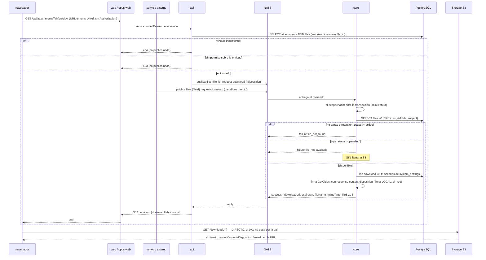

# Lectura de Archivos

**Tipo:** Feature
**Status:** Active
**Creado:** 2026-08-19
**Última actualización:** 2026-08-19
**Stories:** S-002, S-005, S-006, S-007

> **Estado de implementación (2026-08-19).** El lado de `core` (S-002), el de la **`api` (S-005)**,
> el de **`web` (S-006)** y el de **`opus-web` (S-007)** están implementados: los cinco caminos de lectura autorizan, publican
> `files.{fileId}.request-download` y responden 302, y los dos route handlers de `web`
> (`/api/attachments/{id}/preview` y `/download`) **propagan esa redirección con
> `redirect: 'manual'` en lugar de proxear el binario**, sin `Content-Length` en el `GET`. El `HEAD`
> se mantiene para que `useAttachmentMeta` resuelva nombre, tamaño y mime.
>
> **El flujo está completo y pasa a `Active` con S-007:** los dos handlers propios de `opus-web` —`/api/attachments/[id]/preview`
> (autenticado) y el público `/attachments/[id]/[fileName]`— **también propagan el 302 con
> `redirect: 'manual'`** y dejaron de propagar `Content-Length`. Ambos devuelven ahora el body de
> error tal cual llega, para que el `code` (`file_not_available`, `file_not_found`, `not_found`)
> sobreviva y la interfaz pueda distinguirlos. Se sumó `GET`/`HEAD /api/files/[id]/preview`, el
> camino de lectura **por `fileId`** que permite previsualizar lo recién subido antes de que exista
> el vínculo.
>
> **Corrección (2026-08-20).** El camino E le faltaba a `web`: `getFilePreviewUrl()` apuntaba a
> `/api/files/{id}/preview` y el endpoint de la `api` existía, pero **`web` nunca tuvo el route
> handler** —solo lo tenía `opus-web`—. Next respondía un 404 sin cuerpo y `useAttachmentMeta`
> traduce un 404 sin `code` a `file_not_available`, así que un `[file:N]` recién subido y
> correctamente vinculado se mostraba como **"El archivo no está disponible"**. Ni la `api` ni
> `core` registraban la request, porque nunca salía de Next. Ya está agregado, con sus tests.
>
> **Cambio de comportamiento (2026-08-20): `byte_status: 'pending'` ya NO bloquea la lectura.**
> El diseño pedía responder `file_not_available` (CA-15, RF-21, D-15), y era incompatible con
> RF-1 / CA-7: `pending` significaba a la vez "el byte nunca llegó" y "todavía no se vinculó"
> —el `uploaded` lo escriben los comandos de vinculación, al guardar la entidad—, así que un
> archivo recién subido era **imprevisualizable por construcción**. Es el caso que el camino E
> existe para cubrir. **Se resigna el 404 entendible:** un PUT que falló en silencio ahora llega
> al navegador como un `NoSuchKey` opaco de S3. Decisión explícita del solicitante.
>
> **Corrección (2026-08-20): el prefijo del placeholder decide el espacio de ids.** Tres bugs de
> la misma familia, todos silenciosos porque **los dos espacios de ids se solapan** — resolver un
> `fileId` contra la ruta de vínculos no da 404, sirve **otro archivo**:
>
> | Dónde | Qué pasaba |
> |---|---|
> | `web` — `AttachmentPlaceholder` | La descarga usaba `/api/attachments/{id}/download` incluso con `resource: 'file'`: bajaba el archivo equivocado |
> | `opus-web` — `RichContentRenderer` | Solo reconocía `attach:`, así que un `![file:N]` de `web` se mostraba como **texto crudo** y no cargaba |
> | `opus-web` — los dos formularios | Guardaban `attach:{fileId}` — un id de `files` bajo el prefijo de vínculos |
>
> **`attach:` se sigue leyendo** en los dos frontends: los comentarios anteriores a REQ-001 lo
> usan con id de vínculo legítimo (verificado: ninguno quedó huérfano), así que no hay migración
> de datos. Lo que cambió es que **se escribe siempre `file:`**, que es el id que existe al
> adjuntar.

## Descripción

El **plano de la lectura**, que en el diseño anterior no era un flujo propio porque no cruzaba
servicios. Se dispara con un preview embebido, una descarga, o la apertura de un link público.

**El byte no pasa por la `api`.** Es simétrico con la subida: igual que el `PUT` va directo del
navegador a S3, el `GET` también. La `api` **autoriza** y responde un **302**; el navegador baja de
S3 siguiendo la redirección.

El corte de responsabilidades es la clave del flujo:

- **La `api` autoriza** —resuelve el proyecto desde la entidad del vínculo— **y traduce vínculo →
  archivo**, porque ya tiene el `file_id` de la fila que leyó para autorizar.
- **`core` es dueño del storage** y **solo conoce el archivo**: firma sobre un `fileId` y no sabe por
  qué se autorizó esa descarga.

Junto con [`subida-de-archivos`](subida-de-archivos.md) y
[`vinculacion-de-archivos`](vinculacion-de-archivos.md), reemplaza a [`adjuntos`](adjuntos.md).

## Servicios Involucrados

| Servicio | Rol | Tipo de Participación |
|---|---|---|
| `web` / `opus-web` | Route handlers que agregan el Bearer y **siguen o devuelven el 302**. Ya no proxean el binario | Iniciador |
| Servicio externo | Publica `files.{fileId}.request-download` **directo al bus** | Iniciador (canal bus) |
| `api` | **Autoriza** y resuelve el `file_id` del vínculo. Publica el comando y **redirige**. **Sin credenciales de S3** | Procesador |
| NATS | Transporta el comando request/reply | Transporte |
| `core` | Valida existencia, `retention_status` y `byte_status`, y **firma** la URL de `GetObject` | Procesador |
| Storage S3-compatible | Sirve el binario **directo al navegador** | Almacenamiento externo |
| PostgreSQL `jiku` | Provee `attachments` + `files` y `system_settings` | Almacenamiento |

## Los cinco caminos de lectura

| # | Camino | Sesión | Id que recibe | Autorización de la `api` |
|---|---|---|---|---|
| A | `web` → `GET /api/attachments/{id}/preview` | **Sí** | Vínculo | `canUserViewEntity` sobre la entidad del vínculo |
| B | `web` → `GET /api/attachments/{id}/download` | **Sí** | Vínculo | `canUserViewEntity` sobre la entidad del vínculo |
| C | `opus-web` → `GET /api/opus/attachments/{id}/preview` | **Sí** | Vínculo | Igual, más permiso de proyecto |
| D | `opus-web` → `GET /api/opus/attachments/{id}/public` | **NO** | Vínculo | Solo `visibilityLevel === 'public'` de la entidad. **DEPRECADO** |
| E | **Archivo sin vínculo, por `fileId`** | **Sí** | **Archivo** | **Solo el JWT** — sin vínculo no hay entidad contra la que validar permiso |

Los cuatro primeros entran por **id de `attachments`** (D-16, contrato HTTP intacto). El quinto entra
por **id de `files`**, y es lo único que hace coherente a RF-1 y CA-7.

**Todos terminan igual:** publican `files.{fileId}.request-download` y responden **302**.

## Pasos del Flujo



### Paso 1: El navegador pide el preview o la descarga

**Origen:** navegador
**Destino:** `web` / `opus-web`
**Tipo:** REST

**Request:**
- **Método:** GET
- **Endpoint:** `/api/attachments/{id}/preview` (route handler del BFF, que **se mantiene**)

> **El navegador no puede mandar el `Authorization`**: la URL va en un `src`/`href`. Es exactamente
> la razón por la que estos route handlers existen y por la que no se eliminan con el rediseño.

---

### Paso 2: El BFF reenvía con el Bearer

**Origen:** `web` / `opus-web`
**Destino:** `api`
**Tipo:** REST

Reenvía con el Bearer de la sesión
([ADR-009](../adrs/ADR-009-token-confinado-al-servidor.md): el access token nunca llega al
navegador).

**Ya no proxea el binario.** Lo que recibe es un 302, así que **deja de propagar `Content-Length`**
y solo sigue la redirección o la devuelve al navegador.

`opus-web` recorre el mismo camino por `GET /api/attachments/[id]/preview` →
`GET /api/opus/attachments/{id}/preview`. **No tiene handler de descarga:** el portal solo
previsualiza.

---

### Paso 3: La api autoriza y resuelve el `file_id`

**Origen:** `api` (`attachments-id-preview.ts` / `-download.ts`)
**Destino:** `api` (interno)
**Tipo:** Interno

Busca el `Attachment` por `id` con `include` a `files` — **para autorizar y para resolver el
`file_id` en una sola consulta**:

```sql
SELECT a.id, a.entity_type, a.entity_id, f.storage_key, f.file_name, f.mime_type, f.file_size
FROM attachments a JOIN files f ON f.id = a.file_id
WHERE a.id = $1
```

**Autoriza:** `canUserViewEntity` resuelve el proyecto **desde la entidad del vínculo** y verifica
`user_project_permissions`.

> **Corrección (S-005, 2026-08-19).** Este flujo declaraba que el camino B (`/download`) autorizaba
> con **`canUserAccessEntity`**. **El código nunca lo hizo**: `attachments-download.ts` siempre usó
> `canUserViewEntity`, igual que el preview, y S-005 lo mantiene deliberadamente.
>
> `canUserAccessEntity` es la función de **adjuntar**, con reglas más finas sobre objetivos
> (creador / asignado). Aplicarla a la descarga **restringiría** el acceso de usuarios que hoy
> descargan sin problema: un cambio de comportamiento observable que ningún criterio de aceptación
> pidió, en una story cuyo único cambio observable debía ser el 302. CA-4 pide que la autorización
> **se mantenga**, no que se endurezca.
>
> Esto no era una decisión pendiente sino documentación que afirmaba algo que el servicio no hacía.

- Si falla → **403 y no publica nada**
- Si el vínculo no existe → **404 sin publicar**

**La traducción vínculo → archivo no cuesta nada:** la `api` ya estaba leyendo la fila para
autorizar, así que tiene el `file_id` en la mano. No hay consulta extra.

**Ref:** `docs/db-schemas/jiku.md` — `attachments`, `files`, `user_project_permissions`

---

### Paso 4: La api publica el comando de descarga

**Origen:** `api`
**Destino:** `core`
**Tipo:** Evento (NATS request/reply)

**Subject:** `{instance}.{api-service-user}.gestion.v1.files.{file_id}.request-download`

> **El subject lleva el id del archivo, no el del vínculo.** El parámetro se llama `fileId` a
> propósito, para que no se confunda con el id de `attachments` que sí viaja en el contrato HTTP.

**Payload (`FilesRequestDownloadPayload`):**
```json
{
  "disposition": "string — enum [inline, attachment], default inline"
}
```

`inline` para vista previa, `attachment` para descarga con nombre. Determina el
`response-content-disposition` de la prefirmada, **así el nombre original viaja en la URL firmada y
S3 lo devuelve sin que nadie proxee el byte**.

> **No lleva `requester`: la titularidad NO aplica a la lectura.** Un archivo se lee por el permiso
> sobre la entidad del vínculo, no por quién lo subió. Un requisito puede tener adjuntos de varias
> personas y todo el equipo del proyecto tiene que poder verlos. **RF-12 habla de *vincular*, no de
> *leer*** — confundir las dos reglas rompería el producto.

**Timeout:** 5000 ms ([ADR-002](../adrs/ADR-002-comandos-nats-sin-jetstream.md)).

**Ref:** `docs/apis/core.yaml` — canal `files.{fileId}.request-download`

---

### Paso 5: Core valida y firma

**Origen:** `core` (`src/commands/files/files-request-download.ts`)
**Destino:** PostgreSQL + S3 (firma)
**Tipo:** Interno

El despachador abre la transacción
([ADR-003](../adrs/ADR-003-transaccion-del-despachador.md)) — es de solo lectura, pero el despachador la
abre igual.

1. Busca el `File` por el `id` del subject → **`file_not_found`** si no está o su `retention_status`
   no es `active`
2. Verifica `byte_status` → **`file_not_available`** si es `'pending'`. **Sin llamar a S3**
3. Lee `download-url-ttl-seconds` de `system_settings`, con su default de código
4. Firma `GetObject` sobre `storage_key`, con `response-content-disposition` según `disposition` y el
   `file_name` original. **Firma local, sin red**

**Reply (éxito):**
```json
{
  "status": "success",
  "data": {
    "downloadUrl": "https://bucket.example/grava-gestion/f/9c1e....pdf?X-Amz-...",
    "expiresIn": 300,
    "fileName": "informe.pdf",
    "mimeType": "application/pdf",
    "fileSize": 4194304
  }
}
```

Los tres campos de metadatos van en el reply **a propósito**: la `api` los necesita para armar los
headers de su respuesta sin volver a consultar la base, y el `HEAD` al preview que los frontends ya
usan para resolver nombre y tamaño sigue funcionando.

> **`core` no conoce el vínculo ni la entidad.** La autorización ya la hizo la `api`. **Lo que `core`
> NO valida en este comando es el permiso sobre la entidad**, porque `core` no conoce roles ni
> usuarios finales y ese corte no cambia: `core` es dueño **del storage**, la `api` es dueña **de la
> autorización**.

> **`file_not_available` se resuelve por `byte_status`, sin tocar S3.** Es mejor que el `NoSuchKey`
> que el diseño anterior necesitaba: `core` responde con lo que ya tiene en la fila, sin una llamada
> de red dentro de la transacción del despachador — justo lo que ADR-002 y ADR-003 no toleran. El
> `NoSuchKey` queda como red de seguridad para el objeto borrado del bucket por fuera del producto.

---

### Paso 6: La api redirige

**Origen:** `api`
**Destino:** navegador
**Tipo:** REST (response del Paso 1)

**Response (éxito):**
- **Status:** **302**
- **Headers:** `Location: {downloadUrl}`, `X-Content-Type-Options: nosniff`

**No toca el byte.** Se elimina `getFileStream` de este camino.

> **El 302 es el ÚNICO mecanismo.** Hoy los cuatro endpoints responden `200` con el binario en stream
> y solo el público hace `302` para archivos grandes. La rama *"alt archivo grande / 302 a URL
> pre-firmada"* **deja de ser una rama**: ahora es el camino normal para todos los tamaños y todos los
> caminos.

---

### Paso 7: El navegador baja de S3, directo

**Origen:** navegador
**Destino:** Storage S3
**Tipo:** REST (S3 API)

Sigue la redirección y baja el archivo de S3. El `Content-Disposition` **viene firmado en la URL**,
así que el nombre original se respeta sin que nadie arme el header.

**Para el usuario no cambia nada:** el navegador sigue una redirección de forma transparente.

---

### Camino D: link público sin sesión (compatibilidad, DEPRECADO)

**Origen:** navegador → `opus-web` → `api`
**Tipo:** REST

> **Este endpoint queda DEPRECADO.** Sobrevive **solo** para los ids ya emitidos, porque RF-18 y
> CA-14 exigen que los links en circulación sigan funcionando y D-06 preserva los ids justamente por
> eso. **No es una vía de acceso válida para nada nuevo.**

1. **[navegador → `opus-web`]** `GET /attachments/{id}/{fileName}` — **sin sesión**, fuera del matcher
   del middleware. El `fileName` **se ignora**: es cosmético, para que la descarga tenga nombre
2. **[`opus-web` → `api`]** `GET /api/opus/attachments/{id}/public`. El único endpoint exento de
   autenticación del producto
3. **[`api`]**
   - Busca el `Attachment` con `include` a `files` **para autorizar y resolver el `file_id`**
   - Valida `visibilityLevel === 'public'` **sobre la entidad** del vínculo, por `entityType`, y
     responde **403 por default** en cualquier otro caso
   - Publica `files.{file_id}.request-download` con `{ "disposition": "attachment" }` — **igual que
     todos los demás caminos, sin firma propia**
4. **[`core`]** Idéntico al Paso 5: firma sobre el archivo y **no sabe que vino de la vía pública**
5. **[`api`]** Responde **302** a la prefirmada, con `nosniff` y la **CSP de sandbox**

**Ninguna excepción al control del storage.** El endpoint público **también** pide la URL a `core`:
la `api` no firma nada por su cuenta en ningún camino.

**Sus dos limitaciones conocidas se mantienen por decisión explícita** (D-19): ids enumerables y
`fileName` sin validar. **No se le agregan `entityType` nuevos** — está deprecado.

---

### Camino E: archivo sin vínculo, por `fileId`

**Origen:** navegador → `api`
**Tipo:** REST

Entre el `PUT` a S3 y el guardado de la entidad, el usuario **puede previsualizar lo que subió**.
Todavía no hay vínculo, así que **no hay id de `attachments`** con el que pedir el preview.

- La `api` necesita un camino que reciba **`fileId`** en lugar de id de vínculo — si es una ruta
  nueva (`GET /api/files/{id}/preview`) o un parámetro **queda a definir en la story**
- **Su autorización es solo el JWT**: sin vínculo no hay entidad contra la que validar permiso de
  proyecto, igual que en la subida
- De ahí en adelante es idéntico: publica `files.{fileId}.request-download` y responde 302

**Es lo que hace coherente a RF-1 y CA-7.** Con un comando que solo aceptara id de vínculo, los
archivos sin vínculo serían **ilegibles por diseño**, y los dos frontends muestran preview antes de
guardar.

**Un servicio externo usa el mismo comando, sin `api` de por medio** (RF-11): publica
`files.{fileId}.request-download` directo y recibe la URL. Con `fileId` no necesita conocer el modelo
de vínculos para descargar lo que subió.

## Manejo de Errores

| Paso | Condición | Reply de core | HTTP | Criterio |
|---|---|---|---|---|
| 3 | Sin permiso sobre el proyecto de la entidad | *(la `api` corta antes de publicar)* | 403 | CA-26 |
| 3 | Entidad `visibilityLevel: 'internal'` y usuario `external-user` | *(idem)* | 403 | CA-27 |
| 3 | Vínculo inexistente o borrado | *(idem)* | 404 | CA-29, CA-30 |
| D3 | La entidad del vínculo no es `public` | *(idem)* | 403 | Comportamiento actual, sin cambios |
| D3 | Archivo **sin ningún vínculo** por la vía pública | *(idem)* | 404 — inalcanzable por esa vía | CA-30 |
| 5 | Archivo borrado (`retention_status` no `active`) | `file_not_found` | 404 | — |
| 5 | ~~`byte_status: 'pending'`~~ — **ya no se verifica** (2026-08-20) | *(se firma igual)* | **302** | Ver la nota de estado |
| 4 | Timeout del bus | — | **503** | ADR-002 |
| 4 | **`core` caído, camino público** | — | **503** — el link del correo no abre | Ver Notas |
| 7 | Objeto borrado del bucket por fuera del producto | *(el 302 lleva a un `NoSuchKey` de S3)* | 403/404 de S3 | Caso residual |
| 7 | `downloadUrl` vencida antes de seguirse | — | 403 de S3 | El front vuelve a pedir |

## Resultado

**Éxito:** El archivo se muestra embebido o se descarga con su nombre original. **La `api` no movió
un solo byte.**

**Estado final:**
- Nada cambia en la base: el flujo es de solo lectura
- El navegador tiene una URL prefirmada de vida corta y el binario servido por S3
- El ancho de banda de descarga sale **del bucket**, no del proceso de la `api`

## Notas

- **Por qué la lectura NO distingue archivos viejos de nuevos.** Después del backfill, **toda** fila
  de `attachments` tiene `file_id NOT NULL` apuntando a una fila de `files`: la migración destructiva
  no puede completarse si queda una del modelo viejo. Entonces la lectura es **una sola consulta para
  todos los archivos**, con `JOIN files`. Lo único que difiere entre un archivo migrado y uno nuevo es
  la **forma del string** de `storage_key`:

  | Origen | `storage_key` |
  |---|---|
  | Migrado | `{prefix}/{entityType}/{entityId ?? 'draft'}/{uuid}{ext}` |
  | Nuevo (D-02) | `{prefix}/f/{uuid}{ext}` |

  **Y nada lee esa forma.** Ningún código parsea la clave: `core` la pasa opaca al firmador de S3, y
  es el único que la toca. Dos formatos en una columna que solo se usa opacamente **no son dos casos**:
  son un caso con datos heterogéneos. **No hay rama, ni `if`, ni fallback, ni riesgo de que un camino
  se pruebe y el otro no.** Reescribir las claves viejas sería la opción **peligrosa**, no la segura:
  exigiría copiar cada objeto del bucket y borrar el viejo — el único paso irreversible que tocaría el
  bucket — para un beneficio **cosmético** en una columna que nadie inspecciona. El `/f/` no está para
  distinguirlos al leer: está para que el backfill **no pueda colisionar** con una clave existente,
  dado que `storage_key` es UNIQUE en las dos tablas.

- **Este es el escenario donde CA-15 se cobra de verdad.** Con el byte sin verificar (D-13), el caso
  probable no es un link viejo: es **el usuario que acaba de subir y adjuntar un archivo cuyo `PUT`
  falló en silencio**. Ahora se detecta por `byte_status` **antes** de redirigir, así que ve un 404
  entendible en lugar de un error de S3 opaco al final de una redirección.
- **El costo nuevo: cada preview publica un comando.** Un requisito con ocho imágenes embebidas son
  **ocho comandos** por el bus, cada uno contra el timeout de 5 s. **Es la consecuencia aceptada** de
  que el único control del storage sea `core`. Se descartó cachear o agrupar por lote: rompería CA-20
  (el TTL configurable tiene que aplicar en caliente) y agregaría una **segunda** forma de acceder al
  storage, que es justo lo que esta decisión elimina. **Queda como el punto a medir**; la salida, si
  molesta, es el comando por lote — decisión consciente de romper la uniformidad, no una optimización
  silenciosa.
- **El `HEAD` al preview sigue funcionando, pero por otro mecanismo.** Los metadatos vienen en el
  reply del comando en lugar de leerse del stream, y **hay que verificar que la `api` los ponga en los
  headers del 302**: un `HEAD` que devuelve 302 sin `Content-Disposition` rompería el renderer, y eso
  se descubre en runtime porque los tipos de los fronts están escritos a mano.
- **Precio nuevo, y hay que decirlo: con `core` caído, un link en el correo de un cliente no abre.**
  [ADR-001](../adrs/ADR-001-separacion-lectura-escritura.md) declara como ventaja que *"si core está
  caído, el producto sigue siendo consultable"*; esta decisión **renuncia a esa ventaja para los
  adjuntos**, en los cinco caminos. Sin JetStream (ADR-002) no hay reintento, y del otro lado hay un
  correo, no una aplicación que pueda reintentar. Es consecuencia asumida de la uniformidad.
- **La `api` pierde las credenciales de S3, y eso es una garantía de infraestructura.** No puede
  acceder a un objeto que `core` no le firmó, ni por error ni por un endpoint nuevo que se olvide de
  autorizar. Es el mismo tipo de garantía que ADR-001 logró para la escritura en base —por
  credenciales, no por convención— aplicada al storage. **Una superficie entera de acceso desaparece
  del servicio expuesto a internet.**
- **Consecuencia a registrar, y es la más delicada del diseño:** el comando recibe un **`fileId`**,
  así que **quien pueda publicar en el bus puede pedir la URL de cualquier archivo del catálogo por su
  id**, salteando la autorización de la `api`. Es el mismo modelo de confianza que ADR-007 ya declara
  para toda la escritura, con dos diferencias: **ahora cubre la lectura**, y **la superficie es el
  catálogo de archivos, no el de vínculos autorizables**. Se evaluó un `attachmentId` opcional que
  `core` validara y **se descartó** por simetría con `files.request-upload`; queda como mitigación
  aditiva disponible.
- **Un archivo con dos vínculos tiene un solo objeto y una sola clave.** Si uno apunta a una entidad
  `public` y otro a una `internal`, quien acceda por el público obtiene el mismo byte que el interno
  protege. **Ya es así hoy** —un archivo, una clave— pero hoy nadie puede pedir "el archivo" sin pasar
  por un vínculo. Con `fileId` sí, y con 0..N vínculos (RF-2) el caso deja de ser hipotético.
- **Una URL de lectura filtrada da acceso al contenido sin ninguna credencial**, y con el 302 esa URL
  **llega al navegador en cada preview**: queda en el historial, en los logs de proxy y en el
  `Referer`. El default de `download-url-ttl-seconds` debería ser **el más corto que la UI tolere**.
- **El futuro del endpoint público está fuera de alcance.** Una prefirmada que expira **no reemplaza**
  un link permanente: el link actual es resoluble y su autorización se evalúa en cada apertura, así
  que funciona un año después; una prefirmada es un permiso congelado con vencimiento y del otro lado
  hay un correo que no puede renovarla. Eliminarlo ahora rompería RF-18, CA-14 y D-06.
