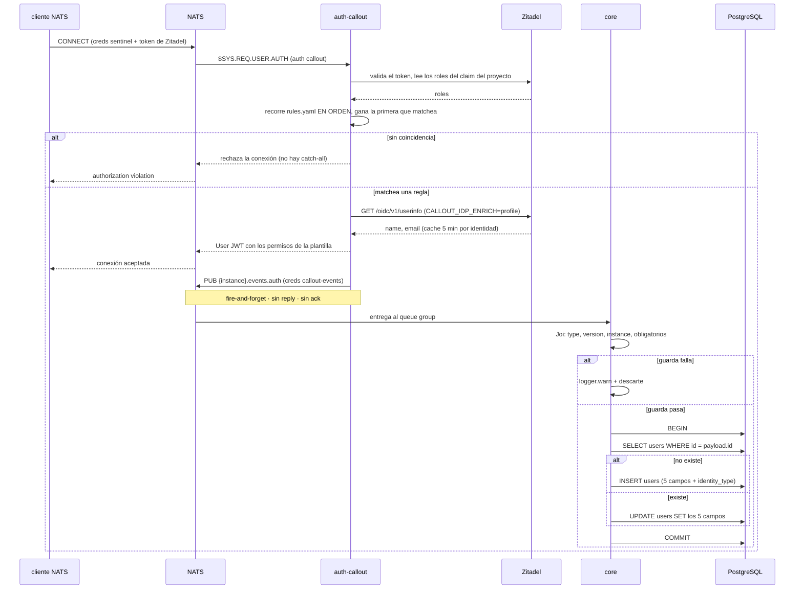

# Sincronización de Identidades desde el Evento de Autenticación

**Tipo:** Evento
**Status:** Draft
**Creado:** 2026-08-24
**Última actualización:** 2026-08-25
**Stories:** S-016, S-018, S-023, S-029, S-034

> ## REQ-007 — el flujo gana un SEGUNDO DISPARADOR
>
> Hasta hoy la fila de `users` la creaba **solo** el evento `{instance}.events.auth`. Desde S-029
> también la crea o actualiza **el comando publicado por la api**, con la identidad de quien actúa.
>
> **La sección *"Lo que este flujo NO hace"* queda DEROGADA.** Decía: *"no da de alta al usuario
> que solo usa `web` u `opus-web`: quien nunca conecta al bus sigue recibiendo 401
> `user_not_found`"*. **Ese 401 dejó de existir en las 61 rutas** (S-034), y la fila la crea el
> primer comando.
>
> **Los dos caminos escriben la misma fila y comparten el mismo handler.** Difieren en **una sola
> cosa, parametrizada**: qué hacer ante un campo de perfil faltante.
>
> | | Evento `{instance}.events.auth` | Comando con sobre |
> |---|---|---|
> | Disparador | La identidad conecta al bus | La persona ejecuta cualquier comando desde la api |
> | Campos | Los cinco, **reemplazo total sin `pickPresent`** | Los mismos cinco |
> | Sin `email` | **Descarta** el evento sin crear fila parcial | **No rechaza el comando**: `warn`, y `name`/`username` caen a `email` o al `sub` si hay que crear la fila |
> | `id` y `roles` faltantes | Descarta | **`invalid_fields`**: son la entrada de la autorización |
> | Transacción | Propia | **Propia, y sobrevive al rollback del comando** |
>
> **Un comando rechazado igual espeja.** Es deliberado: la identidad de quien lo intentó sigue
> siendo cierta, y es lo que hace que una fila con `roles: []` quede corregida. **Un caller no
> autorizado NO llega a escribir**: sin sobre no hay espejo, y con sobre el caller es el publicador
> de confianza.
>
> **Consecuencia de disponibilidad:** el espejo **deja de depender de un único evento no durable**.
> Si el evento se pierde, el propio comando repone la fila.


## Descripción

Ciclo completo del evento que el `auth-callout` publica **cada vez que una identidad se autentica
para conectarse al bus**, y de la escritura que `core` hace en `users` al consumirlo. Es el mecanismo
por el que toda identidad que conecta al bus —persona o service user— queda dada de alta y
actualizada **sin intervención manual**.

**Merece documento propio por tres razones que no se pueden reconstruir leyendo el código:**

1. Es el **primer flujo del producto que no es request/reply**, y su subject está **fuera de la
   gramática** que fijó S-011.
2. Es la **primera escritura en la base que no pasa por un comando**.
3. Su entrega **no es durable**, y **la causa está en la ausencia de una variable en el compose**, no
   en el código de `core`.

## Servicios Involucrados

| Servicio | Rol | Tipo de Participación |
|---|---|---|
| Zitadel | Autentica la identidad y provee sus roles y su perfil | Procesador (externo) |
| `auth-callout` | Resuelve la regla, mintea los permisos del bus y **publica el evento** | Iniciador / Autorizador |
| NATS | Transporta el evento. **Core NATS, sin JetStream** | Transporte |
| `core` | **Consume** el evento y escribe `users` | Consumidor |
| PostgreSQL | Persiste la identidad espejada | Almacenamiento |

**Quién NO participa:** `api`, `web` y `opus-web`. **El evento no tiene interfaz**: nadie lo dispara
a mano, nadie lo ve fallar y nadie espera su resultado.

## Pasos del Flujo



### Paso 1: La identidad conecta al bus

**Quién:** un cliente NATS — `api`, `core`, el conector externo, el observador, o **una persona**
(desde S-018).

- Conecta con las creds del sentinel **más** `tokenAuthenticator` con su token de Zitadel.
- **Fija `inboxPrefix`** con `inboxPrefix(userId)` de `@jiku/nats-protocol` — el hash de su `sub`.
  Sin eso, la librería genera un `_INBOX.<aleatorio>` que ningún permiso autoriza y **las respuestas
  nunca llegan**: el síntoma es un **TIMEOUT**, no un error de permisos.
- El servidor NATS **deriva la autorización al `auth-callout`**.

### Paso 2: El callout resuelve la regla y mintea los permisos

**Quién:** `auth-callout` (imagen externa; su configuración vive en `deploy/nats/auth-callout/`).

- Valida el token contra Zitadel y resuelve los roles del **claim del proyecto**.
- Recorre `rules.yaml` **en orden** y gana la **primera** regla cuyo `match` coincida con algún rol.
  **Sin coincidencia, rechaza la conexión: no hay catch-all** (ADR-008).
- **Las siete reglas, en su orden de evaluación:**

  | # | `match` | `type` | Plantilla |
  |---|---|---|---|
  | 1 | `internal-app` | `service` | `templates/api.yaml` |
  | 2 | `core` | `service` | `templates/core.yaml` |
  | 3 | `bus-observer` | `service` | `templates/observer.yaml` |
  | 4 | `admin` | `person` | `templates/person.yaml` *(desde S-018)* |
  | 5 | `user` | `person` | `templates/person.yaml` *(desde S-018)* |
  | 6 | `external-user` | `person` | `templates/person.yaml` *(desde S-018)* |

  **Eran siete.** La primera era `external-publisher`, con `templates/external-publisher.yaml`;
  el rol se eliminó del producto porque nunca existió en Zitadel, y un servicio externo lleva
  ahora `internal-app`.

  **Las de persona van últimas a propósito:** si un token llegara con un rol de servicio **y** uno de
  producto, tiene que caer en la de servicio, que es la que tiene el permiso correcto para lo que ese
  usuario hace.

- Enriquece con `userinfo` (`CALLOUT_IDP_ENRICH=profile`), porque **el access token de Zitadel no
  trae los claims `name` ni `email`**. **Cachea 5 min por identidad**, así que una flota que reconecta
  cuesta una llamada por usuario, no por conexión.
- Mintea el User JWT con los permisos de la plantilla y **acepta la conexión**.

### Paso 3: El callout publica el evento

**Quién:** `auth-callout`, con su **segunda conexión** — credencial propia `callout-events.creds`,
que **solo puede publicar ese subject y no puede suscribirse a nada** (`deploy/nats/add-events-user.sh`).

**Subject:** `{instance}.events.auth`

**Está fuera de la gramática del bus, y no es un error:**

```
{instance}.events.auth                          3 segmentos, fire-and-forget, sin reply
{instance}.{user-id}.{svc}.{version}.{method}    5+ segmentos, request/reply
```

**Payload** (nombres verbatim del callout, `snake_case`):

```json
{
  "type": "authenticated",
  "version": 1,
  "id": "281234567890123456",
  "name": "Ana Pérez",
  "username": "ana@grava.digital",
  "email": "ana@grava.digital",
  "roles": ["user"],
  "authenticated_at": "2026-08-23T18:04:11.123Z",
  "expires_at": "2026-08-23T19:04:11Z",
  "instance": "prod",
  "identity_type": "person",
  "matched_role": "user",
  "template": "templates/person.yaml",
  "client_ip": "10.1.2.3",
  "session": "UAWUJEWODGQJGMUGZBJH4Y6XKTVD5V4G5EQZXUJA5QV3ZL2TP2JY3ZNH"
}
```

**Es fire-and-forget.** `CALLOUT_EVENTS_STREAM` está **deliberadamente sin definir**
(`deploy/docker-compose.yml:92-99`), así que el mensaje es **core NATS puro**: no hay stream, no hay
ack, no hay reintento. **Esta ausencia es la causa raíz de que la entrega no sea durable**, y está en
infraestructura, no en el código de `core`.

> **`identity_type` sale del `type` de la regla que matcheó**, no de una heurística — `rules.yaml` lo
> dice: *"No hay heurística que adivine si un token es de una persona o de un servicio: lo declara
> `type`"*. **Antes de S-018 las cuatro reglas eran `type: service`, así que todo evento llegaba con
> `identity_type: "service"`.**

### Paso 4: `core` recibe el evento

**Quién:** `core`, en `src/bus/host.ts` — **suscripción plana**, no un endpoint micro.

- `connection.subscribe('{instance}.events.auth', { queue: 'jiku-events' })`.
- **Con queue group**, porque `bus-consumer.md` lo exige: *"sin queue group, N réplicas escriben N
  veces"*. Acá es una **optimización y no una necesidad de corrección**, porque el upsert es
  idempotente.
- **No es un endpoint micro** porque el protocolo micro es request/reply: cada endpoint **tiene que
  responder**, y `respond()` sobre un mensaje sin `reply` subject es un **no-op silencioso** que además
  ensucia los contadores de `$SRV`.
- El `for await` lleva **try/catch por mensaje**: una excepción que escape **mataría el iterador y
  core dejaría de recibir eventos para siempre**, con un solo error en el log.
- Un cuerpo que **no es JSON** se loguea y se descarta. **No hay a quién responderle** — es la
  excepción explícita a la regla *"todo mensaje recibido se responde"*.

**Permiso requerido:** `templates/core.yaml` › `sub.allow` tiene que incluir el subject **literal**
`{{instance}}.events.auth`. **Sin esa línea `core` arranca, atiende los 20 comandos, loguea que se
suscribió, y no recibe ni un evento** — la violación de permisos aparece en el log del **servidor
NATS**, no como un fallo de `subscribe()`.

### Paso 5: El despachador valida y abre la transacción

**Quién:** `core`, en `src/events/dispatcher.ts` — **su propio despachador**, no una rama del de
comandos.

**Las guardas, en orden, con Joi `.unknown(true)`:**

| Guarda | Condición | Si falla |
|---|---|---|
| `type` | `=== 'authenticated'` | descarta + `warn` |
| `version` | `=== 1` | descarta + `warn` |
| `instance` | `=== INSTANCE` del consumidor | descarta + `warn` **con los dos valores** |
| obligatorios | `id`, `name`, `username` presentes, y `email` **solo si `identity_type` no es `service`** | descarta **sin crear fila parcial** |

- **`email` es obligatorio para una PERSONA y opcional para un SERVICE USER**, y la condición es
  la guarda entera. Un machine user de Zitadel **no tiene dirección de correo**: `userinfo` no
  devuelve el claim ni con `CALLOUT_IDP_ENRICH=profile`, así que el callout **omite la clave**.
  Mientras `email` fue obligatorio para todos, **todo evento de servicio se descartaba** con
  `"email" is required` y ninguna identidad de servicio llegaba a tener fila — con lo que las dos
  compuertas del bus la rechazaban. Las **tres formas de decir "no hay"** —ausente, `null` y
  cadena vacía— se normalizan a `null`. Para una persona las tres siguen siendo descarte, porque
  ahí el faltante significa que el emisor está mal configurado y ese diagnóstico hay que
  conservarlo. La condición se apoya en `identity_type`, cuyo default es `person`: un evento sin
  ese campo cae en la rama obligatoria, que es fallar del lado seguro.
- **`.unknown(true)` es deliberado:** el schema del callout vive en otro repo y puede crecer. **Un
  campo nuevo no puede tirar el consumidor.**
- **Recién después de las guardas** abre `sequelize.transaction()` — mismo criterio con que la
  validación de un comando corre antes de la transacción.
- **El despachador nunca lanza.**

### Paso 6: El handler espeja la identidad

**Quién:** `core`, en `src/events/auth/user-sync.ts`.

- `User.findByPk(payload.id, { transaction })`
- **No existe** → `User.create({ id, name, username, email, roles, identityType }, { transaction })`
- **Existe** → `user.update({ name, username, email, roles, identityType }, { transaction })`

**Sobreescribe los cinco campos siempre, sin `pickPresent`.** El evento trae la identidad **completa**
y Zitadel es la verdad: **no es una edición parcial**, y esa es la diferencia semántica con los 20
comandos.

**El mapeo de campos, con los tres nombres que conviven:**

| Payload (`snake_case`) | Modelo (`camelCase`) | Columna (`snake_case`) | Tipo en la base |
|---|---|---|---|
| `id` | `id` | `id` | `VARCHAR(100)` PK — es el `sub` de Zitadel |
| `name` | `name` | `name` | `VARCHAR` NOT NULL |
| `username` | `username` | `username` | `VARCHAR` NOT NULL |
| `email` | `email` | `email` | `VARCHAR` **NULL** — vacío para una identidad de servicio |
| `roles` | `roles` | `roles` | `JSONB` NOT NULL DEFAULT `'[]'` |
| `identity_type` | `identityType` | `identity_type` | ENUM `identity_type` NOT NULL DEFAULT `'person'` |

> **Los tres nombres conviven y ninguno se "normaliza".** El payload es `snake_case`, la base también,
> y el modelo es `camelCase` por `underscored: true`.

- **`sequelize.upsert()` no se usa**: `findByPk` + `create`/`update` deja el log distinguiendo **alta
  de actualización**, que es el dato que se quiere al diagnosticar por qué una identidad no tiene los
  roles que debería.
- **Cuidado con `JSONB`:** un `update` de un campo JSONB **reemplaza el valor entero**. Es exactamente
  la semántica buscada, pero es la trampa clásica de JSONB con ORM.

### Paso 7: El despachador confirma

- `'applied'` → `commit`.
- `'discarded'` o excepción → `rollback` + `warn` / `error`.

**La transacción es del despachador y el handler no tiene acceso a `commit` ni `rollback`** — la misma
garantía de ADR-003, con un `outcome` en vez de un `reply.status`.

**El log no imprime el payload.** Solo el `id` de la identidad y el resultado
(`created` / `updated` / `discarded:<razón>`): el payload trae `email`, `client_ip` y el id de sesión,
y la convención `logging` prohíbe datos de negocio fuera de `LOG_COMMANDS`.

## Manejo de Errores

| Situación | Comportamiento | Síntoma observable |
|---|---|---|
| Rol sin regla en `rules.yaml` | **La conexión se rechaza.** No se emite ningún evento | `authorization violation` en el cliente |
| Cuerpo no-JSON | `warn` + descarte. **No hay reply que mandar** | línea de `warn` en `core` |
| `type` ≠ `authenticated` o `version` ≠ `1` | descarta sin escribir | `warn` en `core` |
| `instance` ≠ la del consumidor | descarta sin escribir, **con los dos valores en el log** | `warn` con los dos valores |
| Falta `id`, `name` o `username` | descarta **sin crear fila parcial** | `warn` en `core` |
| Falta `email` **y es una persona** | descarta **sin crear fila parcial** | `warn` en `core` nombrando `email` |
| Falta `email` **y es un service user** | **No es un descarte.** Fila creada/actualizada con `email` en `NULL` | fila con `email = NULL` |
| `roles` ausente o `[]` | **No es un descarte.** Fila creada/actualizada con `roles: []` | fila con `roles = '[]'` |
| Campo desconocido en el payload | se ignora, el evento se procesa | ninguno |
| Excepción en `create` / `update` | `rollback` + `error`. **Evento perdido** | `error` en `core` |
| `templates/core.yaml` sin el permiso | **`core` no recibe nada.** Arranca y atiende comandos | violación de permisos en el log **del servidor NATS** |
| `NATS_INSTANCE` desalineado | ídem, o **todos los eventos descartados** por la guarda | `warn` con los dos valores, o **nada** |
| `CALLOUT_IDP_ENRICH` ausente | `name` y `email` vacíos → **los eventos de PERSONA se descartan** (los de servicio no: sin `name` sí, pero `email` vacío ya no los corta) | `warn` de campos obligatorios, en cada evento |
| **`core` caído o reiniciando** | **El evento se pierde. Sin reintento, sin reconciliación, sin registro** | **ninguno.** La fila queda desactualizada |

> **Tres causas, un síntoma.** *"No llega ni un evento"* puede ser el permiso de la plantilla, el
> `NATS_INSTANCE` desalineado, o el emisor caído. **Las separan dos líneas de log:** la de
> `[events] suscripto a <subject>` al arrancar, y el `warn` de la guarda de `instance` con los dos
> valores.

## Resultado

**Estado final:** la fila de `users` refleja la identidad **tal como Zitadel la conoce en el momento
de esa autenticación**.

| Identidad | `roles` | `identity_type` | `email` |
|---|---|---|---|
| Persona con rol `user` | `["user"]` | `person` | su dirección, **nunca `NULL`** |
| Persona con rol `admin` | `["admin"]` | `person` | su dirección, **nunca `NULL`** |
| Conector externo | `["internal-app"]` | `service` | **`NULL`** (salvo que Zitadel declare una) |
| Service user de la `api` | `["internal-app"]` | `service` | **`NULL`** |
| Service user de `core` | `["core"]` | `service` | **`NULL`** |

**Y lo que ese estado habilita:**

- **La compuerta de autorización de `core`** lee `users.roles` para autorizar a los callers del bus
  que no son la api (S-017).
- **El canal del publicador externo de REQ-001 funciona.** `files.uploaded_by` tiene **FK real a
  `users.id`** con `onDelete: RESTRICT`, y **sin fila el INSERT violaba la FK** — traducido a un
  `internal_error` genérico que **no nombraba la causa**. Lo mismo con `requirements.created_by` y
  `objectives.created_by`.
- **La interfaz puede marcar al autor no-humano** (S-019), porque `identity_type` distingue una
  persona de un servicio.

**Lo que este flujo NO hace:**

- **No crea Persona ni PermisoDeProyecto.** Una identidad `person` recién creada sigue sin poder
  cargar horas y sin ver proyectos: eso es **FG-1**.
- **No da de alta al usuario que solo usa `web` u `opus-web`.** Quien nunca conecta al bus sigue
  recibiendo **401 `user_not_found`**, y `POST /api/auth/present` **sigue siendo un no-op**.
- **No persiste `authenticated_at`, `expires_at`, `client_ip`, `session`, `matched_role` ni
  `template`.** El evento **sincroniza identidad, no audita accesos** — y `client_ip` y `session`
  quedan afuera también por minimización de datos personales.
- **No invalida conexiones establecidas.** Roles revocados en Zitadel sobreviven en la fila hasta la
  próxima autenticación.

## Notas

- **La entrega no es durable, y es una decisión aceptada.** Cambiarla no es agregar una línea: exige
  **JetStream habilitado** en el server y en la cuenta, el stream creado a mano, y **ampliar la
  credencial `callout-events`**, que hoy **no puede suscribirse a nada**. Es **FG-3**.
- **La consistencia es eventual, y asimétrica respecto del plano HTTP.** Revocar un rol en Zitadel
  tiene efecto **inmediato** en la autorización HTTP (sale del claim, en cada request) y **diferido**
  —potencialmente indefinido— en la del bus (sale de la base, y se corrige al reautenticar).
- **`users` deja de ser la tabla que nadie escribe.** `core` la escribe, **por un evento y no por un
  comando**, y es la primera escritura del producto que no pasa por el despachador de comandos.
- **El emisor ya estaba desplegado antes de que existiera el consumidor.** `CALLOUT_EVENTS_SUBJECT`,
  `CALLOUT_EVENTS_CREDS` y `add-events-user.sh` están en el repo desde antes: el evento **se publicaba
  y nadie lo escuchaba**. Por eso correr `add-events-user.sh` pasó de **opcional** a **precondición de
  despliegue**.
- **La herramienta de diagnóstico ya existe.** `deploy/bus-inspect.sh` con el rol `bus-observer`, que
  **ya está autorizado a `{{instance}}.events.>`** (`templates/observer.yaml`), permite ver los eventos
  en vivo. Es la única forma de verificar el caso de `core` caído, que **no es testeable en una
  suite**: es una propiedad de infraestructura.
- **Origen:** REQ-005 · stories S-016 (el consumidor y el permiso) y S-018 (la rama de persona).

### Consecuencia nueva: la lectura por el bus queda acoplada a este flujo (REQ-006 · S-023)

Desde REQ-006 este flujo **no solo condiciona la escritura**: condiciona también **toda la superficie
de lectura por el bus**. El servicio de consultas resuelve la **clase del caller** —conector, interno
o externo— leyendo `users.roles`, y **sin fila no consulta**: la respuesta es `unknown_caller`.

- **La entrega del evento sigue sin ser durable** (NATS core, sin JetStream). Un evento perdido deja
  al caller sin fila, y **todas** sus consultas fallan hasta su próxima autenticación contra el bus —
  con un token de ~1 h renovado en caliente, potencialmente en **días**.
- **Incluye al service user de la api**, sin excepción por configuración: la exención del
  `CORE_TRUSTED_PUBLISHER_ID` vale para la compuerta de autorización, **no** para la resolución de la
  clase.
- **`roles` deja de ser un dato informativo del espejo de identidad y pasa a ser el control de acceso
  efectivo** de toda la lectura por el bus. La regla de precedencia con varios roles es "gana el más
  restrictivo": `external-user` → `user` → `internal-app`.
- El recorrido completo está en `docs/flows/consulta-por-el-bus.md`, Paso 3.
