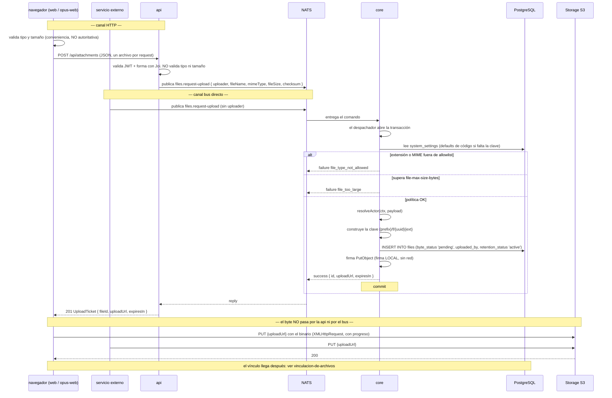

# Subida de Archivos

**Tipo:** Feature
**Status:** Active
**Creado:** 2026-08-19
**Última actualización:** 2026-08-19
**Stories:** S-002, S-004, S-006, S-007

> **Estado de implementación (2026-08-19).** **El flujo está completo y pasa a `Active`.** El lado
> de `core` (S-002), el de la **`api` (S-004)**, el de **`web` (S-006)** y el de **`opus-web`
> (S-007)** están implementados.
>
> `web` pide el ticket por Server Action, hace el `PUT` **directo a la URL prefirmada de S3 con
> `XMLHttpRequest`** y progreso real, de a un archivo por vez, y su route handler
> `POST /api/attachments` **quedó eliminado** junto con `bodySizeLimit`.
>
> `opus-web` hace lo mismo desde el navegador: `attachmentsApi.requestUploadTicket` pide el ticket
> por el proxy catch-all —**sin route handler nuevo**— y `putFileToStorage` hace el `PUT` con
> `XMLHttpRequest`, `withCredentials` en `false` y progreso real en el bloque
> `progreso-subida-adjunto` de los dos formularios. **Los dos formularios mandan `fileIds`** y el
> `entityType: 'requirement_draft'` que usaba el alta de requisito **desapareció**.
>
> **Precondición de prueba vigente:** sin CORS en el bucket (S-008) el `PUT` del navegador falla con
> `status: 0`, un error opaco que no señala la causa.

## Descripción

Flujo por el cual un archivo entra al sistema. Se dispara cuando el usuario (o un servicio externo
conectado al bus) selecciona un archivo para adjuntar.

El rediseño de REQ-001 parte la subida en **tres planos independientes**:

1. **Permiso** — se pide un `UploadTicket`: `core` valida la política, crea la fila de `files` con
   `byte_status: 'pending'` y firma una URL prefirmada de `PutObject`.
2. **Byte** — el navegador (o el servicio externo) hace el **`PUT` directo a S3**. No pasa por la
   `api` ni por el bus.
3. **Vínculo** — al guardar la entidad se mandan los `fileIds`. Ese plano es el flujo
   [`vinculacion-de-archivos`](vinculacion-de-archivos.md).

Un archivo **sin vínculo es un estado válido** (RF-1, CA-7): los planos 1 y 2 se completan solos.

Este flujo, junto con [`lectura-de-archivos`](lectura-de-archivos.md) y
[`vinculacion-de-archivos`](vinculacion-de-archivos.md), **reemplaza por completo** a
[`adjuntos`](adjuntos.md).

## Servicios Involucrados

| Servicio | Rol | Tipo de Participación |
|---|---|---|
| `web` / `opus-web` | Valida por conveniencia, pide el ticket y hace el `PUT` con progreso | Iniciador |
| Servicio externo | Publica `files.request-upload` **directo al bus** y hace el `PUT`. Sin `api` de por medio | Iniciador (canal bus) |
| `api` | **Solo en el canal HTTP.** Valida el JWT y la forma con Joi, publica el comando y traduce el reply. **No toca la base ni el byte** | Traductor |
| NATS | Transporta el comando request/reply | Transporte |
| `core` | Valida la política, construye la clave, escribe `files` y **firma** la URL de PUT | Procesador |
| Storage S3-compatible | Recibe el binario **directo del cliente** | Almacenamiento externo |
| PostgreSQL `jiku` | Persiste la fila de `files` y provee `system_settings` | Almacenamiento |

## Pasos del Flujo



### Paso 1: Validación en el cliente (conveniencia)

**Origen:** navegador
**Tipo:** Interno

Los dos frontends validan tipo y tamaño **antes** de pedir el ticket, para fallar rápido.

> **Dejó de ser autoritativa.** La fuente de verdad es `core`, que lee la política de
> `system_settings` **en caliente**. Por eso el microcopy **no puede** nombrar los límites: los
> valores cambian por SQL sin redespliegue.

**Ref:** stories S-006 (`web`) y S-007 (`opus-web`)

---

### Paso 2: El cliente pide permiso de subida

**Origen:** navegador → `api`
**Destino:** `api`
**Tipo:** REST

**Request:**
- **Método:** POST
- **Endpoint:** `/api/attachments` (o `/api/opus/attachments`)
- **Content-Type:** `application/json` — **ya no es `multipart/form-data`**
- **Body:**
  ```json
  {
    "fileName": "string — nombre original, maxLength 255",
    "mimeType": "string — maxLength 100",
    "fileSize": "integer — minimum 1",
    "checksum": "string|null — sha256 hexadecimal declarado por el cliente"
  }
  ```

**Un request por archivo** (D-07). Tres archivos son tres requests independientes: el fallo de uno
no arrastra a los otros.

Desaparecen del contrato `files` (el binario), `entityType`, `entityId` y `description`:
**subir no menciona la entidad** (D-12).

**Autorización:** solo el JWT. `canUserAccessEntity` **deja de aplicar** porque no hay entidad; el
control por entidad se corre al momento de vincular (CA-26).

**Ref:** `docs/apis/api.yaml` — `POST /api/attachments`, `POST /api/opus/attachments`

---

### Paso 3: La api publica el comando

**Origen:** `api`
**Destino:** `core`
**Tipo:** Evento (NATS request/reply)

La `api` valida el JWT y la forma con Joi. **No valida tipo ni tamaño** —eso es de `core` ahora
(D-08)— y **no toca la base**.

**Subject:** `{instance}.{api-service-user}.jiku-commands.v1.files.request-upload`

**Payload (`FilesRequestUploadPayload`):**
```json
{
  "uploader": "IdentityUserId — el zitadel sub del usuario final autenticado por JWT",
  "fileName": "string",
  "mimeType": "string",
  "fileSize": 4194304,
  "checksum": "string|null — NADIE lo verifica (D-25)"
}
```

Requeridos: `uploader`, `fileName`, `mimeType`, `fileSize`.

> **`uploader` es opcional a propósito**: es la palanca de D-26. Un publicador externo **lo omite**,
> y si lo mandara **se ignora** — `core` resuelve el actor del `caller` del subject. Ver paso 5.

**Timeout:** 5000 ms ([ADR-002](../adrs/ADR-002-comandos-nats-sin-jetstream.md)).

**Ref:** `docs/apis/core.yaml` — canal `files.request-upload`, `FilesRequestUploadPayload`

---

### Paso 4: Canal alternativo — el servicio externo publica directo

**Origen:** servicio externo
**Destino:** `core`
**Tipo:** Evento (NATS request/reply)

**Subject:** `{instance}.{externo-service-user}.jiku-commands.v1.files.request-upload`

**Payload:** `{ fileName, mimeType, fileSize }`. **No manda `uploader`.**

**Es el mismo comando, sin ruta alternativa** (RF-11, CA-4). El servicio externo no atraviesa la
`api` en ningún momento: ni para pedir el ticket ni para subir el byte.

> El servicio externo **lleva el rol `internal-app`, el mismo que la api**, y comparte su
> plantilla (`deploy/nats/auth-callout/templates/api.yaml`): **dos prefijos con `>`**, el de
> comandos y el de consultas.
>
> **Tenía una plantilla propia y un rol propio —`external-publisher`— que enumeraba 9 subjects
> y ninguna consulta. Los dos se eliminaron**: el rol nunca existió en Zitadel, así que el canal
> jamás se usó. El servicio externo **sigue funcionando igual en este flujo**, pero su permiso es
> ahora mucho más ancho: todos los comandos, todas las consultas, y sin recorte de filas al leer.
> Acotarlo otra vez es crear un rol nuevo.

---

### Paso 5: Core valida la política, escribe `files` y firma

**Origen:** `core` (`src/commands/files/files-request-upload.ts`)
**Destino:** PostgreSQL + S3 (firma)
**Tipo:** Interno

El despachador abre la transacción ([ADR-003](../adrs/ADR-003-transaccion-del-despachador.md)).

**1. Lee la política de `system_settings`** — `file-max-size-bytes`, `file-allowed-extensions`,
`file-allowed-mime-types`, `upload-url-ttl-seconds`. **Cada clave ausente cae a su default de
código** (RF-16, CA-21): el seed es conveniencia, el default es la garantía.

**2. Valida:**

| Regla | Código de error |
|---|---|
| Tamaño sobre `file-max-size-bytes` | `file_too_large` |
| Extensión fuera de `file-allowed-extensions` | `file_type_not_allowed` |
| MIME fuera de `file-allowed-mime-types` | `file_type_not_allowed` |

**Las dos listas, no una** (RF-17, D-18): un `.exe` renombrado a `.pdf` se rechaza porque el MIME
declarado no coincide. Lo que se valida es **lo declarado**, y eso nunca fue una garantía sobre el
byte (D-25).

**3. Resuelve el actor:**
```
resolveActor(ctx, payload):
  si ctx.caller == CORE_TRUSTED_PUBLISHER_ID   -> el actor es payload.uploader
  si no                                        -> el actor es ctx.caller
```

Es **la misma función** que usan los seis comandos de dominio al vincular. Si subir y vincular
resolvieran la identidad distinto, nadie podría vincular lo que subió.

**4. Construye la clave** — **quien sube no la elige** (D-08):
```
{STORAGE_S3_KEY_PREFIX}/f/{uuid}{ext}
```
Sin `entityType` ni `entityId` (D-02). El namespace `/f/` separa lo nuevo del legado.

**Operación de BD:**
- **Tabla:** `files`
- **Operación:** INSERT
- **Campos:** `file_name`, `file_size`, `mime_type`, `storage_key`, `storage_bucket`,
  `storage_region`, `checksum`, `byte_status` (`'pending'`), `uploaded_by` (el actor resuelto),
  `retention_status` (`'active'`)

**5. Firma `PutObject`** con `expiresIn` = `upload-url-ttl-seconds`.

> **Es una llamada de firma local, sin red.** El SDK firma con las credenciales sin contactar el
> bucket, así que no arriesga el timeout de 5 s de ADR-002. Es la misma razón por la que **no se
> verifica que el byte llegue** con un `headObject` (D-13).

**Reply (`ReplyWithData`):**
```json
{
  "status": "success",
  "data": {
    "id": 1234,
    "uploadUrl": "https://bucket.example/grava-gestion/f/9c1e.../abcd.pdf?X-Amz-...",
    "expiresIn": 300
  }
}
```
→ **commit**

> **Excepción declarada a `conventions/commands.md`** (*"las creaciones devuelven solo el `id`"*).
> La URL prefirmada la genera `core`, es de un solo objeto y de vida corta, y la `api` no puede
> reconstruirla releyendo la base sin duplicar la política de la clave y montar su propio firmador.

**Ref:** `docs/apis/core.yaml` · `docs/db-schemas/jiku.md` — `files`, `system_settings`

---

### Paso 6: La api traduce el reply

**Origen:** `api`
**Destino:** navegador
**Tipo:** REST (response del Paso 2)

**No relee la base**: la URL prefirmada no está en la base y no es reconstruible desde afuera de
`core`.

**Response (éxito):**
- **Status:** 201
- **Body (`UploadTicket`):**
  ```json
  {
    "fileId": "integer — id de `files`. Es lo que viaja en `fileIds` al guardar la entidad",
    "uploadUrl": "string — URL prefirmada de PUT, de un solo objeto y TTL corto (D-10)",
    "expiresIn": "integer — segundos de validez, de `system_settings`"
  }
  ```

> **El campo se llama `id` en el bus y `fileId` en HTTP.** No es un descuido: en el bus `id` es la
> convención de todas las creaciones; en HTTP `fileId` dice de qué id se trata, y eso importa porque
> el contrato HTTP de adjuntos maneja **dos** espacios de ids (el del vínculo y el del archivo).

---

### Paso 7: El byte va directo a S3

**Origen:** navegador (o servicio externo)
**Destino:** Storage S3
**Tipo:** REST (S3 API)

**Request:**
- **Método:** PUT
- **Endpoint:** `{uploadUrl}` — la prefirmada del ticket
- **Body:** el binario

Se hace con `XMLHttpRequest` para tener **barra de progreso** (RF-8): `fetch` no la da.

**No pasa por la `api` ni por el bus** (RF-5, D-09, CA-3). La `api` deja de bufferizar 10 MB × 10
archivos en memoria, que con `multer.memoryStorage()` era su pico.

**Precondiciones de instalación** (story S-008):
- **CORS en el bucket** acotado al origen de los frontends (D-21)
- Una **URL del bucket alcanzable desde el navegador** (D-22)
- La `api` **pierde las credenciales de S3**

> **El progreso que se muestra es el del `PUT`, no confirmación de que el byte quedó íntegro.** El
> sistema no verifica el byte (D-13): `byte_status` sigue en `'pending'` hasta que el vínculo lo
> pase a `'uploaded'`. Por eso la UI bloquea el envío mientras la subida está en curso.

---

### Paso 8: Vista previa antes de guardar (opcional)

**Origen:** navegador
**Tipo:** REST

Entre el `PUT` y el guardado de la entidad, el usuario **puede previsualizar lo que subió**. Todavía
no hay vínculo, así que no hay id de `attachments`: la lectura entra **por `fileId`**.

Es el caso que RF-1 y CA-7 declaran válido y que los dos frontends ya ejercen hoy. Ver
[`lectura-de-archivos`](lectura-de-archivos.md) — *camino de archivo sin vínculo*.

---

### Paso 9: El vínculo (fuera de este flujo)

Al guardar el requisito, la tarea o el comentario, el cliente manda `fileIds: [1234, 1235, 1236]`.
Ahí es donde `core` valida titularidad, hace `UPDATE files SET byte_status = 'uploaded'` y crea las
filas de `attachments`.

Ver [`vinculacion-de-archivos`](vinculacion-de-archivos.md).

## Manejo de Errores

| Paso | Error | Código | Response | Comportamiento |
|---|---|---|---|---|
| 2 | Sin JWT válido | 401 | — | La `api` rechaza sin publicar |
| 2 | Forma del body inválida | 400 | `{ code: invalid_fields }` | Joi corta antes de publicar |
| 5 | Extensión fuera de la allowlist | 400 | `{ code: file_type_not_allowed }` | Rollback del comando. No queda fila de `files` (CA-23) |
| 5 | MIME fuera de la allowlist, **aunque la extensión esté** | 400 | `{ code: file_type_not_allowed }` | Idem (CA-24) |
| 5 | Supera `file-max-size-bytes` | 400 | `{ code: file_too_large }` | Idem (CA-25) |
| 3 | **Nadie escuchando** el subject (core no desplegado) | **503** | `{ code: service_unavailable }` | **La operación no ocurrió.** El server contesta *no responders* en milisegundos. **Reintentar es seguro** |
| 3 | **La respuesta no llegó a tiempo** (core lento) | **504** | `{ code: gateway_timeout }` | **PUDO haber ocurrido.** Sin acuse ni idempotencia ([ADR-002](../adrs/ADR-002-comandos-nats-sin-jetstream.md)): **reintentar a ciegas puede duplicar** |
| 7 | `uploadUrl` vencida | — | 403 de S3 | *No hay reply: es S3.* El front **pide un ticket nuevo** (CA-16) |
| 7 | **El `PUT` falla en silencio** | — | — | **No hay compensación.** La fila de `files` queda con `byte_status: 'pending'`; el error se descubre **al descargar** (`file_not_available`), no al subir |
| 7 | CORS no configurado en el bucket | — | error de red del navegador | **Síntoma opaco que no señala la causa.** Es la razón por la que S-008 es precondición dura de prueba |

> **El rollback de S3 desapareció y no se reemplaza.** Hoy la `api` borra del bucket lo ya subido si
> un lote falla a mitad. Con el byte directo a S3 **ese rollback ya no existe ni puede existir**:
> quien escribe el objeto es el navegador. Está en Riesgos Asumidos del REQ.

## Resultado

**Éxito:** El archivo está en el bucket bajo su `storage_key` y existe su fila en `files`. El
usuario ve el preview de lo que subió, todavía sin vínculo.

**Estado final:**
- Storage: el binario bajo `{STORAGE_S3_KEY_PREFIX}/f/{uuid}{ext}`
- `files`: fila con `byte_status: 'pending'`, `retention_status: 'active'` y `uploaded_by` = el actor
  resuelto por `resolveActor`
- `attachments`: **ninguna fila todavía** — es un estado válido (RF-1, CA-7)
- `byte_status` pasa a `'uploaded'` recién al vincular

## Notas

- **Los tres planos son independientes por diseño.** Un archivo puede quedarse para siempre en el
  plano 1 + 2, sin vínculo. Es lo que RF-1 y CA-7 declaran normal, y su costo es **acumulación de
  basura, no acceso indebido**. El barrido está fuera de alcance, así que ese costo **no tiene
  techo** (Riesgos Asumidos).
- **El índice `(uploaded_by, byte_status)` de `files` es la mitigación parcial**: sin barrido, los
  abandonados quedan al menos **identificables por consulta**.
- **Los pasos 2 a 7 son idempotentes-en-daño respecto de CA-28.** Un segundo `PUT` con la misma URL
  sobreescribe el mismo objeto con el mismo contenido y no duplica ninguna fila: el `INSERT INTO
  files` ya ocurrió en el paso 5 y el `PUT` no escribe la base. La clave lleva `uuid`, así que dos
  pedidos de subida del mismo archivo son dos claves distintas y dos `File` — **duplicación de
  contenido, no corrupción**. Deduplicar está fuera de alcance.
- **`checksum` lo declara el cliente y nadie lo verifica** (D-25). Un cliente puede declarar
  `application/pdf` y subir otra cosa: la defensa vigente sigue siendo **la del servido**
  (`nosniff` + CSP de sandbox en el endpoint público), no la de la subida.
- **`expiresIn` es un parámetro de seguridad.** El default de 300 s para subida es un orden de
  magnitud sobre el de lectura actual (60 s), justificado porque un `PUT` de 10 MB por una conexión
  lenta puede tardar. Que sea configurable (RF-15) significa que **una instalación puede empeorarlo
  bastante**: el default es el que importa.
- **`resolveActor` mal configurado rompe la web en silencio.** Si `CORE_TRUSTED_PUBLISHER_ID` no
  coincide con el `sub` real del service user de la `api`, todo comando de la `api` cae en la rama
  externa, `uploaded_by` pasa a ser el service user y **ningún usuario puede vincular lo que subió**
  — con `file_not_owned` como único síntoma, que parece un problema de permisos y no de
  configuración. **Mitigación:** el arranque de `core` falla sin la variable, y la rama externa
  loguea en `warn`.
- **La URL prefirmada llega al navegador, y es la excepción deliberada a
  [ADR-009](../adrs/ADR-009-token-confinado-al-servidor.md)** (D-23). Va **por respuesta de la
  `api`**, no por `NEXT_PUBLIC_*`: el access token sigue confinado al servidor y la topología del
  bucket no entra al bundle.
- **Este flujo cierra la excepción 2 de
  [ADR-001](../adrs/ADR-001-separacion-lectura-escritura.md):** la `api` deja de escribir la base al
  subir adjuntos. Y extiende el alcance del ADR al storage — la `api` sin credenciales de S3 hace que
  la garantía sea **estructural, no de disciplina**.
