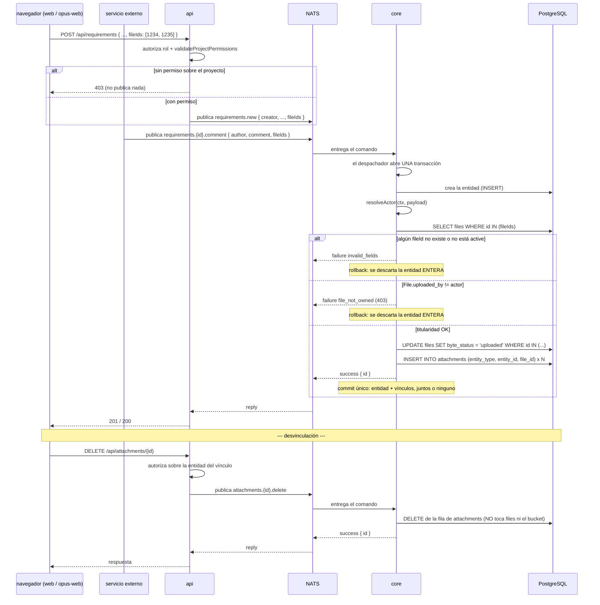

# Vinculación de Archivos a Entidades

**Tipo:** Feature
**Status:** Draft
**Creado:** 2026-08-19
**Última actualización:** 2026-08-19
**Stories:** S-003, S-004

> **Estado de implementación (al cerrar S-003):** los pasos **4 y 5** —`resolveActor`, la validación
> de titularidad y el commit conjunto de entidad + vínculos— están **implementados en `core`** y
> cubiertos por tests, para los seis comandos de dominio. El **paso 6 (desvinculación vía
> `attachments.{id}.delete`) todavía NO existe**: es de **S-004**, igual que el mapa de
> `file_not_owned` → 403 en la api.
>
> Por eso el flujo sigue en **`Draft`** y no pasa a `Active`: marcarlo Active con un paso sin
> implementar diría que el recorrido completo funciona, y no es así todavía.

## Descripción

El **plano del vínculo**: qué pasa cuando un archivo ya subido se ata a un requisito, una tarea o un
comentario. Se dispara al guardar o editar cualquiera de esas entidades con `fileIds`.

Es **transversal a los seis comandos de dominio** que reciben archivos, y es el flujo donde vive la
regla de titularidad de RF-12: **solo el actor que subió el archivo puede vincularlo**, sin
excepción por rol.

Cubre también la **desvinculación** (`attachments.{id}.delete`), que cierra el ciclo de vida del
vínculo: borrar el vínculo **no borra el archivo ni el objeto del bucket** (D-04, CA-9).

Es el plano 3 de [`subida-de-archivos`](subida-de-archivos.md), y junto con
[`lectura-de-archivos`](lectura-de-archivos.md) reemplaza a [`adjuntos`](adjuntos.md).

## Servicios Involucrados

| Servicio | Rol | Tipo de Participación |
|---|---|---|
| `web` / `opus-web` | Manda `fileIds` al guardar la entidad | Iniciador |
| Servicio externo | Publica el comando de dominio **directo al bus**, con `fileIds` | Iniciador (canal bus) |
| `api` | Autoriza por rol y por proyecto, y publica el comando. **No escribe la base** | Procesador |
| NATS | Transporta el comando request/reply | Transporte |
| `core` | Resuelve el actor, valida titularidad, marca el byte y escribe entidad + vínculos en **una** transacción | Procesador |
| PostgreSQL `jiku` | Persiste la entidad, `attachments` y el `UPDATE` de `files` | Almacenamiento |

## Los seis comandos alcanzados

| Comando | Campo | Cambio |
|---|---|---|
| `requirements.new` | `attachmentIds` → **`fileIds`** | `attachmentScope` **ELIMINADO** |
| `requirements.{id}.edit` | `attachmentIds` → **`fileIds`** | Sigue siendo el **conjunto completo**, pero opera sobre `attachments` (crear/borrar el vínculo), no sobre drafts |
| `requirements.{id}.comment` | `attachmentIds` → **`fileIds`** | La mención a los draft desaparece |
| `tasks.new` | **`fileIds` NUEVO** | No declaraba `attachmentIds` (RF-9) |
| `tasks.{id}.edit` | **`fileIds` NUEVO** | Idem |
| `tasks.{id}.comment` | `attachmentIds` → **`fileIds`** | — |

**Esquema `FileIds`** (reemplaza a `AttachmentIds`):

```yaml
FileIds:
  type: array
  maxItems: 10
  items: { type: integer, minimum: 1 }
```

`maxItems: 10` mueve el tope de 10 archivos de `multer` **al contrato del bus** (D-20): deja de ser
un límite de transporte y pasa a ser **regla de dominio**, validable por Joi. Es fija, no
configurable.

## Pasos del Flujo



### Paso 1: El cliente guarda la entidad con `fileIds`

**Origen:** navegador → `api`
**Destino:** `api`
**Tipo:** REST

**Request:**
- **Método:** POST / PUT
- **Endpoint:** `/api/requirements`, `/api/opus/requirements`, `/api/tasks`, los de comentario…
- **Body (fragmento):**
  ```json
  {
    "fileIds": [1234, 1235, 1236]
  }
  ```

**La entidad y sus vínculos en una sola operación.** No hay un endpoint de "vincular": el vínculo es
parte del comando que crea o edita la entidad.

En los comandos de edición (`requirements.{id}.edit`, `tasks.{id}.edit`) `fileIds` es el
**conjunto completo**: lo que no viene deja de estar vinculado.

---

### Paso 2: La api autoriza y publica

**Origen:** `api`
**Destino:** `core`
**Tipo:** Evento (NATS request/reply)

La `api` mantiene sus dos capas de autorización
([ADR-008](../adrs/ADR-008-autorizacion-deny-by-default.md)): rol, y permiso de proyecto sobre la
**entidad** (`validateProjectPermissions` / `canUserAccessEntity`).

**Es acá donde vive el control por entidad que la subida perdió** (CA-26): al desaparecer
`entityType` del contrato de subida, el permiso de proyecto se valida en el momento en que la
entidad sí existe.

**Subject:** `{instance}.{api-service-user}.gestion.v1.requirements.new` (y equivalentes)

**Payload (fragmento):**
```json
{
  "creator": "IdentityUserId",
  "fileIds": [1234, 1235, 1236]
}
```

`attachmentScope` **desaparece** del payload: existía solo para elegir el anclaje del draft, y no hay
draft.

**Timeout:** 5000 ms ([ADR-002](../adrs/ADR-002-comandos-nats-sin-jetstream.md)).

**Ref:** `docs/apis/core.yaml` — `RequirementsNewPayload`, `FileIds`

---

### Paso 3: Canal alternativo — el servicio externo publica directo

**Origen:** servicio externo
**Destino:** `core`
**Tipo:** Evento (NATS request/reply)

**Subject:** `{instance}.{externo-service-user}.gestion.v1.requirements.{id}.comment`

**Payload:** `{ author, comment, fileIds: [1240] }`

**Es el mismo comando, sin ruta alternativa** (RF-11, CA-4). `core` no distingue el canal salvo por
el `caller` del subject, que es exactamente lo que `resolveActor` usa.

---

### Paso 4: Core resuelve el actor

**Origen:** `core`
**Tipo:** Interno

Es la pieza central del flujo, y lo que
[ADR-007](../adrs/ADR-007-identidad-zitadel-auth-callout.md) declaró irrealizable y este rediseño
convierte en requisito.

**El problema, exacto:** `CommandContext.caller` es *"el SERVICIO que publicó, del subject"*. Para la
`api`, el `user-id` del subject es **su service user, el mismo para todas las personas**. Entonces:

- Validar `File.uploaded_by == ctx.caller` **rompe la web**: `uploaded_by` es un usuario de Zitadel y
  `caller` es el service user de la `api`. Nunca coinciden.
- Validar `File.uploaded_by == payload.author` **no cumple RF-14**, que exige verificar contra *"la
  identidad avalada por el bus, no el autor declarado en el cuerpo"*.

**La resolución es por canal**, y `caller` es lo que permite distinguirlos:

```
resolveActor(ctx, payload):
  si ctx.caller == CORE_TRUSTED_PUBLISHER_ID   (el service user de la api, de config)
     -> el actor es payload.author / creator / editor / uploader
        (la api YA autenticó a esa persona contra Zitadel por JWT: es la premisa de D-24,
         que sigue siendo válida PARA la api)
  si no
     -> el actor es ctx.caller
        (un publicador externo no tiene persona detrás: su identidad ES la del subject,
         avalada por el auth-callout y no falsificable. Lo que declare en el cuerpo se IGNORA)
```

**Es la misma función que usa `files.request-upload`** para poblar `File.uploaded_by`. Si subir y
vincular resolvieran la identidad distinto, nadie podría vincular lo que subió.

> **`CORE_TRUSTED_PUBLISHER_ID` es configuración de `core`, no un literal**, y es el `sub` del
> service user de la `api`. **Sin él configurado el arranque debe fallar**: un default vacío haría
> que todo `caller` caiga en la rama externa y la web deje de funcionar en silencio.

---

### Paso 5: Core valida titularidad y escribe, todo en una transacción

**Origen:** `core`
**Destino:** PostgreSQL
**Tipo:** Interno

El despachador abre **una** transacción
([ADR-003](../adrs/ADR-003-transaccion-del-despachador.md)).

`core` crea la entidad y **después** valida los archivos — **validación tardía, segura por ADR-003**,
que es el patrón que `requirements-new.ts` ya usa:

1. Cada `fileId` **existe** y tiene `retention_status: 'active'` → si no, `invalid_fields`
2. `File.uploaded_by == resolveActor(ctx, payload)` → si no, **`file_not_owned`** (RF-12)

**Operaciones de BD:**

```sql
-- el navegador reportó el PUT y se le cree (D-13)
UPDATE files SET byte_status = 'uploaded' WHERE id IN (1234, 1235, 1236);

-- el vínculo, una fila por archivo
INSERT INTO attachments (entity_type, entity_id, file_id)
VALUES ('requirement', 412, 1234);
```

`entity_type` sale de los **5 valores** que quedan del enum: `project`, `requirement`, `objective`,
`requirement_comment`, `objective_comment`. `entity_id` es **NOT NULL** (D-01): no hay draft.

**Reply (éxito):** `{ "status": "success", "data": { "id": 412 } }` → **commit único**

> **La entidad y sus vínculos, juntos o ninguno** (RF-4, CA-5). Si un solo `fileId` falla la
> titularidad, **no queda ni la entidad ni un solo vínculo**. Lo que **sí queda** son los `File`,
> sin vínculo, que es un estado válido (RF-1, CA-7).

**Ref:** `docs/db-schemas/jiku.md` — `files`, `attachments`

---

### Paso 6: Desvinculación — PENDIENTE (S-004)

> **Todavía no implementado.** El comando `attachments.{id}.delete` **no existe** al cerrar S-003:
> lo crea **S-004**, que es la story a la que la tabla "Servicios Afectados" se lo asigna. Lo que
> sigue es el diseño acordado, no una descripción de lo que ya corre.
>
> Hasta que S-004 lo implemente, la única forma de desvincular es mandando el conjunto completo
> por `requirements.{id}.edit` o `tasks.{id}.edit` sin el `fileId` que se quiere sacar — eso sí
> funciona hoy, y borra la fila de `attachments` sin tocar el `File`.

**Origen:** navegador → `api` → `core`
**Tipo:** REST + Evento

1. **[navegador]** `DELETE /api/attachments/{id}` — el id es el del **vínculo**
2. **[`api`]** Autoriza sobre la **entidad** del vínculo. Si falla, **403 sin publicar**
3. **[`api`]** Publica `{instance}.{api-service-user}.gestion.v1.attachments.{id}.delete`
   - **Parámetro `{id}`:** el id de **`attachments`** — el vínculo, no el archivo. El nombre es
     deliberado: `attachments.{id}.delete` es más honesto que `files.{id}.unlink`, porque su
     parámetro es el id del vínculo, **al revés que el comando de descarga**
   - **Request:** sin payload propio más allá de los campos de auditoría del comando
4. **[`core`]** Borra la fila de `attachments`. **No toca `files` ni el bucket**
   - **Reply:** `success({ id })`
   - **Errores:** `invalid_fields` (vínculo inexistente), `internal_error`
5. **[`api`]** Traduce el reply y responde

> **Es un cambio de comportamiento observable.** Hoy `DELETE /api/attachments/{id}` *"borra la fila y
> el objeto del bucket"*. Ahora **borra solo el vínculo; el archivo se retiene** (D-04, CA-9). Con
> 0..N vínculos, borrar el objeto rompería los otros.

> **Es la tercera escritura implícita de la `api`, y también se convierte en comando.** Dejarla
> afuera dejaría a la `api` escribiendo `attachments` por otra puerta, reabriendo la excepción que
> este rediseño cierra.

**Ref:** `docs/apis/core.yaml` — canal `attachments.{id}.delete`

## Manejo de Errores

| Paso | Error | Código | Response | Comportamiento |
|---|---|---|---|---|
| 2 | Rol no autorizado | 403 | `{ code: access_denied }` | La `api` rechaza sin publicar |
| 2 | **Sin permiso sobre el proyecto** | 403 | `{ code: access_denied }` | Rechaza sin publicar. **Es la capa que aísla un cliente de otro** (CA-26) |
| 2 | Timeout del bus | **503** | `{ code: bus_unavailable }` | La operación no ocurrió |
| 5 | `fileId` inexistente o borrado | 400 | `{ code: invalid_fields }` | **Rollback: se descarta la entidad entera**, no solo el vínculo |
| 5 | `File.uploaded_by` ≠ actor | **403** | `{ code: file_not_owned }` | **Rollback de la entidad entera** (CA-10 a CA-13) |
| 5 | Más de 10 `fileIds` | 400 | `{ code: invalid_fields }` | Joi, por `maxItems: 10` (CA-22) |
| 6 | Vínculo inexistente | 400/404 | `{ code: invalid_fields }` | Según el mapeo vigente |
| 6 | Sin permiso sobre la entidad del vínculo | 403 | — | La `api` corta sin publicar |

> **`file_not_owned` tiene que ser 403, no 400.** CA-10 a CA-13 piden explícitamente "error de
> permisos". Reusar `invalid_attachment_id` (que la `api` mapea a 400) haría indistinguible *"el
> archivo no existe"* de *"el archivo no es tuyo"*, y el segundo es la regla nueva del rediseño.

**Las cuatro combinaciones de titularidad:**

| Subió | Vincula | Resultado | Criterio |
|---|---|---|---|
| Usuario de la web | El mismo usuario | ✓ | CA-10 |
| Usuario de la web | Servicio externo | `file_not_owned` | CA-11 — el `uploaded_by` es un `sub` de persona; el actor resuelto es un service user |
| Servicio externo A | Servicio externo B | `file_not_owned` | CA-12 — dos service users distintos |
| Usuario de la web | **Un `admin`** | `file_not_owned` | CA-13 — **sin excepción por rol** |

## Resultado

**Éxito:** La entidad existe con sus archivos vinculados y el preview embebido en el markdown.

**Estado final:**
- La entidad (`requirements`, `tasks`, la actividad del comentario): fila nueva o actualizada
- `attachments`: **N filas nuevas** con `entity_type`, `entity_id` (NOT NULL) y `file_id`
- `files`: los archivos vinculados pasan a `byte_status: 'uploaded'`
- Al desvincular: la fila de `attachments` desaparece; **`files` y el objeto del bucket quedan
  intactos**, y los otros vínculos del mismo archivo siguen funcionando

## Notas

- **La titularidad es independiente del permiso de proyecto** (CA-26). Son dos capas distintas: el
  permiso de proyecto lo valida **la `api`** antes de publicar; la titularidad la valida **`core`**.
  Un `external-user` sin permiso sobre el proyecto falla en la `api` y **nunca llega al bus**, con
  independencia de quién subió el archivo.
- **Sin excepción por rol es estructural, no una validación más.** `core` no conoce roles, permisos
  ni usuarios finales, así que la excepción **no tiene dónde escribirse** incluso si se quisiera. Es
  el corte de `core` trabajando a favor del requisito (RF-13, CA-13).
- **Lo que `resolveActor` sigue sin cubrir, y hay que decirlo.** Dentro del canal de la `api`, la
  premisa de D-24 se mantiene: `core` sigue confiando en el `author` del cuerpo. Un atacante con el
  service user de la `api` podría vincular archivos como cualquier persona. **Este diseño no cierra
  ese hueco** — no puede, sin un service user por persona o propagación del token de usuario, que es
  lo que ADR-007 alternativa 3 descartó. Lo que sí hace es **acotarlo al canal de la `api`**: el
  publicador externo queda cubierto por completo.
- **El `UPDATE files SET byte_status = 'uploaded'` no verifica nada** (D-13): el cliente reportó el
  `PUT` y se le cree. El modo de fallo aparece **al leer**, con `file_not_available`, no acá.
- **`retention_status` vive en `files`, no en `attachments`** (D-04). Con 0..N vínculos, marcar el
  archivo al desvincular rompería los otros. **Desvincular es borrar el `Attachment`.**
- **La FK polimórfica sigue siendo imposible** (D-05): `(entity_type, entity_id)` apunta a cinco
  tablas. D-01 elimina los huérfanos *por draft*, no los huérfanos por entidad borrada. **No se
  promete FK hacia la entidad.** `file_id` sí es FK real, la primera que `attachments` tiene hacia el
  contenido.
- **La validación tardía es segura por ADR-003, no por suerte.** `core` crea la entidad primero y
  valida los archivos después porque el despachador garantiza que el rollback descarta todo. El test
  que importa de CA-10 no es que devuelva 403: es que **no quede el comentario**.
