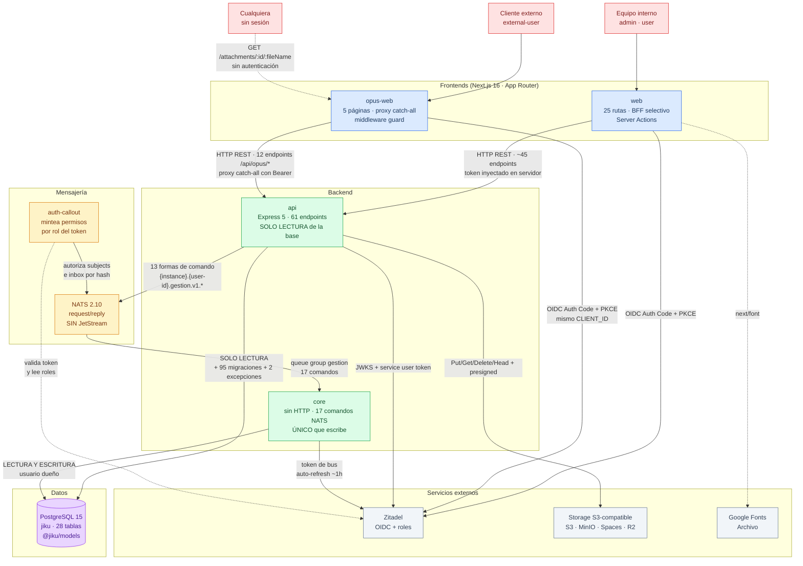

# Arquitectura

> Documento generado por `/product-consolidate-services` desde el código de los cuatro servicios,
> el esquema de la base y la configuración de deploy. **Describe la arquitectura implementada**,
> no una propuesta. El diagrama fue validado con el equipo el 2026-08-18.

## Visión General

Jiku es un **monorepo npm con workspaces** que despliega cuatro servicios propios más tres
componentes de infraestructura. No es una arquitectura de microservicios: es un **sistema CQRS de
grano grueso** con dos frontends sobre una única API.

La decisión que define todo lo demás no es la separación en servicios sino **la separación entre
lectura y escritura, impuesta por credenciales de base de datos**:

- La **`api`** es la única puerta HTTP. Autentica, autoriza, y **lee la base directamente** con
  una conexión de solo lectura por permisos de PostgreSQL. No puede escribir aunque quisiera.
- **`core`** es el único servicio que escribe. No expone HTTP: su única interfaz es el bus NATS,
  por donde recibe comandos de la api, los valida y los persiste en una transacción por comando.

Esto significa que la separación no es de estilo ni de convención: un desarrollador que intente
escribir desde la api recibe un error de permisos de PostgreSQL. La garantía es de
infraestructura, no de disciplina.

Los dos frontends (**`web`** para el equipo, **`opus-web`** para los clientes) comparten stack y
proveedor de identidad, pero difieren en tres decisiones estructurales que se documentan más
abajo, y consumen superficies separadas de la misma API.

### Por qué esta arquitectura

Reconstruido desde el código y sus comentarios. Los ADRs de `docs/adrs/` desarrollan cada punto:

- **Integridad de escritura por diseño (ADR-001, ADR-003).** Con un único escritor y la
  transacción abierta y cerrada por el despachador —no por el comando— es estructuralmente
  imposible dejar una escritura a medias por olvidarse un rollback en una rama de error.
- **Un contrato HTTP estable independiente del esquema (ADR-004).** El bus permitió renombrar
  conceptos del producto (`objectives` → `task`) sin tocar la base ni romper a los frontends.
- **Aislamiento del cliente a nivel de datos, no de UI (ADR-006).** El portal es un frontend
  separado sobre una superficie de API separada, con permisos por proyecto en la base.

### Qué cuesta

La contrapartida está asumida y documentada, no es un descubrimiento de esta consolidación:

- **Sin JetStream, un comando perdido es un comando perdido.** No hay cola, reintento,
  persistencia ni idempotencia. Si `core` está caído, la operación **no ocurrió** y el usuario ve
  un 503. La disponibilidad de escritura del producto es exactamente la de `core`.
- **La política de acceso del bus es la única defensa de `core`.** Core confía en el
  `creator`/`author`/`editor` que viaja en el cuerpo del mensaje, sin verificar nada. Si el
  auth-callout falla, no hay segunda línea.
- **Toda escritura cuesta dos saltos y una relectura.** Core devuelve solo el `id`; la api relee
  la base para rearmar el recurso completo con sus relaciones.

## Diagrama de Arquitectura

> Diagrama validado con el equipo el 2026-08-18.



## Servicios

| Servicio | Tecnología | Responsabilidades | Entidades que administra | Base de datos | APIs externas |
|---|---|---|---|---|---|
| **web** | Next.js 16 (App Router) + React 19 + TS 5.9 + TanStack Query 5 + Sass/CSS Modules + NextAuth v5 | Interfaz del equipo interno: 25 rutas, 7 route handlers BFF, 8 dominios feature-first | — (no persiste) | — | `api`, Zitadel, Google Fonts |
| **opus-web** | Next.js 16 (App Router) + React 19 + TS + TanStack Query 5 + Sass/CSS Modules + NextAuth v5 | Portal de clientes: 5 páginas, proxy catch-all a `/api/opus/*`, 6 dominios | — (no persiste) | — | `api`, Zitadel |
| **api** | Express 5 + TS 5.9 (Node 24) + Sequelize 6 (**RO**) + Joi 18 + Winston | Única puerta HTTP: 61 endpoints. Autenticación, autorización por rol y por entidad, **lectura** de la base, publicación de comandos, y dueña del esquema (corre las migraciones) | Adjunto (excepción), AsignacionSemanal (excepción) | PostgreSQL `jiku` (solo lectura) | Zitadel (JWKS, userinfo, service user), Storage S3 |
| **core** | TS 5.9 `strict` (Node 24) + NATS 2.29 + Sequelize 6 (**RW**) + Joi 18 + Winston. **Sin framework HTTP** | Único escritor: 17 comandos en 5 módulos. Valida reglas de negocio independientes del rol y persiste en una transacción por comando | Actor, Proyecto, Requisito, Tarea, HoraTrabajada, Ausencia, Actividad, Suscriptor | PostgreSQL `jiku` (usuario dueño) | Zitadel (solo su token de bus) |

### Componentes de infraestructura desplegados

No son workspaces del monorepo, pero son parte de la arquitectura en producción:

| Componente | Imagen | Rol |
|---|---|---|
| **nats** | `nats:2.10-alpine` | Bus de comandos. Configurado por `nats-server.conf` en modo operator, **sin JetStream** |
| **auth-callout** | Imagen externa publicada (`${AUTH_CALLOUT_IMAGE}`) | **Componente de seguridad crítico.** Valida el token contra Zitadel y mintea los permisos de publicación por subject e inbox según `rules.yaml`. Es lo que impide que alguien distinto de la api escriba comandos a `core` |
| **database** | `postgres:15.4-alpine3.18` | Base compartida, en red propia sin exposición externa |

### Paquetes compartidos del monorepo

| Paquete | Qué aporta | Por qué existe |
|---|---|---|
| `@jiku/models` | Los 28 modelos Sequelize | Compartido por api y core **para que no puedan divergir**. Deliberadamente **no abre la conexión**: cada servicio registra las clases en su propio Sequelize, porque conectan con credenciales distintas. Es lo que hace posible la garantía de solo-lectura |
| `@jiku/nats-protocol` | Gramática de subjects, formato de `Reply`, catálogo de códigos de error, hash del inbox | El contrato del bus tiene que ser idéntico en los dos extremos |
| `@jiku/zitadel-auth` | Token del service user con auto-refresh | El token caduca en ~1 h: pasarlo por variable de entorno obligaría a reiniciar |

## Bases de Datos

| Base | Tipo | Usada por | Propósito |
|---|---|---|---|
| `jiku` | PostgreSQL 15.4 | `api` (solo lectura), `core` (lectura y escritura) | **Única base del producto.** 28 tablas: núcleo de dominio, tiempo, actividad, permisos, adjuntos, integración externa preparada y auxiliares |

**No hay cache distribuida, ni Redis, ni base de sesión.** La única capa de cache es TanStack
Query en el navegador (`staleTime` 30 s, `gcTime` 5 min). Las sesiones son JWT firmados por
NextAuth, sin estado en el servidor.

### Propiedad de los datos

La base es **compartida**, no particionada por servicio, y esa es una decisión explícita: los
modelos viven en un paquete común precisamente para que api y core vean la misma definición. La
separación no es de datos sino de **operación**:

| Operación | Quién | Cómo |
|---|---|---|
| Lectura de cualquier tabla | `api` | Sequelize con credenciales de solo lectura |
| Escritura de dominio | `core` | Sequelize con el usuario dueño, una transacción por comando |
| Migraciones del esquema | `api` | 95 migraciones con `POSTGRESQL_MIGRATION_USER`, al arrancar |
| **Excepción 1** | `api` | La fila de `attachments` se escribe directo con el ORM |
| **Excepción 2** | `api` | `PUT /api/week-assigned-times` borra y recrea la semana en una transacción |

> **Las dos excepciones son deuda reconocida.** Escriben con las credenciales de solo lectura y
> funcionan porque el rol de la instalación se lo permite. Son las únicas escrituras de dominio
> que no pasan por `core` (ver FG-6 y la pregunta abierta 15 de `requirements.md`).

### Flujos de datos críticos

**Escritura (el camino largo):**
```
navegador → frontend → api → [valida rol y entidad] → NATS → core → [transacción] → PostgreSQL
                        ↓                                              ↓
                        └──── relee la base ←──── responde {id} ───────┘
```
Core devuelve **solo el `id`**: el contrato con los frontends es el recurso completo con sus
relaciones, así que la api relee. Si el reply no es `success`, el despachador hace rollback y
**nada queda escrito**.

**Lectura (el camino corto):**
```
navegador → frontend → api → PostgreSQL
```
Core no participa. Es lo que permite que las lecturas escalen independientemente de la
disponibilidad del bus.

**Adjuntos:**
```
navegador → frontend (BFF/proxy, stream duplex) → api → S3
                                                   ↓
                                            fila en PostgreSQL (excepción 1)
```
Si un archivo de un lote falla, la api **borra del bucket los ya subidos**.

## Interacciones entre Servicios

### Comunicaciones internas

- **`web` → `api`** (HTTP REST, **síncrono**)
  - ~45 endpoints bajo `{API_URL}/api`. El token se inyecta **en el servidor** vía Server Actions
    con axios de servidor: nunca llega al bundle del navegador.
  - Seis route handlers BFF cubren lo que el navegador no puede resolver server-side: streaming
    de uploads con `duplex: 'half'`, descarga y preview con header `Authorization`, el PATCH
    optimista de requisitos, el alta de actores desde un componente cliente, y el proxy a
    `/oidc/v1/userinfo` (que hoy **no tiene consumidores**).
  - Un 401 de la api redirige el navegador a `/login`.

- **`opus-web` → `api`** (HTTP REST, **síncrono**)
  - 12 endpoints bajo `/api/opus/*` a través de un **proxy catch-all** `/api/opus/[...path]` que
    reenvía cualquier método con el Bearer de la sesión.
  - **No hay allowlist:** el proxy expone toda la superficie de `/api/opus/*` a cualquier usuario
    logueado. Es válido solo porque la api autoriza por rol y por entidad en cada endpoint.
  - Un camino adicional **sin sesión**: `GET /attachments/:id/:fileName` →
    `GET /api/opus/attachments/:id/public`.

- **`api` → `core`** (NATS request/reply, **síncrono desde la perspectiva del usuario**)
  - 13 formas de comando publicadas; core sirve 17.
  - Subject: `{instance}.{user-id}.gestion.v1.{comando}` — por ejemplo
    `dev.323332022539911171.gestion.v1.clients.new`.
  - Core se suscribe a `{instance}.*.gestion.v1.>` con **queue group `gestion`**: el wildcard
    cubre a cualquier caller y el queue group hace que varias réplicas se repartan los mensajes
    en lugar de procesar cada una lo mismo.
  - **Timeout de 5000 ms** (`NATS_REQUEST_TIMEOUT_MS`) → 503 al usuario.
  - El `user-id` va **crudo** en el subject; el inbox usa un **hash** (sha256 → base32 sin
    padding → 16 caracteres). Tiene que coincidir exactamente con lo que mintea el auth-callout:
    sin fijar `inboxPrefix` al conectar, las respuestas nunca llegarían.
  - **Core no publica nada**: solo responde el `Reply` de la request. No hay eventos.

- **`auth-callout` → `nats`** (NATS, **síncrono**)
  - Intercepta cada conexión al bus, valida el token contra Zitadel y mintea los permisos de
    publicación y de inbox según `rules.yaml`.

### Integraciones externas

- **`web` / `opus-web` → Zitadel** (HTTPS OIDC, síncrono)
  - Authorization Code + PKCE. Comparten la misma app OIDC (`ZITADEL_CLIENT_ID`) con secretos de
    sesión distintos. `opus-web` no usa client secret: es cliente público con PKCE.
  - Los roles llegan en el claim `urn:zitadel:iam:org:project:{PROJECT_ID}:roles`. **Si el
    project id está mal configurado, los roles llegan vacíos y nada falla visiblemente.**

- **`api` → Zitadel** (HTTPS, síncrono)
  - JWKS en `{IDENTITY_URL}/oauth/v2/keys`, **resincronizado con reintentos** si el `kid` del
    token no está entre las claves conocidas: cubre la rotación en Zitadel sin reiniciar.
  - Token del service user con JSON key y auto-refresh, para autenticarse en el bus. El `userId`
    con el que publica sale de la key y **no** de una variable, porque tiene que coincidir con el
    `sub` que el auth-callout lee para autorizar el subject.

- **`core` → Zitadel** (HTTPS, síncrono)
  - **Solo para su propio token de bus**, con auto-refresh. No valida tokens de usuario ni lee
    roles de personas.

- **`api` → Storage S3-compatible** (HTTPS, síncrono)
  - `PutObject`, `GetObject`, `DeleteObject`, `ListObjectsV2`, `HeadObject` y URLs pre-firmadas.
  - Sirve AWS S3, MinIO, DigitalOcean Spaces o Cloudflare R2. **Bucket y región no tienen default
    a propósito**: dependen del proveedor de cada instalación y un default apuntaría a la
    infraestructura de otro.

- **`web` → Google Fonts** (HTTPS, build/runtime)
  - Tipografía Archivo vía `next/font/google`. Es la única dependencia de red del frontend que no
    es la api ni Zitadel.

### Divergencias entre los dos frontends

Comparten stack y difieren en cuatro decisiones estructurales. **No hay evidencia en el código de
cuál es la preferida**; es material para un ADR de convergencia:

| | `web` | `opus-web` |
|---|---|---|
| Acceso a datos | Server Actions + axios de servidor | axios de navegador + proxy catch-all |
| Guard de rutas | Layout del grupo `(loggedin)/` — **allowlist**: una ruta fuera del grupo queda sin guard | `middleware.ts` con matcher por exclusión — **deny-by-default**: una ruta nueva queda protegida |
| Corte por rol | Redirige `external-user` a `/unauthorized` | Ninguno: el filtro es de datos, del lado de la api |
| Variables de NextAuth | `AUTH_*` (v5) | `NEXTAUTH_*` (v4) |

El guard de `opus-web` es la forma más segura de las dos. La decisión de datos de `web` es la que
mantiene el bundle más chico.

## Arquitectura de Seguridad

### Autenticación

- **OIDC contra Zitadel** con Authorization Code + PKCE, obligatorio en ambos frontends.
- **El access token nunca llega al navegador.** En `web` se inyecta en Server Actions; en
  `opus-web`, en el route handler del proxy.
- Sesión JWT de **12 horas** en `web`; el callback devuelve `null` cuando el `expiresAt` del
  access token pasó, forzando re-login. `opus-web` valida además el vencimiento en el middleware.
- **Bypass de desarrollo** (`AUTH_BYPASS=true`): opt-in explícito, **prohibido con
  `NODE_ENV=production`** —el arranque falla— y exige `DEV_USER_ID`. El comentario del código
  registra por qué es así: antes se activaba con que faltara `IDENTITY_URL`, así que una variable
  sin completar dejaba la api abierta y con rol `admin`, en silencio.

### Autorización: cuatro capas

1. **Global por path, deny-by-default.** `validateToken` se instala para todo path *excepto* una
   lista de exenciones armada como regex de lookahead negativo. Es la forma correcta, con una
   consecuencia a saber: **un archivo de ruta puede parecer desprotegido y estar cubierto**.
2. **Por rol.** `hasAnyRole([...])` sobre los roles del claim. Tres roles: `admin`, `user`,
   `external-user`.
3. **Por entidad.** `validateProjectPermissions` y `canUserAccessEntity`/`canUserViewEntity`
   restringen a `external-user` por permiso de proyecto, **resolviendo el proyecto desde 9 tipos
   de entidad distintos**. Los adjuntos con `entityType: 'stage'` nunca se autorizan: la tabla ya
   no existe y no hay proyecto contra el cual verificar.
4. **Del bus.** El auth-callout mintea permisos por subject e inbox según el rol del token.

### La única superficie sin autenticación

`GET /api/opus/attachments/:id/public` es el **único** endpoint exento de todo el producto. Sirve
solo adjuntos marcados públicos, responde 403 en cualquier otro caso, y manda
`X-Content-Type-Options: nosniff` con CSP de sandbox.

### Riesgos conocidos

| Riesgo | Detalle | Mitigación actual |
|---|---|---|
| **Core no verifica quién actúa** | Confía en el `creator`/`author`/`editor` del cuerpo. El subject identifica al **service user de la api**, no a la persona | Enteramente la política del auth-callout. **Sin segunda línea de defensa** |
| **Proxy del portal sin allowlist** | Expone toda la superficie de `/api/opus/*` a cualquier usuario logueado | La api autoriza por rol y por entidad en cada endpoint |
| **Reglas de workflow solo en UI** | Las transiciones de estado de requisito solo se validan en `web` | Ninguna. Ver NFR-S07 y FG-4 |
| **Sin rate limiting** | Ninguna capa lo implementa | Ninguna |
| **Sin audit log** | Solo hay historial de cambios de tarea y requisito. No hay registro de accesos, cambios de permisos ni borrados | Ninguna |

### Gestión de secretos

Variables de entorno inyectadas por el compose, sin gestor de secretos. Los secretos del bus son
archivos montados como read-only (`nats/creds/`). **Ninguna variable se hornea en las imágenes**:
no hay `ARG` ni `NEXT_PUBLIC_*` funcional, lo que permite una sola imagen para todos los entornos.

## Requerimientos Técnicos

### Infraestructura

**Despliegue:** Docker Compose sobre un host, con `nginx-proxy` + `letsencrypt-companion` como
ingress. Los cuatro servicios propios corren como imágenes publicadas en Docker Hub
(`gravadigital/jiku-*`), con usuario no-root y `restart: always`.

**Redes:** tres redes segmentadas —
- `ingress-network` (externa): solo `web`, `opus-web` y `api` la tocan
- `jiku-bus`: `nats`, `auth-callout`, `api`, `core`
- `jiku-database` (externa): `api`, `core`, `database`

La base **no se expone** a la red de ingress, y `core` **no está en `ingress-network`**: es
inalcanzable desde afuera por diseño.

**Entornos:**
- **local**: `docker-compose.local.yml` y `local.sh`; `opus-web` publicado en el 3001
- **dev**: imágenes con tag `dev` y `dev-{sha}`, publicadas en cada push
- **producción**: `docker-compose.yml` con versiones fijadas por variable (`${API_VERSION}`, etc.)

**Construcción:** todos los Dockerfiles son multi-stage sobre `node:24.12-alpine3.23` y se
construyen **con contexto en la raíz del monorepo**, porque los servicios dependen de los paquetes
del workspace. Los frontends usan `output: 'standalone'`.

**CI/CD:**
- `ci.yml` — lint + test de los cuatro workspaces
- `dev-images.yml` — publica `dev` y `dev-{sha}` en cada push a la rama
- `release.yml` — publica las versiones, en matriz de cuatro servicios
- **Sin deploy automático:** el despliegue es manual

### Preocupaciones transversales

**Logging:**
- Winston en los dos backends. Consola en desarrollo; consola + dos archivos rotados (info y
  error) en producción.
- **Roto en producción:** las variables `LOGGER_INFO_PATH` y `LOGGER_ERROR_PATH` **no están
  definidas en el compose**, así que los dos transports de archivo quedan con
  `filename: undefined`.
- `LOG_COMMANDS` en core imprime cada comando y su respuesta. **Encenderlo loguea datos de
  negocio.**

**Monitoreo:** no existe. Sin métricas, sin APM, sin alertas.

**Healthchecks:** **ninguno de los cuatro servicios lo define** en el compose.

**Tracking de errores:** no existe. Los errores quedan en los logs, que hoy no llegan a ningún
lado verificable.

> Las tres ausencias juntas son el contenido de FG-3. Es el punto ciego más grande de la
> operación: un comando perdido no deja rastro.

### Rendimiento

**Cache:** solo del lado del cliente (TanStack Query: `staleTime` 30 s, `gcTime` 5 min,
`retry` 1 en queries y 0 en mutations). Update optimista únicamente en la edición de requisitos.
**Sin cache distribuida ni CDN propio.**

**Rate limiting:** no implementado en ninguna capa.

**Paginación:** listados de requisitos 15/20/25; el portal pagina 20 por estado con scroll
infinito — **siete queries en paralelo**, una por columna, y su `isLoading` es un `some`: la
pantalla espera a la más lenta.

**Consultas:** los tags de requisitos usan contains de `jsonb`
(`tags @> '[{"key":…,"value":…}]'::jsonb`). Los índices declarados están en
`docs/db-schemas/jiku.md`.

### Escalabilidad

| Componente | Escala | Cómo |
|---|---|---|
| `core` | **Horizontal, soportado por diseño** | Queue group `gestion`: varias réplicas se reparten los mensajes |
| `api` | Horizontal | Sin estado propio; el límite es la base |
| `web`, `opus-web` | Horizontal | `output: 'standalone'`, sin estado de servidor |
| PostgreSQL | Vertical | Instancia única. Sin réplicas de lectura ni sharding |
| Adjuntos | Externalizada | No consumen disco de los servicios |

**Sin límites de CPU ni memoria** definidos en el compose.

## Estrategia de Despliegue

**Estado actual:**
- Cuatro imágenes publicadas en Docker Hub, versionadas por variable de entorno
- Despliegue manual con `docker compose up`, sin orquestador
- Base de datos en volumen nombrado (`jiku-${STAGE}-database-data`)
- Las **migraciones corren al arrancar la api**, no core — pese a lo que dice el comentario de
  `deploy/docker-compose.yml:129`, que es incorrecto en su segunda mitad
- **Una instalación nueva no se puede levantar desde cero:** las 95 migraciones asumen un esquema
  existente y ninguna crea `objectives`. Requiere un dump previo

**Evolución sugerida** (deriva de los feature groups, no está decidida):
1. **FG-3**: healthchecks, log estructurado a stdout y métricas antes de cualquier otra cosa —
   hoy no hay forma de saber si el sistema está sano
2. **FG-6**: migraciones que construyan el esquema desde cero, para habilitar entornos nuevos y
   eliminar la doble fuente de verdad (`sequelize.sync()` en desarrollo vs migraciones en
   producción)
3. Deploy automático desde `release.yml`, una vez que existan healthchecks contra los cuales
   verificar que el deploy salió bien

## Documentación Relacionada

| Documento | Contenido |
|---|---|
| [`docs/adrs/`](../adrs/) | Las decisiones arquitectónicas con su contexto y sus consecuencias |
| [`docs/architectures/{servicio}/`](../architectures/) | Manifest, overview y convenciones custom de cada servicio |
| [`docs/apis/api.yaml`](../apis/api.yaml) | OpenAPI 3.0 — los 61 endpoints HTTP |
| [`docs/apis/core.yaml`](../apis/core.yaml) | AsyncAPI 2.6 — los 17 comandos del bus |
| [`docs/db-schemas/jiku.md`](../db-schemas/jiku.md) | Las 28 entidades, diagrama ER y DBML |
| [`docs/flows/`](../flows/) | Los flujos cross-service completos |
| [`docs/ux/`](../ux/) | Documentación UX relevada desde el código |
| [`docs/design-system/`](../design-system/) | Design System sembrado con los tokens reales |
