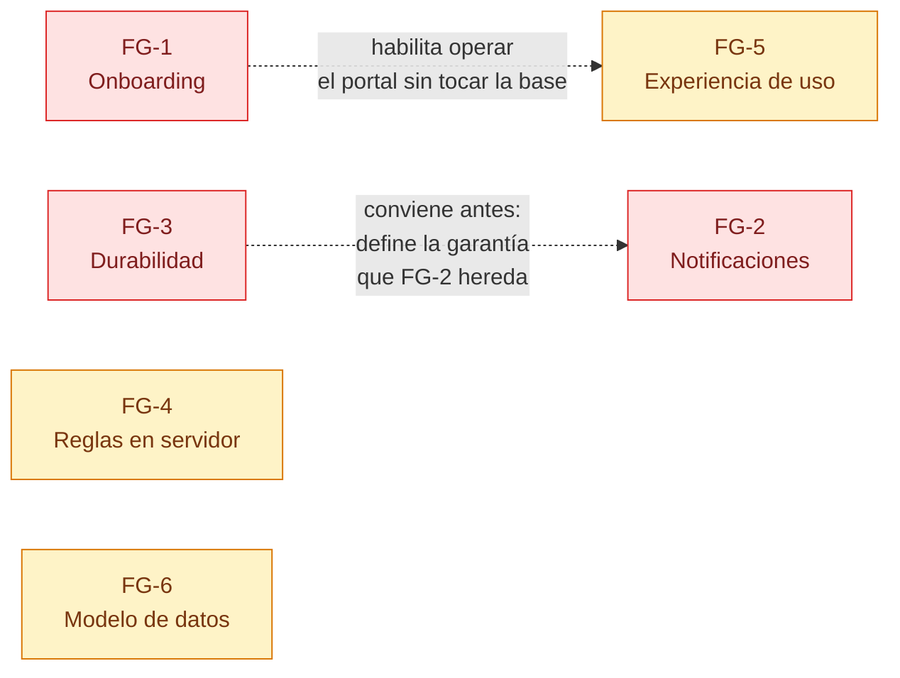

# Feature Groups

## Overview

Este documento contiene los feature groups identificados durante la importación del producto
**Jiku** desde su código existente.

**Feature groups son agrupaciones de funcionalidad relacionada** que deben ser capturadas como
requests, diseñadas técnicamente y formalizadas en stories antes de iniciar implementación.

> ### Lectura obligatoria antes de usar este documento
>
> En un producto nuevo los feature groups se ordenan por **secuencia de construcción**: primero la
> infraestructura, después lo que se apoya en ella. **Acá eso no aplica**: la infraestructura está
> deployada, la autenticación funciona y las diez features del PRD están implementadas y en uso.
>
> Por eso estos grupos **no son un plan de construcción sino un mapa de lo que falta**, ordenado
> por riesgo y por impacto. Cada grupo declara qué parte ya existe y qué parte no, y su
> precondición es siempre el sistema corriendo, no el grupo anterior.
>
> **FG-1 no es infraestructura**: es el hueco que hoy impide incorporar un cliente nuevo sin
> tocar la base a mano. Ese es el punto de entrada correcto para este producto.

**Proceso para formalizar cada feature group:**
1. `/product-new-request` — Capturar requerimiento y clarificar alcance
2. `/product-design-request REQ-XXX` — Diseñar solución técnica y proponer story split
3. `/product-create-stories REQ-XXX` — Crear stories implementables

**Status actual:** 6 feature groups pendientes de formalización.

**Estado del producto base:** las capacidades C-01 a C-81 de `requirements.md` están
implementadas y en producción, salvo las excepciones que cada grupo detalla.

---

## Feature Group 1: Onboarding de Usuarios y Permisos de Proyecto

**Status:** Pending

**Prioridad sugerida:** Alta · **Esfuerzo estimado:** Alto

**Descripción:**

Hoy el producto **no puede incorporar un usuario**. Quien autentica correctamente contra Zitadel
pero no tiene fila en la tabla `users` recibe 401 `user_not_found` en todas las rutas, y la única
vía de alta es un `INSERT` a mano en la base de producción. Lo mismo pasa con
`user_project_permissions`: la tabla que decide qué proyectos ve cada cliente externo no se
administra desde ninguna interfaz.

La causa es estructural y está documentada: `POST /api/auth/present` era la última escritura que
nunca se convirtió en comando, y cuando la api pasó a solo lectura quedó como un no-op que traga
su propio error. Los dos frontends lo siguen llamando después del login y **ninguno se entera de
que no hace nada**.

Este grupo cierra ese hueco: comandos de alta y actualización de usuario en `core`, la
provisión desde el token en el primer login, la administración de personas (que hoy tampoco se
crean desde el producto) y la pantalla de concesión de permisos de proyecto a clientes externos.

**Por qué es importante:**

Es el único grupo que **desbloquea algo hoy imposible**. Sin él, cada cliente nuevo y cada
persona que entra al equipo requiere una intervención manual en la base de producción — con el
riesgo, la latencia y la falta de trazabilidad que eso implica. También es el prerequisito real
de que el portal de clientes (F-08) sea operable por alguien que no tenga acceso a la base.

**Capabilities que implementa:**
- C-67, C-68: autenticación OIDC y resolución de rol (de F-09) — **existen; se extienden** con la
  provisión de la fila de usuario
- **Nuevas capacidades a definir:** alta y actualización de Usuario, alta y edición de Persona,
  vinculación Usuario ↔ Persona, y CRUD de PermisoDeProyecto
- Resuelve las preguntas abiertas **1** de `requirements.md`

**Precondiciones:**
- Sistema en producción con Zitadel operativo (existe)
- Regla estructural vigente: toda escritura nueva se implementa como comando en `core`
- Definir si el alta de usuario es automática en el primer login (provisión desde el token) o
  requiere aprobación explícita de un `admin` — **es la decisión de producto que abre este grupo**

**Postcondiciones:**
- `POST /api/auth/present` deja de ser un no-op y su error deja de tragarse en los dos frontends
- Existen comandos de escritura de `users`, `people` y `user_project_permissions` en `core`
- Un `admin` puede dar de alta una persona, vincularla a su usuario y concederle proyectos a un
  cliente externo, todo desde la interfaz
- Ningún alta requiere tocar la base

**Valor entregado:**
Un cliente nuevo se incorpora al portal en minutos y desde la interfaz, en lugar de requerir un
`INSERT` manual en producción. Una persona que entra al equipo puede cargar horas su primer día.

---

## Feature Group 2: Notificaciones

**Status:** Pending

**Prioridad sugerida:** Alta · **Esfuerzo estimado:** Alto

**Descripción:**

El producto permite a un cliente **suscribirse a un requisito** y no tiene ningún canal por el
cual llegue nada. La suscripción registra interés en una tabla y ahí termina: no hay envío de
mails, ni push, ni webhooks, ni siquiera un indicador de novedades dentro de la aplicación.

Quedan además tres tablas huérfanas de una funcionalidad de mail que se eliminó
(`objective_mail_threads`, `requirement_mail_threads`, `inbound_mail_threads`), que ninguna
migración borra porque una migración destructiva perdería datos. Su presencia sugiere que hubo
notificaciones por mail y que el camino a rehacerlo ya se recorrió una vez.

Este grupo define el canal, el disparador y la preferencia: qué eventos notifican, a quién, por
dónde, y cómo se apaga. Incluye la decisión de si las notificaciones son un servicio nuevo o un
consumidor más del bus.

**Por qué es importante:**

Es la brecha más visible entre lo que el producto **ofrece** y lo que **hace**. Un cliente que se
suscribe y nunca recibe nada aprende que la función no sirve, y esa lección se transfiere al
resto del portal. Además es lo que cierra el ciclo de G-02: el canal formal con el cliente hoy es
de pull —hay que entrar a mirar— cuando debería avisar.

**Capabilities que implementa:**
- C-22, C-23: suscripción y desuscripción (de F-03) — **existen y hoy no producen efecto**
- C-65: elegir suscriptores al crear desde el portal (de F-08) — existe
- **Nuevas capacidades a definir:** canal de entrega, catálogo de eventos notificables,
  preferencias por usuario, y baja de las tres tablas huérfanas
- Resuelve la pregunta abierta **2**

**Precondiciones:**
- F-03 (requisitos) y F-08 (portal) operativos — **cumplido**
- Decidir el canal: mail, notificación en producto, Mattermost, o combinación
- Decidir la arquitectura: **si es un consumidor nuevo del bus, requiere resolver antes la
  durabilidad de los mensajes** (ver FG-3) — hoy sin JetStream un evento perdido es un evento
  perdido, lo que para una notificación es aceptable pero conviene decidirlo explícitamente

**Postcondiciones:**
- Un evento sobre un requisito suscripto genera una notificación entregada por el canal definido
- Existe un catálogo explícito de eventos que notifican
- El usuario puede apagar notificaciones sin desuscribirse
- Las tres tablas huérfanas están eliminadas o reutilizadas

**Valor entregado:**
Un cliente se entera de que su requisito avanzó sin tener que entrar a mirar. El equipo se entera
de que un cliente comentó.

---

## Feature Group 3: Durabilidad y Observabilidad de la Escritura

**Status:** Pending

**Prioridad sugerida:** Alta · **Esfuerzo estimado:** Alto

**Descripción:**

Toda escritura del producto pasa por un comando NATS request/reply **sin JetStream**: sin cola,
sin reintento, sin persistencia y sin idempotencia. Si `core` está caído cuando la api publica,
la request expira a los 5 segundos, el usuario ve un 503 y **la operación no ocurrió, sin
reconciliación posterior**. La disponibilidad de escritura del producto es exactamente la de
`core`.

A esto se suma que la observabilidad hoy está rota en producción: los dos transports de archivo
de Winston quedan con `filename: undefined` porque el compose no define las variables `LOGGER_*`,
no hay healthcheck en ningún servicio, y no hay métricas de latencia ni de comandos fallidos.
Cuando algo se pierde, **no queda registro de que se perdió**.

Este grupo aborda las dos mitades juntas porque son la misma pregunta: qué garantía de escritura
da el producto, y cómo se verifica que la esté cumpliendo.

**Por qué es importante:**

Es la única capacidad del grupo cuyo fallo es **silencioso para el sistema y visible para el
usuario**: alguien carga sus horas, ve un error, y no hay forma de saber cuántas veces pasó eso
esta semana. Mientras no se resuelva, cualquier feature nueva hereda la misma garantía —y el
FG-2 la heredaría al construirse sobre el bus.

**Capabilities que implementa:**
- C-75 a C-81 (F-10, Integridad de la Escritura) — **existen; se extienden** con durabilidad
- NFR-R02, NFR-R03, NFR-R05, NFR-R06 de `requirements.md`
- **Nuevas capacidades a definir:** persistencia del comando, política de reintento e
  idempotencia, healthchecks, log estructurado a stdout, y métricas de latencia y de fallo

**Precondiciones:**
- Arquitectura de comandos operativa — **cumplido**
- Decidir si se adopta JetStream o si la garantía actual se declara aceptable y se compensa con
  observabilidad y reintento del lado del cliente. **Son dos caminos distintos y la decisión abre
  el grupo**
- Definir la idempotencia de los 17 comandos: hoy ninguno la garantiza

**Postcondiciones:**
- Un comando publicado con `core` caído tiene un destino definido y observable (encolado,
  reintentado o registrado como perdido)
- Los cuatro servicios tienen healthcheck
- Los logs de producción llegan a algún lado verificable
- Existe una métrica de comandos fallidos por período

**Valor entregado:**
El equipo puede responder "¿se perdió algo esta semana?" con un número en vez de una suposición.

---

## Feature Group 4: Endurecimiento de Reglas de Negocio en el Servidor

**Status:** Pending

**Prioridad sugerida:** Media-Alta · **Esfuerzo estimado:** Medio

**Descripción:**

Varias reglas que el producto presenta como propias del dominio **solo existen en el frontend**.
La más importante es el workflow de requisitos: la secuencia
`analisis → planificacion → en_cola → desarrollo → revision` y el salteo de `en_cola` para las
incidencias viven únicamente en `web`. Cualquier cliente HTTP —incluido el proxy catch-all del
portal, que no filtra paths ni métodos— puede llevar un requisito a cualquier estado.

Se suman la derivación del estado del actor, la precarga de asignaciones desde la semana
anterior, y la pregunta de si el proxy del portal debería tener allowlist. En todos los casos el
patrón es el mismo: **una regla que el equipo cree del producto y el servidor no conoce**.

Este grupo mueve esas reglas al lugar donde son verificables —`api` para las que dependen de rol
o calendario, `core` para las que no— y cataloga formalmente los códigos de error, que hoy no
tienen lista cerrada y en un caso transportan datos parseando el mensaje con un regex.

**Por qué es importante:**

Es riesgo de integridad de datos, no de seguridad de acceso: nadie ve lo que no debe, pero un
requisito puede quedar en un estado que el proceso del equipo no contempla, y nadie se entera
hasta que aparece en un reporte. Endurecerlo también es prerequisito de exponer la API a
cualquier consumidor que no sea `web`.

**Capabilities que implementa:**
- C-15: workflow de estados (de F-03) — **hoy solo en `web`**
- C-02: derivación del estado del actor (de F-01) — hoy solo en `web`
- C-37: precarga de asignación semanal (de F-05) — hoy solo en `web`
- C-66: operación interna desde el portal (de F-08) — decidir si se corta
- NFR-S07, NFR-S08, NFR-M06
- Resuelve las preguntas abiertas **3, 4, 5, 8, 9, 10, 11**

**Precondiciones:**
- **Decidir, para cada regla, si es autoritativa o si era intencionalmente solo de UI.** No todas
  tienen que moverse: la precarga de la semana anterior probablemente sea correcta como
  comodidad de interfaz
- Definir si el tope de 1440 min/día es requisito de producto o guardarraíl técnico (hoy es una
  constante local duplicada en dos archivos)

**Postcondiciones:**
- Las transiciones de estado de requisito se validan en el servidor
- Existe un catálogo cerrado de `ErrorCode` con su mapeo a HTTP, y `daily_limit_exceeded` deja de
  transportar datos por el mensaje
- Los mensajes de error están unificados en un idioma
- El proxy del portal tiene allowlist o está documentada la decisión de no tenerla

**Valor entregado:**
Un requisito no puede quedar en un estado inválido, sea cual sea el cliente que lo modifique.

---

## Feature Group 5: Consolidación de la Experiencia de Uso

**Status:** Pending

**Prioridad sugerida:** Media · **Esfuerzo estimado:** Alto

**Descripción:**

Los dos frontends tienen huecos de experiencia documentados con evidencia en
`docs/ux/gaps-as-is.md`. Los bloqueantes son dos: **el portal de clientes es inutilizable bajo
768 px** —el `Sidebar` desaparece y no se monta ningún reemplazo, así que no se puede cambiar de
proyecto ni cerrar sesión— y el gestor interno **no tiene tratamiento responsive coherente**: de
cuatro breakpoints declarados solo uno se usa, y en paralelo hay catorce `@media` crudas con ocho
valores distintos.

Se suman huecos de estado (pantallas sin estado de error ni vacío, sin `error.tsx` ni
`not-found.tsx` en ninguna ruta del portal), de accesibilidad (elementos clickeables que no son
botones, ningún modal atrapa el foco, una tabla hecha con `div` sin roles ARIA) y de microcopy
(tuteo mezclado entre "tú" y "vos", typos visibles, mensajes de error en dos idiomas).

Este grupo también recoge el código muerto identificado —once componentes sin uso en `web`, nueve
en `opus-web`, dos contexts montados que nadie consume— porque su presencia hace que el
relevamiento de qué existe sea más caro de lo necesario.

**Por qué es importante:**

Es el grupo con más impacto por hora invertida en la percepción diaria del producto. También es
donde el Design System sembrado desde el código (`docs/design-system/`) pasa de ser documentación
de lo que hay a ser la fuente contra la que se implementa.

**Capabilities que implementa:**
- Transversal a F-01 a F-08 en su capa de presentación
- NFR-U03, NFR-U04, NFR-U05, NFR-U06, NFR-U07
- Resuelve la pregunta abierta **6**

**Precondiciones:**
- Documentación UX generada desde el relevamiento — **cumplido** (`docs/ux/`)
- Design System sembrado con los tokens reales — **cumplido** (`docs/design-system/`)
- **Decidir si el gestor interno debe ser usable en mobile.** El código no permite inferirlo: hay
  tratamiento responsive incoherente, que es distinto de una decisión deliberada de no tenerlo

**Postcondiciones:**
- El portal es navegable en un teléfono
- Los breakpoints del código y los del Design System coinciden
- Toda pantalla tiene estado de carga, error y vacío
- El microcopy usa una sola forma de tratamiento y un solo idioma
- El código muerto está eliminado

**Valor entregado:**
Un cliente puede seguir sus requisitos desde el teléfono. Un usuario que se topa con un error ve
qué pasó en lugar de una pantalla en blanco.

---

## Feature Group 6: Saneamiento del Modelo de Datos

**Status:** Pending

**Prioridad sugerida:** Media · **Esfuerzo estimado:** Medio

**Descripción:**

El esquema arrastra restos de decisiones ya tomadas pero no completadas. El caso más claro es
**`stages`**: la tabla se eliminó, pero `web` sigue enviando `stageId`, la api lo reenvía, el enum
de tipo de actividad todavía lo declara, y los adjuntos históricos con `entityType: 'stage'`
**nunca se autorizan** porque no hay proyecto contra el cual verificar el permiso. Son archivos
que existen y a los que nadie puede llegar.

Se suman la migración de vocabulario a medio camino (`objectives` en la base, `task` en el bus),
el escape transitorio de `priority` que existe solo porque la columna es entera y el bus usa
nombres, las inconsistencias de tipo del esquema (`estimated_finish_date` es `VARCHAR` en tareas
y `DATE` en requisitos; `worked_times.date` es `TIMESTAMP` y `unworked_times.date` es `DATE`), la
asimetría sin justificar en el reemplazo de responsables, y las tres tablas de mail muertas.

Incluye además el problema de instalación: **las 102 migraciones no construyen el esquema desde
cero** —ninguna crea `objectives`— así que una instalación nueva necesita un dump previo, y el
esquema de desarrollo lo construye `sequelize.sync()` mientras el de producción lo construyen las
migraciones: **dos fuentes para la misma cosa**.

**Por qué es importante:**

Ninguno de estos puntos tiene síntoma visible hoy, y por eso el grupo es de prioridad media. Pero
todos **encarecen cada cambio futuro** sobre las tablas que tocan, y dos tienen consecuencia real:
los adjuntos inalcanzables son pérdida de datos silenciosa, y la imposibilidad de instalar desde
cero bloquea cualquier entorno nuevo.

**Capabilities que implementa:**
- Transversal a F-03, F-04, F-06, F-07
- NFR-R07, NFR-R08
- Resuelve las preguntas abiertas **7, 12, 13**

**Precondiciones:**
- **Confirmar que no quedan filas con `entityType: 'comment'` sin migrar en producción**
  (pendiente S-096) antes de tocar los tipos de entidad de adjuntos
- Decidir si la migración `objectives` → `tasks` se completa o se revierte: hoy está a medio
  camino con la dirección declarada
- Definir qué hacer con los adjuntos históricos de `stage`: recuperarlos reasignando entidad, o
  darlos de baja explícitamente

**Postcondiciones:**
- `stageId` no se envía, no se reenvía y no está en ningún enum
- Los adjuntos de `stage` tienen destino resuelto
- El vocabulario es consistente en las tres capas, o la inconsistencia está documentada como
  definitiva
- Las migraciones construyen el esquema desde cero y hay una sola fuente de verdad
- Las tablas muertas están eliminadas

**Valor entregado:**
Un entorno nuevo se levanta con `docker compose up` sin necesitar un dump. Un cambio sobre tareas
o adjuntos no requiere entender qué restos hay que esquivar.

---

## Resumen

| # | Feature Group | Prioridad | Esfuerzo | Naturaleza |
|---|---|---|---|---|
| FG-1 | Onboarding de Usuarios y Permisos de Proyecto | Alta | Alto | **Desbloquea lo imposible** |
| FG-2 | Notificaciones | Alta | Alto | Completa una capacidad ofrecida y vacía |
| FG-3 | Durabilidad y Observabilidad de la Escritura | Alta | Alto | Riesgo de pérdida silenciosa |
| FG-4 | Endurecimiento de Reglas en el Servidor | Media-Alta | Medio | Riesgo de integridad de datos |
| FG-5 | Consolidación de la Experiencia de Uso | Media | Alto | Impacto diario en el uso |
| FG-6 | Saneamiento del Modelo de Datos | Media | Medio | Costo de cambio futuro |

### Dependencias entre grupos

**Ya no hay ninguna dependencia dura**: quedan solo dos recomendaciones de orden. Los grupos son
independientes entre sí y pueden encararse en cualquier orden: el sistema ya está construido, así
que ninguno necesita que otro exista primero.

### Orden sugerido

**FG-1 primero**, porque es el único que hoy hace imposible algo que el producto promete. Después
**FG-3**, porque define la garantía de escritura que FG-2 va a heredar; encarar las notificaciones
antes significa construirlas sobre una entrega que puede perderse en silencio. **FG-4 y FG-5** son
los mejores candidatos a paralelizar: tocan capas distintas (servidor y presentación) y no
compiten. **FG-6** conviene antes de cualquier trabajo grande sobre tareas o adjuntos.
