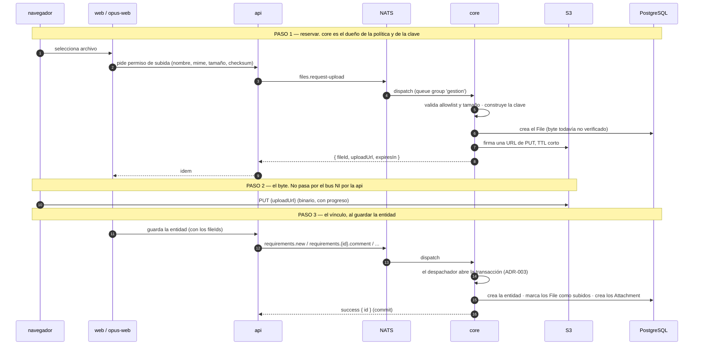

# REQ-001: Rediseño de archivos y adjuntos — separar File de Attachment y subida directa a S3

## Requerimiento Original

> El requerimiento se recibió en dos partes: un documento de lineamientos técnicos elaborado
> internamente (`adjuntos-lineamientos.md`, **documento temporal ya eliminado** — su contenido
> relevante está transcripto íntegramente en este REQ) y una ampliación funcional del solicitante
> durante la captura.

### Parte 1 — Lineamientos del rediseño (documento interno)

**Qué se resuelve.** Dos problemas del modelo actual, en este orden de importancia:

1. **La `api` escribe la fila de `attachments` sin pasar por `core`.** Es la excepción 2 de
   ADR-001, registrada como deuda. Escribe con las credenciales de solo lectura y funciona solo
   porque el rol de la instalación se lo permite.
2. **El archivo no puede existir sin una entidad.** La tabla `attachments` mezcla el archivo con
   su vínculo, así que subir obliga a declarar a qué se va a colgar — incluso cuando la entidad
   todavía no existe. Eso se resolvió con el patrón *draft*: `entity_id` nulo, `entityType` con
   sufijo `_draft`, y hoy hay **cinco** tipos draft vigentes.

Se resuelven con dos cambios de fondo:

1. **Separar `File` de `Attachment`.** El archivo existe por sí solo; el vínculo con una entidad
   es opcional y aparte.
2. **Separar el plano del byte del plano del metadato.** El navegador pide permiso de subida por
   el bus, sube el byte **directo a S3** con URL prefirmada, y el vínculo lo crea el comando de
   dominio.

**Restricción que define el diseño:** el binario **no puede viajar por NATS**. El `max_payload`
default es 1 MB y los adjuntos llegan a 10 MB (ADR-002). Y **no debe viajar por la api**:
bufferizar 10 MB × 10 archivos en memoria es el costo que este rediseño elimina.

### Parte 2 — Ampliación funcional del solicitante

> "En cuanto a requerimiento funcional te puedo mencionar que queremos poder subir archivos y
> relacionarlos a distintas entidades existentes desde la web y opus. También es importante que
> el sistema permita que un servicio externo conectado a nats pueda subir archivos y relacionarlos
> sin problemas.
>
> También quiero que no se pueda usar un archivo que no fue subido por el mismo usuario. Ejemplos:
> - si un usuario en la web quiere adjuntar en un comentario un archivo subido por otro usuario
>   debe dar error de permisos
> - si un servicio externo conectado a nats crea un comentario en un requisito con un archivo
>   subido por otro servicio (o usuario) debe dar error de permisos"

> "El tiempo de duración del link (tanto subida como descarga), el máximo peso, los formatos
> permitidos y todo lo que consideres relevante debe ser configurable"

**Fuente:** Documento de lineamientos interno + ampliación verbal durante la captura.

## Contexto del Producto

**Feature groups relacionados:**

- **Feature Group 6: Saneamiento del Modelo de Datos** — solapamiento resuelto: dos de sus
  precondiciones (destino de los adjuntos con `entityType: 'stage'` y las filas legado con
  `entityType: 'comment'`) **entran en el alcance de este REQ**. FG6 queda liberado de ambas.
- **Feature Group 4: Endurecimiento de Reglas de Negocio en el Servidor** — este REQ mueve la
  política de subida (allowlist, tamaño, forma de la clave) de la `api` a `core`, que es
  exactamente el criterio de ese grupo.
- **Feature Group 3: Durabilidad y Observabilidad de la Escritura** — relacionado por el modo de
  fallo nuevo que introduce la decisión de no verificar el byte (ver Riesgos Asumidos).

**Stories relacionadas:**

- No hay stories formalizadas en el producto todavía.
- Se menciona **S-096** (pendiente, previa al workflow actual): confirmar si quedan filas con
  `entityType: 'comment'` sin migrar en producción. Este REQ absorbe esa verificación.

**Flujos relacionados:**

- `docs/flows/adjuntos.md` — **el flujo actual, que este REQ reemplaza.** Documenta los siete
  pasos vigentes, incluido el Paso 4 ("la fila se escribe SIN pasar por core") y el Paso 5
  (vinculación del borrador), que desaparecen con el rediseño.

**Servicios involucrados:** `web`, `opus-web`, `api`, `core`, más configuración de `deploy`.

**Entidades del dominio afectadas:** Adjunto (`attachments`), AjusteDelSistema
(`system_settings`), y de forma indirecta Requisito, Tarea y Actividad, que son las entidades a
las que se vinculan los archivos.

## Clarificaciones

### Alcance

- **P:** El documento deja sin resolver los adjuntos con `entityType: 'stage'` y las filas legado
  con `entityType: 'comment'`, pero FG6 ya declara esos mismos dos puntos como precondiciones
  suyas. ¿Cómo se resuelve el solapamiento?
- **R:** **Entran en este REQ.** El rediseño resuelve ambos como parte de su backfill. FG6 queda
  liberado de esos dos puntos.

- **P:** El barrido de archivos abandonados (D-14) está declarado en el documento como "la única
  pieza que no puede quedar fuera de alcance". ¿Entra en este REQ o se separa?
- **R:** **No entra en el alcance.** Decisión explícita del solicitante, tomada tras señalarle la
  contradicción con el documento fuente. Ver Riesgos Asumidos.

- **P:** ¿Los prerequisitos de deploy — CORS del bucket y URL pública del bucket — entran como
  requerimientos funcionales?
- **R:** **Como precondición documentada de despliegue**, no como requerimiento verificable del
  desarrollo.

### Funcionales

- **P:** ¿Dónde vive la descripción del archivo tras separar `File` de `Attachment`?
- **R:** Se planteó ubicarla en el archivo, pero al verificar el código se confirmó que
  **`description` es una columna muerta**: existe en el modelo y en el tipo del frontend
  (`web/src/features/attachments/types/attachment.types.ts:21`), pero **ninguna interfaz la
  escribe** — ningún formulario la completa y ninguna ruta la recibe. El usuario solo selecciona
  el archivo. **Se elimina como funcionalidad**; su destino como columna es saneamiento a resolver
  en el diseño.

- **P:** ¿Un servicio externo conectado a NATS debe poder subir archivos y vincularlos?
- **R:** Sí, con el mismo flujo que un usuario de la web, sin trato especial.

- **P:** ¿Puede un usuario vincular un archivo subido por otro?
- **R:** No. Error de permisos, tanto entre usuarios como entre servicios externos, y en cualquier
  combinación de ambos.

- **P:** ¿El administrador es excepción a la regla de titularidad?
- **R:** No. La regla es uniforme y no tiene excepción por rol.

### Negocio

- **P:** ¿Qué nivel de configurabilidad se necesita para los límites de subida?
- **R:** Los valores viven en la tabla `system_settings` y se leen en caliente. Se cambian por
  SQL, igual que `hours-per-day` hoy. **Sin interfaz de administración** y sin redespliegue.

- **P:** ¿Qué parámetros son configurables?
- **R:** Cuatro: duración de la URL de subida, duración de la URL de descarga y vista previa, peso
  máximo por archivo, y las listas de extensiones y tipos MIME permitidos. El tope de 10 archivos
  por operación **queda como regla fija**.

## Requerimientos Funcionales

### Modelo y flujo

1. Un archivo debe poder existir en el sistema **sin estar vinculado a ninguna entidad**. Un
   archivo sin vínculo es un estado válido, no una anomalía.
2. Un mismo archivo debe poder estar vinculado a **cero, uno o varios** destinos.
3. Al subir un archivo, **no se declara a qué entidad se va a vincular**. Desaparecen los cinco
   tipos de entidad con sufijo `_draft`.
4. El vínculo entre un archivo y una entidad se crea **cuando la entidad ya existe**, en la misma
   operación que la crea o la edita. Si la operación falla, no se crea ni la entidad ni sus
   vínculos.
5. El contenido del archivo debe viajar **directamente del navegador al storage**, sin pasar por
   la `api` ni por el bus de mensajes.
6. La política de subida — qué tipos se aceptan, qué tamaño y dónde se guarda el archivo — es
   responsabilidad de `core`. Quien sube recibe un identificador opaco y una URL, y **no elige
   dónde se guarda el archivo**.
7. La subida se pide **de a un archivo por vez**. No hay operación en lote.
8. El usuario debe ver el progreso de la subida.

### Actores y canales

9. Un usuario autenticado en `web` debe poder subir archivos y vincularlos a requisitos, tareas y
   comentarios.
10. Un usuario autenticado en `opus-web` debe poder subir archivos y vincularlos a las entidades
    que ya puede crear o editar desde el portal.
11. Un **servicio externo conectado al bus** con credenciales propias debe poder subir archivos y
    vincularlos con el mismo flujo, sin trato especial ni ruta alternativa.

### Titularidad

12. Un archivo **solo puede ser vinculado por quien lo subió**. Cualquier otro actor que intente
    vincularlo recibe un error de permisos.
13. La regla de titularidad **no tiene excepción por rol**: un administrador tampoco puede
    vincular un archivo que no subió.
14. La titularidad debe verificarse contra la identidad **avalada por el bus**, no contra el autor
    declarado en el cuerpo del mensaje. Ver Impacto en Decisiones Vigentes (D-24 / D-26).

### Configurabilidad

15. Los siguientes parámetros deben ser configurables en caliente, sin redespliegue:
    - duración de la URL de subida
    - duración de la URL de descarga y vista previa
    - peso máximo por archivo
    - lista de extensiones permitidas
    - lista de tipos MIME permitidos
16. Cada parámetro configurable debe tener un valor por defecto conocido que se aplique cuando no
    hay valor cargado.
17. La doble validación por **extensión y por tipo MIME** se conserva: un tipo nuevo debe agregarse
    a las dos listas para ser aceptado.

### Compatibilidad

18. Las URLs públicas de adjuntos que ya circulan fuera del sistema deben **seguir funcionando sin
    cambios** después de la migración.
19. El acceso público debe seguir resolviéndose contra el **vínculo**, no contra el archivo, porque
    la validación de visibilidad necesita la entidad.
20. La lectura, descarga y vista previa existentes no cambian su comportamiento para el usuario.
21. El sistema debe distinguir "el archivo no está disponible" de un error genérico, y comunicarlo
    de forma entendible.

### Migración

22. Los adjuntos existentes deben migrarse al modelo nuevo **preservando sus identificadores**.
23. Los adjuntos históricos con `entityType: 'stage'` — hoy inaccesibles porque la tabla `stages`
    no existe — deben tener destino resuelto: recuperarse como archivos sin vínculo o marcarse
    para baja.
24. Las filas legado con `entityType: 'comment'` sin migrar deben resolverse antes o durante el
    backfill.

## Criterios de Aceptacion

### Subida y vínculo

1. DADO un usuario autenticado en `web` o en `opus-web` con una entidad existente abierta
   CUANDO selecciona un archivo y lo vincula
   ENTONCES el archivo queda vinculado a esa entidad, sea requisito, tarea o comentario

2. DADO un usuario autenticado en `web` con un requisito abierto en edición
   CUANDO selecciona un archivo PDF de 4 MB
   ENTONCES el sistema le devuelve un identificador de archivo y una URL de subida sin que el
   archivo haya pasado por la api

3. DADO que el usuario recibió la URL de subida
   CUANDO el navegador envía el archivo
   ENTONCES el archivo viaja directo al storage, con barra de progreso, sin pasar por la api ni
   por el bus

4. DADO un servicio externo conectado al bus con credenciales propias
   CUANDO pide permiso de subida, sube el archivo y crea una entidad vinculándolo
   ENTONCES el flujo funciona igual que para un usuario de la web, sin trato especial

5. DADO que el usuario subió tres archivos y todavía no guardó el requisito
   CUANDO guarda el requisito
   ENTONCES el requisito y los tres vínculos se crean juntos, y si algo falla no se crea ninguno

6. DADO un comentario nuevo sobre un requisito, con un archivo ya subido
   CUANDO el usuario publica el comentario
   ENTONCES el vínculo se crea contra el comentario ya existente, sin usar ningún tipo de entidad
   borrador

7. DADO un usuario que subió un archivo y abandonó la pantalla sin guardar
   CUANDO se consulta el estado del sistema
   ENTONCES el archivo existe sin vínculo, y eso es un estado válido, no un error

8. DADO un archivo ya vinculado a un requisito
   CUANDO el mismo usuario que lo subió lo vincula también a una tarea
   ENTONCES ambos vínculos coexisten sobre el mismo archivo

9. DADO un archivo con dos vínculos
   CUANDO un usuario elimina uno de los dos
   ENTONCES se elimina solo ese vínculo, el archivo se conserva y el otro vínculo sigue funcionando

### Titularidad del archivo

10. DADO un archivo subido por el usuario A
    CUANDO el usuario B intenta vincularlo a un comentario desde `web`
    ENTONCES la operación falla con error de permisos y no se crea ni el comentario ni el vínculo

11. DADO un archivo subido por un usuario de la web
    CUANDO un servicio externo intenta vincularlo al crear un comentario
    ENTONCES la operación falla con error de permisos

12. DADO un archivo subido por el servicio externo A
    CUANDO el servicio externo B intenta vincularlo
    ENTONCES la operación falla con error de permisos

13. DADO un archivo subido por un usuario
    CUANDO un administrador intenta vincularlo
    ENTONCES la operación falla con error de permisos — la titularidad no tiene excepción por rol

### Compatibilidad y errores

14. DADO un adjunto que ya existía antes del rediseño, con una URL pública en circulación
    CUANDO alguien abre esa URL después de la migración
    ENTONCES el archivo se descarga igual que antes, con el mismo identificador

15. DADO un archivo cuyo byte nunca llegó al storage
    CUANDO un usuario intenta descargarlo
    ENTONCES ve un mensaje entendible de que el archivo no está disponible, no un error genérico

16. DADO una URL de subida ya vencida
    CUANDO el navegador intenta enviar el archivo
    ENTONCES la subida falla y el usuario puede pedir una nueva

### Configurabilidad

17. DADO un administrador que cambia el peso máximo por archivo en la configuración del sistema
    CUANDO un usuario pide permiso de subida para un archivo que supera el nuevo valor
    ENTONCES la solicitud se rechaza según el valor vigente, sin redesplegar ningún servicio

18. DADO un administrador que agrega una extensión y su tipo MIME a las listas permitidas
    CUANDO un usuario sube un archivo de ese tipo
    ENTONCES la subida se acepta, y si solo se agregó a una de las dos listas se rechaza

19. DADO un administrador que cambia la duración de la URL de subida
    CUANDO un usuario pide permiso de subida
    ENTONCES la URL vence según el valor configurado

20. DADO un administrador que cambia la duración de la URL de descarga
    CUANDO un usuario abre la vista previa o descarga un archivo
    ENTONCES la URL vence según el valor configurado

21. DADO que un parámetro de configuración no tiene valor cargado
    CUANDO el sistema lo necesita
    ENTONCES usa un valor por defecto conocido en lugar de fallar

22. DADO una operación con más de 10 archivos
    CUANDO el usuario intenta guardarla
    ENTONCES la operación se rechaza — el tope es regla fija, no configurable

### Casos de error derivados del dominio

23. DADO un archivo con extensión fuera de la lista permitida
    CUANDO el usuario pide permiso de subida
    ENTONCES la solicitud se rechaza antes de que el archivo se suba

24. DADO un archivo cuyo tipo MIME no está en la lista permitida, aunque su extensión sí lo esté
    CUANDO el usuario pide permiso de subida
    ENTONCES la solicitud se rechaza

25. DADO un archivo que supera el peso máximo configurado
    CUANDO el usuario pide permiso de subida
    ENTONCES la solicitud se rechaza

26. DADO un usuario externo (`external-user`) sin permiso sobre un proyecto
    CUANDO intenta vincular un archivo a una entidad de ese proyecto
    ENTONCES la operación falla por falta de permiso sobre el proyecto, con independencia de la
    titularidad del archivo

27. DADO un adjunto vinculado a una entidad con `visibilityLevel: 'internal'`
    CUANDO un usuario externo intenta acceder a él
    ENTONCES el acceso se deniega — la visibilidad se sigue validando contra la entidad

28. DADO un archivo que ya fue subido y cuyo byte está en el storage
    CUANDO se intenta subirlo otra vez con la misma URL prefirmada
    ENTONCES la operación no corrompe el archivo existente ni duplica el registro

29. DADO un vínculo eliminado
    CUANDO se intenta acceder al archivo por ese vínculo
    ENTONCES el acceso falla, aunque el archivo siga existiendo por otro vínculo

30. DADO un archivo sin ningún vínculo
    CUANDO se intenta acceder por la vía pública
    ENTONCES el acceso falla — la vía pública requiere un vínculo contra el cual validar
    visibilidad

## Clasificacion

- **Prioridad:** alta
- **Complejidad:** alta — toca los cuatro servicios, la base de datos con migración y backfill, la
  configuración de despliegue, y modifica dos decisiones de arquitectura vigentes.

## Definiciones Heredadas del Documento de Lineamientos

> El documento fuente fue eliminado. Estas definiciones se transcriben íntegras porque son
> vinculantes para el diseño técnico. Se conserva su numeración original (D-01 a D-26).

### Modelo objetivo

```
File                              Attachment
─────────────────────────         ─────────────────────────
identidad del archivo             vínculo archivo ↔ entidad
la clave en S3                    entity_type / entity_id  (NOT NULL)
nombre, tamaño, mime, checksum    file_id → FK a File
estado del byte
quién lo subió
retención

Un File puede tener 0..N Attachments.
```

| # | Definición | Por qué |
|---|---|---|
| D-01 | `Attachment.entity_id` es **NOT NULL** | Es lo que elimina los cinco `entityType` con sufijo `_draft`. El vínculo se crea cuando la entidad ya existe. |
| D-02 | La clave de S3 **no depende de la entidad** ni del nombre original | El nombre va en una columna. La clave la construye `core` y quien sube **no elige dónde se guarda**. |
| D-03 | El estado del byte vive en `File`, **no** en `Attachment` | Un archivo se sube una vez y se puede vincular muchas; el estado es del archivo. |
| D-04 | `retention_status` vive en `File`; **el vínculo se borra, el archivo se retiene** | Con 0..N vínculos, marcar el `File` al desvincular rompería los otros vínculos. Desvincular es borrar el `Attachment`. |
| D-05 | La FK polimórfica **sigue siendo imposible** | `(entity_type, entity_id)` apunta a ocho tablas distintas. D-01 elimina los huérfanos *por draft*, no los huérfanos por entidad borrada. No prometer una FK hacia la entidad. |
| D-06 | Los `id` de `attachments` **se preservan** | Las URLs públicas que ya circulan fuera del sistema las usan, y están en correos y documentos fuera de nuestro control. |

### Flujo objetivo — los tres planos

| Plano | Quién | Por dónde |
|---|---|---|
| **Permiso de subida** | navegador → api → bus → `core` | comando nuevo `files.request-upload` |
| **El byte** | **navegador → S3, directo** | HTTP PUT a la URL prefirmada |
| **El vínculo** | navegador → api → bus → `core` | los comandos de dominio que ya existen |



| # | Definición | Por qué |
|---|---|---|
| D-07 | **Un comando por archivo.** N archivos = N publicaciones de `files.request-upload` | Mantiene el payload chico y hace que el fallo de un archivo sea independiente del resto. No hay operación en lote. |
| D-08 | **`core` es el dueño de la política de subida**: allowlist, tamaño y forma de la clave | Es lo que cierra la excepción 2 de ADR-001. Quien sube recibe un `fileId` opaco y una URL. |
| D-09 | El byte **nunca** pasa por la api ni por el bus | Es el punto del rediseño. La api deja de bufferizar en memoria. |
| D-10 | La URL prefirmada es de **PUT**, con TTL corto, y **de un solo objeto** | El `getPresignedUrl` que existe hoy en la api es de `GetObject` (lectura). El de escritura hay que agregarlo. |
| D-11 | **El vínculo lo crea el comando de dominio, dentro de su transacción** | ADR-003: la entidad y sus vínculos commitean juntos, o no commitean. |
| D-12 | **Subir nunca menciona la entidad** | Por eso desaparecen los draft: da igual si la entidad existe, no existe, o no va a existir nunca. |

**No hay caso especial:**

| Caso | Paso 1 y 2 | Quién crea el `Attachment` |
|---|---|---|
| Adjunto de requisito | igual | el comando que crea o edita el requisito |
| Adjunto en comentario | igual | el comando que crea el comentario |
| Adjunto de tarea | igual | el comando que edita la tarea |
| Archivo sin vincular | igual | **nadie** — es un caso normal, no una anomalía |

El comentario era el caso más problemático: su `entity_id` es el id de una fila de actividad que
no existe al subir, y por eso hoy pasa sí o sí por draft. Con la separación se resuelve solo.

### La verificación del byte: decisión y su precio

**Decisión: no se verifica que el byte llegó.** El navegador reporta el resultado del PUT y el
vínculo se crea confiando en eso. No hay `headObject` ni en la api ni en `core`.

**Por qué:** verificar en `core` metería una llamada de red a S3 **dentro de la transacción del
despachador**, contra el timeout de 5 s de ADR-002 y con la contención de base que ADR-003 ya
declara como riesgo sin mitigación. Verificar en la api agrega N llamadas serie a cada guardado.
El costo no se justifica para un producto interno.

| # | Definición | Consecuencia |
|---|---|---|
| D-13 | Un `File` puede quedar **vinculado sin byte en S3** | El error no aparece al guardar: aparece cuando alguien descarga. Es un modo de fallo nuevo que hoy no existe. |
| D-14 | El **estado del byte en `File` y el barrido de abandonados** son la única red sin verificación | Un `File` que nunca recibió su PUT tiene que poder identificarse y limpiarse. **El barrido quedó FUERA del alcance de este REQ por decisión del solicitante** — ver Riesgos Asumidos. |
| D-15 | La lectura **debe** distinguir "no existe el objeto" de un error genérico | El `getFileStream` ya distingue `NoSuchKey`; ese camino tiene que llegar al usuario como un mensaje entendible, no como un 500. |

### Lo que no cambia

| # | Definición | Por qué |
|---|---|---|
| D-16 | El endpoint público sigue recibiendo un **id de vínculo**, no de archivo | Dos razones: las URLs que ya circulan fuera del sistema siguen funcionando (D-06), y la validación de visibilidad **necesita la entidad** — un archivo suelto no tiene contra qué validar. |
| D-17 | El cliente S3 **de lectura** de la api no cambia | Preview, descarga y prefirmadas de lectura siguen igual. |
| D-18 | La doble lista blanca —**extensión y MIME**— se conserva | Muda de servicio, no de criterio. Si se agrega un tipo, va a las dos listas. |
| D-19 | Las dos limitaciones conocidas del endpoint público se mantienen | Ids secuenciales enumerables y `fileName` no validado. **No son parte de este rediseño.** |
| D-20 | El tope de 10 archivos por operación sigue existiendo | Deja de ser un límite de `multer` y pasa a ser una regla del frontend y del comando de dominio. **Regla fija, no configurable.** |

### Confianza: qué garantiza cada capa

| Capa | Garantiza | **No** garantiza |
|---|---|---|
| auth-callout (al conectar) | Token válido, rol con regla, permisos de subject | Nada del contenido |
| `core` (al procesar) | Forma y reglas de negocio sobre los datos | **Quién actúa**: confía en el autor que viaja en el cuerpo |
| URL prefirmada | Que el PUT solo puede escribir **ese** objeto, y por poco tiempo | Que el contenido sea el declarado |

| # | Definición | Por qué |
|---|---|---|
| D-24 | `core` **no puede desmentir** quién dice ser el que sube | Era seguro mientras **la api fuera el único publicador**, porque ya autenticó a la persona contra Zitadel. **Este REQ rompe esa premisa** al incorporar un servicio externo como publicador. ADR-007 lo declara como riesgo abierto y exige revisarlo ante cualquier publicador nuevo. |
| D-25 | El checksum lo declara el cliente y **nadie lo verifica** | Igual que hoy. Verificarlo exigiría bajar el objeto. Se guarda porque habilita deduplicación más adelante, no porque se valide. |
| D-26 | La palanca disponible ante más de un publicador | `core` ya extrae el caller del subject y lo pasa al contexto de todos los comandos, aunque ninguno lo use para autorizar. Es un dato avalado por el auth-callout, no falsificable. **El documento original decía "no hace falta implementarlo ahora"; este REQ lo convierte en requisito** — ver Impacto en Decisiones Vigentes. |

### Alcance del desarrollo heredado

**Entra:**

| Servicio | Trabajo |
|---|---|
| **base** | Separar el archivo del vínculo. Migración y backfill — el criterio se define en el diseño |
| **`core`** | Comando `files.request-upload` · cliente S3 (solo firmar URLs de PUT) · recibir los ids de archivo en los comandos de dominio que hoy reciben ids de adjunto |
| **`api`** | Deja de escribir la fila y deja de subir el byte: publica el comando y devuelve la URL · lecturas apuntando al modelo nuevo. **Su cliente S3 de lectura no cambia** (D-17) |
| **`web` / `opus-web`** | **Acá está el cambio real de los frontends:** el PUT del byte pasa a ser contra S3, no contra la api. La barra de progreso se mantiene |
| **deploy** | CORS del bucket (D-21) y la URL pública del bucket (D-22) |

**No entra:**

- **El barrido de archivos abandonados (D-14)** — decisión del solicitante, ver Riesgos Asumidos
- Deduplicación por checksum — el checksum se sigue guardando, así que es aditiva más adelante
- Unificar los duplicados que ya existen
- Cambios en el endpoint público (D-16, D-19)
- Cambios en la configuración del bus
- Interfaz de administración para los parámetros configurables

## Precondiciones de Despliegue

No son requerimientos de desarrollo, pero **sin ellas el flujo no funciona en ninguna
instalación**. Van documentadas como requisito de instalación.

| # | Precondición | Detalle |
|---|---|---|
| D-21 | **El bucket necesita configuración CORS**, por instalación | Un PUT desde el navegador sin CORS falla. S3, MinIO, Spaces y R2 se configuran distinto. |
| D-22 | **El navegador necesita una URL del bucket alcanzable desde afuera** | Hoy `STORAGE_S3_ENDPOINT` puede ser una dirección de la red interna de Docker (`http://minio:9000`), que no tiene sentido en el navegador. Hace falta una URL pública del bucket, distinta de la interna. |

**Sin cambios en la configuración del bus:** la plantilla del service user de la api ya autoriza
`{{instance}}.{{user_id}}.gestion.v1.>`, que cubre el comando nuevo. Verificado en
`deploy/nats/auth-callout/templates/api.yaml`.

## Impacto en Decisiones Vigentes

| ADR | Cambio |
|---|---|
| ADR-001 — separación lectura/escritura | **Se elimina la excepción 2.** Es el objetivo declarado del rediseño. |
| ADR-009 — token confinado al servidor | Se agrega una **excepción acotada**: el upload directo no expone el access token —una URL prefirmada no es el Bearer— pero **sí** hace que el navegador conozca el endpoint del bucket. Contradice *"el bundle no revela la topología del backend"* y tiene que quedar declarada como excepción deliberada (D-23). |
| ADR-007 — identidad y autorización del bus | **Cambio de premisa.** D-24 asume que la api es el único publicador. Al incorporar un servicio externo, esa premisa cae: la titularidad del archivo debe validarse contra el caller del subject (D-26), no contra el autor del cuerpo. El propio ADR-007 exige esta revisión ante cualquier publicador nuevo. |
| ADR-002 · ADR-003 | **No cambian, y el diseño no debe forzarlos a cambiar.** Son la razón de la decisión de no verificar el byte. |

Estos cambios se tramitan por `/product-change-technical-definition`.

## Riesgos Asumidos

**El barrido de archivos abandonados queda fuera del alcance.** Decisión explícita del
solicitante, tomada después de señalarle que el documento de lineamientos marcaba D-14 como *"la
única pieza de este rediseño que no puede quedar fuera de alcance"*.

**Consecuencia:** al no verificarse que el byte llegó al storage, un `File` puede quedar vinculado
sin contenido (D-13) y un `File` que nunca recibió su PUT queda sin recolector. El sistema sale a
producción con un modo de fallo nuevo y sin mecanismo de limpieza. El crecimiento es acumulativo:
cada abandono deja una fila y, cuando el PUT sí ocurrió pero el vínculo no, también un objeto en
el bucket.

**Mitigación parcial dentro del alcance:** el estado del byte sí se registra en `File` (D-03), de
modo que los archivos abandonados son **identificables** aunque no se limpien. Eso deja el barrido
como trabajo aditivo posterior, sin necesidad de rehacer el modelo.

**Recomendación:** planificar el barrido como REQ siguiente, antes de que el volumen acumulado
haga costosa la primera pasada.

## Impacto en Domain Entities

**Entidades nuevas:**

- **Archivo (`File`)**: la identidad del archivo, independiente de a qué se vincule. Concentra la
  clave de storage, el nombre original, el tamaño, el tipo MIME, el checksum, **el estado del
  byte**, quién lo subió y el estado de retención. Un `File` puede tener 0..N vínculos. Es la
  entidad contra la cual se valida la titularidad (RF-12).

**Modificaciones a entidades existentes:**

- **Adjunto (`attachments`)**: pasa de ser "archivo + vínculo" a ser **solo el vínculo**.
  - `entityId` pasa de nullable a **NOT NULL** (D-01) — esto elimina los cinco `entityType` con
    sufijo `_draft` del enum.
  - Los atributos del archivo (`fileName`, `fileSize`, `mimeType`, `storageKey`, `storageBucket`,
    `storageRegion`, `checksum`, `retentionStatus`, `uploadedBy`) **migran a `File`**.
  - Gana una FK `fileId` hacia `File`.
  - Los `id` existentes **se preservan** (D-06).
  - `description`: **columna muerta confirmada** — existe en el modelo y en el tipo del frontend
    pero ninguna interfaz la escribe. Su destino (eliminar o conservar) se resuelve en el diseño.
  - La vinculación polimórfica por `(entityType, entityId)` **se mantiene sin FK** (D-05).

- **AjusteDelSistema (`system_settings`)**: gana cinco claves nuevas —duración de URL de subida,
  duración de URL de descarga, peso máximo por archivo, extensiones permitidas y tipos MIME
  permitidos— con valores por defecto. Hasta ahora tenía un solo uso real (`hours-per-day`) y se
  leía pero no se escribía; sigue **sin interfaz de escritura**, se cambia por SQL.

## Preguntas Abiertas para el Diseño

Puntos que el documento de lineamientos deliberadamente no cerró y que `/product-design-request`
debe resolver antes de que haya stories:

1. **Criterio de migración y backfill.** Qué pasa con los `id` (D-06 fija que se preservan, no
   cómo), con las claves de S3 ya existentes, y con las filas draft actuales.
2. **`entityType: 'stage'`.** Hoy son pérdida de datos silenciosa: la tabla `stages` no existe, así
   que nadie puede acceder a esos archivos. Con el modelo nuevo pasarían a ser archivos sin
   vínculo, que es un caso normal — el rediseño los recupera casi gratis. Decidir si se recuperan
   o se marcan para borrado. **Dentro del alcance de este REQ.**
3. **`entityType: 'comment'` legado.** Quedan filas sin migrar y está pendiente confirmar si
   existen en producción. Con D-01 el backfill **se va a topar con ellas**: hay que resolverlo
   antes o durante, no después. **Dentro del alcance de este REQ.**
4. **La forma exacta de la respuesta de subida.** Hoy `POST /api/attachments` devuelve un array de
   adjuntos completos, y los frontends leen nombre, tamaño y mime de ahí para el preview embebido.
   Con la separación **cambia**, y hay que definir en qué. Es un cambio de contrato chico pero
   real: no dar por sentado que el contrato HTTP queda intacto.
5. **Cómo se valida la titularidad del archivo con un publicador externo.** D-26 deja de ser
   opcional: hay que definir cómo el caller del subject llega al comando de dominio y se contrasta
   contra el `uploadedBy` del `File`.
6. **Destino de la columna `description` de `attachments`** — eliminar o conservar sin uso.
7. **Los tests.** ADR-013 manda tests contra base real, y el `FakeBus` de la api **ejecuta core**.
   Mover la escritura de la api a `core` toca los tests de adjuntos de la api y los de los comandos
   de `core`.

## Referencias

- Flujo actual (a reemplazar): `docs/flows/adjuntos.md`
- Convención de storage: `docs/architectures/api/conventions/storage.md`
- Esquema: `docs/db-schemas/jiku.md`
- Arquitectura: `docs/prd/architecture.md`
- ADR-001 — solo `core` escribe
- ADR-002 — comandos NATS sin JetStream
- ADR-003 — la transacción es del despachador
- ADR-007 — identidad y autorización del bus
- ADR-009 — el token confinado al servidor
- ADR-013 — tests contra base real

---

## Diseño Técnico

### Contexto Técnico

Documentos consultados:

- [x] `docs/architectures/api/manifest.yaml` + `overview.md` — La api es un archivo por endpoint, monta rutas por barrel, y tiene **tres excepciones a solo-lectura**; la fila de `attachments` (`attachments-post.ts:105-118`) es la excepción 2 que este REQ elimina. El módulo `attachments` son 6 endpoints internos + 3 de opus.
- [x] `docs/architectures/api/conventions/storage.md` — `storageService` es una **instancia única** ya construida, con 6 métodos. `getPresignedUrl(key, expiresIn = 60)` es de **`GetObject`**: firmar un PUT es un método nuevo, y **el cliente entero se muda a `core`** con la decisión de centralizar el storage. De los 6 métodos actuales, `core` necesita las dos firmas (PUT y GET); `uploadFromBuffer` y `getFileStream` dejan de usarse en el flujo principal, y `deleteFile`/`listByPrefix` quedan para el barrido, que está fuera de alcance. La clave hoy es `{prefix}/{entityType}/{entityId ?? 'draft'}/{uuid}{ext}` — depende de la entidad, lo que D-02 elimina. `multer` en memoria con `limits: {fileSize: 10MB, files: 10}`. La doble lista blanca son 13 extensiones + su lista MIME, hardcodeadas en `attachments-post.ts:15-31`.
- [x] `docs/architectures/api/conventions/bus-commands.md` (vía overview) — Publicar + esperar respuesta + **releer la base**: core devuelve solo `{ id }`.
- [x] `docs/architectures/core/manifest.yaml` + `overview.md` — 17 comandos, 5 módulos (`clients`, `projects`, `tasks`, `requirements`, `times`). **No hay módulo de archivos:** los dos comandos nuevos abren el sexto módulo. `strict: true`. Agregar un comando son tres pasos: archivo, registro en `commands/index.ts`, tests.
- [x] `docs/architectures/core/conventions/commands.md` — La interfaz `Command` y **`CommandContext.caller`: "el SERVICIO que publicó, del subject"**. Es la pieza que D-26 necesita y que hoy ningún comando usa para autorizar. Orden fijo dentro de `execute` (6 pasos). Las creaciones devuelven **solo `{ id }`**; core **no lee `process.env`** (relevante para los parámetros configurables: van por `system_settings`, no por variable).
- [x] `docs/architectures/web/overview.md` + `conventions/api-routes.md` — El BFF tiene 4 handlers justificados; `POST /api/attachments` existe **solo** porque el upload necesita progreso incremental (XHR + `duplex: 'half'`): con el byte directo a S3 **pierde su razón de ser y se elimina**. Los de `/download` y `/preview` existen porque el navegador no puede mandar el `Authorization` cuando la URL va en un `src`/`href`: **esa razón se mantiene**, así que sobreviven, pero pasan a seguir un 302 en lugar de proxear el binario. `next.config.js` tiene `bodySizeLimit 10mb` — deja de ser necesario.
- [x] `docs/architectures/opus-web/overview.md` — Proxy **catch-all** `/api/opus/[...path]` en 5 métodos: un endpoint nuevo bajo `/api/opus/*` **no requiere código nuevo en el front**. La validación de adjuntos está **duplicada literal** entre `CommentInput.tsx:11-25` y `CreateRequirementModal.tsx:22-36` (10 MB, 12 extensiones).
- [x] `docs/apis/api.yaml` — `POST /api/attachments` devuelve `array<Attachment>` (multipart, `entityType` requerido, `entityId` opcional solo en `requirement_draft`). `POST /api/opus/attachments` idem. El schema `Attachment` expone 14 campos incluido `storageKey`, `storageBucket`, `storageRegion`. `AttachmentEntityType` tiene **10 valores**, cinco de ellos draft o legado.
- [x] `docs/apis/core.yaml` — **Es la fuente de verdad del bus.** `AttachmentIds` = "drafts propios, vivos, anclados a la entidad". **Seis** comandos lo reciben o deberían recibirlo: `tasks.new`, `tasks.{id}.edit`, `tasks.{id}.comment`, `requirements.new`, `requirements.{id}.edit`, `requirements.{id}.comment` — ver la discrepancia de `tasks` más abajo. `attachmentScope: [user, project]` existe **solo** para elegir el anclaje del draft. Catálogo de 21 `ErrorCode`, con `invalid_attachment_id` ya presente.
- [x] `docs/db-schemas/jiku.md` — `attachments` con 16 columnas; `storage_key` **UNIQUE**; `checksum` excluido por `@DefaultScope`; `paranoid: false` con `retention_status` y hook `@BeforeDestroy`. `system_settings` es `key`/`value` **ambos `VARCHAR(255)`** — restricción dura para las listas de extensiones y MIME. Migraciones relevantes: `20260612_03_attachments_entity_id_nullable` y `20260729_01_extend_attachments_entity_type_comment_split`.
- [x] `docs/adrs/ADR-001` — La regla y su excepción 2. Toda escritura nueva **DEBE** ser comando de core.
- [x] `docs/adrs/ADR-002` — `NATS_REQUEST_TIMEOUT_MS` default **5000 ms**; todo `errorCode` nuevo **DEBE** ir al mapa de `api/lib/utils/bus/protocol.ts` o cae en 500 genérico.
- [x] `docs/adrs/ADR-003` — La transacción es del despachador. Una validación **tardía es segura**: `requirements-new.ts:116-121` valida adjuntos después de crear el requisito y el rollback lo descarta todo. Habilita validar titularidad después de crear la entidad.
- [x] `docs/adrs/ADR-007` — El `user-id` del subject identifica al **service user**, no a la persona. La alternativa 3 ("core verifica el creator contra el subject") se descartó por irrealizable con el modelo actual: es exactamente el problema que D-26 reabre.
- [x] `docs/adrs/ADR-009` — El token no llega al navegador y la URL de la api **no está en el bundle**. Una URL de bucket en el navegador es la excepción de D-23 — que con el 302 de lectura resulta **más amplia** de lo que D-23 anticipaba.
- [x] `docs/adrs/ADR-013` — El `FakeBus` de la api **ejecuta core de verdad** contra la misma base; los tests de core entran por `dispatch()`.
- [x] `docs/flows/adjuntos.md` — El flujo vigente de 7 pasos que este REQ reemplaza.
- [x] `docs/flows/alta-requisito-desde-portal.md` — Paso 6 hace `UPDATE attachments SET entity_type='requirement', entity_id={nuevoId}`. Cambia.

**Sin referencias externas:** no existe `docs/references/`. Este rediseño no integra ninguna API de terceros más allá del propio storage S3-compatible, ya cubierto por `conventions/storage.md`.

### Servicios Afectados

| Servicio | Impacto | Referencia | Cambios Necesarios |
|---|---|---|---|
| **base** (migraciones, en `api/db-upgrade/`) | Alto | `docs/db-schemas/jiku.md` | Crear tabla `files`. Agregar `attachments.file_id` (FK). Backfill 1:1 desde `attachments`. Endurecer `attachments.entity_id` a NOT NULL. Retirar del enum los cinco `entity_type` draft. Resolver `stage` y `comment` legado. Sembrar 5 claves en `system_settings`. Decidir el destino de las 9 columnas que migran + `description` |
| **`core`** | Alto | `docs/architectures/core/overview.md`, `conventions/commands.md` | **Módulo nuevo `commands/files/`** con `files.request-upload` **y `files.{fileId}.request-download`**. **Cliente S3 nuevo** — firma PUT y GET; core hoy no habla con S3 y pasa a ser **su único dueño**. Lector de `system_settings` con defaults. Los 6 comandos que reciben `attachmentIds` pasan a recibir `fileIds` y crean el `Attachment`. **Resolución de la identidad del actor** para validar titularidad (D-26) |
| **`api`** | Alto | `docs/architectures/api/overview.md`, `conventions/storage.md` | `POST /api/attachments` y `/opus/attachments` dejan de recibir multipart: publican `files.request-upload` y devuelven `{fileId, uploadUrl, expiresIn}`. **Se elimina `Attachment.create()`** y `multer`. Las lecturas autorizan, resuelven el `file_id` y publican `files.{fileId}.request-download`, y responden **302**. **Se elimina el cliente S3 por completo** — la `api` deja de tener credenciales de storage (revisa D-17). Mapear los `errorCode` nuevos en `bus/protocol.ts` |
| **`web`** | Alto | `docs/architectures/web/overview.md`, `conventions/api-routes.md` | El PUT del byte pasa a ser **contra S3**, con XHR y progreso. Se **elimina** el route handler `POST /api/attachments` del BFF; los de `/download` y `/preview` **se mantienen** y pasan a seguir un 302 (dejan de propagar `Content-Length`). Los formularios pasan `fileIds` en lugar de `attachmentIds`. `bodySizeLimit 10mb` deja de hacer falta |
| **`opus-web`** | Alto | `docs/architectures/opus-web/overview.md` | Idem: PUT directo a S3 con progreso. El **catch-all cubre el endpoint de subida sin código nuevo**; sus dos handlers propios (`/api/attachments/[id]/preview` y el público `/attachments/[id]/[fileName]`) **sí se tocan**: pasan a seguir un 302. Los dos formularios (`CommentInput`, `CreateRequirementModal`) pasan `fileIds`; su validación duplicada deja de ser autoritativa (ya no lo era) |
| **deploy** | Medio | `deploy/docker-compose.yml`, `deploy/nats/auth-callout/` | CORS del bucket por instalación (D-21). URL pública del bucket, distinta de la interna (D-22). Las variables `STORAGE_S3_*` **se mudan de `api` a `core`** — y quitárselas a la `api` es lo que hace la garantía estructural, no solo dejar de usarlas. **Sin cambios en el bus para la `api`:** `api.yaml` del auth-callout ya autoriza `{{instance}}.{{user_id}}.gestion.v1.>`. Un publicador externo **sí** necesita su propia plantilla |

### Cambios de API

#### Comando nuevo en el bus (`docs/apis/core.yaml`)

**`files.request-upload`** — junto con `files.{fileId}.request-download`, abre el módulo `files`, el sexto de core.

- **Servicio:** `core` (`src/commands/files/files-request-upload.ts`)
- **Subject:** `{instance}.{user-id}.gestion.v1.files.request-upload`
- **Descripción:** Valida la política de subida, construye la clave de S3, crea la fila de `files` con el byte sin verificar, y firma una URL de PUT.
- **Justificación:** RF-5, RF-6, D-08. Es lo que cierra la excepción 2 de ADR-001.

**Payload:**

```yaml
FilesRequestUploadPayload:
  type: object
  required: [uploader, fileName, mimeType, fileSize]
  properties:
    uploader:
      $ref: '#/components/schemas/IdentityUserId'
      description: |
        Quién sube. Para la api es el usuario final autenticado por JWT.
        Un publicador externo lo omite: core lo resuelve del `caller` del subject.
    fileName: { type: string, maxLength: 255 }
    mimeType: { type: string, maxLength: 100 }
    fileSize: { type: integer, minimum: 1 }
    checksum:
      type: [string, 'null']
      description: sha256 hexadecimal declarado por el cliente. NADIE lo verifica (D-25)
```

`uploader` es **opcional a propósito**: es la palanca de D-26. Ver *Titularidad y la identidad del actor*.

**Reply (`ReplyWithData`, forma nueva — no es `{ id }` a secas):**

```json
{
  "status": "success",
  "data": {
    "id": 1234,
    "uploadUrl": "https://bucket.example/grava-gestion/f/9c1e.../abcd.pdf?X-Amz-...",
    "expiresIn": 300
  }
}
```

> **Excepción declarada a `conventions/commands.md`** ("las creaciones devuelven solo el `id`"). Acá no hay alternativa: la URL prefirmada **la genera core**, es de un solo uso y de vida corta, y la api no puede reconstruirla releyendo la base sin duplicar la política de la clave y montar su propio firmador de escritura — que es justo lo que D-08 centraliza en core. Se documenta como excepción en el ADR de este rediseño, no como patrón.
>
> **El campo se llama `id` en el bus y `fileId` en HTTP.** No es un descuido: en el bus `id` es la convención de todas las creaciones, y en HTTP `fileId` dice de qué id se trata, que importa porque el contrato HTTP de adjuntos maneja **dos** espacios de ids (el del vínculo y el del archivo). La `api` traduce, que es lo que ya hace en las cinco traducciones de contrato que documenta su `overview.md`.

**`x-error-codes`:** `invalid_fields`, `file_type_not_allowed`, `file_too_large`, `internal_error`.

**Cinco códigos nuevos** al catálogo de `core.yaml` y al mapa de `api/lib/utils/bus/protocol.ts` (ADR-002 lo exige, o caen en 500). Los tres de subida y vínculo:

| Código nuevo | HTTP | Cuándo |
|---|---|---|
| `file_type_not_allowed` | 400 | Extensión o MIME fuera de allowlist (CA-23, CA-24) |
| `file_too_large` | 400 | Supera el máximo configurado (CA-25) |
| `file_not_owned` | 403 | Titularidad ajena al vincular (CA-10 a CA-13) |

Y los dos de lectura, del comando `files.{fileId}.request-download` (detallados más abajo):

| Código nuevo | HTTP | Cuándo |
|---|---|---|
| `file_not_found` | 404 | El archivo no existe o no está `active` |
| `file_not_available` | 404 | `byte_status: 'pending'` — el byte nunca llegó (CA-15) |

> `file_not_owned` **tiene que ser 403, no 400**. Los criterios CA-10 a CA-13 piden explícitamente "error de permisos". Reusar `invalid_attachment_id` (que la api mapea a 400) haría indistinguible "el archivo no existe" de "el archivo no es tuyo", y el segundo es la regla nueva de este REQ.

#### Comando nuevo: `files.{fileId}.request-download`

**Decisión de diseño posterior a la captura, tomada por el solicitante:** *el único control del storage es `core`*. El diseño inicial dejaba la lectura donde estaba (D-17), lo que cerraba la excepción de **escritura** de ADR-001 pero mantenía a la `api` bajando bytes de S3 con credenciales propias. Este comando es lo que cierra también la lectura.

- **Servicio:** `core` (`src/commands/files/files-request-download.ts`)
- **Subject:** `{instance}.{user-id}.gestion.v1.files.{fileId}.request-download`
- **Parámetro `fileId`:** el id de **`files`** — el archivo, no el vínculo. El nombre del parámetro es explícito a propósito, para que no se confunda con el id de `attachments` que sí viaja en el contrato HTTP. Ver *Por qué el id es del archivo y no del vínculo*.
- **Descripción:** valida que el archivo exista, esté vivo y tenga byte, y firma una URL prefirmada de `GetObject` sobre su `storage_key`.
- **Justificación:** el control del storage completo en `core`. Habilita que **cualquier actor del bus** —las dos webs vía `api`, y un servicio externo directo— descargue con el mismo comando y sin ruta alternativa, igual que la subida (RF-11).

**Payload:**

```yaml
FilesRequestDownloadPayload:
  type: object
  properties:
    disposition:
      type: string
      enum: [inline, attachment]
      default: inline
      description: |
        `inline` para vista previa, `attachment` para descarga con nombre. Determina el
        `response-content-disposition` de la prefirmada, así el nombre original viaja en la
        URL firmada y S3 lo devuelve sin que nadie proxee el byte.
```

**No lleva `requester`: la titularidad NO aplica a la lectura.** Un archivo se lee por el permiso sobre la entidad del vínculo, no por quién lo subió. Un requisito puede tener adjuntos de varias personas y todo el equipo del proyecto tiene que poder verlos. **RF-12 habla de *vincular*, no de *leer*** — confundir las dos reglas rompería el producto.

**Reply:**

```json
{
  "status": "success",
  "data": {
    "downloadUrl": "https://bucket.example/grava-gestion/f/9c1e....pdf?X-Amz-...",
    "expiresIn": 300,
    "fileName": "informe.pdf",
    "mimeType": "application/pdf",
    "fileSize": 4194304
  }
}
```

Los tres campos de metadatos van en el reply **a propósito**: la `api` los necesita para armar los headers de su respuesta (o del 302) sin volver a consultar la base, y el `HEAD` al preview que los frontends ya usan para resolver nombre y tamaño sigue funcionando sin cambios.

**`x-error-codes`:** `file_not_found`, `file_not_available`, `internal_error`.

| Código nuevo | HTTP | Cuándo |
|---|---|---|
| `file_not_found` | 404 | El archivo no existe o su `retention_status` no es `active` |
| `file_not_available` | 404 | `byte_status: 'pending'` — el byte nunca llegó (RF-21, CA-15, D-15) |

> **`file_not_available` se resuelve por `byte_status`, sin tocar S3.** Es mejor que el `NoSuchKey` que el diseño anterior usaba: `core` responde con lo que ya tiene en la fila, sin una llamada de red a S3 dentro de la transacción del despachador — que es justamente lo que ADR-002 y ADR-003 no toleran y la razón por la que no se verifica el byte al subir. El `NoSuchKey` queda como red de seguridad para el caso raro de un objeto borrado del bucket por fuera del producto.

##### Por qué el id es del archivo y no del vínculo

Es la pregunta natural, porque **D-16 fija que el endpoint público recibe un id de vínculo** y este comando parece contradecirlo. No lo contradice: son dos capas distintas.

- **Lo que D-16 protege es el contrato HTTP hacia afuera**, y **no cambia**: `GET /api/opus/attachments/{id}/public` sigue recibiendo el id de `attachments`, con los ids preservados por el backfill (D-06, CA-14). Las URLs en circulación siguen funcionando.
- **La traducción vínculo → archivo la hace la `api`, sin costo.** Ya está leyendo la fila de `attachments` para autorizar —resuelve el proyecto desde la entidad—, así que tiene el `file_id` en la mano. No hay consulta extra.

**Y el id de archivo es lo único que cubre un caso que el REQ declara válido.** RF-1 y CA-7 dicen que un archivo **sin ningún vínculo** es un estado normal. Con un comando que solo acepta id de vínculo, esos archivos serían **ilegibles por diseño**: el usuario que subió tres archivos y todavía no guardó el requisito no podría previsualizar lo que acaba de subir, y los dos frontends muestran preview antes de guardar. El id de archivo es lo que hace que el modelo nuevo sea coherente consigo mismo.

**Lo que esto deja del lado de la `api`, y hay que tenerlo escrito:** `core` firma sobre un archivo y **no sabe por qué se autorizó esa descarga**. La visibilidad se sigue validando contra la entidad, pero **solo en la `api`**. Concretamente:

- Un archivo con **dos vínculos** —uno a una entidad `public` y otro a una `internal`— tiene **un solo objeto y una sola clave**. Quien obtenga la URL por el vínculo público accede al mismo byte que el vínculo interno protege. **Ya es así hoy** (un objeto por archivo), pero hoy nadie puede pedir "el archivo" sin pasar por un vínculo; ahora sí.
- **Quien pueda publicar en el bus puede pedir cualquier archivo por su id**, salteando la autorización de la `api`. Es el mismo modelo de confianza que ADR-007 ya declara para toda la escritura —el auth-callout es la única defensa— pero **la superficie pasa a ser el catálogo entero de archivos**, no el de vínculos autorizables. Se evaluó agregar un `attachmentId` opcional para que `core` validara el vínculo cuando viniera; **se descartó** por mantener el comando simétrico con `request-upload` y porque el riesgo residual es el que ADR-007 ya asume. **Va explícito en la revisión de ADR-007.**

**Lo que `core` NO valida en este comando: el permiso sobre la entidad.** Sigue siendo de la `api` (`canUserViewEntity` / `canUserAccessEntity`, capa 3 de `conventions/authorization.md`), porque **`core` no conoce roles ni usuarios finales** y ese corte no cambia. `core` es dueño **del storage**; la `api` sigue siendo dueña **de la autorización**. La secuencia es: la `api` autoriza primero y solo entonces publica el comando.

#### Comandos existentes a modificar (`docs/apis/core.yaml`)

Los **seis** comandos que hoy reciben `attachmentIds` pasan a recibir `fileIds`. Estructura actual copiada verbatim del spec:

| Comando | Campo actual | Cambio |
|---|---|---|
| `requirements.new` (`RequirementsNewPayload`) | `attachmentIds: $ref AttachmentIds`<br>`attachmentScope: enum [user, project], default user` | `attachmentIds` → **`fileIds`**<br>`attachmentScope` → **ELIMINADO** |
| `requirements.{id}.edit` (`RequirementsEditPayload`) | `attachmentIds` (*"COMPLETE set... confirmed from draft... no longer present are soft-deleted"*) | `attachmentIds` → **`fileIds`**. Sigue siendo el conjunto completo, pero opera sobre `attachments` (crear/borrar el vínculo), no sobre drafts |
| `requirements.{id}.comment` (`RequirementsCommentPayload`) | `attachmentIds` (*"Drafts anchored to the requirement. `requirement_comment_draft` and `comment_draft`"*) | `attachmentIds` → **`fileIds`**. La mención a los draft desaparece |
| `tasks.new` (`TasksNewPayload`) | *(no declara `attachmentIds`)* | **`fileIds` NUEVO** — ver nota abajo |
| `tasks.{id}.edit` (`TasksEditPayload`) | *(no declara `attachmentIds`)* | **`fileIds` NUEVO** — ver nota abajo |
| `tasks.{id}.comment` (`TasksCommentPayload`) | `attachmentIds` (*"`objective_comment_draft` and `comment_draft`... The web always sends this field, even when the array is empty"*) | `attachmentIds` → **`fileIds`** |

> **Discrepancia detectada en la documentación.** `core.yaml` declara `x-error-codes: [..., invalid_attachment_id, ...]` para `tasks.new` (línea 502) y `tasks.{id}.edit` (líneas 512-516, 527-531), pero **ninguno de los dos payloads declara `attachmentIds`**. O el código los acepta y el spec no los documenta, o el `x-error-codes` está de más. **RF-9 exige vincular a tareas**, así que en el modelo nuevo los dos llevan `fileIds`. La discrepancia se resuelve al escribir el spec en `/product-create-stories`, verificando contra el código de `core/src/commands/tasks/`.

**Esquema nuevo, reemplazo de `AttachmentIds`:**

```yaml
FileIds:
  type: array
  maxItems: 10
  description: |
    Ids de `files` a vincular. Cada uno tiene que existir, estar vivo, y haber sido
    subido por el actor de este comando (RF-12). Si alguno no cumple, el reply es
    `file_not_owned` o `invalid_fields` y **se descarta toda la escritura**.
    El tope de 10 es regla fija, no configurable (D-20).
  items: { type: integer, minimum: 1 }
```

`maxItems: 10` mueve el tope de 10 archivos de `multer` a **el contrato del bus** (D-20): deja de ser un límite de transporte y pasa a ser regla de dominio, validable por Joi.

#### Endpoints HTTP existentes a modificar (`docs/apis/api.yaml`)

**`POST /api/attachments`** (ref: `docs/apis/api.yaml`:1437-1499)

Estructura actual, verbatim del spec:

```yaml
requestBody:
  content:
    multipart/form-data:
      schema:
        required: [files, entityType]
        properties:
          files: { type: array, maxItems: 10, items: {type: string, format: binary} }
          entityType: { $ref: AttachmentEntityType }
          entityId: { type: integer }
          description: { type: string }
responses:
  '201': { schema: { type: array, items: { $ref: Attachment } } }
```

Estructura nueva:

```yaml
requestBody:
  content:
    application/json:                                   # -> MODIFICADO (era multipart/form-data)
      schema:
        required: [fileName, mimeType, fileSize]        # -> MODIFICADO
        properties:
          fileName: { type: string }                    # + NUEVO
          mimeType: { type: string }                    # + NUEVO
          fileSize: { type: integer }                   # + NUEVO
          checksum: { type: string, nullable: true }    # + NUEVO
          # files       - ELIMINADO: el byte no pasa por acá (D-09)
          # entityType  - ELIMINADO: subir no menciona la entidad (D-12)
          # entityId    - ELIMINADO: idem
          # description - ELIMINADO: columna muerta confirmada
responses:
  '201':
    schema: { $ref: '#/components/schemas/UploadTicket' }   # -> MODIFICADO (era array<Attachment>)
```

- **Cambio:** de multipart a JSON; de un lote de hasta 10 a **un archivo por request** (D-07); la respuesta pasa de `array<Attachment>` a un objeto nuevo. **Ya no escribe la base**: publica `files.request-upload`.
- **Justificación:** RF-5, RF-6, RF-7, D-07, D-08, D-09, D-12. Cierra la excepción 2 de ADR-001.
- **Autorización:** hoy usa `canUserAccessEntity` sobre la entidad declarada. **Deja de aplicar**: no hay entidad. Queda solo el JWT — quien está autenticado puede pedir permiso de subida. El control de entidad se corre al momento de vincular, donde sí hay entidad.

> **Resuelve la pregunta abierta #4 del REQ** ("la forma exacta de la respuesta de subida"). Hoy los frontends leen `fileName`, `fileSize` y `mimeType` de la respuesta para el preview embebido. Ahora **los tienen antes de llamar** — salen del `File` del input del navegador, no de la api. El único dato que necesitan de vuelta es el `fileId` y la URL. Lo que se pierde es el `Attachment` completo, que ya no existe en ese punto del flujo.

**Schema nuevo:**

```yaml
UploadTicket:
  type: object
  required: [fileId, uploadUrl, expiresIn]
  properties:
    fileId: { type: integer, description: Id de `files`. Es lo que viaja en `fileIds` al guardar la entidad }
    uploadUrl:
      type: string
      description: |
        URL prefirmada de **PUT**, de un solo objeto y TTL corto (D-10). El navegador la
        usa directo contra el storage: no pasa por la api ni por el bus.
    expiresIn: { type: integer, description: Segundos de validez. Sale de `system_settings` }
```

**`POST /api/opus/attachments`** (ref: `docs/apis/api.yaml`:1877-1911) — mismo cambio, misma forma. Sigue con `x-roles: [user, external-user]`. Pierde la validación de `entityType` propia del portal, porque ya no recibe `entityType`.

**`GET /api/attachments`** (ref: `docs/apis/api.yaml`:1411-1435) — sin cambios en el **contrato**; cambia la implementación: el `WHERE entity_type/entity_id` sigue igual sobre `attachments`, y los campos del archivo salen de un `include` a `files`.

**`GET /api/attachments/{id}`** (ref: `:1502-1518`) — el schema `Attachment` cambia de forma (ver abajo). Sigue recibiendo el id **del vínculo** (D-16).

**`DELETE /api/attachments/{id}`** (ref: `:1519-1532`) — hoy *"Borra la fila y el objeto del bucket"*. Ahora **borra solo el vínculo; el archivo se retiene** (D-04, CA-9). Es un cambio de comportamiento observable. Con 0..N vínculos, borrar el objeto rompería los otros.

> **Y es la única escritura de adjuntos que este REQ no convierte en comando.** Hoy es la tercera escritura implícita: borra fila + objeto. Si el vínculo pasa a ser una fila de dominio, borrarlo **debe** ser un comando de core para no reabrir la excepción que este REQ cierra. El nombre tiene que dejar claro que opera sobre el **vínculo**, no sobre el archivo — `attachments.{id}.delete` es más honesto que `files.{id}.unlink`, porque su parámetro es el id de `attachments` y no el de `files`, al revés que el comando de descarga. **Se incluye en el alcance** — dejarlo afuera dejaría a la api escribiendo `attachments` por otra puerta.

**`GET /api/attachments/{id}/download`** · **`/preview`** · **`GET /api/opus/attachments/{id}/preview`** · **`GET /api/opus/attachments/{id}/public`** — **cambia el mecanismo de respuesta.** Hoy responden `200` con el binario en stream (y solo el público hace `302` para archivos grandes). Ahora **siempre `302`** a la prefirmada que emite `core`:

```yaml
responses:
  '302':                                        # -> AHORA ES EL CAMINO NORMAL
    description: Redirección a la URL prefirmada que firmó `core`
  # '200' con application/octet-stream    - ELIMINADO: el byte no pasa por la api
  '404':                                        # -> MODIFICADO: gana el código `file_not_available`
    description: |
      El vínculo no existe (lo resuelve la `api`, sin publicar), o el archivo no está
      disponible: `file_not_available` si el byte nunca llegó, `file_not_found` si el
      archivo fue borrado
```

- **Cambio:** la `api` autoriza, resuelve el `file_id` del vínculo, publica `files.{fileId}.request-download` y redirige. **Deja de leer del storage.**
- **Justificación:** el control del storage completo en `core`. Es el cambio que cierra la lectura, no solo la escritura.
- **Para el usuario no cambia nada:** el navegador sigue una redirección de forma transparente y el `Content-Disposition` viaja firmado en la URL, así que el nombre original se respeta. `byte_status: 'pending'` da **404 `file_not_available`** con mensaje entendible (RF-21, CA-15, D-15).
- **Revisa D-17**, que declaraba que el cliente de lectura no cambiaba.

**Schema `Attachment` modificado** (ref: `docs/apis/api.yaml`:2578-2604). Actual verbatim vs. nuevo:

```yaml
Attachment:
  properties:
    id: { type: integer }                                # sin cambios — es el id del VÍNCULO, preservado (D-06)
    entityType: { $ref: AttachmentEntityType }           # -> MODIFICADO: el enum pierde 5 valores
    entityId:
      type: integer
      # nullable: true          - ELIMINADO -> ahora NOT NULL (D-01)
    fileId: { type: integer }                            # + NUEVO — FK a `files`
    # --- los 9 campos de abajo siguen en la RESPUESTA (contrato intacto para los fronts),
    #     pero se leen de `files` por el include, no de `attachments`
    fileName: { type: string }
    fileSize: { type: integer }
    mimeType: { type: string }
    storageKey: { type: string }                         # -> MODIFICADO: el patrón ya no incluye entityType/entityId (D-02)
    storageBucket: { type: string }
    storageRegion: { type: string }
    uploadedBy: { type: string }
    checksum: { type: string }
    byteStatus: { type: string, enum: [pending, uploaded] }   # + NUEVO — estado del byte (D-03)
    # description  - ELIMINADO (columna muerta confirmada)
    createdAt: { type: string, format: date-time }
```

> **Los 9 campos del archivo se mantienen en la respuesta HTTP a propósito.** Aplanar `files` sobre el vínculo mantiene intacto el contrato con los dos frontends, cuyos tipos están escritos a mano y **no fallan en compilación si divergen** (limitación registrada en ambos `overview.md`). Un `Attachment` con el archivo anidado obligaría a tocar todos los consumidores por un beneficio de forma.

**`AttachmentEntityType` modificado** (ref: `docs/apis/api.yaml`:2255-2275). De 10 valores a **5**:

```yaml
enum:
  - project
  - requirement
  - objective
  - requirement_comment
  - objective_comment
  # - comment            - ELIMINADO (legado, resuelto en el backfill)
  # - comment_draft      - ELIMINADO (D-01: no hay draft)
  # - requirement_draft  - ELIMINADO (D-01)
  # - objective_draft    - ELIMINADO (D-01)
  # - stage              - ELIMINADO (resuelto en el backfill)
```

**Resuelve las preguntas abiertas #2 y #3 del REQ.**

### Cambios de Base de Datos

#### Nueva tabla

**`files`**

- **Descripción:** La identidad del archivo, independiente de a qué se vincule. Un `File` tiene 0..N `attachments`.
- **Justificación:** RF-1, RF-2, D-01 a D-04. Es el cambio de fondo del rediseño.

```dbml
Table files {
  id integer [pk, increment]
  file_name varchar(255) [not null, note: 'el nombre original; NO es la clave']
  file_size integer [not null]
  mime_type varchar(100) [not null]
  storage_key varchar(500) [not null, unique, note: 'la construye core; no depende de la entidad (D-02)']
  storage_bucket varchar(100) [not null]
  storage_region varchar(50) [not null]
  checksum varchar(64) [note: 'sha256 declarado por el cliente, NADIE lo verifica (D-25)']
  byte_status varchar [not null, default: 'pending', note: 'pending | uploaded (D-03)']
  uploaded_by varchar(100) [not null, ref: > users.id, note: 'contra esto se valida titularidad (RF-12)']
  retention_status varchar [not null, default: 'active', note: 'el archivo se retiene, el vínculo se borra (D-04)']
  deleted_at timestamp
  deleted_by varchar(100) [ref: > users.id]
  created_at timestamp
  updated_at timestamp

  indexes {
    storage_key [unique]
    (uploaded_by, byte_status) [note: 'titularidad al vincular + identificar abandonados sin barrido']
  }
}
```

- **`byte_status`** es la mitigación parcial declarada en Riesgos Asumidos: con el barrido fuera de alcance, el índice `(uploaded_by, byte_status)` hace que los abandonados sean **identificables** por consulta aunque nada los limpie.
- **`uploaded_by` sin índice propio** no serviría: cada vinculación lo consulta.
- **`checksum` no lleva `@DefaultScope` de exclusión.** Hoy `attachments.checksum` sí lo tiene, y por eso no viaja en las respuestas. En `files` no hace falta replicarlo: el scope se aplica al armar la respuesta de `Attachment` en la api, no al modelo del archivo.

**La clave de S3 (D-02):**

```
{STORAGE_S3_KEY_PREFIX}/f/{uuid}{ext}
```

Sin `entityType` ni `entityId`, que es el punto de D-02. El `/f/` separa el namespace nuevo del legado, así el backfill **no toca ninguna clave existente** — que es lo que hace la migración segura. `STORAGE_S3_KEY_PREFIX` sigue con su default `'grava-gestion'` y su advertencia: cambiarlo en una instalación con datos sigue dejando todo inaccesible.

#### Tablas existentes a modificar

**`attachments`** (ref: `docs/db-schemas/jiku.md`:351-395, DBML `:677-696`)

```dbml
Table attachments {
  id integer [pk, increment]                    // PRESERVADO (D-06) — las URLs públicas lo usan
  entity_type varchar [not null]                // -> MODIFICADO: el enum pierde 5 valores
  entity_id integer [not null]                  // -> MODIFICADO: era nullable desde 20260612_03 (D-01)
  file_id integer [not null, ref: > files.id]   // + NUEVO
  // file_name        - MIGRA a files
  // file_size        - MIGRA a files
  // mime_type        - MIGRA a files
  // storage_key      - MIGRA a files (con su UNIQUE)
  // storage_bucket   - MIGRA a files
  // storage_region   - MIGRA a files
  // uploaded_by      - MIGRA a files
  // checksum         - MIGRA a files
  // retention_status - MIGRA a files (D-04)
  // description      - ELIMINADO: columna muerta confirmada
  deleted_at timestamp                          // se conserva: el vínculo se borra
  deleted_by varchar(100) [ref: > users.id]
  created_at timestamp
  updated_at timestamp

  indexes {
    (entity_type, entity_id)
    file_id
  }
}
```

- **La FK polimórfica sigue siendo imposible** (D-05): `(entity_type, entity_id)` apunta a cinco tablas. D-01 elimina los huérfanos *por draft*, no los huérfanos por entidad borrada. **No se promete FK hacia la entidad.**
- **`file_id` sí es FK real**, la primera que esta tabla tiene hacia el contenido.
- **`description` se elimina.** Resuelve la pregunta abierta #6. Es columna muerta confirmada en el REQ (existe en el modelo y en `web/src/features/attachments/types/attachment.types.ts:21`, ninguna interfaz la escribe). Conservarla sin uso arrastra una columna que el modelo nuevo tendría que decidir de qué lado vive; eliminarla es el saneamiento que el REQ pide y no hay dato que perder — está vacía en todas las filas por construcción.
- **`retention_status` se va a `files`** (D-04). Con 0..N vínculos, marcar el archivo al desvincular rompería los otros. Desvincular es **borrar el `Attachment`**.

**`system_settings`** (ref: `docs/db-schemas/jiku.md`:459, DBML `:786-793`)

Sin cambio de esquema. Se siembran **5 claves** con sus defaults (RF-15, RF-16):

| `key` | `value` por defecto | Qué controla |
|---|---|---|
| `upload-url-ttl-seconds` | `300` | Duración de la URL de subida (CA-19) |
| `download-url-ttl-seconds` | `300` | Duración de la URL de descarga y vista previa (CA-20) |
| `file-max-size-bytes` | `10485760` | Peso máximo por archivo — 10 MB, el valor actual (CA-25) |
| `file-allowed-extensions` | `.jpg,.jpeg,.png,...` | Lista de extensiones (CA-23) |
| `file-allowed-mime-types` | `image/jpeg,image/png,...` | Lista de tipos MIME (CA-24) |

> **`value` es `VARCHAR(255)` y es una restricción dura.** Las 13 extensiones actuales entran cómodas (~70 caracteres). **Los 13 tipos MIME no**: `application/vnd.openxmlformats-officedocument.spreadsheetml.sheet` sola son 65 caracteres, y la lista real supera los 255. Tres salidas:
>
> 1. **Ampliar la columna a `TEXT`** — una migración de una línea, sin downtime, y `system_settings` es una tabla de 1 fila real hoy.
> 2. Partir la clave en `file-allowed-mime-types-1`, `-2` — frágil y feo de mantener por SQL, que es la única vía de escritura.
> 3. Guardar solo las extensiones y derivar el MIME de una tabla fija en código — **rompe RF-17**, que exige que un tipo nuevo se agregue a **las dos** listas.
>
> **Se elige (1).** Es la única que respeta RF-17 y mantiene "se cambia por SQL" viable. La migración amplía `value` a `TEXT`; `key` se deja como está.

- **Sin interfaz de administración** (decisión del REQ) y **sin redespliegue**: core las lee en caliente por comando. Core **no lee `process.env`** para negocio (`conventions/commands.md`), así que la tabla es el lugar correcto, no una variable.
- **Los defaults viven en el código de core**, no solo en el seed: RF-16 y CA-21 exigen que el sistema funcione **sin valor cargado**. El seed es conveniencia; el default es la garantía.

#### Migración y backfill

**Resuelve la pregunta abierta #1 del REQ.** Cinco migraciones en `api/db-upgrade/migrations/` (la api es la dueña del esquema, ADR-001), en este orden:

**1. `create_files_table`** — Crea `files` vacía. Aditiva, sin downtime.

**2. `add_attachments_file_id`** — Agrega `attachments.file_id` **nullable**, sin FK todavía.

**3. `backfill_files_from_attachments`** — Una fila de `files` por cada fila de `attachments`, **1:1**:

```sql
-- 1:1 deliberado, sin deduplicar por checksum.
-- Deduplicar cambiaría la cardinalidad y está FUERA de alcance ("Unificar los duplicados
-- que ya existen" — No entra). 1:1 es idempotente y reversible.
INSERT INTO files (file_name, file_size, mime_type, storage_key, storage_bucket,
                   storage_region, checksum, byte_status, uploaded_by,
                   retention_status, created_at, updated_at)
SELECT file_name, file_size, mime_type, storage_key, storage_bucket,
       storage_region, checksum,
       'uploaded',            -- el byte YA está: es un adjunto que existió y funcionó
       uploaded_by, retention_status, created_at, updated_at
FROM attachments
ORDER BY id;

UPDATE attachments a
SET file_id = f.id
FROM files f
WHERE f.storage_key = a.storage_key;   -- storage_key es UNIQUE en las dos: el join es seguro
```

- **`storage_key` es la llave del join** y es UNIQUE en origen y destino. No hace falta tabla de mapeo.
- **`byte_status = 'uploaded'`** para todo lo migrado: son adjuntos que existieron y se sirvieron. Marcarlos `pending` los haría parecer abandonados.
- **Las claves de S3 existentes no se tocan.** Se copian tal cual, con su patrón viejo (`{prefix}/{entityType}/{entityId ?? draft}/{uuid}{ext}`). El namespace `/f/` es solo para lo nuevo, y su función es evitar que el backfill colisione con una clave existente (`storage_key` es UNIQUE en las dos tablas). **Ningún objeto se mueve en el bucket** — mover objetos sería el único paso irreversible que no se revierte con SQL, y no hace falta.
- **El backfill unifica el modelo, y con eso la lectura queda sin ramas.** Al terminar la migración 5, **toda** fila de `attachments` tiene `file_id NOT NULL`: no queda ninguna del modelo viejo. La lectura es una sola consulta con `JOIN files` para cualquier archivo, migrado o nuevo. Los dos formatos de `storage_key` conviven porque **nadie parsea la clave** — `core` la pasa opaca al firmador de S3, y es el único que la toca. Ver *Por qué la lectura NO distingue archivos viejos de nuevos* en Flujo de Interacción.
- **Los `attachments.id` no se tocan**, que es D-06 y CA-14. Los `files.id` son nuevos y no circulan fuera del sistema.

**4. `resolve_legacy_and_draft_rows`** — Resuelve las tres poblaciones que bloquean el NOT NULL:

| Población | Criterio | Justificación |
|---|---|---|
| **`entity_type IN (comment_draft, requirement_draft, objective_draft)` con `entity_id IS NULL`** | **Se borra la fila de `attachments`; el `File` queda sin vínculo** | Es exactamente el estado que RF-1 y CA-7 declaran válido. El archivo se conserva y su titularidad sigue en `uploaded_by`; el vínculo nunca existió. No hay pérdida: el `File` ya se creó en el paso 3 |
| **`entity_type = 'stage'`** | **Se borra la fila de `attachments`; el `File` queda sin vínculo** | Hoy son **pérdida de datos silenciosa**: la tabla `stages` no existe, `hasProjectPermission` devuelve `false` y **nadie puede acceder**. Recuperarlos como archivos sin vínculo los vuelve alcanzables por su `uploaded_by` — el rediseño los recupera casi gratis, que es la opción que el REQ señala. **No se marcan para baja:** borrar datos recuperables es irreversible y el criterio de este backfill es que todo lo sea |
| **`entity_type = 'comment'` (legado)** | **Se migra a `requirement_comment` u `objective_comment` según a qué tabla de actividad apunte `entity_id`; si no resuelve a ninguna, se borra el vínculo y el `File` queda sin vínculo** | Es lo que `20260729_01` dejó a medias. La migración **debe emitir un conteo por rama** en su log: es la verificación que S-096 dejó pendiente, y este REQ la absorbe. Si el conteo es 0 en producción, la migración es un no-op y S-096 se cierra con evidencia |

- **`entity_type` draft **con** `entity_id` no nulo** (drafts ya confirmados pero con el tipo sin actualizar, si existieran): se normaliza el `entity_type` al tipo concreto correspondiente. Se cuenta y se loguea.
- **Toda rama de esta migración es contable y logueada.** Sin eso el backfill es una caja negra sobre datos de producción.

**5. `harden_attachments_schema`** — El paso destructivo, y el único que exige que los cuatro anteriores hayan corrido:

```sql
ALTER TABLE attachments ALTER COLUMN entity_id SET NOT NULL;      -- D-01
ALTER TABLE attachments ALTER COLUMN file_id  SET NOT NULL;
ALTER TABLE attachments ADD CONSTRAINT fk_attachments_file
  FOREIGN KEY (file_id) REFERENCES files(id);
ALTER TABLE attachments
  DROP COLUMN file_name, DROP COLUMN file_size, DROP COLUMN mime_type,
  DROP COLUMN storage_key, DROP COLUMN storage_bucket, DROP COLUMN storage_region,
  DROP COLUMN uploaded_by, DROP COLUMN checksum, DROP COLUMN retention_status,
  DROP COLUMN description;
ALTER TABLE system_settings ALTER COLUMN value TYPE TEXT;         -- ver nota de VARCHAR(255)
```

> **Los `DROP COLUMN` van en una migración aparte de los pasos 1-4 a propósito.** Los cuatro primeros son aditivos y reversibles: se pueden correr, verificar los conteos del paso 4 contra producción, y recién entonces aplicar el paso 5. Poner todo junto haría irreversible la verificación.
>
> **Rollback:** los pasos 1-4 se revierten (drop de `files`, drop de `file_id`). El paso 5 **no es reversible**: recrear las 10 columnas dejaría las filas borradas en el paso 4 sin restaurar. El punto de no retorno es explícito y está en una sola migración.
>
> **Advertencia de instalación:** `docs/architectures/api/overview.md` registra que *"las migraciones no construyen el esquema desde cero"* y que `sequelize.sync()` corre en `development`/`testing` mientras producción usa las migraciones — **dos fuentes para el mismo esquema**. Este backfill agrava el riesgo: en desarrollo `files` nace de `sync()` con la forma del modelo, en producción de la migración. Las dos definiciones tienen que coincidir campo por campo, y el test de arranque debería verificarlo.

### Titularidad y la identidad del actor (D-24 / D-26)

**Resuelve la pregunta abierta #5 del REQ**, la más delicada del diseño. Es lo que ADR-007 declaró irrealizable y este REQ convierte en requisito.

**El problema, exacto.** `CommandContext.caller` es *"el SERVICIO que publicó, del subject"* (`conventions/commands.md`). Para la api, el `user-id` del subject es **su service user, el mismo para todas las personas** (ADR-007, ADR-002). Entonces:

- Validar `File.uploaded_by == ctx.caller` **rompe la web**: `uploaded_by` es un usuario de Zitadel y `caller` es el service user de la api. Nunca coinciden.
- Validar `File.uploaded_by == payload.author` **no cumple RF-14**, que exige verificar contra *"la identidad avalada por el bus, no el autor declarado en el cuerpo"*.

Ninguna de las dos comparaciones sola sirve. La resolución es **por canal**, y `caller` es lo que permite distinguirlos:

```
resolveActor(ctx, payload):
  si ctx.caller == CORE_TRUSTED_PUBLISHER_ID   (el service user de la api, de config)
     -> el actor es payload.author / creator / editor / uploader
        (la api YA autenticó a esa persona contra Zitadel por JWT: es la premisa de D-24,
         que sigue siendo válida PARA la api)
  si no
     -> el actor es ctx.caller
        (un publicador externo no tiene persona detrás: su identidad ES la del subject,
         avalada por el auth-callout y no falsificable. Lo que declare en el cuerpo se IGNORA)
```

Y entonces, uniforme para los dos canales:

```
si File.uploaded_by != resolveActor(ctx, payload)  ->  failure(file_not_owned)
```

**Por qué esto sí cumple RF-14.** La identidad avalada por el bus es `caller`, y es lo que **decide de dónde se lee el actor**. Un publicador externo **no puede** hacerse pasar por un usuario de la web: su `caller` no es el de la api, así que su cuerpo se ignora y su actor es él mismo (CA-11, CA-12). Y la api no puede ser suplantada, porque su `caller` sale de la key de su service user, que es lo que el auth-callout verifica (ADR-007).

**Lo que sigue sin cubrirse, y hay que decirlo.** Dentro del canal de la api, la premisa de D-24 se mantiene: core sigue confiando en el `author` del cuerpo. Un atacante con el service user de la api podría vincular archivos como cualquier persona. **Este diseño no cierra ese hueco** — no puede, sin un service user por persona o propagación del token de usuario, que es lo que ADR-007 alternativa 3 descartó como irrealizable. Lo que sí hace es **acotarlo al canal de la api**: el publicador externo, que es el actor nuevo que este REQ introduce y la razón por la que ADR-007 exige la revisión, queda cubierto por completo.

- **`CORE_TRUSTED_PUBLISHER_ID` es configuración de core, no un literal.** Es el `sub` del service user de la api. Sin él configurado, **el arranque debe fallar**: un default vacío haría que todo `caller` caiga en la rama externa y la web deje de funcionar en silencio — exactamente el modo de fallo que ADR-007 registra para `ZITADEL_PROJECT_ID`.
- **`files.request-upload` usa el mismo `resolveActor`** para poblar `File.uploaded_by`. Tiene que ser la **misma función**: si subir y vincular resolvieran la identidad distinto, nadie podría vincular lo que subió.
- **Sin excepción por rol** (RF-13, CA-13). Core no conoce roles (`overview.md`: *"Core no sabe de roles, permisos ni usuarios finales"*), así que la regla es uniforme por construcción — no hay dónde poner la excepción incluso si se quisiera. Es el corte de core trabajando a favor del requisito.
- **La titularidad es independiente del permiso de proyecto** (CA-26). Son dos capas distintas: el permiso de proyecto lo valida **la api** (`canUserAccessEntity`, capa 3 de `conventions/authorization.md`) antes de publicar; la titularidad la valida **core**. Un `external-user` sin permiso sobre el proyecto falla en la api y nunca llega al bus, con independencia de quién subió el archivo.

### Flujo de Interacción

#### Escenario A: usuario de `web` adjunta un archivo a un requisito nuevo (CA-1, CA-2, CA-3, CA-5)

**Trigger:** El usuario selecciona un PDF de 4 MB en el formulario de creación de requisito.

**Flujo:**

1. **[navegador — `web`, componente cliente]**
   - Acción: `POST /api/attachments` **contra la api**, vía Server Action — el route handler del BFF que hacía esta subida **se elimina**, porque su única justificación era el progreso incremental y ahora el progreso está en el PUT a S3
   - Payload: `{ "fileName": "informe.pdf", "mimeType": "application/pdf", "fileSize": 4194304, "checksum": "9c1e..." }`
   - → Un request por archivo (D-07). Tres archivos son tres requests independientes.

2. **[`api` — `attachments-post.ts`]**
   - Endpoint: `POST /api/attachments`
   - Acción: valida el JWT (capa 1) y la forma con Joi. **No valida tipo ni tamaño** — eso es de core ahora (D-08). **No toca la base.**
   - Publica: `{instance}.{api-service-user}.gestion.v1.files.request-upload`
   - Payload al bus: `{ "uploader": "<zitadel-sub del usuario>", "fileName": "informe.pdf", "mimeType": "application/pdf", "fileSize": 4194304, "checksum": "9c1e..." }`
   - → Espera respuesta, timeout 5000 ms (ADR-002)

3. **[`core` — `commands/files/files-request-upload.ts`]**
   - El despachador abre la transacción (ADR-003)
   - Lee `system_settings`: `file-max-size-bytes`, `file-allowed-extensions`, `file-allowed-mime-types`, `upload-url-ttl-seconds`. **Cada clave ausente cae a su default de código** (RF-16, CA-21)
   - Valida: tamaño → `file_too_large`; extensión → `file_type_not_allowed`; MIME → `file_type_not_allowed`. **Las dos listas, no una** (RF-17, D-18)
   - `resolveActor(ctx, payload)` → el `uploader` del cuerpo, porque `ctx.caller` es el service user de la api
   - Construye la clave: `{prefix}/f/{uuid}.pdf` (D-02). **Quien sube no la elige**
   - DB: `INSERT INTO files (..., byte_status: 'pending', uploaded_by: <actor>, retention_status: 'active')`
   - S3: firma `PutObject` con `expiresIn` = `upload-url-ttl-seconds`. **Es una llamada de firma local, sin red** — el SDK firma con las credenciales sin contactar el bucket, así que no arriesga el timeout de 5 s de ADR-002
   - Reply: `{ status: 'success', data: { id: 1234, uploadUrl: '...', expiresIn: 300 } }` → **commit**

4. **[`api`]**
   - Traduce el reply. **No relee la base**: la URL prefirmada no está en la base y no es reconstruible desde afuera de core
   - Response: `201 { "fileId": 1234, "uploadUrl": "https://...", "expiresIn": 300 }`

5. **[navegador → S3, DIRECTO]**
   - Acción: `PUT {uploadUrl}` con el binario, vía `XMLHttpRequest` para tener **progreso** (RF-8)
   - **No pasa por la api ni por el bus** (RF-5, D-09, CA-3). La api deja de bufferizar 10 MB × 10 en memoria
   - Requiere **CORS en el bucket** (D-21) y una **URL del bucket alcanzable desde el navegador** (D-22)

6. **[navegador — al guardar el requisito]**
   - Acción: `POST /api/requirements` con `fileIds: [1234, 1235, 1236]`
   - → La entidad y sus vínculos en una sola operación

7. **[`api` → `core` — `requirements.new`]**
   - Publica `requirements.new` con `{ creator, title, ..., fileIds: [1234, 1235, 1236] }`
   - El despachador abre **una** transacción
   - `core` crea el requisito, y **después** valida los archivos (validación tardía, segura por ADR-003 — es el patrón que `requirements-new.ts:116-121` ya usa):
     - cada `fileId` existe, `retention_status: 'active'`
     - `File.uploaded_by == resolveActor(ctx, payload)` → si no, `file_not_owned` (RF-12)
   - `UPDATE files SET byte_status = 'uploaded' WHERE id IN (...)` — el navegador reportó el PUT y se le cree (D-13)
   - `INSERT INTO attachments (entity_type: 'requirement', entity_id: <nuevoId>, file_id: 1234)` × 3
   - Reply: `success({ id })` → **commit único**: el requisito y los tres vínculos, juntos o ninguno (RF-4, CA-5)

**Outcome:** El requisito existe con sus tres archivos vinculados y el preview embebido en el markdown. Si algo falla en el paso 7, no queda ni el requisito ni un solo vínculo — pero **los tres `File` sí quedan**, sin vínculo, que es un estado válido (RF-1, CA-7).

**Manejo de errores:**

| Dónde | Condición | Reply de core | HTTP |
|---|---|---|---|
| 3 | Extensión fuera de lista | `file_type_not_allowed` | 400 (CA-23) |
| 3 | MIME fuera de lista, aunque la extensión esté | `file_type_not_allowed` | 400 (CA-24) |
| 3 | Supera `file-max-size-bytes` | `file_too_large` | 400 (CA-25) |
| 5 | URL vencida | *(no hay reply: es S3)* | 403 de S3 → el front pide una nueva (CA-16) |
| 7 | `fileId` inexistente o borrado | `invalid_fields` | 400 |
| 7 | `File.uploaded_by` ≠ actor | `file_not_owned` | **403** (CA-10 a CA-13) |
| 7 | Más de 10 `fileIds` | `invalid_fields` (Joi, `maxItems: 10`) | 400 (CA-22) |
| 7 | Sin permiso sobre el proyecto | *(la api corta antes de publicar)* | 403 (CA-26) |
| 2 | Timeout del bus | — | 503 (ADR-002) |

**Notas:**

> **Revisión 2026-08-20 — CA-15 se resigna en favor de RF-1 / CA-7.** Las dos no podían cumplirse
> juntas: `byte_status: 'pending'` significaba a la vez "el byte nunca llegó" y "todavía no se
> vinculó", porque el `uploaded` lo escribe el paso 7 (al vincular). Verificarlo en la lectura
> hacía imprevisualizable **por construcción** a todo archivo entre el paso 5 y el 6 — justo lo
> que la nota de abajo declara que el usuario tiene que poder hacer. `files.{fileId}.request-download`
> **dejó de verificar `byte_status`**; un PUT fallido en silencio ahora se manifiesta como un
> `NoSuchKey` opaco de S3 en vez de un 404 entendible.

- **Entre el paso 5 y el 6 el usuario puede previsualizar lo que subió**, y ahí es donde hace falta el camino de lectura por `fileId`: todavía no hay vínculo, así que no hay id de `attachments` con el que pedir el preview. Es el caso que RF-1 y CA-7 declaran válido y que los dos frontends ya ejercen hoy (muestran preview antes de guardar). Ver Escenario C.
- **Los pasos 1-5 son idempotentes-en-daño respecto de CA-28.** Un segundo PUT con la misma URL sobreescribe el mismo objeto con el mismo contenido y no duplica ninguna fila: el `INSERT INTO files` ya ocurrió en el paso 3 y el PUT no escribe la base. La clave lleva `uuid`, así que dos pedidos de subida del mismo archivo son dos claves distintas y dos `File` — duplicación de contenido, no corrupción, y deduplicar está fuera de alcance.
- **El paso 3 no verifica que el byte llegue** (decisión del REQ). El error aparece al descargar, no al guardar. Es el modo de fallo nuevo de D-13 y no tiene barrido (Riesgos Asumidos).

#### Escenario B: servicio externo conectado al bus (CA-4, CA-11, CA-12)

**Trigger:** Un servicio externo con su propio service user de Zitadel crea un comentario en un requisito con un archivo.

**Flujo:**

1. **[servicio externo → NATS]** Publica `{instance}.{externo-service-user}.gestion.v1.files.request-upload` con `{ fileName, mimeType, fileSize }`. **No manda `uploader`** — y si lo mandara, se ignora.
2. **[`core`]** `ctx.caller` = el service user del externo ≠ `CORE_TRUSTED_PUBLISHER_ID` → **el actor es `ctx.caller`**. `File.uploaded_by` = el service user del externo. Todo lo demás idéntico al escenario A paso 3.
3. **[servicio externo → S3]** `PUT {uploadUrl}`. Mismo camino, mismo bucket, misma URL prefirmada.
4. **[servicio externo → NATS]** Publica `requirements.{id}.comment` con `{ author, comment, fileIds: [1240] }`.
5. **[`core`]** `resolveActor` → `ctx.caller` otra vez (mismo canal). `File.uploaded_by == ctx.caller` ✓ → crea la actividad y el `Attachment`.

**Outcome:** Funciona con **el mismo flujo, los mismos comandos y ninguna ruta alternativa** (RF-11, CA-4).

**Manejo de errores:**
- Si el archivo lo subió un **usuario de la web** y el externo intenta vincularlo → `file_not_owned` (CA-11). El `uploaded_by` es un `sub` de Zitadel de persona; el actor resuelto es un service user. No coinciden.
- Si lo subió **otro servicio externo** → `file_not_owned` (CA-12). Dos service users distintos.

**Notas:**
- **Sin cambios en la configuración del bus para la api** — `deploy/nats/auth-callout/templates/api.yaml` ya autoriza `{{instance}}.{{user_id}}.gestion.v1.>`, verificado en el REQ. **Pero el servicio externo necesita su propia plantilla de auth-callout**, con permiso sobre los subjects que va a publicar. Eso es configuración de `deploy`, no de desarrollo, y es la única puerta de entrada del actor nuevo.

#### Escenario C: lectura autenticada — preview y descarga (CA-15, CA-20, CA-27)

**Trigger:** El usuario abre el preview de un adjunto embebido en un requisito, o hace clic en descargar.

**El byte no pasa por la `api`.** Es simétrico con la subida: igual que el PUT va directo del navegador a S3, el GET también. La `api` autoriza y devuelve un 302; el navegador baja de S3.

**Flujo:**

1. **[navegador — `web`]**
   - Acción: `GET /api/attachments/{id}/preview` contra el **route handler del BFF**, que se mantiene
   - → El navegador no puede mandar el `Authorization`: la URL va en un `src`/`href`. Es la razón por la que estos handlers existen

2. **[`web` → `api`]**
   - Reenvía con el Bearer de la sesión. **Ya no proxea el binario**: lo que reenvía es el 302, así que deja de propagar `Content-Length` y solo sigue la redirección o la devuelve al navegador

3. **[`api` — `attachments-id-preview.ts` / `-download.ts`]**
   - Busca el `Attachment` por `id` con `include` a `files` — **para autorizar y para resolver el `file_id`**
   - **Autoriza:** `canUserViewEntity` / `canUserAccessEntity` resuelve el proyecto **desde la entidad del vínculo** y verifica `user_project_permissions`. Si falla, **403 y no publica nada**. Si el vínculo no existe, **404 sin publicar**
   - Publica: `{instance}.{api-service-user}.gestion.v1.files.{file_id}.request-download` con `{ "disposition": "inline" }` — **el subject lleva el id del archivo**, que la `api` ya tiene de la fila que leyó para autorizar
   - → Espera respuesta, timeout 5000 ms (ADR-002)

4. **[`core` — `commands/files/files-request-download.ts`]**
   - El despachador abre la transacción (ADR-003) — es de solo lectura, pero el despachador la abre igual
   - Busca el `File` por el `id` del subject → `file_not_found` si no está o su `retention_status` no es `active`
   - Verifica `byte_status` → `file_not_available` si es `'pending'`. **Sin llamar a S3**
   - Lee `download-url-ttl-seconds` de `system_settings`, con su default
   - S3: firma `GetObject` sobre `storage_key`, con `response-content-disposition` según `disposition` y el `file_name` original. **Firma local, sin red**
   - Reply: `success({ downloadUrl, expiresIn, fileName, mimeType, fileSize })`
   - **No conoce el vínculo ni la entidad.** La autorización ya la hizo la `api`

5. **[`api`]**
   - Traduce el reply y responde **`302` a `downloadUrl`**, con `nosniff`
   - **No toca el byte.** Se elimina `getFileStream` de este camino

6. **[navegador → S3, DIRECTO]**
   - Sigue la redirección y baja el archivo de S3. El `Content-Disposition` viene firmado en la URL, así que el nombre original se respeta sin que nadie arme el header

**Outcome:** El archivo se muestra embebido o se descarga con su nombre original. **La `api` no movió un solo byte.**

**Manejo de errores:**

| Condición | Reply de core | HTTP | Criterio |
|---|---|---|---|
| Sin permiso sobre el proyecto de la entidad | *(la `api` corta antes de publicar)* | 403 | CA-26 |
| Entidad `visibilityLevel: 'internal'` y usuario `external-user` | *(idem)* | 403 | CA-27 |
| Vínculo inexistente o borrado | *(la `api` corta antes de publicar)* | 404 | CA-29, CA-30 |
| Archivo borrado (`retention_status` no `active`) | `file_not_found` | 404 | — |
| `byte_status: 'pending'` — el byte nunca llegó | `file_not_available` | **404** con mensaje entendible | RF-21, CA-15, D-15 |
| Objeto borrado del bucket por fuera del producto | *(el 302 lleva a un `NoSuchKey` de S3)* | 403/404 de S3 | Caso residual |
| Timeout del bus | — | 503 | ADR-002 |

**Notas:**

- **Este es el escenario donde CA-15 se cobra de verdad.** Con el byte sin verificar (D-13), el caso probable no es un link viejo: es **el usuario que acaba de subir y adjuntar un archivo cuyo PUT falló en silencio**. Ahora se detecta por `byte_status` **antes** de redirigir, así que el usuario ve un 404 entendible en lugar de un error de S3 opaco al final de una redirección. Es mejor que el diseño anterior, que dependía del `NoSuchKey`.
- **El costo: cada preview publica un comando.** Un requisito con ocho imágenes embebidas son ocho comandos por el bus, cada uno contra el timeout de 5 s. **Es la consecuencia aceptada** de que el único control del storage sea `core`. Se descartó cachear o agrupar por lote: rompería CA-20 (el TTL configurable tiene que aplicar en caliente) y agregaría una segunda forma de acceder al storage, que es justo lo que esta decisión elimina. Queda anotado como el punto a medir si la latencia molesta.
- **`opus-web` recorre el mismo camino** por `GET /api/attachments/[id]/preview` → `GET /api/opus/attachments/{id}/preview`. No tiene handler de descarga: el portal solo previsualiza.
- **Un servicio externo usa el mismo comando, sin `api` de por medio** (RF-11): publica `files.{fileId}.request-download` directo y recibe la URL. Sin ruta alternativa, igual que en la subida — y con `fileId` no necesita conocer el modelo de vínculos para descargar lo que subió.
- **El `HEAD` al preview que los frontends usan** para resolver nombre y tamaño sigue funcionando: los metadatos vienen en el reply y la `api` los pone en los headers del 302.
- **Un archivo sin vínculo también se puede leer**, y es lo que hace coherente a RF-1 y CA-7: el usuario que subió tres archivos y todavía no guardó el requisito **puede previsualizarlos**, porque los dos frontends muestran preview antes de guardar. La `api` necesita para eso un camino que reciba `fileId` en lugar de id de vínculo —queda a definir en la story si es una ruta nueva (`GET /api/files/{id}/preview`) o un parámetro— y su autorización es solo el JWT: sin vínculo no hay entidad contra la que validar permiso de proyecto, igual que en la subida.

#### Escenario D: link público sin sesión — camino de compatibilidad (CA-14, CA-30)

**Trigger:** Alguien abre una URL pública de adjunto que ya circula en un correo o un documento fuera del sistema.

> **Este endpoint queda DEPRECADO.** Sobrevive **solo** para los ids ya emitidos, porque RF-18 y CA-14 exigen que los links en circulación sigan funcionando y D-06 preserva los ids justamente por eso. **No es una vía de acceso válida para nada nuevo.** Ver *El futuro del endpoint público* más abajo.

**Flujo:**

1. **[navegador → `opus-web`]** `GET /attachments/{id}/{fileName}` — **sin sesión**, fuera del matcher del middleware. El `fileName` se ignora: es cosmético.
2. **[`opus-web` → `api`]** `GET /api/opus/attachments/{id}/public`. El único endpoint exento de autenticación del producto.
3. **[`api`]**
   - Busca el `Attachment` con `include` a `files` **para autorizar y resolver el `file_id`**
   - Valida `visibilityLevel === 'public'` **sobre la entidad** del vínculo, por `entityType`, y responde **403 por default** en cualquier otro caso
   - Publica `files.{file_id}.request-download` con `{ "disposition": "attachment" }` — **igual que todos los demás caminos, sin firma propia**
4. **[`core`]** Idéntico al escenario C paso 4: firma sobre el archivo y no sabe que vino de la vía pública.
5. **[`api`]** Responde **302** a la prefirmada, con `nosniff` y la CSP de sandbox.

**Outcome:** Las URLs que ya circulan siguen funcionando, con el mismo id (RF-18, CA-14).

**Manejo de errores:** los mismos del escenario C, más:

| Condición | Respuesta | Criterio |
|---|---|---|
| La entidad del vínculo no es `public` | 403 | Comportamiento actual, sin cambios |
| Archivo **sin ningún vínculo** | 404 — inalcanzable por esta vía | CA-30 |
| **`core` caído** | **503** — el link no abre | Ver abajo |

**Notas:**

- **Ninguna excepción al control del storage.** El endpoint público **también** pide la URL a `core`. La `api` no firma nada por su cuenta en ningún camino.
- **Precio nuevo y hay que decirlo: con `core` caído, un link en el correo de un cliente no abre.** ADR-001 declara como ventaja que *"si core está caído, el producto sigue siendo consultable"*; esta decisión **renuncia a esa ventaja para los adjuntos**, en los cuatro caminos. Sin JetStream (ADR-002) no hay reintento, y del otro lado hay un correo, no una aplicación que pueda reintentar. Es consecuencia asumida de la uniformidad.
- **CA-30 no necesita chequeo: es estructural.** La vía pública entra por `attachments.id`; un archivo sin vínculo no tiene fila.
- **Las dos limitaciones conocidas se mantienen** (D-19): ids enumerables y `fileName` sin validar. **No se le agregan `entityType` nuevos** — está deprecado.

#### El futuro del endpoint público (fuera del alcance de este REQ)

El criterio del solicitante es que **este endpoint no debería existir**: lo que circule afuera debería ser una URL prefirmada emitida por `core`, con vencimiento. Es coherente con el control del storage centralizado y elimina la única superficie sin autenticación del producto —que además tiene ids enumerables (D-19).

**No entra en este REQ, por dos razones concretas:**

1. **Una prefirmada que expira no reemplaza un link permanente.** Son de naturaleza opuesta: el link actual es resoluble y su autorización se evalúa **en cada apertura**, así que funciona un año después; una prefirmada es un permiso congelado con vencimiento y del otro lado hay un correo que no puede renovarla. Eliminarlo ahora rompe **RF-18**, **CA-14** y **D-06**, que son requisitos vigentes de este REQ.
2. **Hoy nada del producto emite esos links.** Las notificaciones por mail se eliminaron (`requirements-comment.ts:40`) y no hay ninguna superficie que comparta un adjunto hacia afuera: los links existentes los pegó una persona a mano. El reemplazo exige **definir quién emite la prefirmada, con qué TTL y desde qué pantalla** — una feature nueva que este REQ no pide.

**Recomendación:** REQ siguiente, junto con el barrido de abandonados. Tiene que decidir el mecanismo de compartir hacia afuera y, explícitamente, **qué pasa con los links ya emitidos** — que van a dejar de funcionar, y es una decisión de producto con impacto en clientes, no un detalle técnico.

#### Por qué la lectura NO distingue archivos viejos de nuevos

Vale dejarlo explícito, porque es la clase de cosa que se vuelve a discutir en la primera revisión de código.

**El backfill unifica el modelo, no el formato de la clave.** Después de las migraciones 3 y 5, **toda** fila de `attachments` tiene `file_id NOT NULL` apuntando a una fila de `files`. No queda ninguna fila del modelo viejo: la migración 5 no puede completarse si queda una. Entonces la lectura es **una sola consulta para todos los archivos**:

```sql
SELECT a.id, a.entity_type, a.entity_id, f.storage_key, f.file_name, f.mime_type, f.file_size
FROM attachments a JOIN files f ON f.id = a.file_id
WHERE a.id = $1
```

Lo único que difiere entre un archivo migrado y uno nuevo es la **forma del string** de `storage_key`:

| Origen | `storage_key` |
|---|---|
| Migrado | `{prefix}/{entityType}/{entityId ?? 'draft'}/{uuid}{ext}` |
| Nuevo (D-02) | `{prefix}/f/{uuid}{ext}` |

**Y nada lee esa forma.** Ningún código parsea la clave: `core` la pasa opaca al firmador de S3, y es el único que la toca. Dos formatos en una columna que solo se usa opacamente **no son dos casos**: son un caso con datos heterogéneos. No hay rama, ni `if`, ni fallback, ni riesgo de que un camino se pruebe y el otro no.

**Reescribir las claves viejas al patrón nuevo sería la opción peligrosa, no la segura.** Exigiría **copiar cada objeto del bucket a una clave nueva y borrar el viejo**:

- Es el **único paso irreversible** de todo el REQ que toca el bucket y no la base. Las cinco migraciones se revierten con SQL; mover objetos no.
- Una falla a mitad de camino deja filas apuntando a claves que ya no existen — es decir, **pérdida de acceso a archivos que hoy funcionan**, exactamente el modo de fallo que `STORAGE_S3_KEY_PREFIX` ya tiene documentado como advertencia.
- El costo escala con el volumen del bucket, no con el de la base, y no hay forma de hacerlo transaccional con PostgreSQL.
- El beneficio es **cosmético**: uniformidad en una columna que nadie inspecciona.

Por eso el diseño **preserva las claves existentes tal cual** y reserva el namespace `/f/` solo para lo nuevo. El `/f/` no es para distinguirlos al leer — es para que el backfill no pueda colisionar con una clave existente, dado que `storage_key` es UNIQUE en las dos tablas.

### Consideraciones Técnicas

#### Riesgos

- **Riesgo: el `resolveActor` mal configurado rompe la web en silencio.** Si `CORE_TRUSTED_PUBLISHER_ID` no coincide con el `sub` real del service user de la api, todo comando de la api cae en la rama externa y `File.uploaded_by` pasa a ser el service user — con lo que **ningún usuario puede vincular lo que subió**, y el error es `file_not_owned`, que parece un problema de permisos y no de configuración.
  - **Mitigación:** **el arranque de core debe fallar** si la variable no está. Y el mensaje de `file_not_owned` no debe ser el único síntoma: el comando debería loguear en `warn` cuando resuelve por la rama externa, que es el caso raro hoy. Es el mismo modo de fallo que ADR-007 registra sin mitigación para `ZITADEL_PROJECT_ID`; acá sí se puede cubrir.

- **Riesgo: el paso 5 destructivo corre en una instalación donde el paso 4 no resolvió todo.** `SET NOT NULL` falla si queda una sola fila con `entity_id IS NULL`, y falla **al arrancar la api** (las migraciones corren al arrancar), dejando el servicio sin levantar.
  - **Mitigación:** que falle es lo correcto — es preferible a que pase. La migración 4 emite conteos por rama, así que la verificación es previa y con evidencia. Y las migraciones 1-4 son reversibles: se puede volver atrás, arreglar, y reintentar.

- **Riesgo: `files` divergente entre `sync()` (desarrollo) y la migración (producción).** El producto ya tiene **dos fuentes para el mismo esquema** (`core/src/models/index.ts:56-62` corre `sync()` en `testing`/`development`). Una tabla nueva es donde ese riesgo se materializa más fácil: un campo con default distinto pasa los tests y falla en producción.
  - **Mitigación:** el modelo de `@jiku/models` y la migración se escriben en la misma story y se revisan juntos, campo por campo. ADR-013 hace que los tests corran contra el esquema de `sync()`, no contra el de las migraciones, así que **los tests no lo detectan** — la revisión es la única barrera.

- **Riesgo: la URL del bucket en el navegador contradice ADR-009** (*"el bundle no revela la topología del backend"*).
  - **Mitigación:** es la excepción deliberada D-23 y hay que **declararla en ADR-009**, no dejarla implícita. Es acotada: el access token sigue sin llegar al navegador — una URL prefirmada no es un Bearer y solo habilita **un** objeto por **poco** tiempo. Pero la premisa "una imagen para todos los entornos" **sí se toca**: la URL pública del bucket es configuración de runtime que el navegador tiene que recibir, así que va por respuesta de la api (dentro del `uploadUrl` y del `Location` del 302, que ya son absolutas), **no por `NEXT_PUBLIC_*`**. Así ADR-009 se mantiene en lo que más importa.
  - **Con el 302 la excepción se amplía y hay que dimensionarlo:** el navegador ahora conoce el endpoint del bucket **en cada lectura**, no solo al subir. Es más exposición de topología que en el diseño anterior. Sigue sin ser el token, y el bucket es una superficie diseñada para ser pública con URLs firmadas — pero la excepción a declarar en ADR-009 es más grande de lo que D-23 anticipaba.

- **Riesgo: un `File` vinculado sin byte, sin barrido.** El modo de fallo nuevo de D-13, con el barrido fuera de alcance por decisión del solicitante.
  - **Mitigación (parcial, declarada):** `byte_status` + el índice `(uploaded_by, byte_status)` hacen los abandonados **identificables por consulta**. El barrido queda como trabajo **aditivo**, sin rehacer el modelo. **Se mantiene la recomendación del REQ:** planificarlo como REQ siguiente antes de que el volumen acumulado haga costosa la primera pasada.

- **Riesgo: los adjuntos dejan de verse si `core` o el bus están caídos.** ADR-001 declara como ventaja explícita que *"si core está caído, el producto sigue siendo consultable: solo se pierde la escritura"*. Con el storage centralizado eso **deja de ser cierto para los adjuntos**: los cuatro caminos de lectura publican un comando, y sin JetStream (ADR-002) no hay reintento. El caso más visible es un link público en el correo de un cliente, que no abre y del otro lado no hay diagnóstico posible.
  - **Mitigación:** ninguna dentro de este diseño, y es la **consecuencia aceptada** de que el único control del storage sea `core`. Es un intercambio explícito: se cambia resiliencia de lectura por una garantía de acceso al storage por credenciales. **Tiene que quedar declarado en la revisión de ADR-001**, porque contradice una de sus consecuencias positivas declaradas.
  - Si más adelante molesta, la salida **no** es devolverle credenciales a la `api` —eso deshace la garantía— sino subir la disponibilidad de `core` (ya se reparte por queue group, así que replicar es barato).

- **Riesgo: el rollback de S3 desaparece y nadie lo nota.** Hoy la api borra del bucket lo ya subido si un lote falla a mitad (`attachments-post.ts:124-134`), y `conventions/storage.md` lo declara *"el modelo para cualquier operación futura que toque un sistema externo antes de poder fallar"*. Con el byte directo a S3 **ese rollback ya no existe ni puede existir**: quien escribe el objeto es el navegador.
  - **Mitigación:** ninguna, y es consecuencia aceptada del rediseño. **`conventions/storage.md` tiene que actualizarse** para no seguir presentando como modelo un patrón que el flujo principal ya no usa. Va por `/product-change-technical-definition`.

#### Dependencias

- **El storage se muda de servicio, no se duplica.** `core` pasa a ser **su único dueño**: hoy no habla con S3 (`overview.md`: consume *"PostgreSQL, NATS, Zitadel"*) y la `api` sí. Hay que mover las variables `STORAGE_S3_*` de la `api` a `core` en `deploy/docker-compose.yml`, con **credenciales de firma de lectura y escritura**, y **quitárselas a la `api`**.
- **La `api` se queda sin cliente S3.** No es solo dejar de usarlo: si conserva credenciales, la garantía es de disciplina y no de infraestructura — exactamente la distinción por la que ADR-001 separó lectura y escritura por credenciales de base en lugar de por convención de código. **Quitarle las variables es lo que hace la garantía estructural.** `conventions/storage.md` deja de aplicar a `api` y pasa a `core` con `applies_to: [worker]`.
- **`STORAGE_S3_KEY_PREFIX` deja de estar duplicado**, y eso **elimina** el modo de fallo que el diseño anterior introducía (dos servicios con el mismo prefijo que tenían que coincidir). Ahora lo lee un solo servicio. La advertencia de siempre —no cambiarlo en una instalación con datos— queda igual, en un solo lugar.
- **Los frontends dependen del orden**: sin el endpoint nuevo desplegado, el PUT directo no tiene URL. El split de stories lo respeta.
- **`deploy` es precondición dura, no story**: sin CORS (D-21) y sin URL pública del bucket (D-22) el flujo **no funciona en ninguna instalación**. Va documentado como requisito de instalación.
- **Los adjuntos pasan a depender de la disponibilidad de `core` para leerse.** Es la dependencia operativa nueva más importante del rediseño; el detalle y sus consecuencias están en Riesgos.

#### Performance

- **El beneficio principal, ahora en los dos sentidos.** La api deja de bufferizar hasta 10 MB × 10 archivos al subir (con `multer.memoryStorage()` ese es su pico de memoria hoy) **y deja de proxear bytes al bajar**. Con el 302, el ancho de banda de descarga sale del bucket y no del servicio: hoy cada preview de imagen embebida pasa por el proceso de la `api`.
- **Un request por archivo (D-07) sube el número de round-trips**: 3 archivos son 3 requests + 3 comandos, donde antes era 1 multipart. Cada uno es chico y sin binario, y el fallo de uno es independiente del resto — que es el punto de D-07. El tiempo total lo domina el PUT a S3, que ahora es paralelo desde el navegador en lugar de secuencial en la api.
- **La firma de la URL no hace red.** El SDK de S3 firma localmente con las credenciales. No arriesga el timeout de 5 s de ADR-002, que es exactamente por lo que verificar el byte con `headObject` **sí** lo arriesgaría — y es la razón de la decisión de no verificar.
- **`system_settings` se lee por comando.** Es una tabla de pocas filas con `key` UNIQUE: la lectura es por índice y va dentro de la transacción que ya está abierta. "En caliente" **exige** leerla cada vez; cachear con TTL rompería CA-17 a CA-20, que piden efecto sin redespliegue.
- **El join a `files` en las lecturas** es por PK con FK indexada. Las respuestas de `GET /api/attachments` pasan de una tabla a dos; sobre listas de adjuntos por entidad (unidades, no miles) es irrelevante.
- **El costo nuevo: cada lectura de un byte cuesta un ida y vuelta por el bus.** Un requisito con ocho imágenes embebidas son **ocho comandos** `files.{fileId}.request-download`, cada uno contra el timeout de 5 s de ADR-002. Antes eran ocho lecturas directas a PostgreSQL más ocho streams.
  - **Se decidió asumirlo sin caché ni comando por lote.** Un caché de URLs rompería CA-20 (el TTL configurable tiene que aplicar en caliente); un comando por lote agregaría una **segunda** forma de pedir acceso al storage, que es precisamente lo que esta decisión elimina.
  - **Lo que compensa:** el comando no hace red —ni a S3 (la firma es local) ni fuera de su propia transacción—, así que su costo es latencia de bus, no de I/O. Y la descarga en sí deja de pasar por la `api`, que era el costo más grande.
  - **Queda como el punto a medir.** Si la latencia molesta en pantallas con muchos adjuntos, la salida es el comando por lote, y hay que tomarla como una decisión consciente de romper la uniformidad, no como una optimización silenciosa.

#### Seguridad

- **Lo que este REQ gana:** cierra la excepción 2 de ADR-001 — la api deja de escribir la base. La política de subida (allowlist, tamaño, forma de la clave) se centraliza en core, que es el criterio de FG-4. Y **quien sube deja de elegir dónde se guarda el archivo** (D-08): la clave la construye core, así que un cliente no puede escribir fuera de su namespace ni sobreescribir el objeto de otro.
- **El storage queda con un solo dueño, y eso es una garantía de infraestructura.** La `api` **pierde las credenciales de S3**, así que no puede acceder a un objeto que `core` no le firmó, ni por error ni por un endpoint nuevo que se olvide de autorizar. Es el mismo tipo de garantía que ADR-001 logró para la escritura en base —por credenciales, no por convención— aplicada al storage. **Una superficie entera de acceso desaparece del servicio expuesto a internet.**
- **La URL prefirmada de PUT es la superficie nueva.** Es de **un solo objeto** y de **TTL corto** (D-10). No autoriza listar, leer ni borrar. Lo que **no** garantiza es que el contenido sea el declarado: `mimeType`, `fileSize` y `checksum` los declara el cliente y **nadie los verifica** (D-25). Un cliente puede declarar `application/pdf` y subir otra cosa. **La defensa vigente sigue siendo la del servido**, no la de la subida: `nosniff` + CSP de sandbox en el endpoint público. Eso ya está y no cambia — pero conviene que quede escrito que la doble lista blanca ahora valida **lo declarado**, igual que antes, y que eso nunca fue una garantía sobre el byte.
- **`expiresIn` configurable es un parámetro de seguridad, en los dos sentidos.** Un valor alto amplía la ventana de una URL filtrada. El default de 300 s para subida es un orden de magnitud sobre el de lectura actual (60 s), justificado porque un PUT de 10 MB por una conexión lenta puede tardar. **En descarga el riesgo es mayor y conviene decirlo:** una URL de lectura filtrada da acceso al contenido sin ninguna credencial, y con el 302 esa URL **llega al navegador en cada preview** — queda en el historial, en los logs de proxy y en el `Referer`. 300 s es un compromiso razonable; que sea configurable (RF-15) significa que **una instalación puede empeorarlo bastante**. El default es el que importa, y **el de descarga debería ser el más corto que la UI tolere**.
- **La autorización sigue siendo de la `api`, y ese corte no cambia.** `core` es dueño del storage; la `api`, de la autorización — porque **`core` no conoce roles ni usuarios finales** (`overview.md`). La `api` autoriza, resuelve el `file_id` del vínculo, y **solo entonces** publica el comando.
- **Consecuencia a registrar, y es la más importante de esta decisión:** el comando recibe un **`fileId`**, así que un actor que pueda publicar en el bus puede pedir la URL de **cualquier archivo del catálogo** por su id, salteando la autorización de la `api`. Es el mismo modelo de confianza que ADR-007 ya declara para toda la escritura —el auth-callout es la única defensa— pero con dos diferencias que hay que decir:
  - **Ahora cubre la lectura, no solo la escritura.**
  - **La superficie es el catálogo de archivos, no el de vínculos autorizables.** Con id de vínculo, `core` podría al menos negar un id inexistente; con `fileId` no hay nada que contrastar.
  - Se evaluó un `attachmentId` opcional que `core` validara contra el archivo, y **se descartó** para mantener el comando simétrico con `request-upload`. **Es la mitigación disponible si más adelante se quiere defensa en profundidad**, y no exige rehacer nada: es aditiva.
- **Un archivo con dos vínculos tiene un solo objeto.** Si uno apunta a una entidad `public` y otro a una `internal`, quien acceda por el público obtiene el mismo byte que el interno protege. **Ya es así hoy** —un archivo, una clave— pero hoy nadie puede pedir "el archivo" sin pasar por un vínculo. Con `fileId` sí. No es regresión respecto del modelo actual de storage, pero **sí amplía cómo se llega**, y con 0..N vínculos (RF-2) el caso deja de ser hipotético.
- **La autorización de subida se relaja, y es correcto.** Hoy `POST /api/attachments` valida `canUserAccessEntity` sobre la entidad declarada. Al desaparecer la entidad (D-12), queda solo el JWT. **No es una pérdida de control real:** lo que protege el permiso de proyecto es la **entidad**, y el control se corre al momento de vincular, donde la entidad existe (CA-26). Lo que un usuario autenticado gana es poder crear `File` sin vínculo — que es exactamente RF-1, y cuyo costo es acumulación de basura, no acceso indebido. Sin barrido, ese costo no tiene techo (Riesgos Asumidos).
- **El endpoint público queda deprecado** y sigue siendo la superficie más sensible mientras exista. Ya no firma nada por su cuenta: pide la URL a `core` como todos los demás caminos. Sus dos limitaciones conocidas se mantienen por decisión explícita (D-19) y **no se le agregan `entityType` nuevos**. Su eliminación va al REQ siguiente — ver *El futuro del endpoint público*.

#### Tests (pregunta abierta #7 del REQ)

ADR-013 hace que esto **no sea un detalle de implementación**: el `FakeBus` de la api **ejecuta core de verdad** contra la misma base.

- **Los tests de `attachments-post.ts` de la api se reescriben, no se ajustan.** Hoy verifican multipart, `multer`, el rollback de S3 y el `Attachment.create()`. **Nada de eso queda.** Los nuevos verifican que se publica `files.request-upload` con el payload correcto y que el ticket se traduce a 201.
- **Los tests que cubren la ruta completa siguen pasando por core sin cambios de setup**, porque el `FakeBus` lo ejecuta. Es lo que hace que el corrimiento de la validación de la api a core quede cubierto de punta a punta con los tests que ya existen — el beneficio de ADR-013 aplicado a este REQ.
- **Los dos comandos de `files` necesitan el S3 doblado.** Son los primeros de core que tocan un sistema externo. El doble firma URLs sintéticas sin red — coherente con que la firma real tampoco haga red.
- **Los tests de lectura de la `api` se reescriben enteros, y es el trabajo que más se subestima.** Hoy los de `/preview`, `/download` y `/public` verifican un `200` con el binario y sus headers. Ahora tienen que verificar **un 302 con el `Location` correcto**, y ya no hay stream que inspeccionar. Además, al quitarle las credenciales de S3 a la `api`, **cualquier test que hoy dependa de leer del bucket deja de compilar o de pasar** — hay que auditarlos todos, no solo los de adjuntos.
- **`file_not_available` se testea sin S3.** Es una ventaja del diseño: alcanza con un `File` con `byte_status: 'pending'` en la base. No hay que simular un `NoSuchKey`, que era lo que el diseño anterior necesitaba.
- **Los tests de core entran por `dispatch()`** (ADR-003, ADR-013), lo que cubre que un `file_not_owned` **descarta la entidad entera** por rollback. Ese es el test que importa de CA-10: no que devuelva 403, sino que **no quede el comentario**.
- **Los seis comandos con `fileIds` tienen tests de titularidad nuevos**, en las cuatro combinaciones de CA-10 a CA-13 (usuario↔usuario, usuario↔externo, externo↔externo, admin↔usuario). Y **el caso admin es el que más importa**: es el único que verifica que la regla no tiene excepción por rol.

### Flujos Afectados

#### Flujos Existentes Modificados

**`adjuntos`** (ref: `docs/flows/adjuntos.md`) — **reemplazo completo.** Es el flujo que este REQ deja obsoleto; no es una edición de pasos.

- **Paso 1** (validación en el cliente): se mantiene como conveniencia, pero la autoritativa se muda de `api` a `core`.
- **Paso 2** (subida con streaming multipart a la api): **ELIMINADO.** Lo reemplaza el pedido de permiso + el PUT directo a S3.
- **Paso 3** (la api valida, sube y hace rollback): **ELIMINADO.** La validación va a core; el rollback de S3 **desaparece y no se reemplaza** (ver Riesgos).
- **Paso 4** (*"la fila se escribe SIN pasar por core"*): **ELIMINADO.** Es el objetivo declarado del rediseño.
- **Paso 5** (vinculación del borrador): **ELIMINADO.** No hay draft. El vínculo se crea contra la entidad existente.
- **Paso 6** (acceso — tres caminos): **cambia de mecanismo.** Los tres caminos siguen existiendo y entrando por id de vínculo, pero ninguno sirve el byte: autorizan, piden la URL a `core` con `files.{fileId}.request-download` (traduciendo vínculo → archivo) y responden **302**. La rama `alt archivo grande / 302 a URL pre-firmada` del diagrama **deja de ser una rama**: el 302 es el único camino. El camino C queda **deprecado**.
- **Paso 7** (renderizado embebido): **los placeholders no cambian.** El `HEAD` al preview para resolver nombre y tamaño **sigue funcionando pero por otro mecanismo**: los metadatos vienen del reply del comando en lugar de leerse del stream, y hay que verificar que la `api` los ponga en los headers del 302 — un `HEAD` que devuelve 302 sin `Content-Disposition` rompería el renderer, y eso se descubre en runtime porque los tipos de los fronts están escritos a mano.
- **Pasos nuevos:** pedir permiso de subida (comando `files.request-upload`) y el PUT directo del navegador a S3.

> El documento se reescribe entero en `/product-create-stories`, no se parchea: **seis de sus siete pasos** desaparecen o cambian de servicio, y el único que sobrevive (el 7, el renderizado) cambia de mecanismo por debajo.

**`alta-requisito-desde-portal`** (ref: `docs/flows/alta-requisito-desde-portal.md`)

- **Paso previo** (`:48`, *"subida de adjuntos como requirement_draft"*): pasa a ser el flujo nuevo de subida, sin `entityType`.
- **Paso 3** (`:88`, `POST /api/opus/attachments` multipart): pasa a JSON, un archivo por request, devuelve `UploadTicket`.
- **Paso 5** (`:117`, `:184`, el payload con `"attachmentIds": [88, 89]`): pasa a **`"fileIds": [...]`**. Y `attachmentScope` **desaparece** del payload (`:192` y alrededores): existía solo para elegir el anclaje del draft.
- **Paso 6** (`:211`, *"Los adjuntos son drafts propios y vivos"*): se reemplaza por *"los archivos existen, están vivos, y los subió el actor de este comando"*. El SQL de `:225-226` (`UPDATE attachments SET entity_type='requirement', entity_id={nuevoId}`) pasa a `INSERT INTO attachments (entity_type, entity_id, file_id)`.
- **Manejo de errores** (`:254`): la fila *"Un adjunto no es draft propio, o está borrado → 400"* se **desdobla en dos**: `invalid_fields` → 400 (no existe / borrado) y `file_not_owned` → **403** (titularidad). El rollback total de la entidad se mantiene en los dos casos.
- **Estado final** (`:268`): *"los drafts pasan de `requirement_draft`/`NULL` a..."* se reemplaza por *"se crean N filas de `attachments` apuntando a los `files` ya existentes"*.
- **Notas** (`:275-278`): la nota sobre los adjuntos de borrador como *"el mecanismo más sutil del flujo"* **se elimina** — el mecanismo ya no existe, y esa es la mejora.

**`asignacion-semanal`** (ref: `docs/flows/asignacion-semanal.md`:164) — **sin cambios funcionales.** Solo la mención *"las dos excepciones vivas del producto, junto con la fila de `attachments`"* queda desactualizada: al cerrarse la excepción 2, `PUT /api/week-assigned-times` queda como **la única** excepción viva. Es una corrección de una línea.

#### Nuevos Flujos

**`subida-de-archivos`** — junto con `lectura-de-archivos`, reemplaza a `adjuntos` por completo.

- **Trigger:** el usuario (o un servicio externo) selecciona un archivo para adjuntar.
- **Servicios:** `web` / `opus-web` / servicio externo → `api` (solo en el canal HTTP) → NATS → `core` → S3 + PostgreSQL, y el **PUT directo del navegador a S3**.
- **Cubre:** los tres planos (permiso / byte / vínculo), los dos canales (HTTP y bus directo), y la titularidad.

**`vinculacion-de-archivos`** — el plano del vínculo, transversal a los seis comandos de dominio.

- **Trigger:** guardar o editar un requisito, una tarea o un comentario con `fileIds`.
- **Servicios:** `api` → NATS → `core` → PostgreSQL.
- **Cubre:** `resolveActor`, la validación de titularidad, y el commit conjunto de entidad + vínculos.

**`lectura-de-archivos`** — el plano de la lectura, que en el diseño anterior no era un flujo propio porque no cruzaba servicios.

- **Trigger:** un preview embebido, una descarga, o la apertura de un link público.
- **Servicios:** `web` / `opus-web` / servicio externo → `api` (que autoriza) → NATS → `core` (que firma) → **navegador → S3 directo**.
- **Cubre:** los cuatro caminos de lectura más el de archivo sin vínculo, el corte de responsabilidades (`api` autoriza y traduce vínculo → archivo / `core` es dueño del storage y solo conoce el archivo), `file_not_available` por `byte_status`, y el 302 como único mecanismo.

> Se puede evaluar mantenerlos como un solo documento (`archivos-y-adjuntos`) en lugar de tres. Se decide al generarlos, con el criterio de `flow-tmpl.yaml`.

### Referencias Externas Consultadas

No se consultaron: `docs/references/` no existe. La única integración externa del rediseño es el storage S3-compatible, cuyas restricciones están en `docs/architectures/api/conventions/storage.md` (ya citada en el Contexto Técnico) y en las precondiciones de despliegue D-21 y D-22 del propio REQ.

### Cambios en Decisiones Vigentes

Se tramitan por `/product-change-technical-definition`, **no** en las stories de este REQ:

| Documento | Cambio |
|---|---|
| **ADR-001** | **Eliminar la excepción 2.** Quedan dos: migraciones (deliberada) y `week-assigned-times` (deuda). **Y agregar el storage a su alcance:** la decisión pasa de "solo `core` escribe la base" a "solo `core` accede al storage", con la `api` sin credenciales de S3. **Declarar que la consecuencia positiva "el producto sigue consultable si core está caído" ya no aplica a los adjuntos** |
| **ADR-007** | **Registrar el cambio de premisa.** D-24 asumía la api como único publicador. Con un publicador externo, la alternativa 3 (*"core verifica el creator contra el subject"*) pasa de irrealizable a **parcialmente implementada**: `resolveActor` resuelve por canal. Documentar qué cubre y qué no. **Y registrar que el riesgo crítico del auth-callout ahora cubre también la lectura de archivos:** quien pueda publicar puede pedir la URL de **cualquier archivo por su `fileId`**, salteando la autorización de la `api`. Se evaluó y descartó un `attachmentId` opcional que `core` validara |
| **ADR-009** | **Agregar la excepción D-23, más amplia de lo que D-23 anticipaba.** El navegador conoce el endpoint del bucket **al subir y al bajar**. El token sigue confinado; las URLs van por respuesta de la api (`uploadUrl` y `Location` del 302), no por `NEXT_PUBLIC_*` |
| **ADR-002 · ADR-003** | **No cambian.** Son la razón de no verificar el byte, y el diseño no los fuerza: la firma no hace red y la validación tardía usa el rollback del despachador |
| **`api/conventions/storage.md`** | **Se muda a `core`, no se reescribe parcialmente.** La convención entera (los 6 métodos de `storageService`, el patrón de la clave, la doble lista blanca, el rollback) deja de aplicar a `api`: `applies_to` pasa de `[api]` a `[worker]`. Lo que queda en la `api` es autorizar y redirigir, que es de `authorization` y `http-server`, no de storage |
| **`core/conventions/*`** | **Convención de storage para `core`**: firmar PUT y GET, y ser el único dueño del bucket. Y declarar la **excepción** a *"las creaciones devuelven solo el `id`"* para `files.request-upload` y `files.{fileId}.request-download` |
| **`core/manifest.yaml`** | Módulo nuevo `files` en `modules` |

---

## Story Split Propuesto

| # | Título | Descripción | Servicios | Dependencias |
|---|---|---|---|---|
| 1 | Separar `File` de `Attachment` en el esquema | Tabla `files`, `attachments.file_id`, backfill 1:1 por `storage_key`, resolución de draft/`stage`/`comment` legado con conteos, endurecimiento a NOT NULL, y las 5 claves de `system_settings` con `value` a `TEXT`. Modelos de `@jiku/models`. Sin cambios de comportamiento en ningún servicio | base, `@jiku/models` | — |
| 2 | Módulo `files` en `core`: los dos comandos de storage | `files.request-upload` (política, doble lista blanca, construcción de la clave, `resolveActor`) y **`files.{fileId}.request-download`** (firma de lectura con `disposition`, `byte_status` → `file_not_available`). **Cliente S3 nuevo en `core`** que firma PUT y GET. Lectura de `system_settings` con defaults en código. Los 5 códigos de error nuevos | `core`, deploy (vars `STORAGE_S3_*` mudadas de `api`) | Story 1 |
| 3 | Titularidad y `fileIds` en los comandos de dominio | Los 6 comandos pasan de `attachmentIds` a `fileIds`, validan titularidad con el **mismo** `resolveActor`, marcan `byte_status: 'uploaded'` y crean el `Attachment`. Se elimina `attachmentScope`. Tests de las 4 combinaciones de titularidad | `core` | Story 2 |
| 4 | La `api` deja de escribir y de recibir el byte | `POST /api/attachments` y `/opus/attachments` pasan a JSON y publican el comando. Se elimina `Attachment.create()` y `multer`. Mapeo de los códigos nuevos en `bus/protocol.ts`. **Comando de desvinculación** para `DELETE /api/attachments/{id}` | `api`, `core` | Story 3 |
| 4b | Lecturas de la `api`: autorizar y redirigir | Las 4 rutas que sirven bytes (`/preview`, `/download`, y las dos de opus) pasan a **autorizar → resolver `file_id` → publicar `files.{fileId}.request-download` → responder 302**. Las 2 de metadatos (`GET /attachments`, `/{id}`) pasan a `include` de `files`. **Camino nuevo para leer un archivo sin vínculo** (preview antes de guardar, RF-1/CA-7). **Se elimina el cliente S3 de la `api` y sus credenciales.** `byte_status: 'pending'` → 404 `file_not_available` | `api` | Stories 1, 2 |
| 5 | Subida directa a S3 desde `web` | El PUT del byte contra S3 con XHR y progreso. Se elimina **solo** el route handler `POST /api/attachments` del BFF; los dos de preview y descarga **se mantienen** (ahora siguen un 302 en lugar de proxear el binario, así que dejan de propagar `Content-Length`). Los formularios pasan `fileIds`. Se retira `bodySizeLimit` | `web` | Story 4 |
| 6 | Subida directa a S3 desde `opus-web` | Idem en los dos formularios (`CommentInput`, `CreateRequirementModal`). El catch-all cubre el endpoint nuevo sin código | `opus-web` | Story 4 |
| 7 | Precondiciones de despliegue del bucket | CORS por instalación (D-21) y URL pública del bucket distinta de la interna (D-22), documentadas por proveedor (S3, MinIO, Spaces, R2). Plantilla de auth-callout para un publicador externo | deploy | Story 2 |

**Orden de implementación sugerido:**

1. **Story 1** — El esquema primero, y **solo el esquema**. Es aditiva hasta el endurecimiento, así que se puede desplegar y verificar los conteos del backfill contra producción **antes** de que nada dependa de ella. Es el único punto de no retorno del REQ y merece estar solo.
2. **Story 2** — El comando nuevo, sin consumidores todavía. Se puede probar por el bus de punta a punta sin tocar ninguna ruta HTTP.
3. **Story 3** — La titularidad. Va después de la Story 2 porque **comparte `resolveActor`**: si se implementaran en paralelo habría dos resoluciones de identidad, y que difieran es el modo de fallo que hace que nadie pueda vincular lo que subió.
4. **Story 4b** — Las lecturas. **Depende de las Stories 1 y 2, no de la 3**, así que puede correr en paralelo con la titularidad. Va antes que la 4 a propósito: es donde la `api` pierde las credenciales de S3, y conviene que ese corte se despliegue y verifique **solo**, sin mezclarse con el cambio de contrato de la subida. Su cambio observable es acotado —un 302 donde antes había un 200 con el binario— y el usuario no lo nota.
5. **Story 4** — El corte visible de la escritura. Va después de que core esté completo y antes de que los frontends cambien.
6. **Stories 5 y 6** — **En paralelo entre sí.** Son dos frontends independientes contra el mismo contrato ya cerrado.
7. **Story 7** — Precondición de despliegue, no de desarrollo. Puede correr en paralelo desde la Story 2, pero **tiene que estar lista antes de que 5 y 6 se prueben en cualquier instalación**: sin CORS el PUT del navegador falla y el síntoma (un error de red opaco) no señala la causa.

> **La Story 4 sigue siendo la más riesgosa del split** y conviene decirlo: incluso separadas las lecturas en la 4b, concentra el cambio de contrato HTTP, la eliminación de la escritura directa, la reescritura completa de los tests de adjuntos de la api, y el comando de desvinculación. Si al planificarla el volumen lo pide, el corte natural que queda es separar el comando de desvinculación (`DELETE`) del cambio de subida (`POST`).
>
> **Y la Story 4b es la que más se subestima.** Parece mecánica —cambiar un stream por un 302— pero es donde la `api` pierde las credenciales de S3, y **eso rompe todo test que hoy lea del storage**. Vale planificarla con el mismo cuidado que la 4.

---

## Revisión UX

**Fecha:** 2026-08-19
**Superficies afectadas:** `web`, `opus-web`

**Viewports de las superficies afectadas:** `web`: solo desktop (el shell impone un único viewport) · `opus-web`: desktop (primario) + mobile (corte real en 768 px, decidido por JS)

**Alcance de la revisión.** Este REQ es profundo en arquitectura y **angosto en superficie**: no agrega pantallas. Cambia el mecanismo de las que ya adjuntan (progreso real, de a un archivo por vez), elimina el concepto de *borrador de adjunto* del vocabulario de producto, y agrega **dos modos de fallo que el usuario ve y que antes no eran representables**: titularidad (`file_not_owned`) y contenido ausente (`file_not_available`).

### Pantallas

| Cambio | Pantalla | Superficie | Viewports | Detalle |
|--------|----------|------------|-----------|---------|
| Modificar | detalle-proyecto | web | solo desktop | Progreso real por archivo; subida de a uno (RF-7, RF-8). Estado nuevo `archivo no disponible` con variante de `item-adjunto` (RF-21, CA-15). Los límites dejan de estar en el microcopy (RF-15) |
| Modificar | detalle-tarea | web | solo desktop | `lista-adjuntos-borrador` → **`lista-adjuntos-pendientes`** (RF-3). Bloque nuevo `progreso-subida-adjunto`. Estado nuevo `subiendo adjunto`. Error de titularidad (RF-12) |
| Modificar | detalle-requisito | web | solo desktop | Bloque nuevo `progreso-subida-adjunto` — la pantalla no daba **ningún** feedback de subida. Estado nuevo `subiendo adjunto`. Errores de titularidad y de archivo no disponible |
| Modificar | detalle-requisito | opus-web | ambos | `AttachmentSkeleton` indeterminado → progreso real, mismo bloque en los dos viewports. Estado `subiendo adjunto`. Los mensajes dejan de nombrar "10MB" y las 12 extensiones (RF-15, RF-17) |
| Modificar | alta-requisito | web | solo desktop | Solo anotación de mecanismo y rationale: el adjunto deja de subirse como `requirement_draft` (RF-1, RF-3). **Sin delta estructural** — el gesto del usuario no cambia |
| Modificar | edicion-requisito | web | solo desktop | Idem. Además: descartar la edición **deja de descartar los archivos**, solo la vinculación (RF-1) |

**Agregadas:** ninguna · **Eliminadas:** ninguna

> **Por qué ninguna pantalla nueva.** El Escenario C nota que la `api` necesita un camino para leer un archivo sin vínculo (preview antes de guardar). Se resolvió como **cambio de mecanismo bajo un preview que ya existe**, no como superficie nueva: los dos frontends ya muestran preview antes de guardar y RF-1 preserva ese gesto a propósito. Tampoco se agregó nada para el endpoint público deprecado: ninguna pantalla lo emite hoy —los links los pegó gente a mano— y el REQ que defina "compartir hacia afuera" sí va a necesitar pantalla propia.

### Overlays

| Cambio | Overlay | Superficie | Detalle |
|--------|---------|------------|---------|
| Modificar | O-01 · Vista previa de adjunto | web | Suma el caso `archivo no disponible`: mensaje entendible en lugar de un preview roto (RF-21, CA-15) |
| Modificar | O-02 · Nuevo requisito | opus-web | Los adjuntos dejan de ser borrador; progreso real por archivo (RF-1, RF-8) |

**Agregados:** ninguno · **Eliminados:** ninguno

### Flujos

- `surfaces/web/user-flows.md` — Flujo 2 (*Avanzar un requisito*): camino alternativo nuevo para adjuntar (de a uno, progreso real, titularidad) y dos errores nuevos (adjunto ajeno, adjunto sin contenido)
- `surfaces/opus-web/user-flows.md` — Flujo 2 (*Pedir algo nuevo*): el borrador se reemplaza por el modelo nuevo; los límites pasan a configurables del servidor. Flujo 3 (*Conversar*): progreso real y el caso `file_not_available` al abrir un adjunto
- `cross-surface-flows.md` — Flujo 3: **restricción cross-surface nueva**. El archivo cruza para leerse, no para reusarse: la titularidad corta tres cruces que el modelo de datos permitiría (web↔opus-web↔servicio externo), sin excepción por rol
- `product-overview.md` — Glosario: *Adjunto* se desdobla en **Archivo** (existe solo) y **Adjunto** (el vínculo). El borrador se declara eliminado

### Design System

**Verificado contra:** `web` v0.1.0 · `opus-web` v0.1.0 — **ambos son scaffold placeholder**, con 3 specs cada uno (`Button`, `Loader`/`Spinner`, `InputSelect`/`Dropdown`).

| Bloque | Tipo | Surface | Resolución | Detalle | Estado |
|--------|------|---------|-----------|---------|--------|
| `barra-progreso-subida`, `progreso-subida-adjunto` | `progress-bar` | web | Dejar anotado | Ya existe en el código (`FileUploader`) y en los screens relevados | aceptado |
| `progreso-subida-adjunto` | `progress-bar` | opus-web | Dejar anotado | `AttachmentSkeleton` ya figura como candidato pendiente en el README de componentes | aceptado |
| mensaje "archivo no disponible" | `alert` | ambas | Reemplazar | Usa el patrón de mensaje inline que ya emplean los estados de error relevados (`role="alert"` en `FileUploader` / `CommentInput`) | resuelto |

**Ningún componente nuevo, y es una decisión, no un olvido.** Los dos catálogos están en `0.1.0` con tres specs cada uno, y `AttachmentPreview`, `AttachmentDownload` y `AttachmentSkeleton` ya están inventariados como candidatos sin especificar. Crear un `ProgressBar` aislado desde este REQ metería un spec real en un catálogo donde ninguno de sus vecinos lo tiene — desbalancea en lugar de mejorar. La pasada completa la debe hacer `/product-design-system-update`, que es quien maneja semver y CHANGELOG.

**Consecuencia para la planificación:** ninguna resolución quedó en `pendiente-DS`, así que `/service-planify-story` **no se bloquea** por este REQ.

### Limitación conocida del renderer (no bloquea)

`r_progress()` en `build_book.py` descarta el `content` del bloque `progress-bar` y solo dibuja la barra a partir de `fill`. El microcopy `"Subiendo {archivo}... {progress}%"` se preservó poniendo el porcentaje en `fill` y el label en `annotation`. **El contrato de microcopy vive en los screen.md, no en el wireframe** — pero si el porcentaje textual importa como contrato visual, conviene arreglar `r_progress` para que pinte `content`.

### Archivos modificados

- `docs/ux/product-overview.md`
- `docs/ux/cross-surface-flows.md`
- `docs/ux/surfaces/web/product-map.md`
- `docs/ux/surfaces/web/user-flows.md`
- `docs/ux/surfaces/web/screens/detalle-proyecto.md` (modificado)
- `docs/ux/surfaces/web/screens/detalle-tarea.md` (modificado)
- `docs/ux/surfaces/web/screens/detalle-requisito.md` (modificado)
- `docs/ux/surfaces/web/screens/alta-requisito.md` (modificado)
- `docs/ux/surfaces/web/screens/edicion-requisito.md` (modificado)
- `docs/ux/surfaces/web/screens.json` + `wireframes.html` (regenerados — 134 screen-states, antes 130)
- `docs/ux/surfaces/opus-web/product-map.md`
- `docs/ux/surfaces/opus-web/user-flows.md`
- `docs/ux/surfaces/opus-web/screens/detalle-requisito.md` (modificado)
- `docs/ux/surfaces/opus-web/screens.json` + `wireframes.html` (regenerados — 58 screen-states, antes 55)
