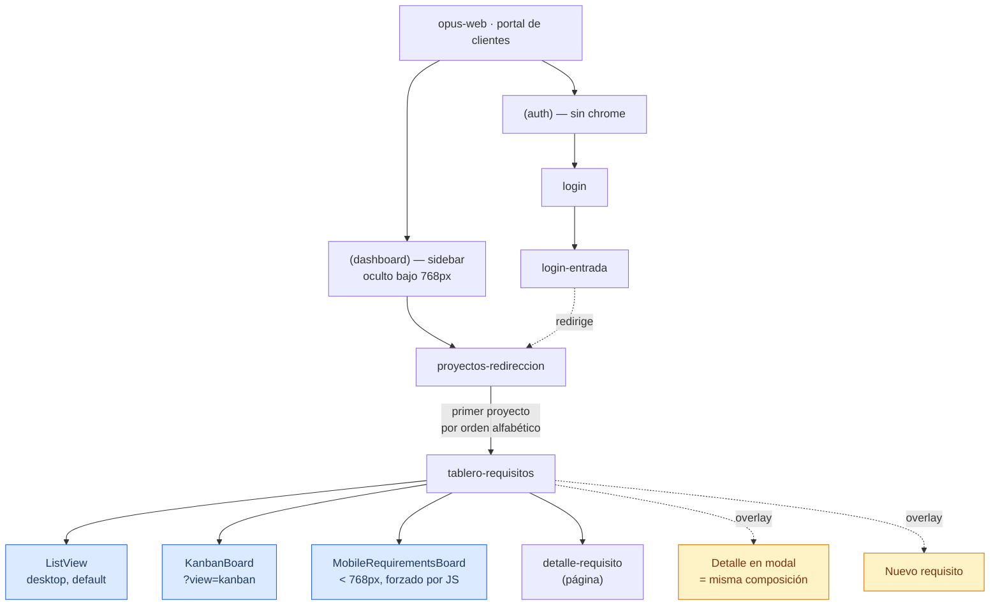

> Mapa estructural de la superficie **opus-web**, el portal de clientes (marca **Opus**). **Las
> rutas son las reales del código** (`opus-web/src/app/`, App Router).

## Audiencias en esta Superficie

- **cliente** (primaria) — Contraparte del proyecto en la organización cliente (`external-user`).
  Uso esporádico y de baja frecuencia. Ver
  [research-context](../../audiences/cliente/research-context.md).

> **Esta superficie no corta navegación por rol** [fuente: código-existente]. Un `user` o `admin`
> que entre ve las mismas rutas, y además le aparecen los dropdowns de estado y prioridad que un
> `external-user` no tiene. **No hay evidencia de si es intencional** — pregunta abierta 4 del PRD.
> El filtro real es de datos: la api solo devuelve los proyectos con permiso.

## Inventario de Pantallas

**5 pantallas relevadas** (6 rutas, una sin UI propia). Es un producto deliberadamente chico.

| # | Pantalla | Propósito | Audiencia primaria | Viewports | Referencia PRD |
|---|---|---|---|---|---|
| 1 | login | Entrada al portal vía OIDC | cliente | ambos | C-67 |
| 2 | login-entrada | Callback post-OIDC, sin UI propia | cliente | ambos | C-67 |
| 3 | proyectos-redireccion | Redirige al primer proyecto por orden alfabético | cliente | ambos | C-59 |
| 4 | tablero-requisitos | Ver el avance de todos los requisitos del proyecto | cliente | ambos | C-60, C-61, C-66 |
| 5 | detalle-requisito | Ver un requisito, su actividad pública, comentar y suscribirse | cliente | ambos | C-63, C-64, C-65, REQ-001 |

*(La ruta `/` no tiene pantalla: es un server component sin JSX que llama a `auth()` y redirige.)*

**Origen:** `opus-web/src/app/` [fuente: código-existente].

> **`/projects` no muestra un listado.** Es una pantalla de redirección que navega al primer
> proyecto por orden alfabético. El listado de proyectos vive en el sidebar, no en una pantalla.
> Existen `ProjectList` y `ProjectCard` implementando una grilla de proyectos, y **son código
> muerto**.

> **La pantalla #4 es tres pantallas en una.** El tablero tiene tres vistas: `ListView` (tabla
> agrupada por estado, default en desktop), `KanbanBoard` (7 columnas colapsables) y
> `MobileRequirementsBoard` (acordeones por estado, **bajo 768 px forzado por JS**). En mobile no
> es un reflow de CSS: es **otro árbol de componentes**.

## Inventario de Overlays

**Origen:** `docs/analysis/ux/opus-web/screens/_overlays.md` [fuente: código-existente].

| # | Overlay | Tipo | Trigger | Propósito |
|---|---|---|---|---|
| O-01 | Detalle de requisito | modal (desktop) / **fullscreen con tabs** (mobile) | tablero-requisitos · fila o card | Ver el requisito sin perder el tablero. En mobile los paneles son tabs excluyentes, no dos columnas |
| O-02 | Nuevo requisito | modal | Sidebar · botón "Nuevo requisito"; tablero-requisitos | Crear un requisito. **REQ-001:** los adjuntos dejan de ser borrador y la subida muestra progreso real (RF-1, RF-8) |
| O-03 | Dropdown de estado | dropdown en portal | fila de lista, card de kanban | Cambiar estado inline — **solo visible para rol interno** |
| O-04 | Dropdown de prioridad | dropdown en portal | fila de lista, card de kanban | Cambiar prioridad inline — **solo rol interno** |
| O-05 | Dropdowns del formulario (proyecto, prioridad, tipo) | panel posicionado a mano | Nuevo requisito | Selección dentro del alta |
| O-06 | Selector de suscriptores | panel posicionado a mano | Nuevo requisito | Elegir quién sigue el requisito |
| O-07 | Toast | notificación efímera (4 s) | `useUpdateRequirement` | Confirmar un cambio de estado o prioridad |

**Overlays que existen en el código y no se pueden abrir** (componentes muertos): `Modal`
(genérico) y **`MobileMenu`** (drawer de navegación) — este último es justamente el que resolvería
el gap bloqueante de navegación en mobile.

> **El detalle de requisito está implementado dos veces**: como overlay (O-01) y como pantalla
> propia (#5). Los dos componen los mismos tres paneles, con 1 px de diferencia en el ancho del
> panel de actividad.

## Estructura de Navegación

### Navegación principal

**El sidebar es toda la navegación de la superficie** [fuente: código-existente]:

- **Lista de proyectos** (ordenados alfabéticamente) → tablero-requisitos (#4) del proyecto
  elegido. El activo se marca por regex sobre el pathname.
- **Botón "Nuevo requisito"** → abre O-02
- **Bloque de usuario** con **Cerrar sesión**

No hay más navegación: ni breadcrumbs, ni menú, ni búsqueda global.

> ⚠️ **Bajo 768 px no hay ninguna navegación.** El `Sidebar` es `display: none`
> (`Sidebar.module.scss:13`) y el layout **no monta reemplazo**. En un teléfono no se puede
> cambiar de proyecto ni cerrar sesión. Es el gap bloqueante de la superficie.

### Navegación secundaria

Dentro de **tablero-requisitos**: selector de vista por `?view=` (lista / kanban), secciones
colapsables por estado, y **paginación infinita independiente por estado** — siete
`useInfiniteQuery` en paralelo, 20 por página, con "Ver más" por columna. `resuelto` y `cancelado`
arrancan colapsados.

## Information Architecture

La superficie tiene 5 pantallas y la agrupación es casi trivial, pero hay una decisión estructural
que conviene registrar.

### Agrupación: El proyecto como contexto único

Pantallas: proyectos-redireccion (#3), tablero-requisitos (#4), detalle-requisito (#5)

**Por qué se agrupan:** toda la superficie ocurre **dentro de un proyecto**. La ruta lo lleva
siempre (`/projects/[projectId]/requirements`), el sidebar es el selector de proyecto, y no existe
ninguna vista que cruce proyectos. Es la diferencia estructural más grande con `web`, donde los
listados son globales y el proyecto es un filtro.

### Agrupación: Entrada

Pantallas: login (#1), login-entrada (#2)

**Por qué se agrupan:** son las únicas fuera del grupo `(dashboard)`. Su layout es un `
` con
`display: contents`, o sea que no genera caja.

## Estados Globales

- **Autenticado vs no autenticado** — Todo está protegido salvo `/login`, por `middleware.ts` con
  matcher **por exclusión**: una ruta nueva queda protegida sola [fuente: código-existente]. El
  guard además rechaza sesiones con el access token vencido, no solo la ausencia de cookie.
- **Rol interno vs `external-user`** — **No cambia la navegación.** Cambia qué controles se
  renderizan: un rol interno ve dropdowns de estado y prioridad donde el cliente ve pills fijos.
- **Sin proyectos asignados** — Si el cliente no tiene ninguna fila en `user_project_permissions`,
  el sidebar queda vacío y `/projects` no tiene a dónde redirigir. El microcopy dice **"No tienes
  proyectos asignados"**.
- **Mobile (< 768 px)** — **Estado degradado, no soportado.** Sin navegación: no se puede cambiar
  de proyecto ni cerrar sesión.
- **Sin conexión** — **No hay tratamiento.** Tampoco hay `error.tsx` ni `not-found.tsx` en ninguna
  ruta de la superficie.

## Mapa Visual

## Preguntas Abiertas

1. **¿El portal debe ser usable en mobile?** Es la pregunta que más cambia esta superficie. El
   código dice que **sí se pensó** —hay 25 usos de `@include mobile`, una vista de tablero
   dedicada, y un `MobileMenu` escrito— y a la vez dice que **no funciona**: el `MobileMenu` es
   código muerto y no hay navegación. Si la respuesta es sí, montar ese componente es
   probablemente el trabajo de mayor impacto por hora del producto entero.

2. **¿Un usuario interno debería poder operar desde el portal?** Hoy puede cambiar estado y
   prioridad inline. Si la respuesta es no, O-03 y O-04 desaparecen y la superficie queda
   enteramente de lectura salvo el alta y los comentarios.

3. **¿El detalle de requisito debe existir como pantalla y como modal?** Hoy están los dos, con la
   misma composición y 1 px de diferencia. Unificar reduce el mapa y elimina una fuente de
   divergencia; mantener los dos exige una razón que el código no registra.

4. **¿`/projects` debería mostrar un listado en vez de redirigir?** Existe `ProjectList`
   implementado y sin uso. Con muchos proyectos, saltar al primero por orden alfabético es una
   elección arbitraria que el cliente no controla.

5. **¿Las tres vistas del tablero son necesarias?** Lista y kanban muestran lo mismo con dos
   formas, y la lista de 7 estados está declarada **tres veces** en el código. Si una de las dos
   no se usa, eliminarla saca una vista y una copia de la lista de estados.

6. **¿La suscripción debería mostrar algo?** Un cliente se suscribe a un requisito y **no recibe
   ninguna notificación** — no hay canal en el producto. Desde la UI, la acción no tiene
   consecuencia observable. Es FG-2.
