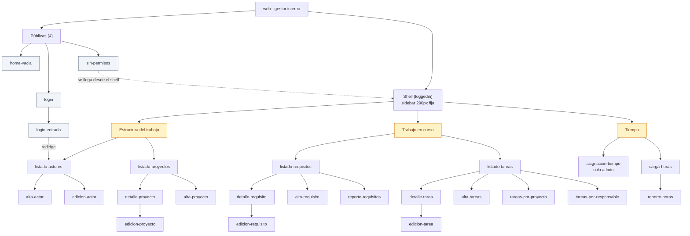

> Mapa estructural de la superficie **web**, el gestor interno. **Las rutas son las reales del
> código** (`web/src/app/`, App Router), no una propuesta. Cada fila cita su origen y, cuando se
> puede mapear, la capacidad del PRD que cubre.

## Audiencias en esta Superficie

- **equipo-interno** (primaria y única) — Miembros del equipo (`user`) y conducción (`admin`) de
  Grava Digital. Uso diario e intensivo. Ver
  [research-context](../../audiences/equipo-interno/research-context.md).

Un `external-user` que llegue a esta superficie **es redirigido a `/unauthorized`** por el layout
del grupo `(loggedin)` [fuente: código-existente].

## Inventario de Pantallas

25 rutas relevadas: 21 protegidas bajo `(loggedin)`, 4 públicas.

| # | Pantalla | Propósito | Audiencia primaria | Viewports | Referencia PRD |
|---|---|---|---|---|---|
| 1 | home-vacia | Raíz de la aplicación | equipo-interno | solo desktop | — *(ver Preguntas Abiertas)* |
| 2 | login | Entrada al sistema vía OIDC | equipo-interno | solo desktop | C-67 |
| 3 | login-entrada | Callback post-OIDC, sin UI propia | equipo-interno | solo desktop | C-67, REQ-005, REQ-007 |
| 4 | sin-permisos | Corte de acceso para `external-user` | equipo-interno | solo desktop | C-70 |
| 5 | listado-actores | Ver los actores y su cartera de proyectos | equipo-interno | solo desktop | C-01, C-02 |
| 6 | alta-actor | Dar de alta un actor | equipo-interno | solo desktop | C-03 |
| 7 | edicion-actor | Editar un actor | equipo-interno | solo desktop | C-04 |
| 8 | listado-proyectos | Ver y filtrar los proyectos | equipo-interno | solo desktop | C-06 |
| 9 | detalle-proyecto | Ver un proyecto con sus requisitos, tareas, propiedades y adjuntos | equipo-interno | solo desktop | C-10, C-12, REQ-001, REQ-005, REQ-008 |
| 10 | alta-proyecto | Dar de alta un proyecto | equipo-interno | solo desktop | C-07, C-09 |
| 11 | edicion-proyecto | Editar un proyecto | equipo-interno | solo desktop | C-08, C-09, C-11 |
| 12 | listado-requisitos | Ver y filtrar los requisitos, por varios estados a la vez, con las horas cargadas de cada uno | equipo-interno | solo desktop | C-13, REQ-009, REQ-010 |
| 13 | detalle-requisito | Ver un requisito, avanzar su workflow, comentar, resolver y ver sus horas por persona | equipo-interno | solo desktop | C-15, C-16, C-17, C-19, C-20, REQ-001, REQ-005, REQ-010 |
| 14 | alta-requisito | Dar de alta un requisito | equipo-interno | solo desktop | C-14, C-18, REQ-001 |
| 15 | edicion-requisito | Editar un requisito | equipo-interno | solo desktop | C-16, C-18, REQ-001 |
| 16 | reporte-requisitos | Reportar requisitos con export CSV | equipo-interno | solo desktop | C-24 |
| 17 | listado-tareas | Ver y filtrar las tareas | equipo-interno | solo desktop | C-25, C-28, REQ-008 |
| 18 | detalle-tarea | Ver una tarea, su historial y sus comentarios | equipo-interno | solo desktop | C-31, C-32, C-33, REQ-001, REQ-003, REQ-005 |
| 19 | alta-tareas | Dar de alta una o varias tareas en un submit | equipo-interno | solo desktop | C-26 |
| 20 | edicion-tarea | Editar una tarea | equipo-interno | solo desktop | C-27 |
| 21 | tareas-por-proyecto | Ver las tareas agrupadas por proyecto, con horas del mes | equipo-interno | solo desktop | C-29 |
| 22 | tareas-por-responsable | Ver las tareas agrupadas por responsable | equipo-interno | solo desktop | C-30 |
| 23 | asignacion-tiempo | Planificar capacidad semanal en grilla proyecto × persona | equipo-interno (`admin`) | solo desktop | C-34..C-38, REQ-007 |
| 24 | carga-horas | Cargar las horas y ausencias del día | equipo-interno | solo desktop | C-39..C-48 |
| 25 | reporte-horas | Reportar horas con tabla jerárquica de 4 niveles | equipo-interno | solo desktop | C-49 |

**Origen:** `web/src/app/` — 25 rutas, 3 layouts, 4 `loading.tsx`, 5 `error.tsx`
[fuente: código-existente].

> **Todas las pantallas son `solo desktop`.** No es una decisión por pantalla sino del shell: la
> sidebar mide 290 px fijos y el layout no tiene ningún media query, así que bajo ~1000 px no hay
> navegación. Ver [`grid.md`](../../../design-system/web/foundations/grid.md).

> **REQ-008 no agrega ni quita pantallas, y toca dos.** Corrige dos defectos de listados que
> mostraban datos incompletos sin avisar. **(1)** `detalle-proyecto`: los 7 contadores de la card de
> requisitos pasan a ser **totales reales pedidos a la api por estado**, y cada tab carga su propia
> página desde el servidor. Hasta acá los contadores se calculaban sobre las 20 filas del default
> del endpoint, así que un proyecto con más de 20 requisitos **informaba mal cuántos tiene** — y los
> ausentes eran los más nuevos, por el orden `createdAt DESC`. **(2)** `listado-tareas`: el paginador
> compartido muestra como máximo 10 números en una ventana centrada, en vez de uno por página.
> **Ninguna pantalla gana ni pierde bloques**, y ninguna cambia su comportamiento de navegación: el
> paginador queda unificado en un solo componente con dos modos —URL para tareas, controlado para la
> card— y `paginacion-requisitos` deja de ser una reimplementación inline. Se verificó que
> `listado-requisitos`, `reporte-requisitos` y las dos vistas agregadas de tareas **no se tocan**: el
> requerimiento nombra dos paginadores y esos usan los suyos. **Queda un tercer paginador inline sin
> unificar** en `detalle-requisito` (tabla de tareas del requisito), registrado como fuera de alcance
> en el propio REQ [REQ-008 RF-1..RF-10].

> **REQ-010 no agrega ni quita pantallas, y toca dos.** Hace visible un dato que ya existe en la
> base y hoy solo se alcanza desde el reporte de período. **(1)** `listado-requisitos` gana una
> novena columna, **"Hs. Trab."**, con el total formateado `Xh Ym` y `—` cuando es cero; el ancho
> sale del 42% del título, la columna va última —después de "Creación"— y **no ordena**: ordenar por
> un calculado obligaría a evaluarlo sobre todo el conjunto y no solo sobre la página, así que el
> encabezado tiene que no parecer ordenable. La página entera se resuelve en **una sola request**,
> no una por fila. **(2)** `detalle-requisito` gana la card **"Horas Trabajadas"** al final de la
> columna derecha, con el total y el desglose por persona de mayor a menor, `"Sin horas cargadas"`
> cuando no hay ninguna. La card **se carga con su propia consulta**, no con el payload del
> requisito: se revalida sola y una falla suya no rompe el detalle, lo que suma tres sub-estados
> nuevos a esa pantalla (*sin horas cargadas*, *horas cargando*, *horas no disponibles*). El
> desglose es **histórico**: quien cargó horas aparece aunque ya no esté en el equipo. **Se verificó
> que `reporte-horas` y `reporte-requisitos` no se tocan** —siguen siendo la vista de período, que
> es lo que este requerimiento evita tener que abrir— y que **`opus-web` no se modifica**: las horas
> son dato interno y no llegan al portal por ninguna vía [REQ-010 RF-6..RF-9].

> **REQ-009 no agrega ni quita pantallas, y toca una.** El filtro de estado de
> `listado-requisitos` pasa de selección única a **selección múltiple**, replicando el mecanismo que
> `listado-tareas` ya usa: la selección viaja en la URL como lista separada por comas, el default al
> entrar sin `state` son los cuatro estados de trabajo en curso (`planificacion`, `en_cola`,
> `desarrollo`, `revision`) y **deseleccionar todo muestra los siete estados**, persistido como
> `state=all` para distinguirlo del default. **La pantalla no gana ni pierde bloques:**
> `filtro-estado` cambia de variante (single → multi) y `paginacion` deja de ser una
> reimplementación inline para pasar al paginador unificado, ahora alimentado con el total real del
> conjunto filtrado — el tercer paginador inline que REQ-008 había dejado registrado como fuera de
> alcance. **Se verificó que la card de requisitos del detalle de proyecto no se toca** (sigue con
> sus siete tabs de un estado cada uno, y el contrato es compatible hacia atrás), y que **`opus-web`
> no se modifica** [REQ-009 RF-4..RF-9, RF-11].

> **REQ-007 no agrega ni quita pantallas, y toca dos.** Habilitar `jiku-commands` para personas no
> tiene interfaz: quien publica un comando lo hace desde un cliente NATS. Lo user-visible son dos
> consecuencias. **(1)** El 401 `user_not_found` **desaparece de las 61 rutas de la api** (CA-12) y
> `core` da de alta la identidad desde el propio comando (CA-9, CA-11): el bucle donde un usuario
> nuevo entraba, pedía datos y volvía a `/login` **deja de existir**, y `login-entrada` cierra el
> caso que REQ-005 había dejado abierto. **(2)** `asignacion-tiempo` deja de ser la única escritura
> de dominio que no pasa por el bus (CA-20, CA-21), así que su guardado hereda el desdoblamiento
> 503/504 de REQ-004 y aparece un desenlace que esa pantalla nunca tuvo: *"pudo haberse guardado"*.
> **Se verificó `sin-permisos` y no cambia** —corta por rol, no por ausencia de fila en `users`— y
> se verificó que ninguna otra vista dependa del 401 como señal. Ninguna pantalla gana ni pierde
> bloques [REQ-007].

> **REQ-005 no agrega ni quita pantallas, y toca tres.** El evento de autenticación del bus no
> tiene interfaz; lo que sí es user-visible es su consecuencia: desde REQ-005 una **identidad de
> servicio** tiene fila en `users` y puede figurar como autor. Las tres pantallas que exponen un
> usuario —`detalle-requisito` (fila "Creado por" y feed de actividad), `detalle-proyecto` (fila
> "Creado por") y `detalle-tarea` (metadatos, historial y comentarios)— suman el bloque
> `marca-identidad-automatica`, un badge `"Automático"` que acompaña al nombre. `login-entrada`
> gana precisión en su estado de fallo, sin cambio de bloques. **Se verificó que
> `listado-requisitos` no tiene columna de autor**, así que no se toca [REQ-005 RF-3, RF-10].

## Inventario de Overlays

Ninguno es ruta. **Origen:** `docs/analysis/ux/web/screens/_overlays.md` [fuente: código-existente].

| # | Overlay | Tipo | Trigger | Propósito |
|---|---|---|---|---|
| O-01 | Vista previa de adjunto | modal (`role="dialog"`, `aria-modal`) | detalle-proyecto · botón "Preview" de un adjunto | Ver imagen o PDF sin salir de la pantalla. **REQ-001:** suma el caso "el archivo no está disponible" (RF-21, CA-15) |
| O-02 | Confirmación de borrado | modal (`<dialog>` nativo con `showModal()`) | carga-horas (2 instancias) · detalle-proyecto (adjuntos) | Confirmar una acción destructiva |
| O-03 | Dropdown de estado de tarea | dropdown | listado-tareas · tag de estado; cards de tarea | Cambiar estado inline sin abrir el detalle |
| O-04 | Pills-dropdown de estado/tipo/prioridad | dropdown (`role="listbox"`) | detalle-requisito · header | Editar los tres campos de clasificación inline |
| O-05 | Dropdown de tipo de proyecto | dropdown (checkboxes) | reporte-horas | Filtrar el reporte por tipo de proyecto |
| O-06 | Date-picker de fecha de cierre | dropdown (por portal) | tareas-por-proyecto, tareas-por-responsable · etiqueta de fecha | Editar la fecha estimada desde la card |
| O-07 | Menú de `react-select` | dropdown | 6 pantallas con selects de búsqueda | Selección con búsqueda y agrupación |
| O-08 | Tooltip | tooltip | transversal (10 usos) | Aclaración contextual |
| O-09 | Acordeón de campos de estado | in-place (no overlay) | detalle-requisito | Abrir los campos que corresponden al estado actual |
| O-10 | Cajón de actores | modal lateral | **ninguno — código muerto** | *(no alcanzable)* |

## Estructura de Navegación

### Navegación principal

La sidebar (`<Navbar>`) es persistente en las 21 pantallas autenticadas, con 6 ítems
[fuente: código-existente]:

- **Actores** → listado-actores (#5)
- **Proyectos** → listado-proyectos (#8)
- **Requisitos** → listado-requisitos (#12)
  - *subítem:* Reporte → reporte-requisitos (#16)
- **Tareas** → listado-tareas (#17)
  - *subítems:* Por proyecto (#21) · Por responsable (#22)
- **Asignación de Tiempo** → asignacion-tiempo (#23)
- **Horas Trabajadas** → carga-horas (#24)
  - *subítem:* Reporte → reporte-horas (#25)

Más un **bloque de enlaces externos configurable** (variable `EXTERNAL_LINKS`; vacío = bloque
oculto) y **Cerrar sesión**.

### Navegación secundaria

Dentro de **listado-requisitos** y **listado-tareas**: filtros en la URL (búsqueda con debounce,
estado, proyecto, responsable, área, orden) y paginación.

Dentro de **detalle-proyecto**: tabs por estado en las secciones de requisitos y de tareas, cada
una con su paginación y contadores. **Desde REQ-008 las dos secciones dejan de ser equivalentes:**
en la de requisitos los contadores son totales reales del proyecto y cada tab pagina contra el
servidor, mientras la de tareas conserva su recuento sobre los datos ya traídos y su paginador
inline.

Dentro de **carga-horas**: modo **Presente / Ausente**, que cambia el formulario completo.

## Information Architecture

### Agrupación: Estructura del trabajo

Pantallas: listado-actores (#5), alta-actor (#6), edicion-actor (#7), listado-proyectos (#8),
detalle-proyecto (#9), alta-proyecto (#10), edicion-proyecto (#11)

**Por qué se agrupan:** son la jerarquía de contenedores —actor → proyecto— sobre la que cuelga
todo lo demás. Se tocan poco y de a ratos: dar de alta un proyecto es un acto puntual, no diario.

### Agrupación: Trabajo en curso

Pantallas: listado-requisitos (#12) a edicion-tarea (#20), más las dos vistas agregadas (#21, #22)

**Por qué se agrupan:** requisitos y tareas son el trabajo mismo, y están relacionados (una tarea
puede pertenecer a un requisito). Es donde el equipo pasa la mayor parte del tiempo de gestión.

### Agrupación: Tiempo

Pantallas: asignacion-tiempo (#23), carga-horas (#24), reporte-horas (#25)

**Por qué se agrupan:** son las tres caras del tiempo — lo planeado (#23), lo ocurrido (#24) y la
comparación (#25). Tienen audiencias parcialmente distintas: #23 es solo de `admin`.

### Agrupación: Entrada y corte de acceso

Pantallas: home-vacia (#1), login (#2), login-entrada (#3), sin-permisos (#4)

**Por qué se agrupan:** son las 4 rutas fuera del grupo `(loggedin)`, sin shell de navegación.

## Estados Globales

- **Autenticado vs no autenticado** — Las 21 pantallas del grupo `(loggedin)` exigen sesión. Sin
  ella, el layout redirige a `/login` [fuente: código-existente].
- **Rol `external-user`** — Redirigido a `/unauthorized`. Además, tres rutas repiten el chequeo a
  nivel de página (`time-allocation`, `worked-times`, `worked-times/report`) redirigiendo a
  `/projects`.
- **Rol `admin` vs `user`** — No cambia la navegación: los 6 ítems se ven igual. Cambia qué se
  puede editar: la grilla de asignación semanal es de solo lectura para `user`, y solo `admin`
  puede cargar horas en nombre de otra persona.
- **Sesión vencida** — El interceptor de axios redirige a `/login` ante un 401. La sesión dura
  12 h. **Desde REQ-007 ese 401 significa una sola cosa.** Antes había dos 401 indistinguibles para
  la interfaz —token vencido y `user_not_found`— y el segundo mandaba a `/login` a alguien cuya
  sesión estaba perfecta, produciendo un bucle sin explicación. El `user_not_found` ya no existe en
  ninguna ruta (CA-12), así que un redirect a `/login` ahora quiere decir exactamente *"tu sesión
  venció"*.
- **Sin conexión** — **No hay tratamiento.** No hay banner, ni modo offline, ni reintento visible.

## Mapa Visual

## Preguntas Abiertas

1. **¿`/` debe redirigir a alguna pantalla?** Hoy renderiza `<h1>Home</h1>` y el
   `redirect('/clients')` está **comentado** en el código. Si debe redirigir, la pantalla #1
   desaparece del mapa; si no, necesita contenido real. Es la pregunta que más cambia el mapa.

2. **¿Esta superficie debe ser usable en mobile?** Si la respuesta es sí, **todas las 25 filas de
   la tabla cambian su columna de viewports**, y el primer trabajo es el shell, no las pantallas.
   El código no permite inferir la respuesta: hay tratamiento responsive incoherente, que es
   distinto de una ausencia deliberada de tratamiento.

3. **¿La asignación semanal pertenece a esta superficie o merece la suya?** Es la única pantalla
   con audiencia acotada (`admin`), tiene un patrón de interacción único en el producto (grilla
   editable) y no se relaciona con ninguna otra pantalla salvo por el reporte.

4. **¿Las dos vistas agregadas de tareas (#21, #22) son pantallas o son vistas del listado?** Hoy
   son rutas propias con navegación propia, pero muestran los mismos datos que #17 con otro
   agrupamiento. Si fueran vistas, el listado ganaría un selector y el mapa perdería dos nodos.

5. **¿El reporte de requisitos (#16) y el de horas (#25) deberían convivir en una sección de
   reportes?** Hoy cuelgan cada uno de su dominio. Con un tercer reporte, la agrupación actual
   deja de escalar.
